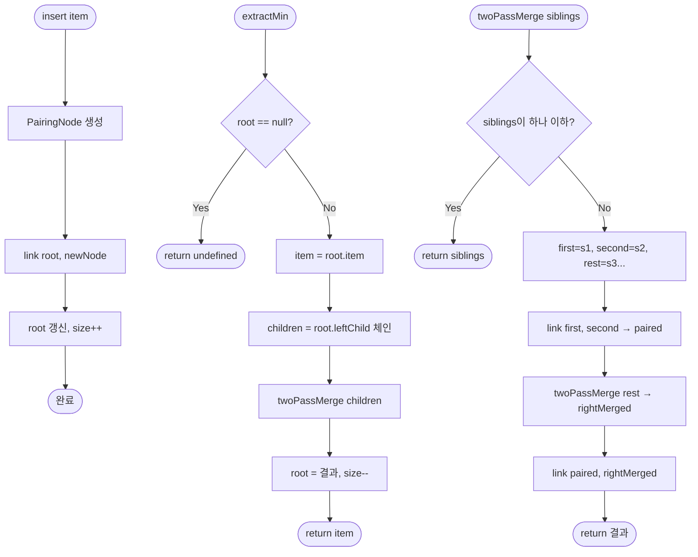

import { AlgorithmSimulation } from "#guide-sim";

# PairingHeap (쌍 힙) 해설

## 성능 목표 예측

| 연산 | Binary Heap | FibonacciHeap | PairingHeap | 비고 |
|------|------------|---------------|-------------|------|
| insert | O(log n) | O(1) 상각 | **O(1)** | PH 강점 |
| extractMin | O(log n) | O(log n) 상각 | O(log n) 상각 | 유사 |
| merge | O(n) | O(1) | **O(1)** | PH 강점 |
| peek | O(1) | O(1) | **O(1)** | 동일 |
| 구현 복잡도 | 낮음 | 매우 높음 | **낮음** | PH 강점 |

실무 벤치마크: FibonacciHeap은 상수 인수가 크지만 PairingHeap은 상수가 작아 실제로 더 빠른 경우가 많다.

---

## 목표 함수

| 메서드 | 반환 타입 | 엣지케이스 |
|--------|-----------|-----------|
| `insert(item)` | `void` | 단일 노드 힙과 merge |
| `extractMin()` | `T \| undefined` | 빈 힙 → `undefined`, Two-Pass merge 발생 |
| `merge(other)` | `PairingHeap<T>` | 빈 힙 병합 가능, O(1) |
| `peek()` | `T \| undefined` | 빈 힙 → `undefined`, O(1) |
| `size()` | `number` | 0부터 시작 |
| `isEmpty()` | `boolean` | size === 0과 동치 |

---

## 핵심 아이디어

### 왜 쌍 힙이 필요한가

Fibonacci Heap은 이론적으로 아름답지만 구현이 복잡하다. 실제 코드에서는 포인터 조작 오류가 잦고, 캐시 미스가 많아 O(1)의 상수 인수가 크다.

이진 힙은 구현이 쉽지만 병합이 O(n)이다.

쌍 힙은 **"단순하게, 그리고 충분히 빠르게"** 라는 철학으로 설계되었다. 자식 리스트를 형제 체인으로 표현하는 단 하나의 아이디어로 insert/merge O(1), extractMin O(log n) 상각을 달성한다.

### 원형 아이디어: 자식 리스트를 왼쪽 자식 + 오른쪽 형제 체인으로

전통적인 트리에서 각 노드는 자식 배열을 가진다. 쌍 힙에서는:
- `leftChild`: 자식 중 가장 최근에 추가된 노드
- `nextSibling`: 같은 부모의 다음 자식

이 표현으로 자식 추가가 O(1)이 된다. `link(a, b)`에서 더 큰 루트의 nextSibling을 작은 루트의 leftChild로 만들면 끝이다.

### 어떤 관찰이 돌파구가 되는가

**관찰:** extractMin 후 남은 자식 리스트를 어떤 순서로 재결합하느냐가 상각 복잡도를 결정한다.

- **Naive 단순 결합:** 왼쪽에서 오른쪽으로 순서대로 link → O(n) 가능
- **Two-Pass merge:** 먼저 2개씩 묶은 뒤(forward), 오른쪽에서 왼쪽으로 결합(backward) → O(log n) 상각

Two-Pass 방식이 핵심이다.

### 관찰을 형식화: 상태/구조 정의

```ts
class PairingNode<T> {
  item: T;
  leftChild: PairingNode<T> | null;   // 첫 번째 자식
  nextSibling: PairingNode<T> | null; // 오른쪽 형제
  parent: PairingNode<T> | null;      // 부모 (선택적)
}

class PairingHeap<T> {
  root: PairingNode<T> | null;
  _size: number;
  compare: (a: T, b: T) => number;
}
```

**불변식:**
1. 최소 힙 속성: `parent.item ≤ child.item` (모든 노드)
2. root는 전체 최솟값이다.

### 점화식 또는 핵심 연산

**두 루트 연결 (link):**
```
link(a, b):
  if compare(a.item, b.item) <= 0:
    // a가 새 루트
    b.nextSibling = a.leftChild
    b.parent = a
    a.leftChild = b
    return a
  else:
    // b가 새 루트
    a.nextSibling = b.leftChild
    a.parent = b
    b.leftChild = a
    return b
```

**Two-Pass Merge (extractMin 내부):**
```
twoPassMerge(siblings):
  if siblings == null or siblings.nextSibling == null:
    return siblings
  first  = siblings
  second = siblings.nextSibling
  rest   = second.nextSibling
  // 연결 끊기
  first.nextSibling = null
  second.nextSibling = null
  // Forward pass: 두 개씩 link
  paired = link(first, second)
  // Backward pass: 나머지를 오른쪽부터 link
  return link(paired, twoPassMerge(rest))
```

### 정당성: 왜 이것이 옳은가

**상각 분석 (스케치):**

m번의 insert와 k번의 extractMin이 있을 때, 총 비용은 O((m + k) log k)이다.

Two-Pass 방식은 자식 리스트를 균형 있게 결합함으로써 각 extractMin에서 처리하는 link 횟수가 O(log n)으로 제한된다. (엄밀한 증명은 포텐셜 함수를 사용하지만 여기서는 직관으로 이해한다.)

### 구현 디테일과 최적화

- **insert:** `link(root, singleNode)`. root가 null이면 그냥 singleNode가 새 root.
- **merge:** 두 힙이 비어 있지 않으면 `link(root1, root2)`. O(1).
- **extractMin:** root 제거 → `twoPassMerge(root.leftChild)`. 재귀 구현이 자연스러우나 스택 오버플로 주의 시 반복(iterative)으로도 구현 가능.
- **재귀 vs 반복:** 재귀 구현이 더 직관적이나, n이 매우 클 때는 반복 구현이 안전하다.

---

## 시뮬레이션

export const steps = [
  {
    title: "초기 상태",
    detail: "빈 쌍 힙. root = null.",
    array: [],
    highlight: [],
    marked: [],
  },
  {
    title: "insert(5), insert(3), insert(8), insert(1)",
    detail: "각 insert는 link(root, newNode)로 처리. 더 작은 값이 루트. 최종 root = 1.",
    array: [1, 3, 5, 8],
    highlight: [0],
    marked: [],
  },
  {
    title: "extractMin() → 1 제거",
    detail: "root(1) 제거. 자식 체인: [3, 5, 8] (nextSibling 체인). Two-Pass 시작.",
    array: [3, 5, 8],
    highlight: [],
    marked: [],
  },
  {
    title: "Forward Pass: (3,5) link",
    detail: "첫 두 개: link(3, 5). 3 < 5 → 3이 루트, 5가 자식. 나머지: [8].",
    array: [3, 5, 8],
    highlight: [0, 1],
    marked: [],
  },
  {
    title: "Forward Pass 완료",
    detail: "쌍: [B(3,5), B(8)]. 이제 Backward pass.",
    array: [3, 5, 8],
    highlight: [0],
    marked: [2],
  },
  {
    title: "Backward Pass: link(B(3,5), B(8))",
    detail: "link(3, 8). 3 < 8 → 3이 최종 루트. 8은 3의 자식으로 추가.",
    array: [3, 5, 8],
    highlight: [0],
    marked: [],
  },
];

<AlgorithmSimulation view="array" steps={steps} title="PairingHeap extractMin Two-Pass 시뮬레이션" />

## 수도 코드와 Activity Diagram

### 의사코드

```
// 두 루트 연결
link(a, b):
  if a == null: return b
  if b == null: return a
  if compare(a.item, b.item) <= 0:
    b.nextSibling = a.leftChild
    a.leftChild = b
    return a
  else:
    a.nextSibling = b.leftChild
    b.leftChild = a
    return b

// Two-Pass Merge (재귀)
twoPassMerge(node):
  if node == null or node.nextSibling == null:
    return node
  first = node
  second = node.nextSibling
  rest = second.nextSibling
  first.nextSibling = null
  second.nextSibling = null
  return link(link(first, second), twoPassMerge(rest))

// 삽입
insert(item):
  node = new PairingNode(item)
  root = link(root, node)
  _size++

// 최솟값 추출
extractMin():
  if root == null: return undefined
  item = root.item
  root = twoPassMerge(root.leftChild)
  if root != null: root.parent = null
  _size--
  return item

// 병합
merge(other):
  result = new PairingHeap(compare)
  result.root = link(this.root, other.root)
  result._size = this._size + other._size
  return result
```

### Activity Diagram


