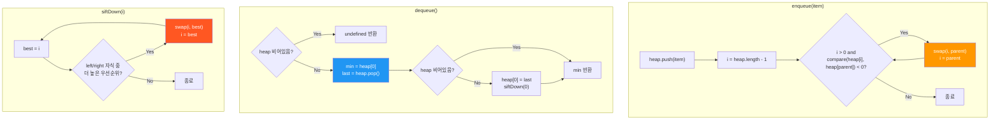

import { AlgorithmSimulation } from "#guide-sim";

# PriorityQueue (우선순위 큐) 해설

## 성능 목표 예측

| 연산 횟수 n | naive 배열 O(n²) | 목표 힙 O(n log n) |
|-------------|-----------------|---------------------|
| 1,000       | ~1ms            | <1ms                |
| 10,000      | ~100ms          | <1ms                |
| 100,000     | ~10,000ms       | <20ms               |
| 1,000,000   | 초과             | <200ms              |

우선순위 큐 없이 매번 배열에서 최솟값을 선형 탐색하면 O(n²), 힙을 사용하면 O(n log n).

---

## 목표 함수

| 연산 | 내부 동작 | 시간 | 공간 |
|------|-----------|------|------|
| `enqueue` | 배열 끝 삽입 + bubbleUp | O(log n) | O(1) |
| `dequeue` | 루트 제거 + 마지막→루트 + siftDown | O(log n) | O(1) |
| `peek` | 배열 인덱스 0 접근 | O(1) | O(1) |
| `size` | 배열 length 반환 | O(1) | O(1) |
| `isEmpty` | size === 0 | O(1) | O(1) |

**주요 엣지케이스:**
- 빈 큐에서 `dequeue()`/`peek()` → `undefined`
- 동일 우선순위 원소 → 임의 순서로 반환 (정렬 안정성 불보장)
- 단일 원소 → enqueue/dequeue 후 isEmpty

---

## 핵심 아이디어

### 원형 아이디어와 naive 접근

단순 배열에 삽입 후 정렬하거나, dequeue 시 최솟값 선형 탐색:

```
// 삽입 O(1) + 조회 O(n)
enqueue: arr.push(item)
dequeue: find min, splice → O(n)

// 또는 삽입 O(n log n) + 조회 O(1)
enqueue: arr.push(item); arr.sort(compare) → O(n log n)
dequeue: arr.shift() → O(n)
```

n번 연산 시 총 O(n²) 또는 O(n² log n). 비효율적.

### 어떤 관찰이 돌파구가 되는가

**관찰 1:** 최솟값만 빠르게 접근하면 되지, 전체를 정렬할 필요는 없습니다.

**관찰 2:** 완전 이진 트리에서 부모≤자식 관계(힙 속성)만 유지하면 루트가 항상 최솟값입니다.

**관찰 3:** 배열로 완전 이진 트리를 표현하면 추가 포인터 없이 인덱스 연산만으로 O(log n) 탐색이 가능합니다.

### 관찰을 형식화: 상태/구조 정의

**배열 기반 완전 이진 트리:**
```
인덱스 i의 부모:         Math.floor((i - 1) / 2)
인덱스 i의 왼쪽 자식:   2 * i + 1
인덱스 i의 오른쪽 자식: 2 * i + 2
```

**힙 속성 불변식:** `compare(heap[parent], heap[child]) <= 0` — 부모의 우선순위가 항상 자식보다 높거나 같다.

### 점화식 또는 핵심 연산

```
// bubbleUp (enqueue 후 힙 속성 복원)
i = heap.length - 1
while i > 0:
  parent = Math.floor((i - 1) / 2)
  if compare(heap[i], heap[parent]) < 0:   // 자식이 더 높은 우선순위
    swap(heap, i, parent)
    i = parent
  else:
    break                                    // 힙 속성 만족

// siftDown (dequeue 후 힙 속성 복원)
i = 0
n = heap.length
while true:
  left  = 2 * i + 1
  right = 2 * i + 2
  best  = i                                  // 현재 노드, 왼쪽, 오른쪽 중 최우선

  if left < n and compare(heap[left], heap[best]) < 0:
    best = left
  if right < n and compare(heap[right], heap[best]) < 0:
    best = right

  if best !== i:
    swap(heap, i, best)
    i = best
  else:
    break                                    // 힙 속성 만족
```

### 정당성 — 왜 이것이 옳은가

**enqueue 정당성:**
- 새 원소를 끝에 삽입하면 완전 이진 트리 형태는 유지됨
- bubbleUp이 부모와의 힙 속성을 복원하면서 위로 이동
- 높이가 O(log n)이므로 최대 O(log n) 번 swap

**dequeue 정당성:**
- 루트가 힙 속성에 의해 항상 최우선 원소
- 마지막 원소를 루트로 가져오면 완전 이진 트리 형태 유지
- siftDown이 두 자식 중 더 높은 우선순위와 swap하며 힙 속성 복원
- 높이 O(log n) → O(log n) swap

### 구현 디테일과 최적화

- 비교 함수를 생성자에서 주입받아 클로저로 저장
- TypeScript `noUncheckedIndexedAccess` 대응: 배열 접근 시 `?? undefined` 처리 또는 범위 확인
- `dequeue`에서 원소가 1개이면 siftDown 없이 직접 pop

---

## 시뮬레이션

export const steps = [
  {
    title: "초기 상태",
    detail: "빈 힙. 최솟값 우선 (minHeap). heap = []",
    array: [],
    highlight: [],
    marked: [],
  },
  {
    title: "enqueue(5)",
    detail: "배열 끝에 삽입. heap = [5]. 부모 없음 → bubbleUp 종료.",
    array: [5],
    highlight: [0],
    marked: [],
  },
  {
    title: "enqueue(1)",
    detail: "heap = [5,1]. bubbleUp: parent=5 > 1 → swap. heap = [1,5]. 힙 속성 만족.",
    array: [1, 5],
    highlight: [0],
    marked: [],
  },
  {
    title: "enqueue(3)",
    detail: "heap = [1,5,3]. bubbleUp: parent=1 <= 3 → 종료. heap = [1,5,3].",
    array: [1, 5, 3],
    highlight: [2],
    marked: [],
  },
  {
    title: "enqueue(2)",
    detail: "heap = [1,5,3,2]. bubbleUp: parent(index1)=5 > 2 → swap. heap = [1,2,3,5]. parent(index0)=1 <= 2 → 종료.",
    array: [1, 2, 3, 5],
    highlight: [1],
    marked: [],
  },
  {
    title: "dequeue() → 1 반환",
    detail: "루트(1) 저장. 마지막(5)을 루트로. heap = [5,2,3]. siftDown: left=2<5 → swap. heap = [2,5,3]. left=5,right=3 모두 >= 현재위치 없음 → 종료.",
    array: [2, 5, 3],
    highlight: [0],
    marked: [],
  },
  {
    title: "dequeue() → 2 반환",
    detail: "루트(2) 반환. siftDown 후 heap = [3,5]. peek() = 3.",
    array: [3, 5],
    highlight: [0],
    marked: [],
  },
];

<AlgorithmSimulation view="array" steps={steps} title="PriorityQueue 시뮬레이션 (minHeap)" />

---

## 수도 코드와 Activity Diagram

### 의사코드

```
클래스 PriorityQueue<T>:
  heap: T[] = []
  compare: (a: T, b: T) => number

  // 불변식: 모든 i에 대해 compare(heap[parent(i)], heap[i]) <= 0

  enqueue(item):
    heap.push(item)
    bubbleUp(heap.length - 1)

  dequeue():
    if heap.length === 0: return undefined
    min = heap[0]
    last = heap.pop()
    if heap.length > 0:
      heap[0] = last
      siftDown(0)
    return min

  peek():
    return heap[0]  // undefined if empty

  bubbleUp(i):
    while i > 0:
      p = (i - 1) / 2 | 0
      if compare(heap[i], heap[p]) < 0:
        swap(i, p)
        i = p
      else: break

  siftDown(i):
    n = heap.length
    while true:
      best = i
      l = 2*i+1; r = 2*i+2
      if l < n and compare(heap[l], heap[best]) < 0: best = l
      if r < n and compare(heap[r], heap[best]) < 0: best = r
      if best != i: swap(i, best); i = best
      else: break
```

### Activity Diagram


