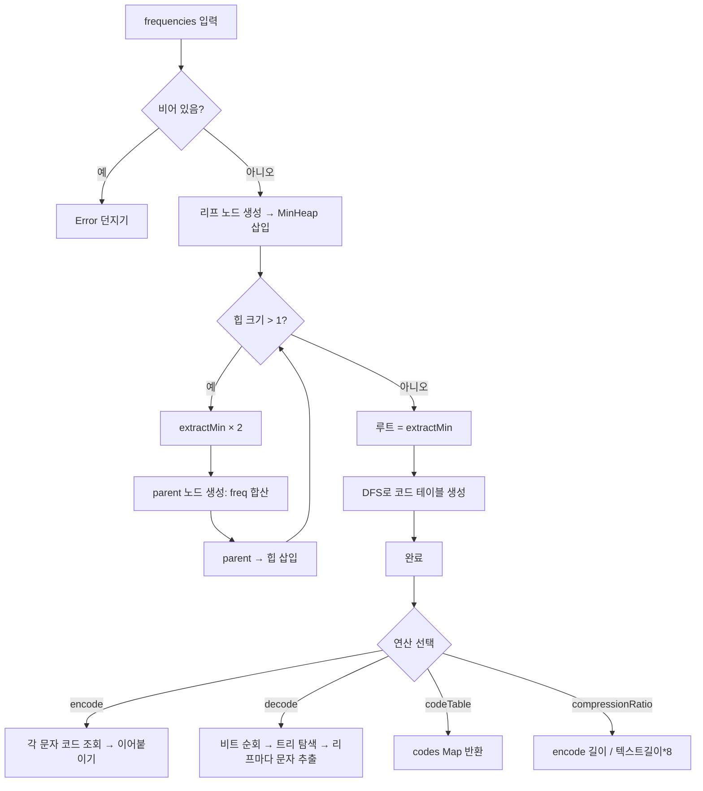

import { AlgorithmSimulation } from "#guide-sim";

# HuffmanTree 해설

## 성능 목표 예측

| 연산 | 시간복잡도 | 공간복잡도 | 비고 |
|------|-----------|-----------|------|
| constructor | O(n log n) | O(n) | n = 고유 문자 수, 최소 힙 사용 |
| encode | O(m) | O(m) | m = 텍스트 길이 |
| decode | O(m) | O(m) | m = 비트 문자열 길이 |
| codeTable | O(n) | O(n) | DFS 1회 |
| compressionRatio | O(m) | O(1) | 코드 테이블 조회 |

---

## 목표 함수

| 함수 | 시그니처 | 설명 |
|------|---------|------|
| constructor | `(frequencies: Map<string, number>) => void` | 최소 힙으로 허프만 트리 구성 |
| encode | `(text: string) => string` | 텍스트 → 비트 문자열 |
| decode | `(bits: string) => string` | 비트 문자열 → 원본 텍스트 |
| codeTable | `() => Map<string, string>` | 문자별 코드 맵 반환 |
| compressionRatio | `(text: string) => number` | 8비트 대비 압축 비율 |

---

## 핵심 아이디어

### 원형 아이디어와 naive 접근
고정 길이 코드(예: ASCII 8비트)는 모든 문자에 동일한 비트 수를 사용한다. 'a'(영문에서 약 8% 빈도)에도, 'z'(0.07%)에도 똑같이 8비트. 만약 빈도에 비례해 비트 길이를 줄일 수 있다면 전체 비트 수가 줄어든다.

### 어떤 관찰이 돌파구가 되는가
**Prefix-free 코드**: 어떤 코드도 다른 코드의 접두사가 아니면, 구분자 없이도 디코딩이 가능하다. 이진 트리의 **리프 노드**에만 문자를 배치하면 이 조건이 자동 충족된다. 가장 짧은 경로(= 짧은 코드)를 빈도가 높은 문자에 주면 된다.

**Huffman의 증명**: 빈도가 가장 낮은 두 문자는 최적 코드 트리에서 형제 리프여야 한다. 이 탐욕적 결합을 반복하면 전역 최적 코드 트리가 완성된다.

### 관찰을 형식화: 상태/구조 정의
- **노드**: `{ char, freq, left, right }` — 리프는 `char != null`, 내부 노드는 `char == null`
- **최소 힙**: 빈도 기준 우선순위 큐. 매 단계에서 빈도 최솟값 두 개를 꺼낸다
- **코드 테이블**: DFS로 트리를 순회하며 `Map<char, bitString>` 생성

### 핵심 연산

**트리 구성**
```
heap = MinHeap(비교 기준: freq)
for (char, freq) in frequencies:
  heap.insert({ char, freq, left: null, right: null })

while heap.size() > 1:
  left = heap.extractMin()
  right = heap.extractMin()
  parent = { char: null, freq: left.freq + right.freq, left, right }
  heap.insert(parent)

root = heap.extractMin()
```

**코드 생성 (DFS)**
```
function buildCodes(node, prefix):
  if node.char != null:
    codes.set(node.char, prefix || "0")  // 단일 문자 예외
    return
  buildCodes(node.left, prefix + "0")
  buildCodes(node.right, prefix + "1")
```

**디코딩**
```
current = root
result = ""
for bit in bits:
  current = bit == "0" ? current.left : current.right
  if current.char != null:
    result += current.char
    current = root
return result
```

### 정당성
허프만 알고리즘의 탐욕 증명은 **교환 논증(exchange argument)**으로 이루어진다. 최적 트리에서 최소 빈도 두 문자가 형제가 아니라면, 그 자리를 교환했을 때 총 비트 수가 줄거나 같아진다. 따라서 매 단계 최솟값 둘을 결합하는 탐욕 선택이 전역 최적을 보장한다.

### 구현 디테일과 최적화
- **단일 문자 예외**: 고유 문자가 1개이면 트리에 루트만 존재. 코드는 "0" (임의 선택)으로 설정하고, 인코딩 길이는 `text.length`비트.
- **최소 힙 구현**: JavaScript 표준 라이브러리에 힙이 없으므로 직접 구현하거나 정렬된 배열로 대체. 대입 시 O(n²) → 힙 사용 시 O(n log n).
- **안정성**: 같은 빈도의 노드가 여러 개일 때 힙에서 꺼내는 순서에 따라 코드 테이블이 달라질 수 있다. 디코딩/인코딩이 같은 트리를 공유하면 일관성이 보장된다.

---

## 시뮬레이션

export const steps = [
  {
    title: "빈도 맵으로 리프 노드 생성",
    detail: "a:5, b:2, r:2, c:1, d:1 → 최소 힙에 삽입",
    array: ["a:5", "b:2", "r:2", "c:1", "d:1"],
    highlight: [0, 1, 2, 3, 4],
    marked: [],
  },
  {
    title: "1단계: 최솟값 2개(c:1, d:1) 결합",
    detail: "c:1 + d:1 → 내부:2 생성 후 힙 재삽입",
    array: ["a:5", "b:2", "r:2", "내부:2(c,d)"],
    highlight: [3],
    marked: [],
  },
  {
    title: "2단계: 최솟값 2개(b:2, r:2) 결합",
    detail: "b:2 + r:2 → 내부:4(b,r) 생성",
    array: ["a:5", "내부:4(b,r)", "내부:2(c,d)"],
    highlight: [1],
    marked: [2],
  },
  {
    title: "3단계: 최솟값 2개(내부:2, a:5) — 아니면 내부:2 + 내부:4",
    detail: "내부:2 + 내부:4 → 내부:6 생성",
    array: ["a:5", "내부:6(b,r,c,d)"],
    highlight: [1],
    marked: [0],
  },
  {
    title: "4단계: 루트 완성",
    detail: "a:5 + 내부:6 → 루트:11",
    array: ["루트:11(a, b, r, c, d)"],
    highlight: [0],
    marked: [],
  },
  {
    title: "코드 테이블: a→0, b→110, r→111, c→100, d→101",
    detail: "루트에서 왼쪽=0, 오른쪽=1로 DFS",
    array: ["a:0", "b:110", "r:111", "c:100", "d:101"],
    highlight: [0, 1, 2, 3, 4],
    marked: [],
  },
];

<AlgorithmSimulation view="array" steps={steps} title="HuffmanTree 시뮬레이션 (abracadabra)" />

---

## 수도 코드와 Activity Diagram

### 의사코드

```
HuffmanTree.constructor(frequencies):
  if frequencies.size == 0: throw Error
  heap = MinHeap()
  for (char, freq) of frequencies:
    heap.insert({ char, freq, left: null, right: null })
  while heap.size() > 1:
    left = heap.extractMin()
    right = heap.extractMin()
    heap.insert({ char: null, freq: left.freq + right.freq, left, right })
  root = heap.extractMin()
  codes = buildCodes(root, "")

HuffmanTree.encode(text):
  result = ""
  for ch of text:
    if !codes.has(ch): throw Error
    result += codes.get(ch)
  return result

HuffmanTree.decode(bits):
  current = root
  result = ""
  for bit of bits:
    current = bit == "0" ? current.left : current.right
    if current.char != null:
      result += current.char
      current = root
  return result

HuffmanTree.compressionRatio(text):
  encoded = encode(text)
  return encoded.length / (text.length * 8)
```

### Activity Diagram


