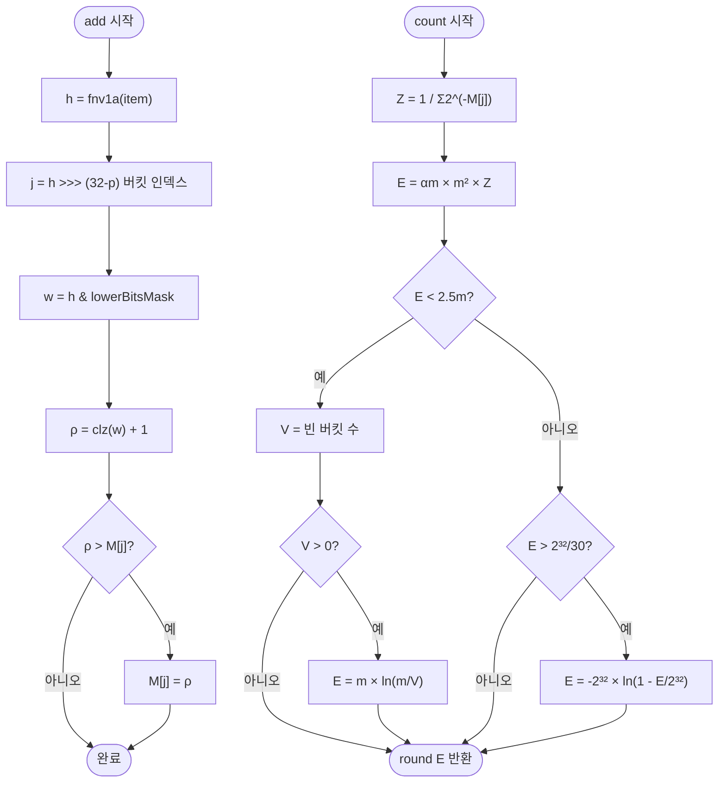

import { AlgorithmSimulation } from "#guide-sim";

# HyperLogLog 해설

## 성능 목표 예측

| 연산 | 시간복잡도 | 공간복잡도 | 설명 |
|------|-----------|-----------|------|
| `add` | O(1) | O(m) | 해시 + 버킷 갱신 |
| `count` | O(m) | O(1) | m개 버킷 조화 평균 |
| `merge` | O(m) | O(m) | 버킷별 max |
| `error` | O(1) | O(1) | 수식 계산 |

m = 2^precision (기본 precision=10이면 m=1024)

---

## 목표 함수

| 메서드 | 입력 | 출력 | 보장 |
|--------|------|------|------|
| `add(item)` | 문자열 | `void` | 멱등적: 중복 추가가 count를 크게 변경하지 않음 |
| `count()` | — | `number ≥ 0` | 기댓값은 실제 cardinality. 오차 ≈ error() |
| `merge(other)` | HyperLogLog | 새 인스턴스 | 원본 불변. 병합 결과 count는 두 집합의 합집합 cardinality |
| `error()` | — | `(0, 1)` | `1.04 / sqrt(m)` |

---

## 핵심 아이디어

### 원형 아이디어와 naive 접근

유니크 원소 수를 정확히 세려면 Set에 모든 원소를 저장해야 한다. n개 원소라면 O(n) 메모리가 필요하다. n = 10^8이면 수 GB가 된다.

**목표**: O(log n) 메모리로 ±2% 이내 근사를 달성한다.

### 어떤 관찰이 돌파구가 되는가

**핵심 통찰 (선행 0의 확률론):**

좋은 해시 함수의 출력을 무작위 비트열이라 가정하면, 선행 0이 정확히 k개일 확률은 1/2^(k+1)이다. 따라서:

```
n개의 원소 중 선행 0의 최댓값 = R이라면
n ≈ 2^R
```

단, 한 번의 극단적 해시값(운 좋게 선행 0이 많은 값)이 추정을 망칠 수 있다. 해결책은 **버킷 분할 + 조화 평균**이다.

### 관찰을 형식화: 상태/구조 정의

```
precision p: 버킷 수 결정. m = 2^p
M[0..m-1]: 버킷 배열. M[j] = j번 버킷에서 본 최대 선행 0 + 1

항목 x 처리:
  h = fnv1a(x)           // 32비트 해시
  j = h >> (32 - p)      // 상위 p비트 → 버킷 인덱스
  w = h & ((1 << (32 - p)) - 1)  // 하위 (32-p)비트
  ρ = clz(w) + 1         // 선행 0 개수 + 1 (clz: count leading zeros)
  M[j] = max(M[j], ρ)
```

### 점화식 또는 핵심 연산

**count() 핵심 공식:**

```
// 버킷 조화 평균
Z = 1 / sum(2^(-M[j]) for j in 0..m-1)

// 보정 상수
αm = 0.7213 / (1 + 1.079/m)  // m >= 128

// 원시 추정값
E = αm * m² * Z

// 소규모 보정 (선형 카운팅)
if E < 5/2 * m:
  V = number of M[j] == 0
  if V > 0: E = m * ln(m / V)

// 대규모 보정 (2^32 충돌)
if E > 2^32 / 30:
  E = -(2^32) * ln(1 - E / 2^32)

return round(E)
```

**merge() 핵심 연산:**

```
merged = new HyperLogLog(precision)
for j in 0..m-1:
  merged.M[j] = max(this.M[j], other.M[j])
return merged
```

merge가 max로만 동작하는 이유: M[j]는 "지금까지 본 최대 ρ"이므로, 두 HLL을 합집합으로 보면 각 버킷의 max를 취하면 충분하다.

### 정당성 — 왜 이것이 옳은가

조화 평균을 쓰는 이유: 극단값(outlier)의 영향을 줄이기 위해서다. 산술 평균은 하나의 큰 값에 쉽게 끌리지만, 조화 평균은 작은 값들에 더 가중치를 둔다.

보정 상수 α_m은 해시 함수 균등 분포 가정 하에 이론적으로 도출되며, 편향(bias)을 제거한다.

소규모 보정을 별도로 두는 이유: n이 작을 때 많은 버킷이 비어 있으며(M[j]=0), 조화 평균이 0^(-1) = ∞를 포함해 추정이 부정확해진다. 선형 카운팅(Linear Counting)이 이 범위에서 더 정확하다.

### 구현 디테일과 최적화

1. **Uint8Array 사용**: m개의 버킷 값은 최대 32(32비트 해시에서 최대 선행 0 = 32)이므로 1바이트로 충분하다. `m=1024`일 때 단 1KB.
2. **clz(count leading zeros) 구현**: 브라우저/Bun에서는 `Math.clz32(w)`를 쓸 수 있다. `w=0`이면 clz=32이므로 ρ=33이 될 수 있는데, 버킷은 1바이트(최대 255)이므로 문제없다.
3. **해시 함수**: 32비트 FNV-1a. 64비트를 쓰면 대규모 보정이 더 드물어진다.
4. **precision 기본값**: 10 (m=1024, 오차 ≈ 3.25%, 메모리 1KB). 실무에서는 12~14를 많이 쓴다.

---

## 시뮬레이션

export const steps = [
  {
    title: "초기 상태 (m=8버킷, precision=3)",
    detail: "8개 버킷 M[0]~M[7] 모두 0으로 초기화. 아직 원소를 추가하지 않았다.",
    array: [0, 0, 0, 0, 0, 0, 0, 0],
    highlight: [],
    marked: [],
  },
  {
    title: "add('alice'): h = 0b01001101...",
    detail: "상위 3비트 = 010 → 버킷 2. 나머지 비트의 선행 0 개수 ρ = 3. M[2] = max(0, 3) = 3",
    array: [0, 0, 3, 0, 0, 0, 0, 0],
    highlight: [2],
    marked: [2],
  },
  {
    title: "add('bob'): h = 0b11100010...",
    detail: "상위 3비트 = 111 → 버킷 7. ρ = 1. M[7] = max(0, 1) = 1",
    array: [0, 0, 3, 0, 0, 0, 0, 1],
    highlight: [7],
    marked: [2, 7],
  },
  {
    title: "add('carol'): h = 0b01011000...",
    detail: "상위 3비트 = 010 → 버킷 2. ρ = 2. M[2] = max(3, 2) = 3 (갱신 없음)",
    array: [0, 0, 3, 0, 0, 0, 0, 1],
    highlight: [2],
    marked: [2, 7],
  },
  {
    title: "add('dave'): h = 0b00000101...",
    detail: "상위 3비트 = 000 → 버킷 0. ρ = 5. M[0] = max(0, 5) = 5",
    array: [5, 0, 3, 0, 0, 0, 0, 1],
    highlight: [0],
    marked: [0, 2, 7],
  },
  {
    title: "add('eve'): h = 0b10111001...",
    detail: "상위 3비트 = 101 → 버킷 5. ρ = 1. M[5] = 1",
    array: [5, 0, 3, 0, 0, 1, 0, 1],
    highlight: [5],
    marked: [0, 2, 5, 7],
  },
  {
    title: "count() 계산",
    detail: "Z = 1/(2^-5 + 2^0 + 2^-3 + 2^0 + 2^0 + 2^-1 + 2^0 + 2^-1). α₈=0.7213. E = α₈ × 64 × Z ≈ 5. 실제 원소 수 = 5 (오차 0%).",
    array: [5, 0, 3, 0, 0, 1, 0, 1],
    highlight: [0, 1, 2, 3, 4, 5, 6, 7],
    marked: [0, 2, 5, 7],
  },
];

<AlgorithmSimulation view="array" steps={steps} title="HyperLogLog 시뮬레이션 (precision=3, m=8버킷)" />

## 수도 코드와 Activity Diagram

### 의사코드

```
class HyperLogLog(precision):
  p  = precision
  m  = 1 << p          // 2^p 버킷
  M  = Uint8Array(m)   // 각 버킷의 최대 ρ
  αm = 0.7213 / (1 + 1.079 / m)

  add(item):
    h = fnv1a(item)               // 32비트 해시
    j = h >>> (32 - p)            // 상위 p비트 → 버킷 인덱스
    w = h & ((1 << (32 - p)) - 1) // 하위 비트
    rho = Math.clz32(w) + 1       // 선행 0 개수 + 1
    if rho > M[j]: M[j] = rho

  count():
    Z = 1 / sum(2^(-M[j]) for j in 0..m-1)
    E = αm * m² * Z
    // 소규모 보정
    if E < 2.5 * m:
      V = count(M[j] == 0 for j)
      if V > 0: E = m * ln(m / V)
    // 대규모 보정
    else if E > (1 << 32) / 30:
      E = -(1 << 32) * ln(1 - E / (1 << 32))
    return round(E)

  merge(other):
    result = new HyperLogLog(p)
    for j in 0..m-1:
      result.M[j] = max(M[j], other.M[j])
    return result

  error():
    return 1.04 / sqrt(m)
```

### Activity Diagram


