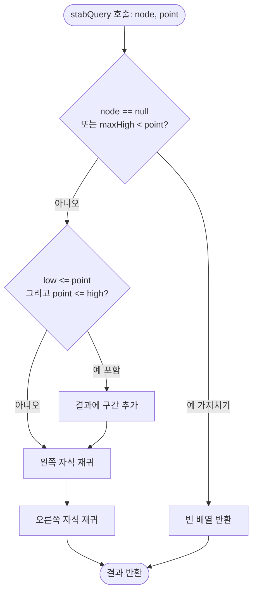
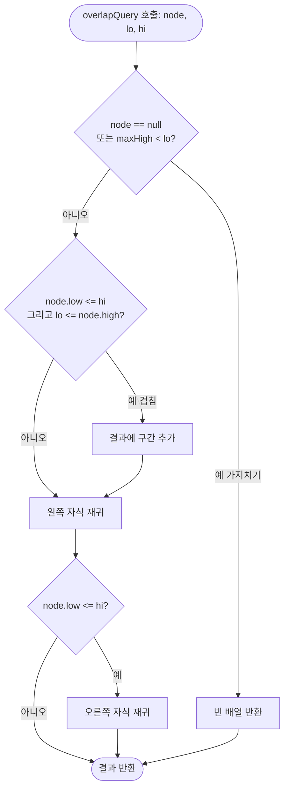

import { AlgorithmSimulation } from "#guide-sim";

# IntervalTree (구간 트리) 해설

## 성능 목표 예측

| 연산 | 정렬 배열 + 이진탐색 | **구간 트리** |
|------|----------------------|---------------|
| 삽입 | O(n) (재정렬) | O(log n) |
| 삭제 | O(n) | O(log n) |
| 단건 겹침 검색 | O(log n) | O(log n) |
| 전체 겹침 반환 | O(n) | O(k + log n) |
| 점 포함 구간 반환 | O(n) | O(k + log n) |

k = 결과 구간 수. 겹치는 구간이 적을수록 구간 트리의 이점이 크다.

---

## 목표 함수

| 함수 | 시그니처 | 복잡도 |
|------|----------|--------|
| 삽입 | `insert(low, high, data?)` | O(log n) |
| 삭제 | `delete(low, high): boolean` | O(log n) |
| 점 질의 | `stabQuery(point): [number,number][]` | O(k + log n) |
| 겹침 질의 | `overlapQuery(low, high): [number,number][]` | O(k + log n) |
| 크기 | `size(): number` | O(1) |

---

## 핵심 아이디어

### 원형 아이디어와 naive 접근

n개의 구간을 배열에 저장하면 임의의 점 p를 포함하는 구간을 찾으려면 모든 구간을 순회해야 해 O(n)이다. 예약이 10만 건이면 매 질의마다 10만 번 비교가 발생한다.

### 어떤 관찰이 돌파구가 되는가

BST로 구간을 정렬하면 삽입·삭제는 O(log n)이 된다. 그러나 "겹침 검색"에서 문제가 생긴다. low 기준으로 정렬되어 있어도 high가 불규칙하게 분포하므로, 오른쪽 서브트리를 탐색해야 할지 판단하기 어렵다.

**핵심 관찰**: 각 노드가 "서브트리 내 모든 구간의 최대 high 값(maxHigh)"을 알고 있다면, `maxHigh < queryLow`일 때 이 서브트리의 모든 구간이 질의 구간 왼쪽에 끝남을 보장할 수 있다 — 즉, 탐색을 즉시 중단(가지치기)할 수 있다.

### 관찰을 형식화

**Augmented BST**: 각 노드에 `maxHigh`를 추가로 저장한다.

```
node.maxHigh = max(node.high, leftChild?.maxHigh, rightChild?.maxHigh)
```

이 불변성(invariant)을 삽입·삭제마다 유지하면, 모든 탐색에서 `node.maxHigh < threshold` 조건으로 서브트리를 가지치기할 수 있다.

### 핵심 연산

**겹침 조건**: 구간 [l₁, h₁]과 [l₂, h₂]가 겹치는 조건은 `l₁ ≤ h₂ AND l₂ ≤ h₁`. 즉, `!(h₁ < l₂ || h₂ < l₁)`.

**가지치기 조건**:
- stabQuery: `node.maxHigh < point`이면 이 서브트리에 point를 포함하는 구간이 없다.
- overlapQuery: `node.maxHigh < queryLow`이면 이 서브트리의 모든 구간이 queryLow 왼쪽에서 끝난다.

### 정당성

`maxHigh`는 서브트리 내 **모든** high의 최댓값이다. 어떤 구간도 이 값보다 큰 high를 가질 수 없다. 따라서 `maxHigh < threshold`이면 서브트리의 어떤 구간도 `high ≥ threshold`를 만족하지 못한다는 것이 보장된다.

### 구현 디테일과 최적화

- **균형 유지**: 단순 BST는 최악의 경우 O(n)으로 퇴화할 수 있다. AVL 트리나 레드-블랙 트리를 기반으로 구현하면 O(log n)을 보장한다. 간단한 구현은 랜덤 삽입 순서를 가정한 비균형 BST를 쓰기도 한다.
- **maxHigh 갱신 경로**: 삽입·삭제 후 루트까지의 경로 상 모든 노드를 상향식으로 갱신해야 한다.
- **동일 low 처리**: low가 같은 구간은 high를 보조 기준으로 BST 순서를 결정하거나, 같은 노드에 리스트로 묶을 수 있다.
- **오른쪽 자식 탐색 조건**: stabQuery에서 오른쪽 자식은 `node.low > point`여도 항상 탐색해야 한다 (node.low가 BST 기준이고, 오른쪽 서브트리에 low가 더 큰 구간이 있을 수 있으며 그 구간의 high는 point를 넘길 수 있다).

---

## 시뮬레이션

export const steps = [
  {
    title: "초기 삽입 — [9,11]",
    detail: "루트로 [9,11]을 삽입. maxHigh=11.",
    array: [9, 11],
    highlight: [0, 1],
    marked: [],
  },
  {
    title: "삽입 — [14,16]",
    detail: "9 < 14이므로 오른쪽 자식. 루트 maxHigh → max(11,16)=16.",
    array: [9, 11, 14, 16],
    highlight: [2, 3],
    marked: [0, 1],
  },
  {
    title: "삽입 — [10,12]",
    detail: "9 < 10이므로 오른쪽, 14 > 10이므로 왼쪽 자식. maxHigh 경로 갱신.",
    array: [9, 11, 10, 12, 14, 16],
    highlight: [2, 3],
    marked: [0, 1, 4, 5],
  },
  {
    title: "stabQuery(11) — 점 11 포함 구간 검색",
    detail: "루트 maxHigh=16 ≥ 11, 탐색 진입. [9,11]: 9≤11≤11 → 포함. [10,12]: 10≤11≤12 → 포함.",
    array: [9, 11, 10, 12],
    highlight: [0, 1, 2, 3],
    marked: [],
  },
  {
    title: "overlapQuery(10,12) — 겹치는 구간 검색",
    detail: "겹침 조건: storedLow ≤ 12 AND 10 ≤ storedHigh. [9,11]: 9≤12 AND 10≤11 → 겹침. [10,12]: 10≤12 AND 10≤12 → 겹침. [14,16]: 14≤12? 거짓 → 제외.",
    array: [9, 11, 10, 12, 14, 16],
    highlight: [0, 1, 2, 3],
    marked: [4, 5],
  },
  {
    title: "delete([9,11]) — 삭제 후 maxHigh 재계산",
    detail: "[9,11] 삭제. 트리를 재구성하고 경로 상 maxHigh를 갱신한다.",
    array: [10, 12, 14, 16],
    highlight: [0, 1, 2, 3],
    marked: [],
  },
];

<AlgorithmSimulation view="array" steps={steps} title="IntervalTree — 회의실 예약 충돌 감지 시뮬레이션" />

## 수도 코드와 Activity Diagram

### 의사코드

```
// 삽입
insert(node, low, high, data):
  if node == null:
    return new Node(low, high, data)
  if low < node.low OR (low == node.low AND high < node.high):
    node.left = insert(node.left, low, high, data)
  else:
    node.right = insert(node.right, low, high, data)
  node.maxHigh = max(node.high, maxHigh(node.left), maxHigh(node.right))
  return node  // 균형 회전 삽입 가능

// 점 포함 질의
stabQuery(node, point):
  if node == null OR node.maxHigh < point:
    return []
  result = []
  if node.low <= point <= node.high:
    result.push([node.low, node.high])
  result += stabQuery(node.left, point)
  result += stabQuery(node.right, point)
  return result

// 겹침 질의
overlapQuery(node, lo, hi):
  if node == null OR node.maxHigh < lo:
    return []
  result = []
  if node.low <= hi AND lo <= node.high:
    result.push([node.low, node.high])
  result += overlapQuery(node.left, lo, hi)
  if node.low <= hi:
    result += overlapQuery(node.right, lo, hi)
  return result
```

### Activity Diagram




