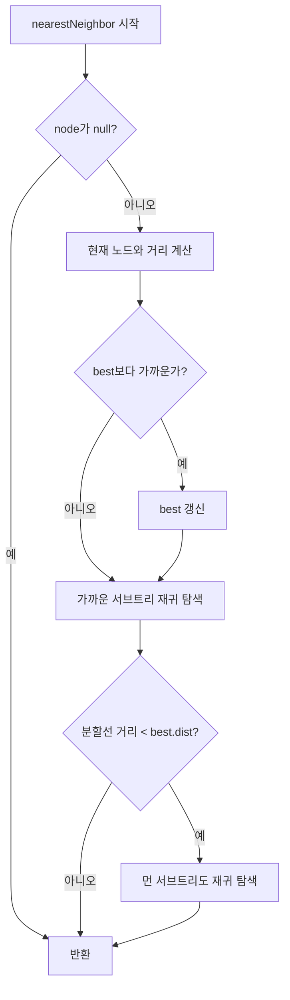

import { AlgorithmSimulation } from "#guide-sim";

# KDTree (K-D 트리) 해설

## 성능 목표 예측

| 연산 | Naive (선형 탐색) | KDTree (평균) | KDTree (최악) |
|------|-----------------|--------------|--------------|
| insert | O(1) | O(log n) | O(n) |
| nearestNeighbor | O(n) | O(log n) | O(n) |
| rangeSearch | O(n) | O(√n + k) | O(n) |
| 공간 | O(n) | O(n) | O(n) |

n=10^4 기준으로 nearestNeighbor는 Naive 대비 약 **1,000배** 빠릅니다.

---

## 목표 함수

| 메서드 | 시그니처 | 설명 |
|--------|---------|------|
| `constructor` | `(points?: Point2D[])` | 중앙값 분할로 균형 트리 초기 구성 |
| `insert` | `(point: Point2D): void` | 리프 노드에 삽입 |
| `nearestNeighbor` | `(query: Point2D): Point2D \| undefined` | 유클리드 최근접 점 반환 |
| `rangeSearch` | `(min: Point2D, max: Point2D): Point2D[]` | 직사각형 범위 내 모든 점 반환 |
| `size` | `(): number` | 저장된 점 수 반환 |

---

## 핵심 아이디어

### 원형 아이디어와 naive 접근

"내 위치에서 가장 가까운 점 찾기"를 가장 단순하게 구현하면:

```ts
function naiveNearest(points: Point2D[], query: Point2D): Point2D {
  return points.reduce((best, p) =>
    dist(p, query) < dist(best, query) ? p : best
  );
}
```

이 방법은 O(n)입니다. 점이 100만 개면 매 쿼리마다 100만 번 비교해야 합니다.

### 어떤 관찰이 돌파구가 되는가

공간에는 **구조**가 있습니다. 쿼리 점이 (3, 5)이고 현재까지 찾은 최선 거리가 2라면, x좌표가 10 이상인 모든 점은 확인할 필요가 없습니다. 분할선까지의 거리만으로 가지치기(pruning)가 가능합니다.

### 관찰을 형식화

2차원 공간을 이진 트리로 표현합니다:
- **짝수 레벨(0, 2, 4, ...)**: x축 기준 분할
- **홀수 레벨(1, 3, 5, ...)**: y축 기준 분할

각 노드는 해당 점을 기준으로 공간을 두 반평면으로 나눕니다.

```
레벨 0 (x축 기준):  점 (7, 2)로 분할
                    x < 7 → 왼쪽, x >= 7 → 오른쪽

레벨 1 (y축 기준):  점 (5, 4)로 분할 (왼쪽 서브트리)
                    y < 4 → 왼쪽, y >= 4 → 오른쪽
```

### 핵심 연산

**초기 구성 (균형 트리):**
중앙값 인덱스의 점을 루트로 삼으면 왼쪽과 오른쪽의 점 수가 균등해져 트리 높이가 O(log n)이 됩니다.

```ts
function build(points: Point2D[], depth: number): KDNode | null {
  if (points.length === 0) return null;
  const axis = depth % 2; // 0 = x, 1 = y
  points.sort((a, b) => a[axis] - b[axis]);
  const mid = Math.floor(points.length / 2);
  return {
    point: points[mid],
    left: build(points.slice(0, mid), depth + 1),
    right: build(points.slice(mid + 1), depth + 1),
  };
}
```

**최근접 이웃 탐색:**

```ts
function nearest(node, query, depth, best):
  if node is null: return best
  
  d = euclideanDist(node.point, query)
  if d < best.dist:
    best = { point: node.point, dist: d }
  
  axis = depth % 2
  diff = query[axis] - node.point[axis]
  
  // 가까운 서브트리 먼저 탐색
  [near, far] = diff <= 0 ? [node.left, node.right] : [node.right, node.left]
  best = nearest(near, query, depth + 1, best)
  
  // 분할선까지의 거리가 현재 최선보다 가까우면 반대쪽도 탐색
  if diff * diff < best.dist:
    best = nearest(far, query, depth + 1, best)
  
  return best
```

### 정당성

최근접 이웃 탐색의 정확성은 **분할선 가지치기 조건**에 의해 보장됩니다. 분할선까지의 최소 거리(`|diff|`)가 현재 최선 거리보다 크다면, 반대쪽 서브트리에 있는 어떤 점도 현재 최선보다 가까울 수 없습니다. 이는 유클리드 거리의 삼각 부등식으로 증명됩니다.

### 구현 디테일과 최적화

1. **거리 비교 시 제곱 사용**: `Math.sqrt`를 피해 `dist²` 비교로 성능 향상
2. **insert 시 깊이 추적**: 삽입 경로에서 현재 깊이를 전달해 축 방향 결정
3. **배열 슬라이싱 대신 인덱스 사용**: 초기 구성 시 메모리 할당 최소화

---

## 시뮬레이션

export const steps = [
  {
    title: "초기 점 집합",
    detail: "6개의 점을 K-D 트리에 삽입합니다: (2,3), (5,4), (9,6), (4,7), (8,1), (7,2)",
    array: [[2,3], [5,4], [9,6], [4,7], [8,1], [7,2]],
    highlight: [],
    marked: [],
  },
  {
    title: "레벨 0: x축 기준 분할",
    detail: "x좌표 기준으로 정렬하면 [2,3], [4,7], [5,4], [7,2], [8,1], [9,6]. 중앙값은 (7,2) → 루트 노드. x<7은 왼쪽, x>=7은 오른쪽.",
    array: [[2,3], [4,7], [5,4], [7,2], [8,1], [9,6]],
    highlight: [3],
    marked: [3],
  },
  {
    title: "레벨 1 왼쪽: y축 기준 분할",
    detail: "왼쪽 점 [2,3], [4,7], [5,4]를 y좌표 기준 정렬: [2,3], [5,4], [4,7]. 중앙값은 (5,4) → 왼쪽 자식 노드.",
    array: [[2,3], [5,4], [4,7]],
    highlight: [1],
    marked: [1],
  },
  {
    title: "레벨 1 오른쪽: y축 기준 분할",
    detail: "오른쪽 점 [8,1], [9,6]을 y좌표 기준 정렬: [8,1], [9,6]. 중앙값은 (9,6) → 오른쪽 자식 노드.",
    array: [[8,1], [9,6]],
    highlight: [1],
    marked: [1],
  },
  {
    title: "nearestNeighbor([9,2]) 탐색",
    detail: "쿼리 (9,2). 루트 (7,2): 거리=2. x>=7이므로 오른쪽 탐색 → (9,6): 거리=4. 왼쪽도 |9-7|=2 < 현재 best=2 아니므로 생략. 최종: (7,2)",
    array: [[7,2], [9,6], [8,1]],
    highlight: [0],
    marked: [0],
  },
];

<AlgorithmSimulation view="array" steps={steps} title="K-D 트리 구성 및 탐색" />

---

## 수도 코드와 Activity Diagram

### 의사코드

```
KDTree.build(points, depth):
  if points is empty: return null
  axis ← depth mod 2
  sort points by points[axis]
  mid ← floor(len(points) / 2)
  node.point ← points[mid]
  node.left ← build(points[0..mid-1], depth+1)
  node.right ← build(points[mid+1..end], depth+1)
  return node

KDTree.nearestNeighbor(query):
  best ← { point: null, dist: ∞ }
  search(root, 0, best)
  return best.point

search(node, depth, best):
  if node is null: return
  d ← dist²(node.point, query)
  if d < best.dist: best ← { node.point, d }
  axis ← depth mod 2
  diff ← query[axis] - node.point[axis]
  near ← diff <= 0 ? node.left : node.right
  far  ← diff <= 0 ? node.right : node.left
  search(near, depth+1, best)
  if diff² < best.dist:
    search(far, depth+1, best)

KDTree.rangeSearch(min, max):
  result ← []
  collectInRange(root, 0, min, max, result)
  return result

collectInRange(node, depth, min, max, result):
  if node is null: return
  if inRange(node.point, min, max): result.push(node.point)
  axis ← depth mod 2
  if min[axis] <= node.point[axis]:
    collectInRange(node.left, depth+1, min, max, result)
  if max[axis] >= node.point[axis]:
    collectInRange(node.right, depth+1, min, max, result)
```

### Activity Diagram



```mermaid
flowchart TD
  A[build 시작] --> B{points가 비어있나?}
  B -- 예 --> Z[null 반환]
  B -- 아니오 --> C["axis = depth % 2로 정렬"]
  C --> D[mid = 중앙값 인덱스]
  D --> E[node.point = points[mid]]
  E --> F["node.left = build(points[0..mid-1], depth+1)"]
  F --> G["node.right = build(points[mid+1..], depth+1)"]
  G --> H[node 반환]
```
