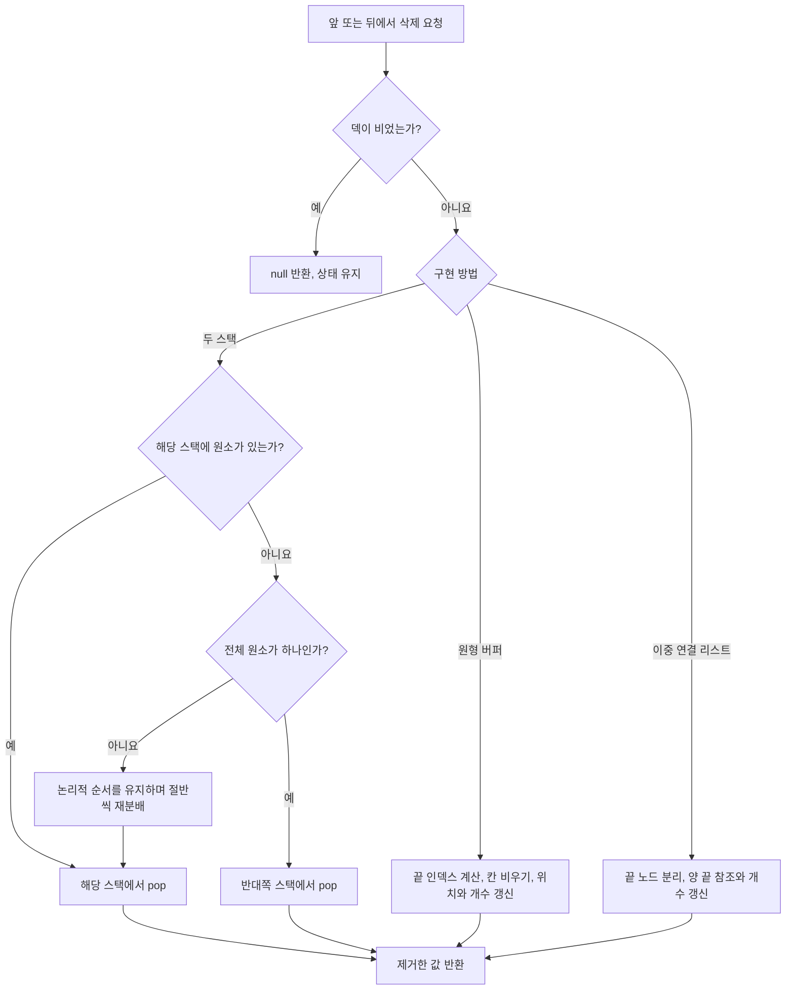

# 덱 — 두 스택, 원형 버퍼, 연결 리스트로 구현하기

## 파트 1 — 양쪽 끝을 빠르게 다루는 세 가지 방법

### 전체 컨셉

카드를 한 줄로 놓았다고 생각해 봅시다. 맨 앞에 카드를 놓거나 가져갈 수도 있고, 맨 뒤에서 같은 일을 할 수도 있습니다. 덱(deque, double-ended queue)은 이처럼 **앞과 뒤 양쪽에서 원소를 넣고 뺄 수 있는 자료구조**입니다.

```text
                    앞                         뒤
pushFront(0) →      [1, 2, 3]       ← pushBack(4)
popFront()   ←                     → popBack()
```

덱은 사용할 수 있는 연산을 정한 개념입니다. 그 원소를 메모리에 어떻게 보관할지는 구현마다 다릅니다. 이 글에서는 대표적인 세 가지 구현을 직접 만들어 봅니다.

| 구현 | 저장 방법 |
| --- | --- |
| 두 스택 | 앞쪽과 뒤쪽 원소를 나누어 보관하고, 한쪽이 비면 절반씩 재분배합니다. |
| 원형 버퍼 | 배열의 마지막 칸 다음에 첫 칸이 이어진다고 계산합니다. |
| 이중 연결 리스트 | 각 노드가 이전 노드와 다음 노드를 참조합니다. |

이 세 가지가 덱 구현의 전부라는 뜻은 아닙니다. 배열 블록 여러 개를 연결하는 방법 등도 있습니다. 여기서는 세 방법이 각각 양쪽 끝 연산을 어떻게 처리하는지, 왜 빠른지, 어떤 실수를 주의해야 하는지에 집중합니다.

```text
덱의 역할: 어떤 순서로 넣고 빼는가
구현의 역할: 그 순서를 어떻게 저장하고 빠르게 갱신하는가
```

이 프로젝트의 [연산 명세](./deque.ts)는 삽입과 삭제에 **상각 O(1)**, 조회에 **최악 O(1)**을 요구합니다. 상각 O(1)은 한 번의 호출이 언제나 빠르다는 뜻이 아닙니다. 빈 상태에서 시작한 m번의 연산에 드는 총비용이 O(m)이라는 뜻입니다. 특정 입력이 자주 나온다고 가정하는 평균 실행 시간과도 다릅니다.

### 시작하기 전에 — 이미 알고 있어야 하는 것

배열의 인덱스로 값을 읽는 방법, 스택의 `push`와 `pop`, 객체가 다른 객체를 참조하는 방식을 알고 있으면 읽을 수 있습니다. 상각 분석과 연결 리스트의 포인터 갱신은 필요한 곳에서 설명합니다.

세 구현은 다음과 같은 사용법을 공유합니다.

```ts
const d = new Deque<number>();
d.pushBack(2);    // [2]
d.pushFront(1);   // [1, 2]
d.pushBack(3);    // [1, 2, 3]
d.peekFront();    // 1, 제거하지 않음
d.peekBack();     // 3, 제거하지 않음
d.popFront();     // 1 반환, [2, 3]
d.popBack();      // 3 반환, [2]
d.size();         // 1
d.isEmpty();      // false
```

빈 덱에서 `popFront`, `popBack`, `peekFront`, `peekBack`은 모두 `null`을 반환합니다. 값이 `0`, `false`, `undefined`여도 정상적인 원소일 수 있으므로, 값의 참·거짓으로 비어 있는지 판단하면 안 됩니다. `T`에 `null`을 허용하면 빈 덱의 반환값과 저장된 `null`을 구분할 수 없다는 점은 현재 명세의 제약입니다.

이 글에서 n은 현재 원소 수, m은 연산 횟수, C는 배열의 용량입니다. `front`는 앞쪽, `back`은 뒤쪽을 뜻합니다. 가운데 원소를 검색하거나 특정 위치에 삽입하는 연산은 구현하지 않습니다.

### 설계 상세 — 배열의 앞쪽 삽입에서 출발하기

가장 먼저 생각할 수 있는 구현은 배열 하나에 `push`, `pop`, `unshift`, `shift`를 사용하는 것입니다. 원소의 순서와 반환값은 이 방법으로도 맞출 수 있습니다.

문제는 앞쪽에 삽입할 때입니다. 연속된 배열에서 맨 앞에 빈칸을 만들려면 기존 원소를 한 칸씩 뒤로 옮겨야 합니다. 이 모델에서 원소 n개를 앞에 하나씩 삽입하면 이동 횟수는 `0 + 1 + … + (n - 1) = n(n - 1) / 2`입니다. 총비용이 O(n²)이므로 이 프로젝트의 성능 요구를 만족하지 못합니다. 실제 JavaScript 엔진의 최적화 여부에 기대어 이 상한을 보장할 수도 없습니다.

```text
배열 [1, 2, 3]의 맨 앞에 0 삽입
3 이동 → 2 이동 → 1 이동 → 첫 칸에 0 저장
결과 [0, 1, 2, 3]: 기존 원소 3개를 옮김
```

그렇다면 **앞에 넣을 때 기존 원소를 모두 옮기지 않으려면 무엇을 바꾸면 될까요?** 세 구현은 이 질문에 서로 다른 답을 줍니다.

```text
두 스택: 앞에 넣을 원소도 배열의 끝에 저장한다.
원형 버퍼: 앞 원소의 위치를 바꿔 앞쪽 빈칸을 사용한다.
이중 연결 리스트: 기존 원소 앞에 새 노드를 연결한다.
```

> 공통 관찰: 덱의 순서와 메모리의 저장 순서는 달라도 됩니다.

세 방법 모두 원소의 논리적인 순서와 실제 저장 위치를 구분합니다. 덱 사용자에게 `[1, 2, 3]`으로 보인다고 해서 메모리에서도 반드시 같은 배열의 0, 1, 2번 칸에 놓일 필요는 없습니다.

### 수행으로 알아보는 자료구조 — 세 구현을 직접 만들기

#### 1. 두 스택 — 앞쪽 원소를 거꾸로 저장한다

스택 두 개를 배열 `front`, `back`으로 구현합니다. 각 배열은 왼쪽이 바닥, 오른쪽이 꼭대기입니다. 덱의 앞쪽 원소는 `front`에 역순으로, 뒤쪽 원소는 `back`에 정순으로 넣습니다.

```text
덱의 순서:       [1, 2, 3, 4, 5, 6]
front:           [3, 2, 1]   ← 오른쪽 끝 1이 덱의 맨 앞
back:            [4, 5, 6]   ← 오른쪽 끝 6이 덱의 맨 뒤
복원 규칙:       reverse(front) + back
```

`pushFront(x)`는 `front.push(x)`, `pushBack(x)`는 `back.push(x)`입니다. 삭제할 쪽의 스택에 원소가 있으면 그 스택에서 `pop()`하면 됩니다. 두 방향 모두 배열의 끝만 사용합니다.

**어려운 경우는 삭제할 쪽의 스택이 비었을 때입니다.** 큐를 두 스택으로 구현하던 방법대로 반대쪽 원소를 전부 옮기면 어떨까요? 큐에서는 잘 작동하지만, 덱에서는 앞뒤 삭제가 번갈아 들어올 수 있습니다.

```text
back에 원소 6개가 있을 때 앞뒤로 번갈아 삭제:
popFront → 6개를 front로 옮기고 1개 삭제
popBack  → 남은 5개를 back으로 옮기고 1개 삭제
popFront → 남은 4개를 front로 옮기고 1개 삭제
...
총 이동: 6 + 5 + 4 + 3 + 2 + 1
```

이 실패는 두 스택이라는 선택 자체의 문제가 아닙니다. **한쪽에 전부 몰아주는 재분배 방식**이 문제입니다. 전체 원소를 앞쪽 절반과 뒤쪽 절반으로 나누면, 바로 다음에 반대쪽을 삭제하더라도 다시 옮길 필요가 없습니다.

아래 구현은 한쪽이 빈 상태에서 삭제해야 할 때만 재분배합니다. 홀수 개라면 `front`가 한 개 더 갖습니다. 재분배 전에 원소가 하나뿐인 경우에는 어느 스택에 있든 그 원소를 바로 꺼냅니다.

| 호출 | front: 바닥 → 꼭대기 | back: 바닥 → 꼭대기 | 반환값 | 남은 덱 |
| --- | --- | --- | --- | --- |
| 뒤에 1~6 삽입 | `[]` | `[1,2,3,4,5,6]` | — | `[1,2,3,4,5,6]` |
| `popFront()` | `[3,2]` | `[4,5,6]` | 1 | `[2,3,4,5,6]` |
| `popBack()` | `[3,2]` | `[4,5]` | 6 | `[2,3,4,5]` |
| `popFront()` | `[3]` | `[4,5]` | 2 | `[3,4,5]` |
| `popBack()` | `[3]` | `[4]` | 5 | `[3,4]` |
| `popFront()` | `[]` | `[4]` | 3 | `[4]` |
| `popBack()` | `[]` | `[]` | 4 | `[]` |

재분배는 첫 삭제에서 한 번만 일어났습니다. 처음 예시처럼 삭제할 때마다 모든 원소를 옮기지 않습니다.

**조회 때문에 재분배하지는 않습니다.** `front`가 비었으면 덱의 맨 앞은 `back[0]`이고, `back`이 비었으면 맨 뒤는 `front[0]`입니다. 배열의 바닥도 인덱스로 읽을 수 있으므로 조회는 항상 O(1)입니다.

```text
front가 비었을 때 앞 조회 → back[0]
back이 비었을 때 뒤 조회 → front[0]
조회만으로 원소를 옮기지는 않는다.
```

여기서 말하는 두 스택은 **배열로 만든 두 스택**입니다. 꼭대기 접근만 허용하는 엄격한 스택 인터페이스라면 바닥을 직접 조회할 수 없습니다. 그 경우 양 끝 값을 별도로 관리하거나, 스택이 비기 전에 재분배하는 설계가 필요합니다. 절반을 옮기는 과정에도 임시 스택 등을 사용할 수 있습니다. 아래 코드는 그 과정을 임시 배열로 명확하게 표현했습니다.

#### 두 스택 구현 코드

```ts
export class StackDeque<T> {
  private front: T[] = [];
  private back: T[] = [];

  size(): number { return this.front.length + this.back.length; }
  isEmpty(): boolean { return this.size() === 0; }
  pushFront(item: T): void { this.front.push(item); }
  pushBack(item: T): void { this.back.push(item); }

  peekFront(): T | null {
    if (this.isEmpty()) return null;
    return this.front.length > 0
      ? this.front[this.front.length - 1] as T
      : this.back[0] as T;
  }

  peekBack(): T | null {
    if (this.isEmpty()) return null;
    return this.back.length > 0
      ? this.back[this.back.length - 1] as T
      : this.front[0] as T;
  }

  popFront(): T | null {
    if (this.isEmpty()) return null;
    if (this.front.length === 0) {
      if (this.back.length === 1) return this.back.pop() as T;
      this.rebalance();
    }
    return this.front.pop() as T;
  }

  popBack(): T | null {
    if (this.isEmpty()) return null;
    if (this.back.length === 0) {
      if (this.front.length === 1) return this.front.pop() as T;
      this.rebalance();
    }
    return this.back.pop() as T;
  }

  private rebalance(): void {
    // 먼저 덱의 논리적인 순서를 복원한다.
    const items = this.front.slice().reverse().concat(this.back);
    const middle = Math.ceil(items.length / 2);
    this.front = items.slice(0, middle).reverse();
    this.back = items.slice(middle);
  }
}
```

`rebalance()`는 기존 `front`를 직접 뒤집지 않고 복사본을 뒤집습니다. 재분배 중에도 원래 배열의 해석을 바꾸지 않도록 하기 위한 선택입니다. 여러 번 복사하므로 상수 비용과 임시 메모리는 늘지만, 복사하는 총량은 O(n)입니다.

#### 2. 원형 버퍼 — 첫 원소가 0번 칸에 있을 필요는 없다

배열에서 맨 앞 원소가 항상 0번 칸에 있어야 한다는 조건을 없애 봅시다. 앞 원소의 위치를 `head`, 원소 수를 `count`로 기억하면, 앞에서 i번째 원소의 위치는 다음과 같습니다.

```text
실제 인덱스 = wrap(head + i)
wrap(x)     = ((x % C) + C) % C
```

`wrap`은 인덱스를 `0`부터 `C - 1` 사이로 바꿉니다. 예를 들어 C가 4일 때 3 다음을 0으로, 0의 이전을 3으로 계산합니다. TypeScript에서 `-1 % 4`는 -1이므로 음수를 보정하는 두 번째 나머지 연산이 필요합니다.

앞에 넣을 때는 `head`를 한 칸 뒤로 옮기고 값을 씁니다. 뒤에 넣을 때는 `wrap(head + count)`에 씁니다. 다른 원소의 위치는 바뀌지 않습니다.
다음 예시는 계산을 작게 보려고 용량 4에서 시작합니다. 코드의 초기 용량은 8이지만 동작 원리는 같습니다. `·`는 사용하지 않는 칸입니다.

| 호출 | 실제 배열: 0, 1, 2, 3번 순서 | head | count | 논리적인 덱 |
| --- | --- | --- | --- | --- |
| 시작 | `[·,·,·,·]` | 0 | 0 | `[]` |
| `pushBack(1)` | `[1,·,·,·]` | 0 | 1 | `[1]` |
| `pushBack(2)` | `[1,2,·,·]` | 0 | 2 | `[1,2]` |
| `pushFront(0)` | `[1,2,·,0]` | 3 | 3 | `[0,1,2]` |
| `pushBack(3)` | `[1,2,3,0]` | 3 | 4 | `[0,1,2,3]` |
| `popFront()` → 0 | `[1,2,3,·]` | 0 | 3 | `[1,2,3]` |
| `pushBack(4)` | `[1,2,3,4]` | 0 | 4 | `[1,2,3,4]` |

배열이 가득 찬 상태에서 원소를 더 넣으려면 용량을 늘려야 합니다. 원소를 잃지 않는 덱이므로 기존 값을 덮어쓰면 안 됩니다. 두 배 크기의 배열을 만들고 **덱의 앞에서부터** 새 배열의 0번 칸부터 복사한 뒤 `head = 0`으로 둡니다.

```text
용량 4, head = 3, count = 4
기존 배열: [1, 2, 3, 0]       논리적인 순서: [0, 1, 2, 3]
복사 순서: 기존 3 → 0 → 1 → 2번 칸
새 배열:   [0, 1, 2, 3, ·, ·, ·, ·], head = 0
뒤에 4 삽입: [0, 1, 2, 3, 4, ·, ·, ·], count = 5
```

기존 배열을 저장된 순서 그대로 복사하면 `[1,2,3,0]`이 되어 덱의 순서가 달라집니다. 또한 용량만 바꾸면 나머지 연산의 기준이 달라지므로 기존 인덱스 계산도 더 이상 맞지 않습니다.

삭제는 앞이나 뒤의 값을 읽고 해당 칸을 비운 다음 `count`를 줄입니다. 앞에서 삭제했다면 `head`도 다음 칸으로 이동합니다. 빈 칸에 `undefined`를 쓰는 이유는 제거한 객체에 대한 참조를 해제하기 위해서입니다. 빈 덱인지 판단하는 기준은 칸의 값이 아니라 `count`입니다.

```text
앞 삭제: head 위치를 비움 → head를 다음 칸으로 → count 감소
뒤 삭제: wrap(head + count - 1)을 비움 → count 감소
```

아래 시뮬레이션에서는 초기 용량 8을 사용합니다. 처음에는 빈 덱을 조회하고, 이후 양쪽 삽입·삭제와 용량 확장을 차례로 확인합니다. 마지막 호출은 `popBack()`이며 **7을 반환하고 `[0,1,2,3,4,5,6]`을 남깁니다.**
<!--result:walk=7-->

<!--viz:walk-->

```ascii
시작: []
popFront() → null, peekBack() → null, isEmpty() → true
pushBack(1), pushBack(2), pushFront(0) → [0,1,2]
peekFront() → 0, peekBack() → 2
popFront() → 0, popBack() → 2, 남은 값 [1]
pushBack(2)부터 pushBack(7), pushFront(0) → [0,1,2,3,4,5,6,7]
size() → 8
pushFront(-1) → 용량 16으로 확장, [-1,0,1,2,3,4,5,6,7]
peekFront() → -1, peekBack() → 7
popFront() → -1, popBack() → 7
최종 상태: [0,1,2,3,4,5,6], head = 0, count = 7
```

시뮬레이션과 같은 순서로 호출한 뒤의 덱입니다. T19에서 확장하고, T23에서 마지막 반환값 7을 확인합니다.

| 단계와 호출 | 호출 후 덱의 순서 |
| --- | --- |
| T1 popFront() | [] |
| T2 peekBack() | [] |
| T3 isEmpty() | [] |
| T4 pushBack(1) | [1] |
| T5 pushBack(2) | [1 2] |
| T6 pushFront(0) | [0 1 2] |
| T7 peekFront() | [0 1 2] |
| T8 peekBack() | [0 1 2] |
| T9 popFront() | [1 2] |
| T10 popBack() | [1] |
| T11 pushBack(2) | [1 2] |
| T12 pushBack(3) | [1 2 3] |
| T13 pushBack(4) | [1 2 3 4] |
| T14 pushBack(5) | [1 2 3 4 5] |
| T15 pushBack(6) | [1 2 3 4 5 6] |
| T16 pushBack(7) | [1 2 3 4 5 6 7] |
| T17 pushFront(0) | [0 1 2 3 4 5 6 7] |
| T18 size() | [0 1 2 3 4 5 6 7] |
| T19 pushFront(-1) | [-1 0 1 2 3 4 5 6 7] |
| T20 peekFront() | [-1 0 1 2 3 4 5 6 7] |
| T21 peekBack() | [-1 0 1 2 3 4 5 6 7] |
| T22 popFront() | [0 1 2 3 4 5 6 7] |
| T23 popBack() | [0 1 2 3 4 5 6] |

<!--proof:simulation-->

```text
시뮬레이션 23단계: 반환값·원소 순서·배열 배치 일치
마지막 반환값: 7
최종 덱: [0,1,2,3,4,5,6]
```

#### 원형 버퍼 전체 코드

다음은 프로젝트의 참조 구현에서 성능 측정용 카운터를 제외한 코드입니다. `pushFront`와 `pushBack`은 공간을 먼저 확보한 뒤 위치를 계산합니다. 새 용량에 맞춰 인덱스를 계산해야 하기 때문입니다.

```ts guide-core=src/data-structures/linear/deque/_reference/deque.ts
/** 처음 잡는 칸 수. 2의 거듭제곱일 필요는 없다 — 나머지 연산으로 감싸기 때문이다. */
const INITIAL_SLOTS = 8;

export class Deque<T> {
  #slots: (T | undefined)[] = new Array(INITIAL_SLOTS);
  /** 앞 끝 원소가 놓인 칸. 비어 있을 때는 다음 `pushBack` 이 쓸 칸이다. */
  #head = 0;
  #count = 0;

  pushFront(item: T): void {
    if (this.#count === this.#slots.length) this.#grow();
    this.#head = this.#wrap(this.#head - 1);
    this.#slots[this.#head] = item;
    this.#count += 1;
  }

  pushBack(item: T): void {
    if (this.#count === this.#slots.length) this.#grow();
    const at = this.#wrap(this.#head + this.#count);
    this.#slots[at] = item;
    this.#count += 1;
  }

  popFront(): T | null {
    if (this.#count === 0) return null;
    const item = this.#slots[this.#head] as T;
    this.#slots[this.#head] = undefined;
    this.#head = this.#wrap(this.#head + 1);
    this.#count -= 1;
    return item;
  }

  popBack(): T | null {
    if (this.#count === 0) return null;
    const at = this.#wrap(this.#head + this.#count - 1);
    const item = this.#slots[at] as T;
    this.#slots[at] = undefined;
    this.#count -= 1;
    return item;
  }

  peekFront(): T | null {
    if (this.#count === 0) return null;
    return this.#slots[this.#head] as T;
  }

  peekBack(): T | null {
    if (this.#count === 0) return null;
    return this.#slots[this.#wrap(this.#head + this.#count - 1)] as T;
  }

  /**
   * 논리 위치를 칸 번호로 감싼다. 음수도 받으므로 `pushFront` 가 따로 분기하지 않는다.
   */
  #wrap(index: number): number {
    const total = this.#slots.length;
    return ((index % total) + total) % total;
  }

  /**
   * 칸을 두 배로 늘리고 원소를 **앞에서부터 차례로** 새 칸에 옮긴다.
   *
   * 옮기고 나서 `#head` 를 0으로 되돌리는 것이 중요하다. 감긴 상태를 그대로 두고 칸만
   * 늘리면 앞 끝과 뒤 끝 사이에 빈 칸이 끼어 순서가 어긋난다.
   */
  #grow(): void {
    const grown: (T | undefined)[] = new Array(this.#slots.length * 2);
    for (let offset = 0; offset < this.#count; offset++) {
      grown[offset] = this.#slots[this.#wrap(this.#head + offset)];
    }
    this.#slots = grown;
    this.#head = 0;
  }
}
```

#### 3. 이중 연결 리스트 — 양 끝 노드를 직접 연결하고 끊는다

이번에는 배열을 사용하지 않습니다. 원소마다 노드를 만들고, 각 노드가 바로 이전 노드와 다음 노드를 참조하게 합니다. 덱은 맨 앞 노드 `head`, 맨 뒤 노드 `tail`, 원소 수 `count`를 기억합니다.

```text
head                                tail
 ↓                                    ↓
[1]  ←→  [2]  ←→  [3]  ←→  [4]
이전 참조가 null                 다음 참조가 null
```

단일 연결 리스트에서는 다음 노드만 알 수 있습니다. `tail`을 알고 있어도 마지막 노드를 삭제한 뒤 누가 새로운 마지막 노드인지 알아내려면 앞에서부터 찾아야 합니다. 따라서 양쪽 삭제가 O(1)이어야 하는 이 구현에는 **이전 노드를 가리키는 `prev`도 필요합니다.**

앞에 새 노드를 삽입하는 순서는 다음과 같습니다. 새 노드의 `next`를 기존 `head`에 연결하고, 기존 `head`가 있다면 그 노드의 `prev`를 새 노드로 바꿉니다. 마지막으로 `head`를 새 노드로 바꿉니다. 처음부터 비어 있었다면 `tail`도 같은 새 노드를 가리켜야 합니다.

```text
기존: head → [2] ← tail
1 삽입:
  새 노드 1의 next = 노드 2
  노드 2의 prev = 노드 1
  head = 노드 1
결과: head → [1] ←→ [2] ← tail
```

앞에서 삭제할 때는 기존 `head`의 값을 보관하고, `head = head.next`로 바꿉니다. 새 `head`의 `prev`는 `null`이어야 합니다. 새 `head`가 없다면 마지막 원소를 지운 것이므로 `tail`도 `null`로 바꿉니다. 뒤쪽 삽입·삭제는 방향만 반대입니다.

| 호출 | 노드 연결 | head | tail | 반환값 |
| --- | --- | --- | --- | --- |
| 시작 | 없음 | null | null | — |
| `pushBack(2)` | `[2]` | 노드 2 | 노드 2 | — |
| `pushFront(1)` | `[1] ↔ [2]` | 노드 1 | 노드 2 | — |
| `pushBack(3)` | `[1] ↔ [2] ↔ [3]` | 노드 1 | 노드 3 | — |
| `popFront()` | `[2] ↔ [3]` | 노드 2 | 노드 3 | 1 |
| `popBack()` | `[2]` | 노드 2 | 노드 2 | 3 |
| `popBack()` | 없음 | null | null | 2 |
| `popFront()` | 없음 | null | null | null |

원소가 하나에서 0개가 되는 행을 눈여겨보세요. `head`와 `tail`은 같은 덱을 표현하므로 반드시 함께 빈 상태로 돌아가야 합니다.

#### 이중 연결 리스트 구현 코드

```ts
type Link<T> = {
  value: T;
  prev: Link<T> | null;
  next: Link<T> | null;
};

export class LinkedDeque<T> {
  private head: Link<T> | null = null;
  private tail: Link<T> | null = null;
  private count = 0;

  size(): number { return this.count; }
  isEmpty(): boolean { return this.count === 0; }
  peekFront(): T | null { return this.head === null ? null : this.head.value; }
  peekBack(): T | null { return this.tail === null ? null : this.tail.value; }

  pushFront(item: T): void {
    const node: Link<T> = { value: item, prev: null, next: this.head };
    if (this.head === null) this.tail = node;
    else this.head.prev = node;
    this.head = node;
    this.count += 1;
  }

  pushBack(item: T): void {
    const node: Link<T> = { value: item, prev: this.tail, next: null };
    if (this.tail === null) this.head = node;
    else this.tail.next = node;
    this.tail = node;
    this.count += 1;
  }

  popFront(): T | null {
    if (this.head === null) return null;
    const node = this.head;
    this.head = node.next;
    if (this.head === null) this.tail = null;
    else this.head.prev = null;
    node.next = null;
    this.count -= 1;
    return node.value;
  }

  popBack(): T | null {
    if (this.tail === null) return null;
    const node = this.tail;
    this.tail = node.prev;
    if (this.tail === null) this.head = null;
    else this.tail.next = null;
    node.prev = null;
    this.count -= 1;
    return node.value;
  }
}
```

삭제한 노드와 남은 리스트 사이의 참조도 끊었습니다. 이 구현은 노드를 외부에 반환하지 않지만, 연결을 명시적으로 정리해 두면 삭제 후 상태를 확인하기 쉽습니다. 같은 값을 여러 번 넣어도 각각 다른 노드를 생성하므로 중복 원소도 독립적으로 삭제됩니다.

#### 멈춤 — 삭제 요청 하나를 세 구현이 처리하는 흐름

어떤 방법이든 먼저 빈 상태를 확인하고, 요청한 끝의 원소 하나만 제거해야 합니다. 그 사이에 필요한 준비가 서로 다릅니다.

<!--

-->

```text
삭제 요청
  ├─ 비어 있음 → null 반환
  └─ 원소가 있음
       ├─ 두 스택 → 해당 쪽이 비었는가?
       │    ├─ 아니요 → 해당 스택에서 pop
       │    └─ 예 → 한 개면 바로 pop, 여러 개면 절반 재분배 후 pop
       ├─ 원형 버퍼 → 끝 인덱스 계산 → 칸 비우기 → 위치·개수 갱신
       └─ 연결 리스트 → 끝 노드 분리 → 양 끝 참조·개수 갱신
  최종 결과: 요청한 끝의 값 반환, 남은 원소의 순서 유지
```

### 불변식 — 저장 모양이 달라도 같은 수열이어야 한다

불변식은 연산 전후에 계속 참이어야 하는 구현 내부의 성질입니다. 명세에 별도 불변식 항목이 없더라도, 구현의 정확성을 설명할 때는 저장 상태와 덱의 순서를 연결하는 규칙이 필요합니다.

**두 스택:** 덱의 순서는 항상 `reverse(front) + back`입니다. 처음에는 둘 다 비어 있으므로 빈 덱과 같습니다. 각 `push`는 요청한 끝에 값을 추가하고, 각 `pop`은 그 끝의 값을 제거합니다. 재분배에서는 이 순서를 먼저 복원한 뒤 앞쪽 절반만 뒤집어 저장하므로 순서가 유지됩니다. 따라서 연산이 끝났을 때 반환값과 남은 수열이 모두 명세와 같습니다. 두 스택의 크기가 항상 같아야 하는 것은 아닙니다.

```text
두 스택의 순서 보존
reverse(front) + back → 앞·뒤 절반으로 분리 → 같은 순서 복원
```

**원형 버퍼:** `0 ≤ count ≤ C`, `0 ≤ head < C`이고, 덱의 i번째 원소는 `slots[wrap(head + i)]`에 있습니다. 빈 상태에서 성립하고, 삽입은 사용 중인 구간 바로 앞이나 뒤를 한 칸 늘립니다. 삭제는 그 구간의 끝을 한 칸 줄입니다. 확장도 기존 논리적 순서를 그대로 복사하므로 이 규칙을 보존합니다. 연산이 끝나면 `count`개 원소의 순서가 정확히 남습니다.

**이중 연결 리스트:** 비어 있으면 `head`와 `tail`이 모두 `null`입니다. 비어 있지 않으면 `head.prev`와 `tail.next`는 `null`이고, 이웃 노드 a와 b에 대해 `a.next === b`이면 `b.prev === a`입니다. 처음 빈 리스트는 이 조건을 만족합니다. 삽입·삭제는 바뀌는 이웃의 양방향 참조를 함께 고치며, 마지막 노드 삭제 때 양 끝을 모두 비웁니다. 따라서 앞에서 뒤로 방문하는 원소 순서와 개수가 요청한 연산의 결과와 같습니다.

```text
연결 참조의 보존
[a] ↔ [b] ↔ [c] → 앞 삭제 → head = b, b.prev = null
[a] 하나만 있음 → 삭제 → head = tail = null
```

세 구현의 반복문은 복사 대상 원소를 하나씩 처리하고 끝납니다. 일반 연산은 유한한 수의 갱신만 수행하므로, 위 규칙이 보존된 상태로 반드시 종료합니다.

### 수식 정의와 유도

원형 버퍼에서 앞에서 i번째 원소를 찾는 식은 `wrap(head + i)`입니다. 맨 앞은 i가 0이고, 맨 뒤는 i가 `count - 1`입니다. 뒤에 새로 삽입할 위치는 기존 원소들 다음이므로 i가 `count`입니다. **뒤 원소 조회의 `-1`과 뒤쪽 삽입의 `count`를 혼동하지 마세요.**

두 스택은 원소 n개를 재분배할 때 앞쪽에 `ceil(n / 2)`개, 뒤쪽에 `floor(n / 2)`개를 둡니다. 양쪽이 비어 있지 않도록 재분배는 n이 2 이상일 때만 실행합니다. n이 1일 때는 남은 원소를 직접 꺼내므로, 홀수 분할로 한쪽이 다시 비는 문제를 피합니다.

```ts
const C = 8, head = 3, count = 4;
const wrap = (i: number) => ((i % C) + C) % C;
wrap(head);             // 3: 앞 조회
wrap(head + count - 1); // 6: 뒤 조회
wrap(head + count);     // 7: 뒤 삽입
```

연결 리스트에서는 위치를 계산하는 나머지 연산이 필요 없습니다. `head.next`와 `tail.prev`가 각각 삭제 후의 새 끝을 직접 알려줍니다. `count`를 따로 저장하는 이유도 같습니다. `size()`마다 노드를 세면 O(n)이 되기 때문입니다.

## 파트 2 — 비용을 증명하고 구현을 선택하기

### 비용 계산

#### 비용을 세는 과정

**두 스택의 재분배가 O(n)인데, 왜 삭제는 상각 O(1)일까요?** 두 스택의 크기 차이에 주목하면 설명할 수 있습니다. 보통의 삽입·삭제 한 번은 크기 차이를 최대 1만 바꿉니다. 재분배 직전에는 한쪽이 비었으므로 그 차이가 n이고, 재분배 직후에는 0 또는 1로 줄어듭니다.

크기 차이에 충분히 큰 상수 k를 곱한 `Φ = k × abs(front.length - back.length)`를 적립된 비용으로 생각합시다. 일반 연산은 Φ를 최대 k만 늘립니다. 재분배는 O(n)의 실제 비용이 들지만 Φ를 대략 kn만큼 줄입니다. 복사 비용을 감당하도록 k를 정하면, 재분배를 포함한 상각 비용도 상수로 제한됩니다. Φ는 처음에 0이고 음수가 되지 않으므로 m번의 연산 총비용은 O(m)입니다. 배열 자체의 용량 증가 비용도 동적 배열의 상각 비용으로 더해집니다.

```text
두 스택의 크기 차이: n → 재분배 → 0 또는 1
재분배 비용: O(n)
적립 비용의 감소: 크기 차이에 비례하므로 O(n) 비용을 감당
```

**원형 버퍼**는 가득 찼을 때만 두 배로 늘립니다. 초기 용량이 8이면 확장 시 복사하는 원소 수는 `8 + 16 + 32 + …`입니다. 마지막 복사량을 L이라고 하면 합은 2L보다 작습니다. L개를 복사할 정도로 채우려면 그 전에 적어도 L번의 삽입이 필요합니다. 삭제가 섞여도 축소하지 않는 이 구현의 확장 횟수를 더 늘리지는 못합니다. 따라서 m번의 연산 동안 발생하는 복사와 일반 연산의 총비용은 O(m)입니다.

T19의 확장이 이 복사의 한 사례입니다. 8개를 복사하지만, 그 전에 8개가 들어갈 만큼 삽입이 이루어졌습니다.

```text
확장 때 복사량: 8 + 16 + 32 + … + L < 2L
L개까지 채우기 위한 삽입: 적어도 L회
```

**이중 연결 리스트**는 원소 수에 관계없이 끝 노드와 그 이웃만 수정합니다. 전체 노드를 복사하거나 순회하지 않으므로, 노드 할당을 O(1)로 보는 일반적인 자료구조 분석에서 각 연산은 최악 O(1)입니다.

#### 케이스별 비용과 그 경계

| 항목 | 배열로 만든 두 스택 | 확장 가능한 원형 버퍼 | 이중 연결 리스트 |
| --- | --- | --- | --- |
| 앞·뒤 삽입 | 상각 O(1) | 상각 O(1) | 최악 O(1) |
| 앞·뒤 삭제 | 상각 O(1) | 최악 O(1) | 최악 O(1) |
| 양 끝 조회·크기·빈 상태 | 최악 O(1) | 최악 O(1) | 최악 O(1) |
| 큰 작업이 생기는 때 | 재분배, 배열 용량 증가 | 버퍼 용량 증가 | 원소 전체를 다루는 작업 없음 |
| 구현상 저장 공간 | 원소 O(n), 배열 여유 공간 별도 | O(C) | O(n) |
| 추가 부담 | 재분배 중 임시 배열 O(n) | 확장 중 새 배열 O(C) | 원소마다 두 연결 참조 |

이 글의 원형 버퍼는 삭제해도 축소하지 않습니다. 따라서 C는 현재 n보다 훨씬 클 수 있고, 공간을 항상 O(n)이라고 쓰면 부정확합니다. 지금까지 저장한 최대 원소 수를 N이라고 하면 C는 O(N + 1)입니다. 두 스택의 JavaScript 배열도 원소 삭제 후 실제 내부 용량을 언제 반환할지는 엔진에 달려 있습니다. 위 표의 O(n)은 논리적으로 저장하는 원소 수를 말합니다.

원형 버퍼를 축소하고 싶다면 가득 찰 때 확장하고, 사용량이 용량의 1/4 이하가 됐을 때 절반으로 줄이는 식으로 두 기준을 떨어뜨릴 수 있습니다. 절반만 비어도 바로 절반으로 줄이면 삽입과 삭제를 반복할 때 확장·축소가 연달아 일어날 수 있습니다. 축소는 현재 코드에 포함되어 있지 않습니다.

#### 최악을 만드는 입력

한두 번 정상적으로 동작하는 예시만으로 구현을 판단하면 재분배나 확장 오류를 놓치기 쉽습니다. 다음 연산열은 세 구현의 차이와 경계 처리를 확인하는 데 유용합니다.

- **뒤로 n개 삽입한 뒤 앞뒤를 번갈아 삭제:** 두 스택에서 전부 옮기는 구현의 O(n²) 비용을 드러냅니다. 절반 재분배 구현은 전체 O(n)이어야 합니다.
- **앞으로 계속 삽입하다 용량을 초과:** 원형 버퍼의 음수 인덱스 보정과, 배열 끝을 넘어 이어진 상태에서의 확장 순서를 확인합니다.
- **한 개 삽입 → 반대쪽에서 삭제 → 빈 상태 조회 → 다시 삽입:** 연결 리스트의 양 끝 참조와 두 스택의 원소 한 개 처리를 확인합니다.
- **중복값과 `0`, `false`, `undefined` 삽입:** 값으로 빈 상태를 판단하지 않는지 확인합니다. 제거 순서는 값이 같은지와 무관하게 보존되어야 합니다.

```text
뒤에 [1,2,3,4] 삽입 → 앞 삭제 1 → 뒤 삭제 4 → 앞 삭제 2 → 뒤 삭제 3
빈 상태 → 앞에 7 삽입 → 뒤 삭제 7 → 양 끝 조회 null
```

동작을 검증할 때는 단순 배열을 정답 모델로 사용할 수 있습니다. 같은 연산을 두 구현에 보내 반환값, 크기, 양 끝 값을 매번 비교하면 됩니다. 이때 배열 모델은 정답을 구하는 용도이므로 느려도 괜찮습니다. 다만 동작이 맞는다는 사실만으로 상각 시간까지 증명되지는 않습니다. 비용 증명은 앞의 분석처럼 별도로 필요합니다.

<!--proof:implementations-->

```text
세 구현과 참조 구현: 각각 무작위 연산 20,000회 일치
양쪽 교대 삭제·빈 덱 재사용·특수값·객체 동일성: 모두 일치
```

**실제 실행 시간과 언어 선택.** 위의 O(1)은 원소 접근, 참조 갱신, 할당 등의 추상적인 연산 수에 대한 분석입니다. JavaScript의 가비지 컬렉션이나 실제 메모리 할당 지연까지 일정하다는 뜻은 아닙니다. 특히 연결 리스트의 최악 O(1)을 실시간 응답 시간 보장으로 해석하면 안 됩니다.

```text
동작 검증: 배열 모델과 매 연산의 결과 비교
복잡도 검증: 원소 이동·참조 갱신 횟수의 상한 분석
실제 응답 시간: 메모리 할당과 가비지 컬렉션 영향도 고려
```

현재 명세는 세 방법 모두 TypeScript로 구현할 수 있습니다. 메모리 배치나 할당 시점을 직접 통제해야 한다면 사전 할당한 버퍼나 노드 풀을 검토할 수 있고, 필요에 따라 C++나 Rust처럼 메모리 관리를 더 직접 제어하는 언어를 선택할 수 있습니다. 그런 선택은 덱의 기본 연산을 구현하는 것과 별개의 요구입니다.

### 이 구조가 최적의 선택인 경우

#### 최적인 요구의 모양

앞과 뒤 양쪽에서 삽입·삭제해야 하고, 가운데 위치를 찾을 필요가 없다면 덱이 요구에 잘 맞습니다. 다만 어느 구현이 가장 좋은지는 호출 패턴, 메모리 사용, 한 번의 큰 복사를 허용하는지에 따라 달라집니다.

**두 스택**은 이미 익숙한 배열의 끝 연산을 활용하고 싶을 때 이해하기 좋은 선택입니다. 대신 재분배 규칙과 그 비용을 정확히 설명할 수 있어야 합니다. **원형 버퍼**는 노드별 참조 없이 배열 공간을 재사용하고 싶을 때 적합합니다. **이중 연결 리스트**는 용량 확장이나 재분배처럼 원소 전체를 옮기는 작업을 피하고 싶을 때 적합하지만, 노드 할당과 참조 저장 비용을 부담합니다.

#### 이 구조를 떠올리게 하는 연산 조합

뒤에 넣고 앞에서만 빼면 큐로 충분하고, 같은 끝에서만 넣고 빼면 스택으로 충분합니다. 덱은 이 두 패턴이 섞이거나, 양 끝 중 어느 쪽을 사용할지가 실행 중에 바뀔 때 유용합니다.

예를 들어 오래된 원소는 앞에서 제거하면서 새 원소를 넣기 전에 뒤쪽 원소도 조건에 따라 제거해야 한다면, 양쪽 삭제가 모두 필요합니다. 반면 최솟값인 원소를 어디에 있든 꺼내야 한다면 덱의 연산만으로는 충분하지 않습니다.

#### 실제로 쓰이는 곳

슬라이딩 윈도우의 최댓값을 구하는 단조 덱에서는 범위를 벗어난 인덱스를 앞에서 제거하고, 새 값보다 작아서 앞으로 최댓값이 될 수 없는 후보를 뒤에서 제거합니다. 덱이 빠른 양 끝 연산을 제공하고, 어떤 값을 제거할지는 그 위의 알고리즘이 결정합니다.

가중치가 0 또는 1인 그래프의 0–1 BFS에서는 거리를 개선한 정점을 간선 가중치에 따라 앞이나 뒤에 넣습니다. 이처럼 삽입 방향 자체가 알고리즘의 처리 순서를 표현하기도 합니다.

#### 경쟁 설계와의 대조

| 선택할 때 먼저 물을 질문 | 검토할 구현 | 확인할 부담 |
| --- | --- | --- |
| 배열의 끝 연산으로 구현하고 싶은가? | 두 스택 | 절반 재분배와 임시 복사 |
| 배열 공간을 순환해서 재사용하고 싶은가? | 원형 버퍼 | 인덱스 보정과 용량 확장 |
| 한 번에 전체 원소를 옮기지 않아야 하는가? | 이중 연결 리스트 | 노드 할당과 두 방향 참조 |
| 최대 크기가 고정되어 있는가? | 고정 용량 원형 버퍼 | 가득 찼을 때 거부·덮어쓰기 등 별도 정책 |

추가로 [비용 측정 코드](./deque-guide.alt.ts)는 뒤로 1,024개를 넣고 앞에서 모두 꺼내는 동일한 연산열을 비교합니다. 원형 버퍼는 참조 구현을 실행하며, 연결 리스트는 측정용 구현의 값·연결 필드 접근을 셉니다. 단위가 필드와 칸이므로 이 수치를 실행 시간이나 실제 바이트 수로 해석하면 안 됩니다. 위의 세 구현 비교표와 별도로, 큰 복사와 노드 저장 공간의 차이를 확인하는 자료입니다.

| 측정 항목 | 원형 버퍼 | 측정용 연결 리스트 |
| --- | --- | --- |
| 한 호출이 접근한 칸·필드 수의 최댓값 | 513 | 4 |
| 전체 접근 수 | 3064 | 7166 |
| 최대로 보관한 칸·필드 수 | 1024 | 3072 |
| 모두 삭제한 뒤 보관하는 칸·필드 수 | 1024 | 0 |

고정 용량 버퍼가 가득 차면 오래된 값을 덮어쓰도록 만들 수도 있지만, 그것은 이 글의 덱과 다른 동작입니다. 현재 명세에서는 넣은 원소가 명시적인 삭제 없이 사라지면 안 됩니다.

### 스스로 점검하기

1. 두 스택 중 한쪽이 비었을 때 전부 옮기면 왜 큐에서는 괜찮고 덱에서는 문제가 될까요? 앞뒤 삭제를 번갈아 실행해 보세요.
2. T19처럼 원형 버퍼를 확장한다고 합시다. 배열이 `[1,2,3,0]`, `head = 3`, `count = 4`일 때 확장 후 배열은 어떤 순서여야 할까요? 단순 복사와 비교해 보세요.
3. 연결 리스트에 원소가 하나뿐일 때 `popBack()`이 `tail`만 비우면 어떤 조회가 잘못될까요?

세 질문을 설명할 수 있다면, 덱의 사용법을 넘어 각 구현이 원소 순서를 보존하는 방법과 비용이 발생하는 지점을 이해한 것입니다.
