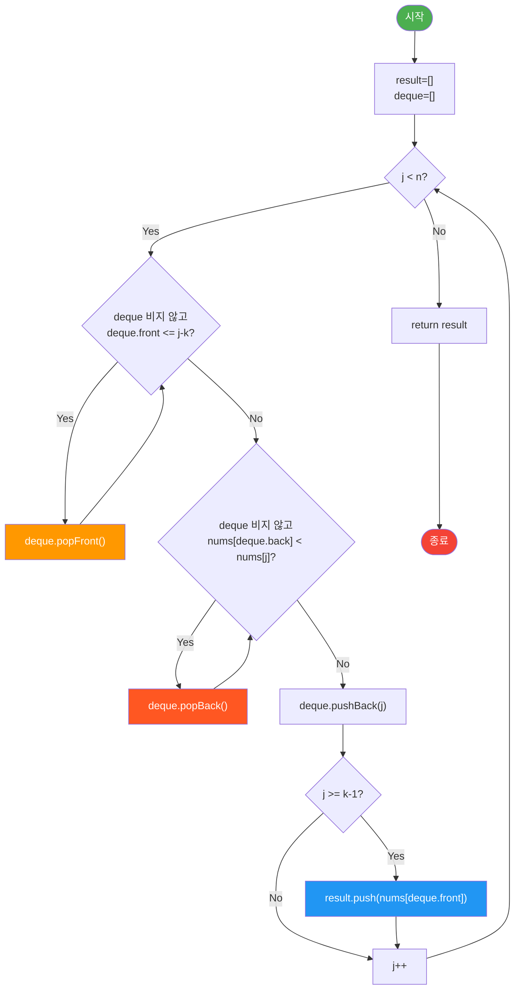

import { AlgorithmSimulation } from "#guide-sim";

# MonotonicQueue (단조 큐) 해설

## 성능 목표 예측

| 입력 크기 n | 윈도우 k | naive O(nk) | 목표 O(n) |
|-------------|----------|-------------|-----------|
| 10,000      | 100      | ~10ms       | <1ms      |
| 100,000     | 100      | ~500ms      | <10ms     |
| 100,000     | 1,000    | ~5,000ms    | <10ms     |
| 100,000     | 100,000  | 초과         | <10ms     |

k가 커질수록 naive O(nk)와 O(n)의 차이가 극적으로 벌어집니다.

---

## 목표 함수

| 메서드 | 덱 불변식 | 결과 길이 | 시간 | 공간 |
|--------|-----------|-----------|------|------|
| `slidingWindowMax` | 단조 감소 (앞→뒤) | n-k+1 | O(n) | O(k) |
| `slidingWindowMin` | 단조 증가 (앞→뒤) | n-k+1 | O(n) | O(k) |

**주요 엣지케이스:**
- `k=1`: 입력 배열 자체 반환
- `k=n`: 전체 배열의 최댓값/최솟값 하나 반환
- 동일값 배열: 동일한 값도 덱에 유지 (중복 허용)

---

## 핵심 아이디어

### 원형 아이디어와 naive 접근

각 윈도우에 대해 `Math.max()`를 호출하는 방식:

```
result = []
for i = 0 to n-k:
  result.push(Math.max(...nums.slice(i, i+k)))
```

이 접근은 O(nk)로, k가 클수록 비효율적입니다.

### 어떤 관찰이 돌파구가 되는가

**관찰 1:** 윈도우가 오른쪽으로 한 칸 이동할 때 k개 중 k-1개는 이전 윈도우와 공유됩니다.

**관찰 2:** 현재 윈도우에 `nums[j]`가 있고 `j < i`이면서 `nums[j] <= nums[i]`이면, `j`는 앞으로 어떤 윈도우에서도 최댓값이 될 수 없습니다 (윈도우에서 먼저 제거되기 때문).

**관찰 3:** 따라서 "유효한 최댓값 후보"만 덱에 유지하면 됩니다. 덱의 앞쪽이 항상 현재 윈도우의 최댓값을 가리킵니다.

### 관찰을 형식화: 상태/구조 정의

- **덱(Deque):** 인덱스를 저장, 앞(front)과 뒤(back)에서 O(1) 삽입/삭제
- **덱 불변식 (slidingWindowMax):** 덱 앞→뒤로 `nums[덱[i]]`가 단조 감소
- 덱에 있는 인덱스들은 모두 현재 윈도우 범위 내에 있음

### 점화식 또는 핵심 연산

```
slidingWindowMax 알고리즘:
  result = []
  deque = []  (앞뒤 삽입/삭제 O(1), 인덱스 저장)
              (불변식: deque의 nums 값은 앞→뒤로 단조 감소)

  for j = 0 to n-1:
    // 1. 만료된 원소 제거: 덱 앞쪽 인덱스가 윈도우 범위 벗어나면 제거
    while deque 비지 않고 deque.front <= j - k:
      deque.popFront()

    // 2. 새 원소 삽입: 덱 뒤쪽에서 nums[j]보다 작은 것 제거 (절대 최댓값이 될 수 없음)
    while deque 비지 않고 nums[deque.back] < nums[j]:
      deque.popBack()
    deque.pushBack(j)

    // 3. 윈도우가 완성되면 최댓값 기록
    if j >= k - 1:
      result.push(nums[deque.front])  // 불변식에 의해 앞쪽 = 최댓값

  return result
```

### 정당성 — 왜 이것이 옳은가

**불변식 유지:**
1. 단계 1에서 윈도우를 벗어난 인덱스 제거 → 덱의 모든 인덱스는 현재 윈도우 내
2. 단계 2에서 뒤쪽의 작은 값 제거 → 덱은 앞→뒤 단조 감소 유지
3. 따라서 `deque.front`는 항상 현재 윈도우의 최대 인덱스이자 최댓값

**복잡도 증명:** 각 인덱스는 정확히 한 번 pushBack, 최대 한 번 popFront/popBack → 전체 O(n).

### 구현 디테일과 최적화

- TypeScript에서 덱은 배열 + 포인터 방식으로 O(1) 연산 구현 (또는 `shift()`/`push()`로 단순 구현)
- `slidingWindowMin`: 단조 증가 덱 — 뒤쪽에서 `nums[back] > nums[j]`인 것을 제거

---

## 시뮬레이션

export const steps = [
  {
    title: "초기 상태",
    detail: "nums = [1,3,-1,-3,5,3,6,7], k=3. 덱 = [], result = []",
    array: [],
    highlight: [],
    marked: [],
  },
  {
    title: "j=0: nums[0]=1",
    detail: "덱 비어있음. pushBack(0). 덱 = [0]. 윈도우 미완성(j<k-1=2)",
    array: [0],
    highlight: [0],
    marked: [],
  },
  {
    title: "j=1: nums[1]=3",
    detail: "nums[0]=1 < 3 → popBack. pushBack(1). 덱 = [1]. 윈도우 미완성",
    array: [1],
    highlight: [1],
    marked: [],
  },
  {
    title: "j=2: nums[2]=-1",
    detail: "nums[1]=3 >= -1 → 그대로. pushBack(2). 덱 = [1,2]. j=k-1=2 → result.push(nums[1]=3). result=[3]",
    array: [1, 2],
    highlight: [2],
    marked: [0],
  },
  {
    title: "j=3: nums[3]=-3",
    detail: "만료체크: front=1 > 3-3=0 → ok. nums[2]=-1 >= -3 → 그대로. pushBack(3). 덱=[1,2,3]. result.push(nums[1]=3). result=[3,3]",
    array: [1, 2, 3],
    highlight: [3],
    marked: [0, 1],
  },
  {
    title: "j=4: nums[4]=5",
    detail: "만료체크: front=1 <= 4-3=1 → popFront! 덱=[2,3]. nums[3]=-3<5 → pop. nums[2]=-1<5 → pop. pushBack(4). 덱=[4]. result.push(nums[4]=5). result=[3,3,5]",
    array: [4],
    highlight: [4],
    marked: [0, 1, 2],
  },
  {
    title: "j=5: nums[5]=3",
    detail: "만료체크: front=4 > 5-3=2 → ok. nums[4]=5 >= 3 → 그대로. pushBack(5). 덱=[4,5]. result.push(nums[4]=5). result=[3,3,5,5]",
    array: [4, 5],
    highlight: [5],
    marked: [0, 1, 2, 3],
  },
  {
    title: "완료",
    detail: "j=6,7도 동일 방식으로 처리. 최종 result = [3,3,5,5,6,7]",
    array: [],
    highlight: [],
    marked: [0, 1, 2, 3, 4, 5, 6, 7],
  },
];

<AlgorithmSimulation view="array" steps={steps} title="slidingWindowMax([1,3,-1,-3,5,3,6,7], k=3) 시뮬레이션" />

---

## 수도 코드와 Activity Diagram

### 의사코드

```
함수 slidingWindowMax(nums, k):
  n = nums.length
  result = []
  deque = []  // 인덱스 저장, 앞→뒤 nums값 단조 감소

  for j = 0 to n-1:
    // [1] 만료 원소 제거
    while deque 비지 않고 deque[0] <= j - k:
      deque.shift()   // 앞에서 제거

    // [2] 불필요 후보 제거 (새 원소보다 작은 뒤쪽 원소)
    while deque 비지 않고 nums[deque[last]] < nums[j]:
      deque.pop()     // 뒤에서 제거
    deque.push(j)     // 뒤에 삽입

    // [3] 윈도우 완성 시 기록
    if j >= k - 1:
      result.push(nums[deque[0]])  // 앞 = 최댓값

  return result
```

### Activity Diagram


