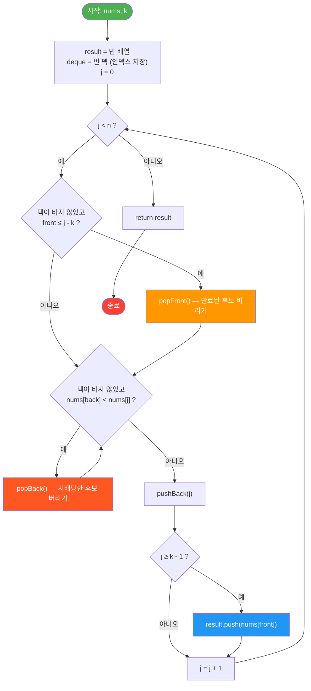

import { AlgorithmSimulation } from "#guide-sim";

# MonotonicQueue — 나보다 늦게 왔는데 나보다 크면, 나는 두 번 다시 답이 될 수 없다

## 한눈에 보는 컨셉

슬라이딩 윈도우의 최댓값을 매 위치마다 다시 구하는 대신, **"앞으로 절대 답이 될 수 없는 값"을 그때그때 버려서** 후보 목록을 짧게 유지하는 기법입니다. 버리는 기준은 한 줄이에요 — 나보다 오른쪽에 있고 나보다 큰(같은) 값이 나타나면, 그 순간부터 나는 어떤 윈도우에서도 대표가 될 수 없습니다. 이렇게 걸러낸 후보 목록은 저절로 앞→뒤 내림차순이 되고(그래서 "단조" 큐예요), 각 원소가 목록에 한 번 들어갔다 한 번 나오므로 전체가 `O(n)`에 끝납니다.

## 출발점: 가장 순진한 방법부터

먼저 무엇을 만들어야 하는지부터 못 박고 갈게요.

```ts
class MonotonicQueue {
  /** 크기 k 윈도우를 왼쪽부터 한 칸씩 옮기며 각 윈도우의 최댓값을 모은다. */
  slidingWindowMax(nums: number[], k: number): number[];
  /** 같은 방식으로 각 윈도우의 최솟값을 모은다. */
  slidingWindowMin(nums: number[], k: number): number[];
}
```

입출력 계약은 이렇습니다. 입력 `nums`의 길이를 $n$이라 할 때 윈도우 $t$는 구간 $[t,\; t+k-1]$이고, 반환 배열의 길이는 정확히 $n - k + 1$입니다. 제약은 $1 \le k \le n \le 10^5$, $-10^4 \le nums[i] \le 10^4$, 시간 제한 1초예요.

```text
nums = [1, 3, -1, -3, 5, 3, 6, 7],  k = 3

윈도우 0: [1, 3,-1]              → 3
윈도우 1:    [3,-1,-3]           → 3
윈도우 2:       [-1,-3, 5]       → 5
윈도우 3:           [-3, 5, 3]   → 5
윈도우 4:               [5, 3, 6]→ 6
윈도우 5:                  [3,6,7]→ 7      결과 길이 8 - 3 + 1 = 6
```

**목표 복잡도부터 예측해 봅시다.** 윈도우 하나를 훑는 데 비교가 $k-1$번 들고 윈도우가 $n-k+1$개이니, 전체 비교 횟수는 정확히

$$(n-k+1)(k-1)$$

입니다. 이 값을 $k$에 대한 이차식으로 보면 위로 볼록하고, 최댓값은 $k = (n+2)/2$ 근처 — 즉 $k$가 $n$의 절반쯤일 때 — 이며 그 크기는 대략 $n^2/4$입니다. $n = 10^5$이면 약 $2.5 \times 10^9$번이에요. 1초 제한에서 이 정도 규모를 상수 시간에 기대는 것은 도박입니다. **목표를 $O(n)$ 또는 $O(n \log n)$으로 잡고 출발합니다.**

### 첫 번째 시도: 윈도우마다 통째로 훑기

가장 정직한 출발입니다. "최댓값을 구하라"는 요구에서 제일 먼저 떠오르는 것은 후보를 전부 나열해 보는 것이니까요.

```ts
function bruteMax(nums: number[], k: number): number[] {
  const result: number[] = [];
  for (let l = 0; l + k <= nums.length; l++) {
    let best = nums[l]!;
    for (let i = l + 1; i < l + k; i++) {
      if (nums[i]! > best) best = nums[i]!;
    }
    result.push(best);
  }
  return result;
}
```

답은 맞습니다. 문제는 비용이에요.

```text
n = 100,000 무작위 입력에서 실제로 잰 시간

  k =  1,000    42 ms      (비교 약 9.9 × 10⁷회)
  k = 10,000   364 ms      (비교 약 9.0 × 10⁸회)
  k = 25,000   642 ms      (비교 약 1.87 × 10⁹회)
  k = 50,000   828 ms      (비교 약 2.5 × 10⁹회)   ← 최악 지점, 1초에 아슬아슬
```

여기서 낌새를 하나 챌 수 있습니다. **윈도우가 한 칸 이동해도 안에 든 원소는 $k-1$개가 그대로**인데, 우리는 매번 $k$개를 처음부터 다시 봅니다.

```text
윈도우 t   : [ a  b  c  d  e ]
윈도우 t+1 :    [ b  c  d  e  f ]
                  └──┬───┘
              이 4개는 방금 전에도 봤던 값이다 — 다시 볼 이유가 있을까?
```

### 두 번째 시도: 직전 최댓값을 재활용하기

낌새를 그대로 코드로 옮겨 봅시다. 직전 윈도우의 최댓값 위치를 기억해 두고, 창이 한 칸 밀릴 때 **빠져나간 원소가 최댓값이 아니었다면** 새로 들어온 값 하나만 비교하면 됩니다.

```ts
function reuseMax(nums: number[], k: number): number[] {
  const result: number[] = [];
  let bestIdx = 0;
  for (let i = 1; i < k; i++) if (nums[i]! > nums[bestIdx]!) bestIdx = i;
  result.push(nums[bestIdx]!);

  for (let j = k; j < nums.length; j++) {
    if (bestIdx === j - k) {
      // 최댓값이 창을 빠져나갔다 — 새 창 전체를 다시 훑는 수밖에 없다
      bestIdx = j - k + 1;
      for (let i = j - k + 2; i <= j; i++) if (nums[i]! > nums[bestIdx]!) bestIdx = i;
    } else if (nums[j]! >= nums[bestIdx]!) {
      bestIdx = j;
    }
    result.push(nums[bestIdx]!);
  }
  return result;
}
```

무작위 입력에서는 극적으로 빨라집니다. 그런데 **최댓값이 매번 빠져나가는 입력**을 주면 재스캔이 매 스텝 걸려요. 내림차순 배열이 정확히 그 모양입니다 — 항상 창의 맨 왼쪽이 최댓값이고, 그게 다음 스텝에 바로 빠져나가니까요.

```text
n = 20,000, k = 1,000 에서 실제로 센 비교 횟수

  입력 패턴        브루트포스      직전값 재활용
  무작위           18,981,999           36,965      ← 500배 이득
  오름차순         18,981,999           19,999      ← 최댓값이 안 나가니 거의 공짜
  내림차순         18,981,999       18,981,999      ← 브루트포스와 완전히 동일

n = 100,000, 내림차순, k = 10,000 실제 소요 시간
  브루트포스     363.6 ms
  직전값 재활용  1,393.0 ms   ← 비교 횟수가 같은데 시간은 오히려 더 든다
```

시간이 더 걸린 원인까지는 단정하지 않겠습니다(같은 비교 횟수를 어떤 루프 모양으로 도는지에 따라 엔진의 최적화가 달라질 수 있어요). 확실한 것은 두 가지입니다 — **비교 횟수가 같고**, 따라서 **이 개선은 최악에서 아무것도 개선하지 못했습니다.**

내림차순은 특별한 입력이 아닙니다. 하강 추세인 시계열, 감소하는 잔량, 역정렬된 데이터는 얼마든지 들어와요. **평균이 좋다는 사실이 최악을 막아 주지 못합니다.**

여기서 무엇이 부족했는지가 드러납니다. 우리는 최댓값 **하나만** 기억했어요. 그래서 그 하나가 사라지면 아무것도 남지 않아 처음부터 다시 세야 합니다. **"2등, 3등도 같이 기억해 둘 수 없을까?"** 이게 다음 시도로 넘어가는 질문입니다.

### 세 번째 시도: 힙에 다 넣고, 만료된 꼭대기는 버리기

"등수를 기억한다"는 요구에 딱 맞는 자료구조가 최대 힙이죠. 모든 원소를 값과 인덱스 쌍으로 힙에 넣고, 꼭대기가 창을 벗어난 인덱스면 버리고 다음 꼭대기를 봅니다(지연 삭제, lazy deletion).

```ts
function heapMax(nums: number[], k: number): number[] {
  const result: number[] = [];
  const heap = new MaxHeap(); // [값, 인덱스] 쌍을 값 기준 최대 힙으로
  for (let j = 0; j < nums.length; j++) {
    heap.push(nums[j]!, j);
    if (j >= k - 1) {
      while (heap.peek()[1] <= j - k) heap.pop(); // 창 밖 인덱스는 꼭대기에서 걷어낸다
      result.push(heap.peek()[0]);
    }
  }
  return result;
}
```

여기서 `MaxHeap`은 **값 기준**으로만 정렬합니다. 값이 같을 때 누가 위로 오는지(tie-break)는 정하지 않아도 괜찮아요 — 꼭대기에 만료된 인덱스가 올라오면 `while`이 걷어내고, 값이 같은 살아 있는 인덱스가 올라오면 그 값이 곧 답이니까요. 어느 쪽이든 보고되는 **값**은 같습니다.

이건 **제대로 동작하는 답**입니다. 각 원소가 한 번 push되고 많아야 한 번 pop되니 힙 연산은 총 $2n$번, 하나가 $O(\log n)$이라 시간은 $O(n \log n)$이에요.

다만 **공간이 $O(n)$까지 커집니다.** 지연 삭제는 만료된 원소를 꼭대기에 올라올 때까지 내버려 두는데, 오름차순 입력에서는 새 원소가 항상 최댓값이라 옛 원소들이 힙 바닥에 그대로 쌓이거든요. 실제로 재 봤습니다.

```text
n = 10,000, k = 100 에서 관찰한 최대 크기

  오름차순 입력   힙 10,000개 (= n, 전체의 100%)      단조 덱     1개
  내림차순 입력   힙    100개 (= k)                    단조 덱   100개 (= k)
```

즉 힙 방식은 최악에 입력 전체를 메모리에 들고 있습니다. 뒤에 만들 단조 큐는 창 안 후보만 들고 있으므로 $O(k)$예요.

```text
n = 100,000 실제 소요 시간

  입력/윈도우            브루트포스   직전값 재활용    힙(지연 삭제)
  무작위, k = 10,000       364.3 ms        0.4 ms         3.4 ms
  내림차순, k = 10,000     363.6 ms    1,393.0 ms        20.8 ms   ← 최악에서도 안정적
```

(측정 환경은 Bun 1.3.12 / Apple M5 Pro입니다. 이 절의 모든 수치는
`src/data-structures/linear/monotonicQueue/_scratch/monotonicQueue-ord005-verify.ts`를
`bun`으로 실행해 얻었고, 절대값은 환경에 따라 달라지지만 논거로 쓰는 것은 **비교 횟수와 배율**입니다.)

목표는 이미 달성했습니다. 그런데 $\log n$이 왜 붙는지 들여다보면 아직 낭비가 보여요. 힙은 **아무 순서로나 들어오는 원소들 사이에서 최댓값을 유지**하려고 비교 트리를 오르내립니다. 하지만 우리 문제에서 원소는 **왼쪽에서 오른쪽으로, 정해진 순서대로만** 들어오고 **왼쪽부터 순서대로만** 만료돼요. 이 규칙성을 힙은 전혀 쓰지 않습니다.

그래서 질문을 다시 던집니다. **어떤 원소를 "등수 목록"에 남겨 둬야 하고, 어떤 원소는 아예 안 남겨도 될까요?** 만약 남길 후보가 항상 내림차순으로만 정리된다면, 최댓값은 그냥 맨 앞이라 비교 트리가 통째로 필요 없을 텐데요.

## 아이디어 자세히 들여다보기

### 늦게 왔는데 더 큰 값이 있으면, 나는 지워진다 — 수식과 그림

문제를 "각 윈도우의 최댓값"이 아니라 **"각 시점에 살아 있는 후보 집합"**으로 바꿔 봅시다. 오른쪽 끝이 $j$인 시점에서, 인덱스 $i$가 앞으로도 쓸모가 있으려면 두 조건을 넘겨야 합니다.

첫째, **아직 창 안에 있어야** 합니다. 창의 왼쪽 끝은 $j-k+1$이므로 $i \ge j-k+1$, 뒤집어 말하면 $i \le j-k$인 인덱스는 만료예요.

둘째가 핵심입니다. 나보다 **오른쪽에 있으면서 값이 나보다 작지 않은** 인덱스가 하나라도 있으면, 나는 그 순간 쓸모를 잃습니다. 이 관계를 정식으로 적으면

$$i \prec j \iff i < j \;\land\; nums[i] \le nums[j]$$

이고, $i \prec j$일 때 "$i$는 $j$에게 **지배당했다**"고 부릅니다. 왜 쓸모가 없어지는지는 그림 한 장이면 충분해요.

```text
                    i        j
nums:  ... ── 4 ─── 3 ─────  7 ── ...
                    ↑        ↑
              값 3 인 자리   값 7 인 자리 (더 오른쪽, 더 큼)

지금 이후의 어떤 윈도우가 i 를 담고 있다면,
그 윈도우의 오른쪽 끝은 j 이상이고 왼쪽 끝은 i 이하다.
i < j 이므로 j 도 반드시 그 윈도우 안에 있다.

  [ ......... i ......... j ......... ]
    └ 왼쪽 끝 ≤ i          j ≤ 오른쪽 끝 ┘

그 윈도우의 최댓값은 최소한 7 이다. 3 은 영원히 대표가 될 수 없다.
```

**"오른쪽에 있다"는 조건은 절대 뺄 수 없습니다.** 왼쪽에 있는 큰 값은 나보다 먼저 만료되므로, 그 값이 사라진 뒤의 윈도우에서는 내가 대표가 될 수 있거든요. 반대로 **등호($nums[i] = nums[j]$)를 지배로 볼지는 선택입니다.** 값이 같으면 어느 쪽이 대표가 되든 최댓값은 같으니, 옛것을 지워도 되고 남겨도 됩니다.

이 선택이 뒤에 나올 코드와 직결되니 **미리 갈라 둘게요.**

```text
지배 정의 (이 절의 ≺)          "값이 같아도 옛것은 쓸모없다" — 지울 수 있는 것의 최대 범위
구현이 실제로 지우는 것         "값이 새것보다 작을 때만" (nums[back] < nums[j], 강부등호)
                                → 지워도 되는 것 중 일부를 일부러 안 지우는 보수적 판본
```

이 가이드의 코드는 **강부등호 판본**을 씁니다. 지워도 되는 것을 안 지우는 것뿐이라 정답은 그대로이고(무작위 검증에서도 두 판본의 출력이 전부 일치했습니다), 대신 남는 목록에 **같은 값이 나란히 남을 수 있습니다.** 그래서 앞으로 "남은 후보 목록"이라고 하면 값이 **내림차순**이 아니라 **비증가**(같은 값이 이어질 수 있음)라고 읽어 주세요. 뒤의 불변식 2가 비증가로 적혀 있는 것도 이 때문입니다.

그럼 남은 후보 집합의 모양은요? 인덱스 순서로 줄을 세우면 값이 비증가일 수밖에 없습니다 — 뒤엣것이 앞엣것보다 **크면** 앞엣것은 강부등호 판본에서도 지워졌을 테니까요.

```text
nums = [1, 3, -1, -3, 5, 3, 6, 7],  k = 3 에서 j 를 하나씩 옮기며 후보 집합 추적
(괄호 안은 값)

 j=0  후보 [0(1)]
 j=1  0 은 1 에게 지배당함(1 ≤ 3)      → 후보 [1(3)]
 j=2  -1 은 3 보다 작다                → 후보 [1(3), 2(-1)]             창 = [0..2], 답 = 3
 j=3  -3 은 -1 보다 작다               → 후보 [1(3), 2(-1), 3(-3)]      창 = [1..3], 답 = 3
 j=4  1 은 만료(1 ≤ 4-3=1),
      3·2 는 4 에게 지배당함           → 후보 [4(5)]                    창 = [2..4], 답 = 5
 j=5  3 은 5 보다 작다                 → 후보 [4(5), 5(3)]              창 = [3..5], 답 = 5
 j=6  5·4 는 6 에게 지배당함           → 후보 [6(6)]                    창 = [4..6], 답 = 6
 j=7  6 은 7 에게 지배당함             → 후보 [7(7)]                    창 = [5..7], 답 = 7

후보 목록은 언제나 값이 내림차순 — 그래서 답은 늘 맨 앞이다.
```

잠깐, 확인 하나만 해 볼까요? $j=3$ 시점의 후보는 세 개인데, 창 안의 최댓값 3은 맨 앞에 있습니다. 그럼 뒤에 있는 $-1$과 $-3$은 왜 굳이 남겨 뒀을까요? — 곧 3이 만료되기 때문이에요. $j=4$에서 인덱스 1이 창을 빠져나가는데, 그때 $-1$이 남아 있지 않았다면 두 번째 시도처럼 창 전체를 다시 훑어야 했을 겁니다. **후보 목록은 "지금의 답"이 아니라 "앞으로 답이 될 수 있는 것 전부"를 들고 있어야 합니다.**

### 단서를 설명해 주는 이론 — 지배 관계와 상각 분석

지금 쓴 방법은 이 문제만의 요령이 아니라 두 가지 일반 이론의 결합입니다. 각각을 짚고 갈게요.

**하나. 지배 관계에 의한 후보 집합 축소(파레토 최적 유지).** 여러 기준으로 평가되는 후보들 중에서 "모든 기준에서 다른 후보보다 나쁜" 것을 버리고 남은 집합을 파레토 최적 집합, 기하에서는 스카이라인이라고 부릅니다. 우리 문제의 기준은 두 가지예요 — **값은 클수록 좋고, 위치는 오른쪽일수록 좋습니다**(오래 살아남으니까요). 인덱스 $i$가 $j$에게 지배당했다는 것은 정확히 "두 기준 모두에서 $j$에게 뒤진다"는 뜻이고, 그래서 미련 없이 버릴 수 있습니다. 남은 집합은 두 기준이 서로 상충하는 것들만 모인 목록 — 오른쪽으로 갈수록 값이 작아지는 계단 — 이 되고, 이게 곧 "단조"의 정체입니다.

```text
값 ↑
 7 |                          ●  ← 오른쪽이면서 크다: 왼쪽 아래를 전부 지배
 5 |            ●
 3 |   ●              ○  ← 이 점은 왼쪽의 5보다 작고 위치도 왼쪽 → 지배당해 탈락
   +---------------------------→ 인덱스
   남는 것: 값과 위치가 서로 맞바꿔지는 점들뿐 (계단 모양)
```

**둘. 상각 분석(회계법).** "한 스텝에서 후보를 여러 개 버릴 수 있는데 그럼 한 스텝이 $O(k)$ 아닌가?" 하는 걱정이 자연스럽게 듭니다. 실제로 한 스텝에 $k-1$개를 버리는 일이 일어나요. 하지만 **버려지는 후보는 반드시 그전에 딱 한 번 들어온 적이 있습니다.** 그래서 이렇게 계산합니다 — 인덱스 하나가 목록에 들어올 때 동전 두 개를 냅니다. 하나는 들어오는 비용으로 즉시 쓰고, 나머지 하나는 "언젠가 내가 버려질 때 쓰라"고 맡겨 둡니다. 버릴 때는 맡겨 둔 동전으로 지불하니 추가 비용이 없어요. 인덱스는 $n$개이므로 동전은 총 $2n$개, 즉 전체 비용이 $O(n)$입니다. 개별 스텝이 비싸도 **총합이 묶인다**는 것이 상각 분석의 힘이고, 정확한 논증은 아래 정당성 절에서 다시 씁니다.

### 셈을 맡는 자료구조 — 덱

후보 목록에 필요한 연산을 모아 보면 네 가지입니다.

- 새 인덱스를 **뒤에** 붙인다 (`pushBack`)
- 지배당한 후보를 **뒤에서** 버린다 (`popBack`)
- 만료된 후보를 **앞에서** 버린다 (`popFront`)
- 현재 답인 **맨 앞**을 읽는다 (`front`)

뒤에서 넣고 빼면서 앞에서도 빼야 하므로 스택 하나로도 큐 하나로도 안 됩니다. 필요한 것은 **덱의 인터페이스**예요. 인터페이스가 필요하다는 말과 범용 덱 자료구조를 통째로 가져다 써야 한다는 말은 다른데, 여기서는 위 네 연산만 쓰므로 더 가벼운 특수화가 가능합니다(잠시 뒤에 만듭니다). 덱 자체의 설계와 정당성은 [deque 가이드](../deque/deque-guide.mdx)에 있으니 여기서는 쓰기만 할게요. 다만 이 문제는 덱의 능력 중 **`pushFront`를 한 번도 쓰지 않는다**는 점이 중요합니다. 앞쪽으로는 버리기만 하지 넣지 않으니, 일반 덱보다 훨씬 단순한 구조 — 배열 하나 + "어디까지 버렸는지" 가리키는 정수 하나 — 로 충분해요. 그 특수화를 최적화 절에서 만듭니다.

### 왜 모순 없이 작동하는가

덱에 **값이 아니라 인덱스**를 담습니다. 그래야 만료 여부를 판정할 수 있어요(같은 값이 여러 번 나올 수 있으니 값만으로는 "이게 언제 들어온 값인지" 알 수 없습니다). 최댓값 판을 기준으로, 매 스텝이 끝난 시점에 다음 세 가지가 성립해야 합니다.

1. **인덱스는 오름차순**: $i_1 < i_2 < \dots < i_m$
2. **값은 앞→뒤 단조 비증가**: $nums[i_1] \ge nums[i_2] \ge \dots \ge nums[i_m]$
3. **전부 창 안**: 오른쪽 끝이 $j$일 때 $i_1 \ge j-k+1$

최솟값 판은 지배 관계를 대칭으로 다시 정의하면 그대로 따라옵니다 — **값은 작을수록 좋고 위치는 오른쪽일수록 좋다**로 기준을 바꾸면 $i \prec j \iff i < j \land nums[i] \ge nums[j]$가 되고, 불변식 2도 $nums[i_1] \le nums[i_2] \le \dots \le nums[i_m]$(비감소)로 뒤집힙니다. 아래 논증에서 "크다/작다"를 전부 맞바꿔 읽으면 그대로 최솟값 판의 증명이 됩니다.

```text
현재 윈도우:  [ j-k+1 ......................... j ]
덱(인덱스):          i1      i2       i3            ← 전부 창 안, 오름차순
대응 값:             9       5        5             ← 앞→뒤 비증가
                     ↑
                front = 현재 창의 최댓값
```

#### 보조정리 — 뒤에서 버린 후보는 다시 필요해지지 않는다

*주장.* $i < j$이고 $nums[i] \le nums[j]$이면, 오른쪽 끝이 $j$ 이상인 어떤 윈도우에서도 최댓값은 $nums[i]$보다 작지 않으며, 그 값은 $j$가 대표할 수 있다.

*증명.* 오른쪽 끝이 $r \ge j$이고 $i$를 포함하는 윈도우 $W = [\,r-k+1,\; r\,]$를 아무거나 잡습니다. $i \in W$이므로 $r-k+1 \le i$입니다. 한편 $i < j$이고 $j \le r$이므로, $j$는 $W$의 왼쪽 끝보다 크고($r-k+1 \le i < j$) 오른쪽 끝 이하입니다($j \le r$). 따라서 **$j \in W$**입니다. 그러면
$$\max W \;\ge\; nums[j] \;\ge\; nums[i]$$
가 성립합니다 — 첫 부등호는 $j$가 $W$의 원소라서, 둘째 부등호는 가정에서 왔습니다. 즉 **$i$를 후보 목록에서 지워도 $W$의 최댓값을 구하는 데 지장이 없습니다.** $i$보다 작지 않은 원소 $j$가 같은 윈도우에 반드시 들어 있으니까요.

한 가지 표현을 정확히 해 둘게요. 이 결론은 "$W$의 최댓값이 $nums[j]$다"라는 뜻이 **아닙니다.** $W$ 안에 $j$보다 큰 원소가 또 있을 수 있어요. 필요한 것은 그보다 약한 명제 — **$i$ 없이도 최댓값에 도달할 수 있다**는 것 — 이고, 그것으로 충분합니다.

오른쪽 끝이 $j$보다 **작은** 윈도우는 어떨까요? 우리는 $r$을 $0$부터 $n-1$까지 오름차순으로 훑으므로, $j$를 처리하는 시점에 그런 윈도우는 이미 답을 기록하고 지나갔습니다. 앞으로 만날 윈도우의 오른쪽 끝은 $j$ 이상뿐이에요. $\blacksquare$

이 보조정리가 곧 후단 청소(back-cleaning) 규칙의 근거입니다. 구현은 앞 절에서 말한 대로 **강부등호 판본**이라 $nums[i] < nums[j]$일 때만 버리는데, 이는 보조정리가 허용하는 범위($nums[i] \le nums[j]$)의 부분집합이므로 안전합니다. (구현을 믿을 근거는 이 증명이고, 아래 수치는 구현이 증명대로 동작하는지 보는 sanity check입니다 — 무작위 300회 시행에서 후단 청소로 버려진 인덱스 8,520개 중 버려진 뒤의 어떤 윈도우에서도 최댓값 대표였던 경우가 0건이었습니다.)

#### 정리 — 덱의 맨 앞은 항상 현재 창의 최댓값이다

먼저 세 불변식이 유지됨을 귀납으로 확인합니다.

*기저.* $j = 0$ 이전에 덱은 비어 있고, 원소가 없으므로 세 조건 모두 공허하게 성립합니다.

*귀납 단계.* $j$번째 스텝을 시작하기 직전에 세 불변식이 성립한다고 가정하고, 스텝 안의 세 동작을 차례로 봅니다.

- **만료 제거.** 맨 앞 $i_1$이 $i_1 \le j-k$면 제거합니다. 앞에서만 빼므로 남은 인덱스들의 오름차순(1번)과 비증가(2번)는 건드리지 않고, 창을 벗어난 원소가 사라졌으니 3번이 회복됩니다. **여기서 제거가 최대 한 번이면 충분합니다** — 직전 스텝이 끝났을 때 모든 인덱스는 $\ge (j-1)-k+1 = j-k$였고, 인덱스는 서로 다르므로 $i \le j-k$를 만족하는 것은 많아야 하나(즉 $i = j-k$)이기 때문이에요. 실제로 이 자리를 `while`로 바꿔 써도 결과가 같다는 것을 무작위 500케이스로 확인했습니다.
- **후단 청소.** $nums[i_m] < nums[j]$인 동안 뒤에서 뺍니다. 루프가 끝나면 남은 마지막 원소는 $nums[i_m] \ge nums[j]$를 만족하므로, $j$를 뒤에 붙여도 2번이 유지됩니다. $j$는 지금까지 본 인덱스 중 가장 크므로 1번도 유지되고요. 버린 원소들이 안전하다는 근거는 위 보조정리입니다.
- **삽입.** $j$ 자신은 창의 오른쪽 끝이라 당연히 창 안이므로 3번이 유지됩니다.

이제 본론입니다. $j$번째 스텝이 끝난 시점을 봅니다(즉 인덱스 $0 \dots j$까지만 처리됐고 $j+1$ 이후는 아직 등장하지 않았습니다). 창 $[l, j]$($l = \max(0,\, j-k+1)$) 안의 **임의의** 인덱스 $i$에 대해

$$\text{덱 안에 } nums[t] \ge nums[i] \text{ 인 } t \text{ 가 존재한다}$$

를 보입니다. $i$를 $j$부터 $l$까지 **내려가며** 강귀납으로 증명할게요(귀납 가정: $i$보다 큰 모든 창 안 인덱스에 대해 명제가 참이다).

- $i = j$: 방금 $j$를 넣었으므로 $t = j$입니다. (기저)
- $i < j$이고 $i$가 덱 안에 있으면 $t = i$입니다.
- $i < j$이고 $i$가 덱에 없다면, 가능한 경로는 둘뿐입니다. $i \le j$이므로 "아직 등장하지 않아서 없다"는 경우는 배제되고, 덱에서 나가는 출구는 만료 제거와 후단 청소밖에 없으니까요.
  - **만료 제거로 나갔다면**: 만료 조건이 $i \le (\text{그 시점의 } j') - k$였고 $j' \le j$이므로 $i \le j-k < l$입니다. 이는 $i \ge l$(창 안이라는 전제)과 모순이라 불가능합니다.
  - **후단 청소로 나갔다면**: 그때 새로 들어온 인덱스 $j'$가 있어 $i < j'$이고 $nums[i] < nums[j']$, 즉 $nums[j'] > nums[i]$입니다(구현이 강부등호 판본이므로 부등호가 엄격합니다). 그리고 $j' > i \ge l$이므로 $j'$도 창 $[l, j]$ 안이고, $j' > i$이므로 귀납 가정을 적용할 수 있습니다 — 덱 안에 $nums[t] \ge nums[j'] > nums[i]$인 $t$가 존재합니다. **$j'$ 자신이 지금 덱에 남아 있는지는 따질 필요가 없습니다.** 귀납 가정이 "$j'$가 덱에 있다"가 아니라 "$j'$를 대신할 원소가 덱에 있다"를 주기 때문이에요.

세 경우가 전부이고, 귀납은 $i = j$에서 시작해 $i$가 하나씩 줄어드는 유한한 방향이라 닫힙니다. 따라서 창 안 모든 원소의 값은 덱 안 어떤 원소의 값 이하이고, 불변식 2에 의해 덱 안 최댓값은 맨 앞입니다. 그러므로 **맨 앞이 창 전체의 최댓값**입니다. $\blacksquare$

#### 총비용이 $O(n)$인 이유

각 인덱스 $j$는 루프에서 **정확히 한 번** `pushBack`됩니다(스텝마다 한 번, 조건 없이). 그리고 한 번 덱에서 나간 인덱스는 다시 들어올 방법이 없어요 — `pushBack`의 인자는 항상 현재 스텝의 $j$이고 $j$는 증가만 하니까요. 그러므로 전체 실행에 걸쳐 `popBack`과 `popFront` 횟수의 합은 $n$을 넘지 못합니다. 덱 연산 하나가 $O(1)$이므로 총비용은
$$\underbrace{n}_{\text{push}} + \underbrace{(\text{popBack} + \text{popFront}) \le n}_{\text{pop}} \;\le\; 2n = O(n)$$
입니다. 안쪽 `while` 루프가 한 스텝에서 아무리 많이 돌아도, 그만큼은 **과거에 push된 횟수**에서 빠져나가는 것이라 총합이 늘지 않아요. 실행으로 확인한 값도 같습니다 — 무작위 200회 시행에서 push는 항상 정확히 $n$회, pop 합계는 항상 $n$ 이하였고, 원소당 총 덱 연산의 최댓값은 1.995회(이론 상한 2)였습니다.

공간은 덱 크기가 창 안 인덱스만 담으므로 $O(k)$입니다. 내림차순 입력에서 후단 청소가 한 번도 일어나지 않아 덱이 가장 커지는데, 실제로 재 보니 $n=1{,}000$, $k=137$에서 최대 크기가 정확히 137이었습니다.

#### 여기서 헷갈리기 쉬운 포인트

- **① 만료 판정의 등호.** 창의 왼쪽 끝이 $j-k+1$이므로 인덱스 $j-k$는 "방금 빠져나간" 경계입니다. `front <= j - k`로 써야 이 경계까지 제거돼요. `<`로 쓰면 경계의 낡은 인덱스가 한 스텝 더 살아남습니다. `nums = [9, 1, 1, 1, 1]`, `k = 2`로 실제 돌려 보면 정답은 `[9, 1, 1, 1]`인데 버그판은 `[9, 9, 1, 1]`을 냅니다 — 두 번째 자리의 창은 `nums[1..2] = [1,1]`인데 이미 나간 인덱스 0의 값 9를 그대로 보고하는 거예요.
- **② 값이 아니라 인덱스를 담아야 합니다.** 값만 담으면 `[7, 7, 7]` 같은 입력에서 "지금 맨 앞의 7이 창 안의 7인지, 이미 나간 7인지"를 구분할 방법이 없습니다. 만료 판정은 인덱스 비교이지 값 비교가 아니에요.
- **③ min 판과 max 판의 부등호는 반대입니다.** max는 "나보다 작은 옛 후보"를 버리고(`nums[back] < nums[j]`), min은 "나보다 큰 옛 후보"를 버립니다(`nums[back] > nums[j]`). 복사해 붙이면서 이 한 글자를 안 바꾸면 조용히 정반대 자료구조가 됩니다 — 오류가 아니라 **틀린 답**이 나오니 더 위험해요.

#### 엣지 케이스

```text
k = 1          → 창이 원소 하나짜리. 매 스텝 push 직후 front 가 자기 자신 → 입력 그대로 반환
                 실측: [4,-2,7,7,0] → [4,-2,7,7,0]
k = n          → 창이 하나뿐. 결과 길이 n-k+1 = 1, 전체 최댓값 하나만 반환
                 실측: [4,-2,7,7,0], k=5 → max [7], min [-2]
전부 같은 값    → 후단 청소 조건이 강부등호라 동일값끼리는 안 밀어냄. 덱이 길어질 뿐 답은 정상
                 실측: [7,7,7,7], k=2 → [7,7,7]
전부 음수      → 초기값을 0 같은 상수로 두지 않고 "덱 맨 앞"을 읽으므로 문제없음
                 실측: [-5,-1,-9], k=2 → max [-1,-1], min [-5,-9]
n = 1, k = 1   → 스텝 한 번, 결과 길이 1.  실측: [42] → [42]
내림차순 입력   → 후단 청소가 한 번도 안 일어나 덱이 k 까지 자란다(최악 공간 O(k))
```

## 아이디어를 코드로 옮기기

먼저 아이디어를 **그대로** 옮깁니다. 덱은 일단 평범한 배열로 흉내 내고(앞에서 빼는 데 `shift`를 씁니다), 알고리즘의 뼈대가 맞는지부터 확인할게요.

```ts
function slidingWindowMaxBasic(nums: number[], k: number): number[] {
  const result: number[] = [];
  const deque: number[] = []; // 인덱스 저장. 앞→뒤로 nums 값이 단조 비증가

  for (let j = 0; j < nums.length; j++) {
    // [1] 만료: 창을 벗어난 맨 앞 인덱스를 버린다 (많아야 하나)
    if (deque.length > 0 && deque[0]! <= j - k) {
      deque.shift();
    }
    // [2] 후단 청소: 새 값에 지배당하는 뒤쪽 후보를 버린다
    while (deque.length > 0 && nums[deque[deque.length - 1]!]! < nums[j]!) {
      deque.pop();
    }
    // [3] 나 자신을 후보로 등록
    deque.push(j);
    // [4] 창이 완성된 시점부터 답을 기록
    if (j >= k - 1) {
      result.push(nums[deque[0]!]!);
    }
  }
  return result;
}
```

이 코드는 문제의 제약($1 \le k \le n$)이 지켜진다는 전제 위에 있습니다. $k = 0$이나 $k > n$, 빈 배열처럼 계약 밖 입력은 다루지 않아요(그런 입력에서 결과 길이 $n-k+1$이라는 계약 자체가 성립하지 않습니다). 라이브러리로 쓸 코드라면 진입부에 그 검사를 두는 편이 좋습니다.

**가장 실수가 잦은 줄은 `[4]`의 `j >= k - 1` 조건입니다.** 창이 완성되기 전($j < k-1$)에는 답을 기록하면 안 됩니다. 조건을 어떻게 어기느냐에 따라 무엇이 나오는지 실제로 돌려 봤어요(`nums = [1,3,-1,-3,5,3,6,7]`, `k = 3`).

```text
  정답 (j >= k-1)   [3, 3, 5, 5, 6, 7]        길이 6 = n-k+1  ✔
  조건을 빼면       [1, 3, 3, 3, 5, 5, 6, 7]  길이 8 = n      ← 창이 아직 1~2개짜리인
                                                 j=0,1 의 값까지 답이라고 보고한다
  j > k-1 로 쓰면   [3, 5, 5, 6, 7]           길이 5 = n-k    ← 첫 창이 통째로 빠진다
```

나머지 결정 지점도 짚어 둘게요.

- `[1]`이 `while`이 아니라 `if`인 이유는 앞 절에서 증명했습니다 — 한 스텝에 만료되는 인덱스는 많아야 하나예요. `while`로 써도 틀리지 않으니, 확신이 안 서면 `while`로 두는 편이 안전합니다.
- `[2]`의 비교는 `nums[뒤쪽 인덱스]`와 `nums[j]`입니다. 인덱스와 값을 헷갈려 `deque[deque.length-1] < nums[j]`라고 쓰면 인덱스와 값을 비교하는 꼴이 되는데, 둘 다 수라서 **에러 없이 조용히 틀린 답**이 나옵니다.
- **`[1]`과 `[2]`의 순서는 바꿔도 결과가 같습니다.** 근거를 나눠 보면 이렇습니다. 만료 대상은 맨 앞 하나, 청소 대상은 맨 뒤 연속 구간이라 덱에 원소가 둘 이상이면 서로 다른 자리를 건드립니다. 겹치는 경우는 **덱에 원소가 하나뿐이고 그 하나가 만료 대상이면서 동시에 지배당하는** 때뿐인데, 이때는 어느 쪽이 먼저 처리하든 그 원소가 제거되고 덱이 빈 채로 `[3]`에 도달하므로 결과가 같아요. (앞 절의 "만료는 많아야 하나" 증명은 만료를 먼저 하는 현재 순서를 기준으로 쓴 것인데, 순서를 바꿔도 그 성질은 유지됩니다 — 만료 판정은 인덱스만 보고, 후단 청소는 인덱스를 새로 만들어 내지 않으니까요.) 무작위 800케이스에서 두 순서의 출력이 전부 일치하는 것도 확인했습니다.

이 구현으로 문제의 예시를 돌리면 `slidingWindowMax([1,3,-1,-3,5,3,6,7], 3) = [3,3,5,5,6,7]`, `slidingWindowMin(...) = [-1,-3,-3,-3,3,3]`이 나옵니다.

## 더 빠르게 만들 단서 찾기

알고리즘은 이제 $O(n)$**번의 덱 연산**을 씁니다. 그런데 우리가 세는 단위인 "덱 연산 한 번"이 정말 상수 시간인지 확인해야 해요. `deque.shift()`가 그 자리입니다.

```text
[1] 만료 제거에서 부르는 shift 는 배열 맨 앞을 지우는 연산이다.

deque = [ i1, i2, i3, i4, i5 ]
          ↑ 이걸 지우면
deque = [ i2, i3, i4, i5 ]
            └─ 나머지가 전부 한 칸씩 앞으로 당겨져야 한다 (명세대로라면)

한 번이 O(덱 크기)이고 덱 크기는 최대 k 이므로,
최악에는 n번 × k = O(nk) — 우리가 없애려던 바로 그 곱이 되돌아온다.
```

실제로 재 보면 이 런타임에서는 그렇게까지 나빠지지 않습니다. 자바스크립트 엔진이 `shift`를 최적화하고 있거든요([deque 가이드](../deque/deque-guide.mdx)에서 같은 현상을 수치로 다룹니다). 하지만 그 최적화는 **언어 명세가 보장하는 것이 아니라 엔진 사정**이고, 실측으로도 여전히 손해가 남습니다.

```text
n = 100,000, 내림차순 입력(덱이 가장 크게 자라는 최악 패턴) 실제 소요 시간
(같은 조건으로 여러 번 재면 절대값은 ±30% 흔들리지만 배율은 일관됩니다)

  k =  1,000    shift 기반 2.4 ~ 2.8 ms      포인터 기반 1.3 ~ 1.5 ms
  k = 10,000    shift 기반 1.9 ~ 2.1 ms      포인터 기반 0.9 ~ 1.0 ms   ← 약 2배
```

**단서는 이겁니다** — 우리는 맨 앞을 **버리기만** 하지 앞에 무언가를 넣지 않습니다. 그렇다면 배열에서 원소를 실제로 치울 필요 없이, "여기부터가 진짜 시작"이라고 표시만 옮기면 되지 않을까요?

## 단서를 최적화로 연결하기

배열은 그대로 두고 **시작 위치를 가리키는 정수 `head`**를 하나 둡니다. `popFront`는 `head`를 1 증가시키는 것으로 끝나요.

```text
Before (shift 방식):  buf = [ i1, i2, i3, i4 ]           popFront → 원소 3개를 당긴다
After  (head 방식):   buf = [ i1, i2, i3, i4 ]           popFront → head 를 한 칸 옮긴다
                              ↑head=0
                      buf = [ i1, i2, i3, i4 ]
                                   ↑head=1        유효 구간은 buf[head..]
```

이러면 앞쪽에 쓰레기가 쌓입니다. $n$번 만료되면 배열 앞에 죽은 값이 $n$개 남아 메모리를 붙들고 있어요. 그래서 **죽은 공간이 살아 있는 공간보다 많아졌을 때만** 한 번에 잘라 냅니다.

```ts
popFront(): void {
  this.head++;
  if (this.head > 8 && this.head * 2 > this.buf.length) {
    this.buf = this.buf.slice(this.head); // 죽은 앞부분을 통째로 버린다
    this.head = 0;
  }
}
```

기호를 정확히 두고 따집니다. $L = $ `buf.length`(죽은 칸 + 살아 있는 칸의 총합), $h = $ `head`(죽은 칸 수)라 하면 살아 있는 원소는 $L - h$개이고, `slice(head)`가 복사하는 것은 정확히 이 $L - h$개입니다. 압축 조건 `head * 2 > buf.length`는 $2h > L$, 즉 $h > L/2$예요. 그러면

$$L - h \;<\; L - \tfrac{L}{2} \;=\; \tfrac{L}{2} \;<\; h$$

이므로 **복사량이 그때까지 쌓인 죽은 칸 수보다 적습니다.** 죽은 칸 하나는 `popFront` 한 번에서만 생기고 압축 때 전부 0으로 초기화되니, `popFront` 한 번에 복사 비용 1을 미리 적립해 두면(앞 절의 동전 회계에 동전 하나를 더 얹는 셈입니다) 모든 압축 비용이 그 적립금으로 지불됩니다. `popFront` 총 횟수가 $n$ 이하이므로 압축에 드는 총비용도 $n$ 이하이고, 전체는 여전히 $O(n)$이에요.

`head > 8`은 증명에 필요한 조건이 아니라 **아주 작은 배열에서 잦은 재할당을 피하려는 실용적 문턱**입니다. 8이라는 숫자 자체에 의미는 없고(4든 16이든 상관없어요), 상한 $h$가 상수로 묶이므로 위 상각 논증도 그대로 유지됩니다.

최악 패턴에서 실제로 세 봤습니다 — $n = 200{,}000$, $k = 50{,}000$의 내림차순 입력에서 `popFront` 150,000회 동안 압축이 실제로 복사한 원소는 149,997개, 즉 `popFront` 한 번당 1.000개였습니다.

## 최적화 코드

```ts
/** 이 문제에 필요한 연산만 남긴 인덱스 전용 덱 (pushFront 는 쓰지 않는다). */
class IndexDeque {
  private buf: number[] = [];
  private head = 0; // buf[head..] 가 유효 구간

  get size(): number {
    return this.buf.length - this.head;
  }
  /** 전제: size > 0. 빈 덱에서 부르면 undefined 를 흘린다. */
  frontIndex(): number {
    return this.buf[this.head]!;
  }
  /** 전제: size > 0. */
  backIndex(): number {
    return this.buf[this.buf.length - 1]!;
  }
  pushBack(i: number): void {
    this.buf.push(i);
  }
  popBack(): void {
    this.buf.pop();
  }
  popFront(): void {
    this.head++;
    // 죽은 앞 공간이 절반을 넘으면 한 번에 압축 — 상각하면 원소당 O(1)
    if (this.head > 8 && this.head * 2 > this.buf.length) {
      this.buf = this.buf.slice(this.head);
      this.head = 0;
    }
  }
}

export class MonotonicQueue {
  slidingWindowMax(nums: number[], k: number): number[] {
    return this.sweep(nums, k, (a, b) => a < b);
  }

  slidingWindowMin(nums: number[], k: number): number[] {
    return this.sweep(nums, k, (a, b) => a > b);
  }

  /**
   * 창을 왼쪽부터 훑으며 후보 덱을 유지한다.
   * dominated(뒤쪽 후보의 값, 새 값) 가 true 면 뒤쪽 후보를 버린다.
   */
  private sweep(
    nums: number[],
    k: number,
    dominated: (backValue: number, incoming: number) => boolean,
  ): number[] {
    const result: number[] = [];
    const deque = new IndexDeque();

    for (let j = 0; j < nums.length; j++) {
      if (deque.size > 0 && deque.frontIndex() <= j - k) {
        deque.popFront();
      }
      while (deque.size > 0 && dominated(nums[deque.backIndex()]!, nums[j]!)) {
        deque.popBack();
      }
      deque.pushBack(j);
      if (j >= k - 1) {
        result.push(nums[deque.frontIndex()]!);
      }
    }
    return result;
  }
}
```

`frontIndex()`/`backIndex()`는 빈 덱에서 부르면 안 된다는 전제를 달고 있고, 호출부는 언제나 `deque.size > 0`을 먼저 확인해 그 전제를 지킵니다.

max와 min을 `sweep` 하나로 합치고 **버릴 조건만 함수로 주입**했습니다. 앞에서 짚은 "부등호 한 글자를 안 바꿔서 정반대 결과가 나오는" 실수를, 두 곳을 각각 고치는 대신 한 곳에서만 결정하도록 구조로 막은 거예요. 그 실수가 실제로 만드는 값은 이렇습니다 — `slidingWindowMin([1,3,-1,-3,5,3,6,7], 3)`에 max용 비교자를 그대로 넘기면 `[3, 3, 5, 5, 6, 7]`이 나옵니다. 정답 `[-1, -3, -3, -3, 3, 3]`과 부호도 크기도 전혀 다른, 그러나 **에러 없이 그럴듯한** 배열이에요.

**가장 중요한 줄은 `deque.frontIndex() <= j - k`입니다.** 등호를 빠뜨리면 어떻게 되는지 다시 구체적인 값으로 보여 드릴게요.

```text
nums = [9, 1, 1, 1, 1],  k = 2

  j=2 시점: 창은 [1, 2] 이고 왼쪽 끝은 2-2+1 = 1
            덱 맨 앞은 인덱스 0.  0 <= 2-2 = 0  → 경계에 정확히 걸린다

  <= 사용:  0 을 제거 → 답 nums[1] = 1     결과 [9, 1, 1, 1]  (정답)
  <  사용:  0 이 살아남음 → 답 nums[0] = 9  결과 [9, 9, 1, 1]  (오답)

무작위 탐색으로 찾은 또 다른 실패:
  nums = [0,4,9,3,7,0,8], k=3  →  버그 [9,9,9,9,8]  vs  정답 [9,9,9,7,8]
```

`nums[3]`부터 시작하는 창은 `[3,7,0]`이라 답이 7이어야 하는데, 버그판은 이미 창을 떠난 인덱스 2(값 9)를 물고 있어 9를 보고합니다.

> 기억법: **"뒤에서는 나를 이긴 값에게 자리를 내주고, 앞에서는 기한이 지난 값을 내보낸다."**

**여기서 최적화를 멈춥니다.** 더 줄일 수 없다는 근거가 두 겹으로 있어요.

먼저 **출력만 봐도** 결과 배열의 길이가 $n-k+1$이라, $k$가 작을 때는 그것을 적어 내는 일만으로 이미 $\Omega(n)$입니다. 하지만 $k$가 $n$에 가까우면 출력이 짧아지므로($k=n$이면 원소 하나) 이 논증만으로는 부족해요. **입력을 읽는 쪽**에서 다시 따집니다.

어떤 알고리즘이 위치 $i$를 **한 번도 읽지 않고** 정답을 낸다고 해 봅시다. 그러면 $nums[i]$를 아주 큰 값 $M$으로 바꿔도 읽지 않은 값이 동작을 바꿀 수는 없으니 출력이 똑같아야 합니다. 그런데 $i$를 포함하는 완성된 윈도우가 반드시 하나는 있어요. 왼쪽 끝을

$$l = \min\bigl(\max(0,\; i-k+1),\; n-k\bigr)$$

로 잡으면 $0 \le l \le n-k$라 유효한 윈도우이고, $l \le i \le l+k-1$이라 $i$를 담습니다($i \ge l$은 두 인자 모두 $i$ 이하라서, $i \le l+k-1$은 $l \ge i-k+1$이 두 인자 모두에서 성립하기 때문입니다 — $n-k \ge i-k+1$은 $i \le n-1$과 같은 말이에요). 그 윈도우의 최댓값은 $M$을 충분히 크게 잡으면 $M$이 되므로 출력이 달라집니다. 모순이에요.

따라서 **모든 위치를 최소 한 번은 읽어야 하고, 어떤 $k$에서도 하한은 $\Omega(n)$입니다.**

```text
nums = [3, 1, 4, 1, 5], k = 2 의 정답은 [3, 4, 4, 5]
  nums[0] 을 100 으로 → [100, 4, 4, 5]    답이 바뀐다
  nums[1] 을 100 으로 → [100, 100, 4, 5]  답이 바뀐다
  nums[2] 을 100 으로 → [3, 100, 100, 5]  답이 바뀐다
  nums[3] 을 100 으로 → [3, 4, 100, 100]  답이 바뀐다
  nums[4] 을 100 으로 → [3, 4, 4, 100]    답이 바뀐다
어느 자리도 건너뛸 수 없다.
```

우리 알고리즘이 $O(n)$이므로 이 하한에 붙었습니다. 다만 **질문의 종류가 달라지면 더 나은 도구가 있다**는 점은 짚어 둘게요. 배열이 고정된 채 임의 구간 $[l, r]$의 최댓값을 여러 번 물어보는 상황이라면 스파스 테이블($O(n \log n)$ 전처리 + 질의 $O(1)$)이나 세그먼트 트리가 맞습니다. 단조 큐가 이기는 지점은 **창이 한 방향으로만 움직일 때**예요. 그 좁은 조건 안에서는 전처리도, 추가 메모리 $O(n)$도 필요 없이 한 번의 순회로 끝납니다.

## 실행 시각화

고정 입력 `nums = [1, 3, -1, -3, 5, 3, 6, 7]`, `k = 3`으로 `slidingWindowMax`를 실행한 트레이스입니다. 위 최적화 코드로 실제 실행한 반환값은 `[3, 3, 5, 5, 6, 7]`이고, 아래 마지막 프레임의 `result`가 그 값과 일치합니다.

패널 읽는 법을 짚어 둘게요. `array` 패널의 **칸에 적힌 수는 덱에 남아 있는 인덱스**입니다(값이 아닙니다 — 예를 들어 `[1, 2]`는 "인덱스 1과 2가 후보로 남았다"는 뜻이고, 그 값은 `nums[1]=3`, `nums[2]=-1`이에요). 빨갛게 칠해지는 자리는 **방금 `pushBack`된 원소가 놓인 칸의 위치**이고, 칸에 적힌 인덱스 값과는 다른 수입니다. `keyValue` 패널은 같은 시점의 창 범위와 지금까지 쌓인 결과를 보여 줍니다.

> 대화형 시뮬레이션은 MDX 런타임에서 표시됩니다.

export const steps = [
  {
    title: "초기 상태",
    detail: "nums = [1,3,-1,-3,5,3,6,7], k = 3. 덱과 result 모두 비어 있다",
    array: [],
    highlight: [],
    entries: [
      { label: "창", value: "아직 없음" },
      { label: "덱(인덱스)", value: "[]" },
      { label: "result", value: "[]" },
    ],
  },
  {
    title: "j=0, nums[0]=1",
    detail: "덱이 비어 있어 버릴 것이 없다. pushBack(0). 창이 아직 완성되지 않았다(j < k-1)",
    array: [0],
    highlight: [0],
    entries: [
      { label: "창", value: "미완성" },
      { label: "덱(인덱스)", value: "[0]" },
      { label: "result", value: "[]" },
    ],
  },
  {
    title: "j=1, nums[1]=3 — 후단 청소",
    detail: "뒤쪽 후보 0의 값 1 < 3 → 지배당했으므로 popBack(0). pushBack(1)",
    array: [1],
    highlight: [0],
    entries: [
      { label: "창", value: "미완성" },
      { label: "덱(인덱스)", value: "[1]" },
      { label: "result", value: "[]" },
    ],
  },
  {
    title: "j=2, nums[2]=-1 — 첫 답 기록",
    detail: "뒤쪽 후보 1의 값 3 >= -1 이라 그대로 둔다. pushBack(2). j = k-1 이므로 nums[덱 맨앞=1] = 3 기록",
    array: [1, 2],
    highlight: [1],
    entries: [
      { label: "창", value: "[0, 2]" },
      { label: "덱(인덱스)", value: "[1, 2]" },
      { label: "result", value: "[3]" },
    ],
  },
  {
    title: "j=3, nums[3]=-3",
    detail: "맨 앞 1은 만료 아님(1 > 3-3=0). -3 은 -1 보다 작아 청소 없음. pushBack(3). 답은 여전히 nums[1]=3",
    array: [1, 2, 3],
    highlight: [2],
    entries: [
      { label: "창", value: "[1, 3]" },
      { label: "덱(인덱스)", value: "[1, 2, 3]" },
      { label: "result", value: "[3, 3]" },
    ],
  },
  {
    title: "j=4, nums[4]=5 — 만료 1개 + 청소 2개",
    detail: "맨 앞 1이 만료(1 <= 4-3=1) → popFront 한 번(만료는 한 스텝에 많아야 하나). 이어서 nums[3]=-3<5, nums[2]=-1<5 → popBack 두 번. pushBack(4). 답 nums[4]=5",
    array: [4],
    highlight: [0],
    entries: [
      { label: "창", value: "[2, 4]" },
      { label: "덱(인덱스)", value: "[4]" },
      { label: "result", value: "[3, 3, 5]" },
    ],
  },
  {
    title: "j=5, nums[5]=3",
    detail: "맨 앞 4는 만료 아님(4 > 5-3=2). nums[4]=5 >= 3 이라 청소 없음. pushBack(5). 답 nums[4]=5",
    array: [4, 5],
    highlight: [1],
    entries: [
      { label: "창", value: "[3, 5]" },
      { label: "덱(인덱스)", value: "[4, 5]" },
      { label: "result", value: "[3, 3, 5, 5]" },
    ],
  },
  {
    title: "j=6, nums[6]=6 — 청소 2회",
    detail: "nums[5]=3<6, nums[4]=5<6 → popBack 두 번으로 덱이 비워진다. pushBack(6). 답 nums[6]=6",
    array: [6],
    highlight: [0],
    entries: [
      { label: "창", value: "[4, 6]" },
      { label: "덱(인덱스)", value: "[6]" },
      { label: "result", value: "[3, 3, 5, 5, 6]" },
    ],
  },
  {
    title: "j=7, nums[7]=7 — 완료",
    detail: "nums[6]=6<7 → popBack. pushBack(7). 답 nums[7]=7. 최종 result = [3,3,5,5,6,7]",
    array: [7],
    highlight: [0],
    entries: [
      { label: "창", value: "[5, 7]" },
      { label: "덱(인덱스)", value: "[7]" },
      { label: "result", value: "[3, 3, 5, 5, 6, 7]" },
    ],
  },
];

<AlgorithmSimulation view={["array", "keyValue"]} steps={steps} title="slidingWindowMax([1,3,-1,-3,5,3,6,7], k=3)" />

## 흐름 한눈에 보기

의사코드로 먼저 골격을 보고, 같은 것을 흐름도로 봅니다.

```text
표기: deque.front = 덱 맨 앞에 담긴 "인덱스"  (코드의 frontIndex())
      deque.back  = 덱 맨 뒤에 담긴 "인덱스"  (코드의 backIndex())
      따라서 값을 보려면 nums[deque.front] 처럼 한 번 더 들어가야 한다

함수 slidingWindowMax(nums, k):
    result ← 빈 배열
    deque  ← 빈 덱            // 인덱스만 담는다. 값은 앞→뒤로 비증가

    for j ← 0 … n-1:
        // [1] 만료: 창을 벗어난 맨 앞 하나를 버린다
        if deque 가 비지 않았고 deque.front ≤ j - k:
            deque.popFront()

        // [2] 후단 청소: 새 값에 지배당한 뒤쪽 후보를 전부 버린다
        while deque 가 비지 않았고 nums[deque.back] < nums[j]:
            deque.popBack()

        // [3] 나를 후보로 등록
        deque.pushBack(j)

        // [4] 창이 완성된 뒤부터 답을 기록
        if j ≥ k - 1:
            result.push(nums[deque.front])

    return result
```


```mermaid
flowchart TD
  Start(["시작: nums, k"]) --> Init["result = 빈 배열<br/>deque = 빈 덱 (인덱스 저장)<br/>j = 0"]
  Init --> Loop{"j < n ?"}
  Loop -- 예 --> Expire{"덱이 비지 않았고<br/>front ≤ j - k ?"}
  Expire -- 예 --> PopFront["popFront() — 만료된 후보 버리기"]
  Expire -- 아니오 --> Monotone{"덱이 비지 않았고<br/>nums[back] < nums[j] ?"}
  PopFront --> Monotone
  Monotone -- 예 --> PopBack["popBack() — 지배당한 후보 버리기"]
  PopBack --> Monotone
  Monotone -- 아니오 --> PushBack["pushBack(j)"]
  PushBack --> Check{"j ≥ k - 1 ?"}
  Check -- 예 --> Record["result.push(nums[front])"]
  Check -- 아니오 --> Inc["j = j + 1"]
  Record --> Inc
  Inc --> Loop
  Loop -- 아니오 --> Return["return result"]
  Return --> End(["종료"])

  style Start fill:#4CAF50,color:#fff
  style End fill:#f44336,color:#fff
  style PopFront fill:#FF9800,color:#fff
  style PopBack fill:#FF5722,color:#fff
  style Record fill:#2196F3,color:#fff
```

이 기법을 "슬라이딩 윈도우 최댓값"이라는 **문제 풀이** 관점에서 다시 훑고 싶다면 [slidingWindowMaximum 가이드](../../../algorithms/array/slidingWindowMaximum/slidingWindowMaximum-guide.mdx)를 함께 보세요. 이 가이드는 같은 기법을 **도구 자체**로 놓고 지배 관계·상각·구현 특수화까지 파고든 쪽입니다.

정리하면 이렇습니다. 브루트포스의 $O(nk)$에서 출발해 "이미 본 값을 다시 본다"는 낭비를 짚었고, 최댓값 하나만 기억하는 방법이 최악에서 무너지는 것을 확인했고, 힙이 $O(n \log n)$으로 해결하지만 입력이 한 방향으로만 들어온다는 규칙성을 못 쓴다는 점을 봤습니다. **지배 관계**로 후보를 걸러 내면 남는 목록이 저절로 단조가 되고, 각 인덱스가 한 번 들어와 한 번 나가므로 총 $O(n)$ — 모든 원소를 최소 한 번은 읽어야 한다는 $\Omega(n)$ 하한에 붙는 최적입니다. 공간은 $O(k)$이고요.

## 스스로 점검하기

1. `nums = [1, 2, 3, 2, 1]`, `k = 3`에 대해 `slidingWindowMax`를 손으로 트레이스해 보세요. 각 $j$에서 만료 제거와 후단 청소가 각각 몇 번 일어나는지, 덱에 남는 인덱스가 무엇인지 적어 가며 따라가면 됩니다. 전체 `popBack` 횟수가 $n$을 넘지 않는지도 확인해 보세요.
2. 본문은 후단 청소 조건을 `nums[back] < nums[j]`(강부등호)로 썼습니다. 이걸 `<=`로 바꾸면 값이 같은 옛 후보까지 버리게 되는데, 그래도 답이 같은 이유를 지배 관계 정의로 설명해 보세요. 그리고 `[7, 7, 7, 7]`, `k = 2`에서 두 판본의 **덱 내용**은 어떻게 달라지는지 적어 보세요.
3. 만료 제거를 `[2] 후단 청소` **뒤로** 옮기면 결과가 달라질까요? 달라지지 않는다면 왜인지, 덱에서 두 연산이 건드리는 자리를 근거로 설명해 보세요. 덱에 원소가 하나뿐이고 그 하나가 만료 대상이면서 동시에 지배당하는 경우도 따져 봐야 합니다.
