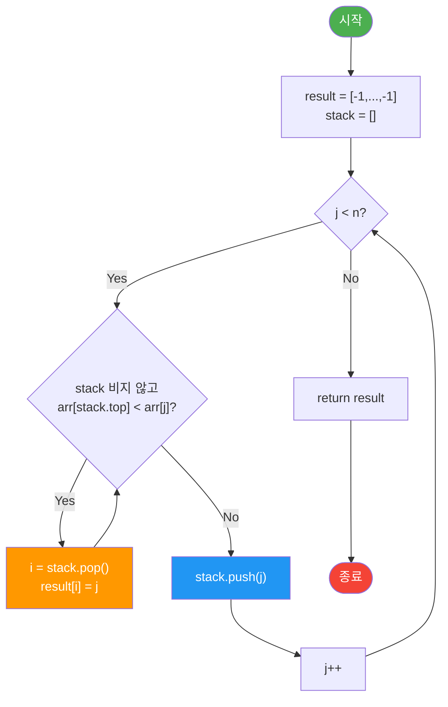

import { AlgorithmSimulation } from "#guide-sim";

# MonotonicStack (단조 스택) 해설

## 성능 목표 예측

| 입력 크기 n | naive O(n²) 예상 시간 | 목표 O(n) 예상 시간 |
|-------------|----------------------|---------------------|
| 1,000       | ~1ms                 | <1ms                |
| 10,000      | ~50ms                | <1ms                |
| 100,000     | ~5,000ms (5초)       | <10ms               |
| 1,000,000   | 초과 (시간 초과)     | <100ms              |

O(n²) 이중 반복은 n=10^5에서 이미 시간 제한을 초과합니다.
단조 스택은 각 원소를 최대 한 번 push/pop하므로 **O(n)** 을 보장합니다.

---

## 목표 함수

| 메서드 | 순회 방향 | 스택 불변식 | 시간 | 공간 |
|--------|-----------|-------------|------|------|
| `nextGreater` | 왼→오 | 단조 감소 (인덱스 기준) | O(n) | O(n) |
| `prevGreater` | 오→왼 | 단조 감소 (인덱스 기준) | O(n) | O(n) |
| `nextSmaller` | 왼→오 | 단조 증가 (인덱스 기준) | O(n) | O(n) |

**주요 엣지케이스:**
- 빈 배열 `[]` → 빈 배열 `[]` 반환
- 단일 원소 → 항상 `-1`
- 동일값 배열 → 모두 `-1` (strict inequality)
- 음수 포함 배열 → 대소 비교는 동일하게 동작

---

## 핵심 아이디어

### 원형 아이디어와 naive 접근

가장 단순한 접근은 각 인덱스 `i`에 대해 오른쪽을 선형 탐색하는 것입니다:

```
for i in 0..n-1:
  result[i] = -1
  for j in i+1..n-1:
    if arr[j] > arr[i]:
      result[i] = j
      break
```

이 접근은 O(n²)으로, n=10^5에서 수초가 소요됩니다.

### 어떤 관찰이 돌파구가 되는가

**관찰 1:** 인덱스 `j`에서 `arr[j]`를 처리할 때, 스택에 쌓인 인덱스들 중 `arr[j]`보다 작은 것들의 "nextGreater"가 바로 `j`임을 알 수 있습니다.

**관찰 2:** 스택에서 `arr[j]`보다 크거나 같은 인덱스들은 아직 nextGreater를 결정할 수 없으므로 스택에 남겨 둡니다.

**관찰 3:** 스택을 단조 감소 상태로 유지하면, 새 원소 `arr[j]`가 들어올 때 스택 상단이 `arr[j]`보다 작은 동안 pop하면서 결과를 채울 수 있습니다.

### 관찰을 형식화: 상태/구조 정의

- **스택 불변식 (nextGreater용):** 스택에는 아직 nextGreater가 결정되지 않은 인덱스들이 있으며, 스택의 값은 아래에서 위로 **단조 감소(non-increasing)**
- 스택에는 원소 값이 아닌 **인덱스**를 저장

### 점화식 또는 핵심 연산

```
nextGreater 알고리즘:
  result = [-1, -1, ..., -1]  (길이 n)
  stack = []                   (단조 감소 스택, 인덱스 저장)

  for j in 0..n-1:
    while stack이 비어있지 않고 arr[stack.top] < arr[j]:
      i = stack.pop()
      result[i] = j            ← 핵심: i의 nextGreater는 j
    stack.push(j)

  // 스택에 남은 인덱스들의 nextGreater는 -1 (이미 초기화됨)
  return result
```

### 정당성 — 왜 이것이 옳은가

**귀납적 불변식:** 루프 불변식으로 "스택에 있는 인덱스들은 아직 nextGreater가 결정되지 않았으며, 스택은 값 기준 단조 감소"가 유지됩니다.

- `arr[j]`를 처리할 때, `arr[stack.top] < arr[j]`이면 `j`가 `stack.top`의 nextGreater입니다.
  - 왜냐하면 `stack.top`과 `j` 사이에 있는 원소들은 모두 이미 pop되었거나 `arr[stack.top]`보다 작거나 같습니다.
- 따라서 nextGreater = `j`가 **첫 번째로 큰 원소**임이 보장됩니다.

**복잡도 증명:** 각 인덱스는 정확히 한 번 push, 최대 한 번 pop → O(n).

### 구현 디테일과 최적화

- **prevGreater:** 오른쪽→왼쪽으로 순회하면서 동일한 로직 적용 (또는 왼쪽→오른쪽 순회 중 스택 상단이 현재 원소의 prevGreater)
- **nextSmaller:** 비교 방향 반전 (`arr[stack.top] > arr[j]` 조건으로 pop)
- TypeScript에서 스택은 배열의 `push()`/`pop()`/`at(-1)` 활용

---

## 시뮬레이션

export const steps = [
  {
    title: "초기 상태",
    detail: "arr = [2, 1, 2, 4, 3], 스택 = [], result = [-1,-1,-1,-1,-1]",
    array: [],
    highlight: [],
    marked: [],
  },
  {
    title: "j=0: arr[0]=2 처리",
    detail: "스택이 비어있으므로 바로 push. 스택 = [0]",
    array: [0],
    highlight: [0],
    marked: [],
  },
  {
    title: "j=1: arr[1]=1 처리",
    detail: "arr[stack.top]=arr[0]=2 >= 1 이므로 pop 안 함. push(1). 스택 = [0, 1]",
    array: [0, 1],
    highlight: [1],
    marked: [],
  },
  {
    title: "j=2: arr[2]=2 처리",
    detail: "arr[1]=1 < 2 → pop. result[1]=2 확정! arr[0]=2 >= 2 이므로 중단. push(2). 스택 = [0, 2]",
    array: [0, 2],
    highlight: [2],
    marked: [1],
  },
  {
    title: "j=3: arr[3]=4 처리",
    detail: "arr[2]=2 < 4 → pop. result[2]=3! arr[0]=2 < 4 → pop. result[0]=3! 스택 비어짐. push(3). 스택 = [3]",
    array: [3],
    highlight: [3],
    marked: [0, 1, 2],
  },
  {
    title: "j=4: arr[4]=3 처리",
    detail: "arr[3]=4 >= 3 이므로 pop 안 함. push(4). 스택 = [3, 4]",
    array: [3, 4],
    highlight: [4],
    marked: [0, 1, 2],
  },
  {
    title: "순회 완료",
    detail: "스택 = [3, 4]. 남은 인덱스들의 nextGreater = -1. 최종: [3, 2, 3, -1, -1]",
    array: [],
    highlight: [],
    marked: [0, 1, 2, 3, 4],
  },
];

<AlgorithmSimulation view="array" steps={steps} title="nextGreater([2, 1, 2, 4, 3]) 시뮬레이션" />

---

## 수도 코드와 Activity Diagram

### 의사코드

```
함수 nextGreater(arr):
  n = arr.length
  result = new Array(n).fill(-1)  // 불변식: 결정되지 않은 값은 -1
  stack = []                       // 불변식: stack의 값은 단조 감소

  for j = 0 to n-1:
    // 스택 상단의 원소보다 arr[j]가 클 때까지 pop
    while stack이 비지 않고 arr[stack[top]] < arr[j]:
      i = stack.pop()
      result[i] = j               // i의 nextGreater = j (첫 번째로 큰 원소)
    stack.push(j)                 // 아직 nextGreater 미결정

  // 스택에 남은 인덱스 → nextGreater 없음 (이미 -1)
  return result
```

```
함수 prevGreater(arr):
  n = arr.length
  result = new Array(n).fill(-1)
  stack = []

  // 오른쪽 → 왼쪽 순회 (또는 왼→오 순회 중 스택 상단이 prevGreater)
  for i = n-1 downto 0:
    while stack이 비지 않고 arr[stack[top]] <= arr[i]:
      stack.pop()
    result[i] = stack이 비어있으면 -1, 아니면 stack[top]
    stack.push(i)

  return result
```

```
함수 nextSmaller(arr):
  n = arr.length
  result = new Array(n).fill(-1)
  stack = []  // 불변식: stack의 값은 단조 증가

  for j = 0 to n-1:
    while stack이 비지 않고 arr[stack[top]] > arr[j]:
      i = stack.pop()
      result[i] = j
    stack.push(j)

  return result
```

### Activity Diagram


