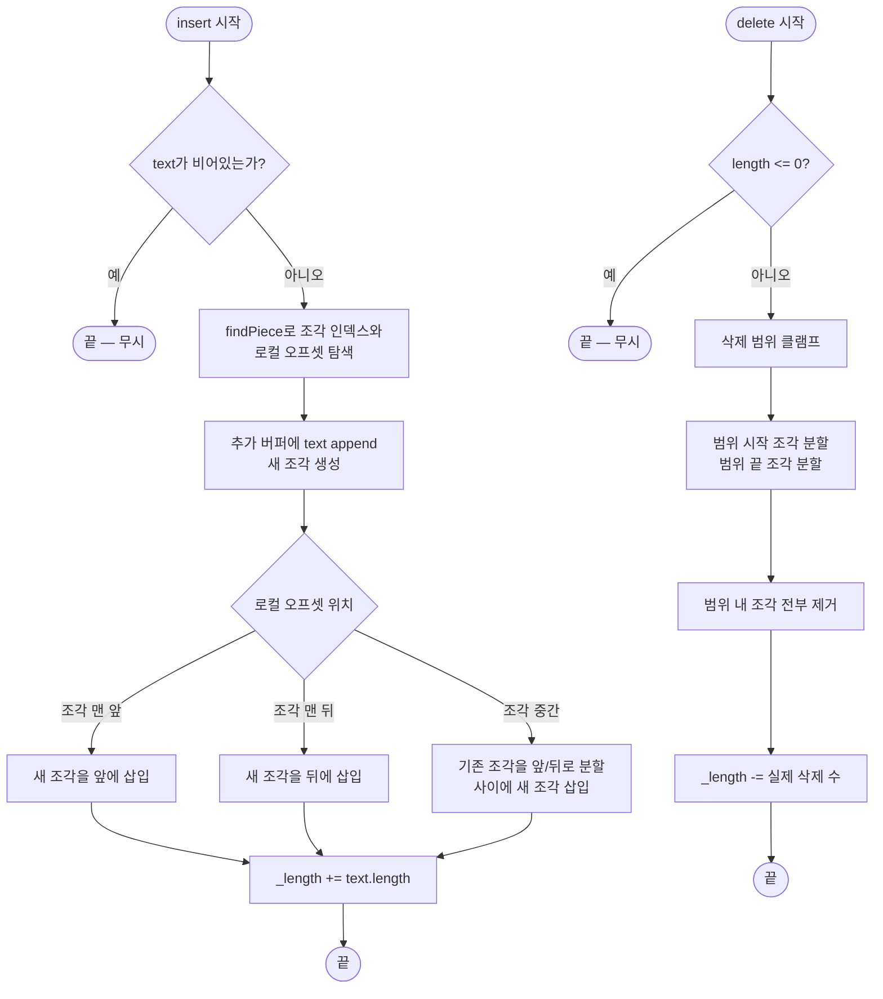

import { AlgorithmSimulation } from "#guide-sim";

# PieceTable 해설

## 성능 목표 예측

| 연산 | 단순 배열 | GapBuffer | PieceTable |
|------|---------|-----------|-----------|
| insert (임의 위치) | O(n) | O(1) + 커서 이동 O(k) | O(p) |
| delete (임의 위치) | O(n) | O(1) + 커서 이동 O(k) | O(p) |
| getText | O(1) | O(n) | O(n) |
| 메모리 사용 | O(n) | O(n) | O(n + p) |
| 원본 불변성 | 없음 | 없음 | 보장 |
| undo/redo 용이성 | 어려움 | 어려움 | 쉬움 (조각 기록) |

p = 조각 수. 일반적인 편집 시나리오에서 p << n이므로 O(p)는 사실상 상수에 가깝다.

---

## 목표 함수

| 함수 | 입력 | 출력 | 엣지케이스 |
|------|------|------|-----------|
| `insert(offset, text)` | 위치, 문자열 | void | offset=0 → 맨 앞 삽입, offset=length → 맨 뒤 삽입, text="" → 무시 |
| `delete(offset, length)` | 위치, 길이 | void | 범위 초과 → 끝까지만 삭제, length=0 → 무시 |
| `getText()` | 없음 | string | 조각이 없으면 "" |
| `length()` | 없음 | number | 항상 조각 길이 합계와 동일 |

---

## 핵심 아이디어

### 원형 아이디어와 naive 접근

텍스트를 하나의 연속된 배열로 관리하면 중간 삽입·삭제 시 이후 내용을 모두 이동시켜야 한다. 1GB 파일에서 이 방식은 현실적으로 불가능하다.

### 어떤 관찰이 돌파구가 되는가

"실제 문자를 이동할 필요가 없다." 텍스트의 "논리적 순서"와 "물리적 저장 위치"를 분리하면 된다. 즉, 어디에 무엇이 저장됐는지 기록하는 메타데이터(조각 목록)만 조작하면 실제 문자 이동 없이 삽입·삭제를 표현할 수 있다.

### 관찰을 형식화: 상태/구조 정의

```
originalBuffer: "hello world"
addBuffer:      ""
pieces: [{ type: "original", start: 0, length: 11 }]

→ getText(): "hello world"
```

insert(5, "!!!") 후:

```
originalBuffer: "hello world"  (변경 없음)
addBuffer:      "!!!"
pieces: [
  { type: "original", start: 0, length: 5 },   // "hello"
  { type: "add",      start: 0, length: 3 },   // "!!!"
  { type: "original", start: 5, length: 6 },   // " world"
]

→ getText(): "hello!!! world"
```

### 점화식 또는 핵심 연산

**조각 탐색 (findPiece):**

```
cumulative = 0
for i, piece in pieces:
    if cumulative + piece.length > offset:
        return (i, offset - cumulative)   // (조각 인덱스, 로컬 오프셋)
    cumulative += piece.length
return (pieces.length, 0)  // 맨 끝
```

**insert(offset, text):**

```
(i, localOffset) = findPiece(offset)

새 조각 = { type: "add", start: addBuffer.length, length: text.length }
addBuffer += text

if localOffset == 0:
    pieces.splice(i, 0, 새 조각)
elif localOffset == pieces[i].length:
    pieces.splice(i + 1, 0, 새 조각)
else:
    앞 = { ...pieces[i], length: localOffset }
    뒤 = { ...pieces[i], start: pieces[i].start + localOffset, length: pieces[i].length - localOffset }
    pieces.splice(i, 1, 앞, 새 조각, 뒤)

_length += text.length
```

**delete(offset, length):**

```
삭제할 범위 [offset, offset + length)에 걸치는 모든 조각을 찾아 제거.
범위 시작 조각과 끝 조각은 각각 앞부분/뒷부분만 남도록 분할.
_length -= 실제 삭제된 문자 수
```

### 정당성 — 왜 이것이 옳은가

- 원본 버퍼와 추가 버퍼는 append-only이므로 기존 조각이 가리키는 데이터는 항상 유효하다.
- `getText()`는 조각 목록 순서대로 버퍼 구간을 이어 붙이므로 논리적 순서가 정확히 재현된다.
- `_length`는 insert/delete마다 갱신되므로 O(1)로 유지된다.

### 구현 디테일과 최적화

- **조각 합병(Piece merging):** 연속된 두 조각이 같은 버퍼의 인접한 구간을 가리키면 하나로 합칠 수 있다. 조각 수 p가 줄어들어 이후 연산이 빨라진다.
- **B-Tree 기반 조각 관리:** VS Code의 실제 구현은 조각 목록을 B-Tree로 관리해 insert/delete를 O(log p)로 낮춘다. 이 연습에서는 배열로 충분하다.
- **undo/redo:** 조각 목록의 스냅샷(또는 조각 단위 변경 로그)만 저장하면 되므로 undo가 매우 간단해진다.

---

## 시뮬레이션

export const steps = [
  {
    title: "초기 상태: PieceTable('hello world')",
    detail: "원본 버퍼='hello world', 추가 버퍼=''. 단일 조각이 원본 전체를 가리킨다.",
    array: [11],
    highlight: [0],
    marked: [],
  },
  {
    title: "insert(5, '!!!') — 조각 분할",
    detail: "조각 0을 [0..4]와 [5..10]으로 분할. 추가 버퍼에 '!!!' 추가. 가운데에 새 조각 삽입.",
    array: [5, 3, 6],
    highlight: [1],
    marked: [0, 2],
  },
  {
    title: "getText() → 'hello!!! world'",
    detail: "조각 0('hello') + 조각 1('!!!') + 조각 2(' world') 이어 붙이기.",
    array: [5, 3, 6],
    highlight: [0, 1, 2],
    marked: [],
  },
  {
    title: "delete(0, 6) — 'hello!'를 삭제",
    detail: "삭제 범위 [0,6)이 조각 0(전체)과 조각 1(앞 1글자)에 걸침. 조각 0 제거, 조각 1을 [1..2]로 축소.",
    array: [2, 6],
    highlight: [0],
    marked: [1],
  },
  {
    title: "getText() → '!! world'",
    detail: "조각 0('!!') + 조각 1(' world') 이어 붙이기.",
    array: [2, 6],
    highlight: [0, 1],
    marked: [],
  },
];

<AlgorithmSimulation
  view="array"
  steps={steps}
  title="PieceTable 동작 시뮬레이션 (array = 각 조각의 길이, highlight = 현재 활성 조각)"
/>

## 수도 코드와 Activity Diagram

### 의사코드

```
class PieceTable:
    originalBuffer: string
    addBuffer: string = ""
    pieces: Piece[] = []
    _length: int = 0

    constructor(original):
        originalBuffer = original
        if original.length > 0:
            pieces = [{ type:"original", start:0, length:original.length }]
            _length = original.length

    findPiece(offset) → (index, localOffset):
        cum = 0
        for i, p in pieces:
            if cum + p.length > offset: return (i, offset - cum)
            cum += p.length
        return (pieces.length, 0)

    insert(offset, text):
        if text == "": return
        (i, local) = findPiece(offset)
        newPiece = { type:"add", start:addBuffer.length, length:text.length }
        addBuffer += text
        if local == 0:
            pieces.splice(i, 0, newPiece)
        elif local == pieces[i].length:
            pieces.splice(i+1, 0, newPiece)
        else:
            left = { ...pieces[i], length: local }
            right = { ...pieces[i], start: pieces[i].start + local, length: pieces[i].length - local }
            pieces.splice(i, 1, left, newPiece, right)
        _length += text.length

    delete(offset, length):
        if length <= 0: return
        end = min(offset + length, _length)
        length = end - offset
        // [offset, end) 범위의 조각 처리
        ...
        _length -= length

    getText():
        result = ""
        for p in pieces:
            buf = (p.type == "original") ? originalBuffer : addBuffer
            result += buf.slice(p.start, p.start + p.length)
        return result
```

### Activity Diagram


