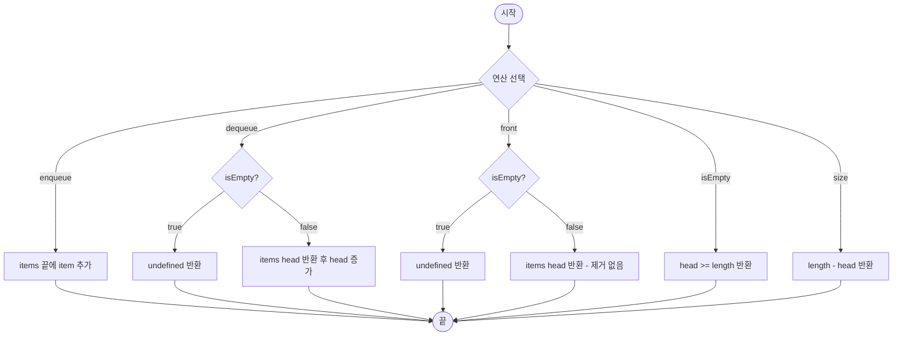

import { AlgorithmSimulation } from "#guide-sim";

# Queue 해설

## 성능 목표 예측

| 제약 항목 | 값 |
|-----------|-----|
| 최대 연산 수 | $10^6$ |
| enqueue 시간복잡도 | amortized O(1) |
| dequeue 시간복잡도 | amortized O(1) |
| 메모리 | 256 MB |

**naive 접근의 문제점**: `Array.shift()`는 O(n)이다. 10^6번 호출하면 총 O(n^2) → 약 10^12 연산 → 1초 초과.

**목표 복잡도**: enqueue / dequeue / front 모두 **amortized O(1)** — 헤드 포인터 방식으로 해결.

---

## 목표 함수

```ts
export class Queue<T> {
  enqueue(item: T): void     // 큐 뒤에 추가
  dequeue(): T | undefined   // 큐 앞에서 제거 후 반환
  front(): T | undefined     // 큐 앞 조회 (제거 없음)
  isEmpty(): boolean
  size(): number
}
```

| 메서드 | 의미 | 제약 |
|--------|------|------|
| `enqueue(item)` | rear에 아이템 추가 | 모든 타입 T |
| `dequeue()` | front 제거 후 반환 | 비어있으면 `undefined` |
| `front()` | front 조회 | 비어있으면 `undefined` |
| `isEmpty()` | 비어있는지 확인 | — |
| `size()` | 현재 원소 수 | — |

**엣지케이스**:
1. 빈 큐에서 `dequeue()` / `front()` → `undefined` 반환
2. enqueue 후 즉시 `front()` → 처음 enqueue한 값 반환 (FIFO)
3. 1개 남은 상태에서 `dequeue()` → 이후 `isEmpty()` === true

---

## 핵심 아이디어

**핵심 아이디어**: "배열을 실제로 시프트하지 않고 `head` 인덱스만 증가시켜 O(1) dequeue를 달성한다"

**풀이 구조**
1. `items: T[]` — 내부 저장 배열
2. `head: number = 0` — 현재 front 인덱스
3. `enqueue`: `items.push(item)` — 배열 끝에 추가 (O(1))
4. `dequeue`: `items[head]`를 반환하고 `head++` (O(1))
5. `front`: `items[head]` 반환 (O(1))
6. `size`: `items.length - head`
7. `isEmpty`: `head >= items.length`

**언제 쓰나**: BFS, 이벤트 루프, 인쇄/작업 대기열, 너비 우선 레벨 처리.

---

### 원형 아이디어와 naive 접근

`shift()`는 내부적으로 모든 원소를 앞으로 한 칸씩 당긴다 → O(n). 이를 피하려면 "front 위치"를 별도 변수로 기억해야 한다.

### 어떤 관찰이 돌파구가 되는가

배열에서 원소를 실제로 지울 필요가 없다. `head` 포인터만 앞으로 이동시키면 논리적으로 삭제된 것과 동일하다. 메모리가 걱정되면 head가 일정 임계값을 넘을 때 `items.splice(0, head)`로 정리하면 된다.

### 관찰을 형식화: 상태/구조 정의

```
items: T[]     // 저장 배열
head: number   // 현재 front 인덱스

유효 원소 범위: items[head .. items.length - 1]
size = items.length - head
```

### 점화식 또는 핵심 연산

```
enqueue(x)  → items[items.length] = x
dequeue()   → x = items[head], head++, return x
front()     → items[head]
size()      → items.length - head
```

### 정당성 — 왜 이것이 옳은가

enqueue는 배열 끝에 O(1) 추가. dequeue는 head 인덱스 조회 + 증가로 O(1). FIFO 순서는 head가 항상 가장 오래된 원소를 가리키기 때문에 보장된다. 상각 비용: 각 원소는 enqueue 1회, dequeue 1회만 처리된다.

### 구현 디테일과 최적화

- `head`가 너무 커지면 `items = items.slice(head); head = 0;`으로 압축.
- 또는 두 개의 스택(inbox / outbox)으로 구현하면 slice 불필요 — 이 경우도 amortized O(1).

---

## 시뮬레이션

enqueue(1) → enqueue(2) → enqueue(3) → dequeue() → front() 순서로 큐 상태 변화를 확인한다.

export const steps = [
  {
    title: "초기 상태 (빈 큐)",
    detail: "head = 0, 배열 비어있음. isEmpty = true",
    array: [],
    highlight: [],
    marked: [],
  },
  {
    title: "enqueue(1)",
    detail: "1을 큐 뒤(rear)에 추가. head = 0, size = 1",
    array: [1],
    highlight: [0],
    marked: [],
  },
  {
    title: "enqueue(2)",
    detail: "2를 큐 뒤에 추가. head = 0, size = 2",
    array: [1, 2],
    highlight: [1],
    marked: [0],
  },
  {
    title: "enqueue(3)",
    detail: "3을 큐 뒤에 추가. head = 0, size = 3",
    array: [1, 2, 3],
    highlight: [2],
    marked: [0, 1],
  },
  {
    title: "dequeue() → 1 반환",
    detail: "head(0) 위치의 1을 반환하고 head = 1로 증가. 배열은 그대로. FIFO 보장.",
    array: [2, 3],
    highlight: [],
    marked: [0, 1],
  },
  {
    title: "front() → 2 반환",
    detail: "현재 head가 가리키는 2를 반환. 제거 없음. size = 2 유지.",
    array: [2, 3],
    highlight: [0],
    marked: [1],
  },
];

<AlgorithmSimulation view="array" steps={steps} title="Queue 시뮬레이션" />

## 수도 코드와 Activity Diagram

### 의사코드

```
class Queue<T>:
  items: T[] = []
  head: number = 0                     // 불변식: head <= items.length

  enqueue(item):
    items.append(item)                 // 불변식 유지

  dequeue():
    if isEmpty(): return undefined
    x = items[head]
    head++                             // 불변식: head 증가
    return x

  front():
    if isEmpty(): return undefined
    return items[head]                 // 불변식: 제거 없음

  isEmpty():
    return head >= items.length

  size():
    return items.length - head
```

### Activity Diagram


