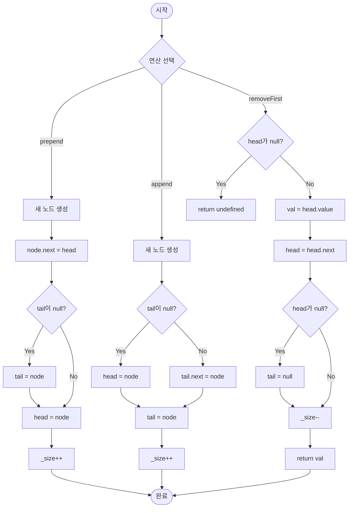

import { AlgorithmSimulation } from "#guide-sim";

# SinglyLinkedList (단방향 연결 리스트) 해설

## 성능 목표 예측

| 연산 | 목표 복잡도 | 비고 |
|------|------------|------|
| `prepend` | O(1) | head 포인터만 갱신 |
| `append` | O(1) | tail 포인터 유지 시 |
| `removeFirst` | O(1) | head 포인터만 갱신 |
| `find` | O(n) | 선형 탐색 불가피 |
| `toArray` | O(n) | 전체 순회 |
| `size` | O(1) | 카운터 변수 유지 |

$n = 10^5$ 기준 O(n) 연산은 약 0.1ms 이내, O(1) 연산은 수 나노초 수준이다.

---

## 목표 함수

| 메서드 | 시그니처 | 엣지케이스 |
|--------|----------|-----------|
| `prepend` | `(value: T) => ListNode<T>` | 빈 리스트 → head=tail=새 노드 |
| `append` | `(value: T) => ListNode<T>` | 빈 리스트 → head=tail=새 노드 |
| `removeFirst` | `() => T \| undefined` | 빈 리스트 → undefined, 단일 노드 → tail도 null |
| `find` | `(value: T) => ListNode<T> \| null` | 빈 리스트, 중복 값, 없는 값 |
| `toArray` | `() => T[]` | 빈 리스트 → [] |
| `size` | `() => number` | 0인 경우 |

---

## 핵심 아이디어

### 원형 아이디어와 naive 접근

가장 단순한 연결 리스트는 `head` 포인터만 유지한다. `append`할 때마다 head부터 끝까지 순회해서 마지막 노드의 `next`에 연결하면 O(n)이 된다. 10만 번 append하면 약 50억 번의 포인터 추적이 발생한다 — 실용적이지 않다.

### 어떤 관찰이 돌파구가 되는가

"항상 끝에 붙이는데, 왜 끝을 매번 찾아야 하는가?" — tail 포인터를 한 개 더 유지하면 끝에 대한 참조를 항상 O(1)로 접근할 수 있다.

### 관찰을 형식화: 상태/구조 정의

```
상태: { head: ListNode<T> | null, tail: ListNode<T> | null, _size: number }

불변식:
  - head === null  ⟺  tail === null  ⟺  _size === 0
  - _size === 1    ⟹  head === tail
  - _size >= 2     ⟹  head !== tail, tail.next === null
```

### 점화식 또는 핵심 연산

**prepend**:
```
새 노드 node 생성
node.next = head
head = node
if tail === null: tail = node   // 빈 리스트였다면
_size++
```

**append**:
```
새 노드 node 생성
if tail !== null: tail.next = node
else: head = node               // 빈 리스트였다면
tail = node
_size++
```

**removeFirst**:
```
if head === null: return undefined
val = head.value
head = head.next
if head === null: tail = null   // 단일 노드를 제거했다면
_size--
return val
```

### 정당성 — 왜 이것이 옳은가

- `append` 후 `tail`은 항상 마지막 노드를 가리키므로 다음 `append`도 O(1).
- `removeFirst` 후 리스트가 비면 `tail`도 `null`로 초기화해야 한다. 그렇지 않으면 `tail`이 이미 해제된 노드를 가리키는 댕글링 참조가 생긴다 (GC 언어에서는 메모리 누수).
- `_size` 카운터를 별도 유지하면 `size()`가 O(1).

### 구현 디테일과 최적화

- `find`는 `===` 참조 비교를 사용한다. 원시 타입은 값 비교, 객체는 참조 비교로 자동 처리된다.
- TypeScript strict mode에서 `noUncheckedIndexedAccess`가 활성화되어 있으므로, 모든 `null` 체크를 명시적으로 수행해야 한다.
- `prepend` 직후 `append`를 호출하면 tail이 prepend로 설정된 단일 노드를 가리키고 있으므로 문제없이 동작한다.

---

## 시뮬레이션

export const steps = [
  {
    title: "초기 상태 (빈 리스트)",
    detail: "head = null, tail = null, size = 0",
    array: [],
    highlight: [],
    marked: [],
  },
  {
    title: "append(10) — 첫 번째 삽입",
    detail: "빈 리스트이므로 head와 tail 모두 새 노드를 가리킨다.",
    array: [10],
    highlight: [0],
    marked: [],
  },
  {
    title: "append(20) — tail.next에 연결",
    detail: "tail.next = 새 노드, tail = 새 노드. head는 그대로 10.",
    array: [10, 20],
    highlight: [1],
    marked: [0],
  },
  {
    title: "prepend(5) — head 앞에 삽입",
    detail: "node.next = head(10), head = node(5). tail은 변하지 않는다.",
    array: [5, 10, 20],
    highlight: [0],
    marked: [1, 2],
  },
  {
    title: "removeFirst() — 5 제거",
    detail: "head = head.next(10). head !== null이므로 tail은 그대로 20.",
    array: [10, 20],
    highlight: [0],
    marked: [1],
  },
  {
    title: "최종 상태",
    detail: "head = 10, tail = 20, size = 2. 불변식이 유지된다.",
    array: [10, 20],
    highlight: [],
    marked: [0, 1],
  },
];

<AlgorithmSimulation view="array" steps={steps} title="SinglyLinkedList 동작 흐름" />

---

## 수도 코드와 Activity Diagram

### 의사코드

```
class ListNode<T>:
  value: T
  next: ListNode<T> | null = null

class SinglyLinkedList<T>:
  head: ListNode<T> | null = null   // 불변식: head===null ⟺ tail===null
  tail: ListNode<T> | null = null
  _size: int = 0

  prepend(value):
    node = new ListNode(value)
    node.next = head
    head = node
    if tail == null:          // 빈 리스트였다면
      tail = node
    _size++
    return node

  append(value):
    node = new ListNode(value)
    if tail != null:
      tail.next = node
    else:
      head = node             // 빈 리스트였다면
    tail = node
    _size++
    return node

  removeFirst():
    if head == null: return undefined
    val = head.value
    head = head.next
    if head == null:          // 단일 노드 제거 → tail도 null
      tail = null
    _size--
    return val

  find(value):
    current = head
    while current != null:
      if current.value === value: return current
      current = current.next
    return null

  toArray():
    result = []
    current = head
    while current != null:
      result.push(current.value)
      current = current.next
    return result

  size(): return _size
```

### Activity Diagram


