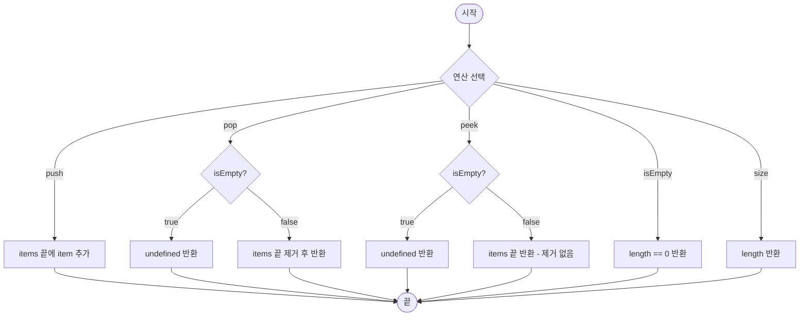

import { AlgorithmSimulation } from "#guide-sim";

# Stack 해설

## 성능 목표 예측

| 제약 항목 | 값 |
|-----------|-----|
| 최대 원소 수 | $10^6$ |
| push/pop 시간복잡도 | O(1) |
| 메모리 | 256 MB |

**naive 접근의 문제점**: 배열의 앞부분에 삽입/삭제하면 O(n) 시프트가 발생한다. 10^6회 연산 시 총 O(n^2) → 1초 초과.

**목표 복잡도**: push / pop / peek 모두 **O(1)** — 배열 뒤를 top으로 사용하면 인덱스 기반 O(1) 달성.

---

## 목표 함수

```ts
export class Stack<T> {
  push(item: T): void    // O(1)
  pop(): T | undefined   // LIFO, 비어있으면 undefined
  peek(): T | undefined  // 제거 없이 top 반환
  isEmpty(): boolean
  size(): number
}
```

| 메서드 | 의미 | 제약 |
|--------|------|------|
| `push(item)` | 스택 top에 아이템 추가 | 모든 타입 T |
| `pop()` | top 제거 후 반환 | 비어있으면 `undefined` |
| `peek()` | top 반환 (제거 없음) | 비어있으면 `undefined` |
| `isEmpty()` | 스택이 비어있는지 확인 | — |
| `size()` | 현재 원소 수 반환 | — |

**엣지케이스**:
1. 빈 스택에서 `pop()` / `peek()` → `undefined` 반환 (에러 아님)
2. 단일 원소 후 `pop()` → 이후 `isEmpty()` === true
3. push 후 즉시 peek → push한 값과 동일해야 함

---

## 핵심 아이디어

**핵심 아이디어**: "배열의 마지막 인덱스를 top으로 관리하면 push/pop이 모두 O(1)"

**풀이 구조**
1. 내부 배열(`items: T[]`)을 선언한다.
2. `push`: `items.push(item)` — JS 배열 뒤에 추가.
3. `pop`: `items.pop()` — JS 배열 뒤에서 제거.
4. `peek`: `items[items.length - 1]` — 마지막 인덱스 조회.
5. `isEmpty`: `items.length === 0`.
6. `size`: `items.length`.

**언제 쓰나**: 함수 호출 스택, 괄호 검증, 실행취소(undo), DFS, 역순 출력.

---

### 원형 아이디어와 naive 접근

naive하게 배열 앞을 top으로 사용하면 push마다 O(n) 시프트가 필요하다.  
배열 뒤를 top으로 사용하는 것이 핵심 관찰이다.

### 어떤 관찰이 돌파구가 되는가

LIFO 특성상 **가장 마지막에 넣은 것을 가장 먼저 꺼낸다**. 배열의 끝은 push/pop이 O(1)이므로 "끝 = top"으로 고정하면 별도 포인터 없이 구현 가능하다.

### 관찰을 형식화: 상태/구조 정의

```
items: T[]        // 내부 저장소
top 인덱스 = items.length - 1
```

### 점화식 또는 핵심 연산

```
push(x)  → items[length] = x,   length++
pop()    → x = items[length-1], length--,  return x
peek()   → items[length-1]
```

### 정당성 — 왜 이것이 옳은가

JS 엔진은 동적 배열을 상각 O(1)로 확장한다. push/pop은 배열 끝만 건드리므로 O(1)이 보장된다. LIFO 순서는 배열 뒤에서만 삽입/삭제함으로써 자동으로 보장된다.

### 구현 디테일과 최적화

- TypeScript 제네릭(`<T>`)으로 타입 안전성 확보.
- `noUncheckedIndexedAccess` 설정 때문에 `items[items.length - 1]`은 `T | undefined`로 추론되므로 별도 캐스팅 불필요.

---

## 시뮬레이션

push(10) → push(20) → push(30) → pop() → peek() 순서로 스택 상태 변화를 확인한다.

export const steps = [
  {
    title: "초기 상태 (빈 스택)",
    detail: "스택이 비어있다. size = 0, isEmpty = true",
    array: [],
    highlight: [],
    marked: [],
  },
  {
    title: "push(10)",
    detail: "10을 스택 top에 추가한다. 배열 끝에 삽입 → O(1)",
    array: [10],
    highlight: [0],
    marked: [],
  },
  {
    title: "push(20)",
    detail: "20을 스택 top에 추가한다. size = 2",
    array: [10, 20],
    highlight: [1],
    marked: [0],
  },
  {
    title: "push(30)",
    detail: "30을 스택 top에 추가한다. size = 3",
    array: [10, 20, 30],
    highlight: [2],
    marked: [0, 1],
  },
  {
    title: "pop() → 30 반환",
    detail: "top(30)을 제거하고 반환한다. LIFO — 마지막에 넣은 것이 먼저 나온다.",
    array: [10, 20],
    highlight: [],
    marked: [0, 1],
  },
  {
    title: "peek() → 20 반환",
    detail: "top(20)을 제거 없이 반환한다. 스택 상태는 유지된다.",
    array: [10, 20],
    highlight: [1],
    marked: [0],
  },
];

<AlgorithmSimulation view="array" steps={steps} title="Stack 시뮬레이션" />

## 수도 코드와 Activity Diagram

### 의사코드

```
class Stack<T>:
  items: T[] = []

  push(item):
    items.append(item)          // 불변식: top = items[length-1]

  pop():
    if isEmpty(): return undefined
    return items.removeLast()   // 불변식 유지

  peek():
    if isEmpty(): return undefined
    return items[length - 1]   // 불변식: 제거 없음

  isEmpty():
    return length == 0

  size():
    return length
```

### Activity Diagram


