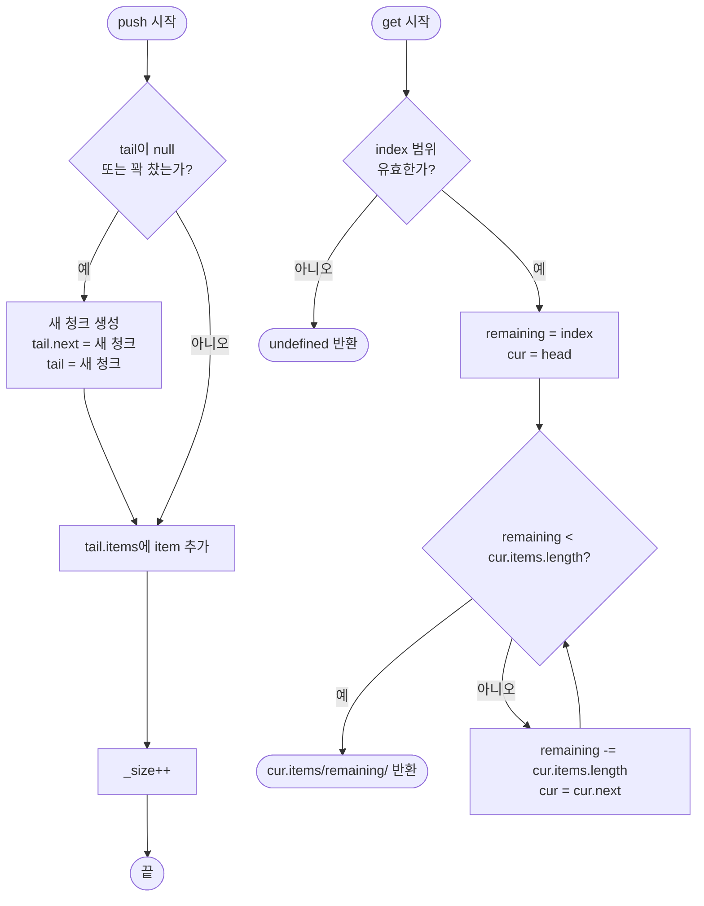

import { AlgorithmSimulation } from "#guide-sim";

# UnrolledLinkedList 해설

## 성능 목표 예측

| 연산 | 단순 연결 리스트 | UnrolledLinkedList | 배열 |
|------|--------------|-------------------|------|
| push | O(1) | O(1) amortized | O(1) amortized |
| pop | O(n) (tail 탐색 필요) | O(p) tail 탐색 | O(1) |
| get(i) | O(n) | O(√n) | O(1) |
| 캐시 효율 | 낮음 (포인터 점프) | 중간 (청크 내 연속) | 높음 |
| 메모리 오버헤드 | n개 포인터 | p개 포인터 | 없음 |

p = 청크 수 ≈ n / chunkSize. chunkSize = √n 으로 설정하면 get이 O(√n)으로 최적화된다.

---

## 목표 함수

| 함수 | 입력 | 출력 | 엣지케이스 |
|------|------|------|-----------|
| `push(item)` | 임의 타입 T | void | tail이 꽉 찬 경우 → 새 청크 생성 |
| `pop()` | 없음 | T \| undefined | 빈 리스트 → undefined, tail 청크가 비면 이전 청크로 tail 교체 |
| `get(index)` | 0-based 정수 | T \| undefined | 음수 또는 범위 초과 → undefined |
| `size()` | 없음 | number | 상시 O(1) 유지를 위해 별도 카운터 필요 |
| `toArray()` | 없음 | T[] | 빈 리스트 → [] |

---

## 핵심 아이디어

### 원형 아이디어와 naive 접근

단순 연결 리스트는 원소마다 노드 객체를 생성해 포인터로 연결한다. 원소 접근 패턴이 순차적이어도 메모리상 노드들이 흩어져 있어 CPU가 캐시에 미리 로드해 두기 어렵다. 반면 배열은 캐시 효율이 극히 좋지만, 중간 삽입·삭제가 O(n)이다.

### 어떤 관찰이 돌파구가 되는가

"원소 하나당 노드 하나"라는 규칙을 깨면 어떨까? 노드 하나에 여러 원소를 배열로 묶으면 노드 수가 `n/chunkSize`로 줄어들고, 청크 내부 접근은 배열처럼 빠르다. 이것이 핵심 관찰이다.

### 관찰을 형식화: 상태/구조 정의

```
head → [Chunk: items=[1,2,3,4], next] → [Chunk: items=[5,6], next=null] ← tail
```

- 각 청크는 `items: T[]`와 `next: Chunk | null`을 갖는다.
- `head`는 첫 청크, `tail`은 마지막 청크를 O(1)로 가리킨다.
- `_size`는 전체 원소 수를 상시 추적한다.

### 점화식 또는 핵심 연산

**get(index) 탐색:**

```
남은_인덱스 = index
현재 청크 = head
while 현재 청크 != null:
    if 남은_인덱스 < 현재 청크.items.length:
        return 현재 청크.items[남은_인덱스]
    남은_인덱스 -= 현재 청크.items.length
    현재 청크 = 현재 청크.next
return undefined
```

**push:**

```
if tail == null 또는 tail.items.length == chunkSize:
    새 청크 = { items: [], next: null }
    if tail != null: tail.next = 새 청크
    else: head = 새 청크
    tail = 새 청크
tail.items.push(item)
_size++
```

### 정당성 — 왜 이것이 옳은가

- 청크를 순회하면서 `items.length`를 누적하면 정확히 index가 위치한 청크와 내부 오프셋을 찾을 수 있다.
- tail 포인터를 별도로 유지하므로 push는 항상 O(1)이다.
- `_size` 카운터를 push/pop마다 갱신하므로 size()는 O(1)이다.

### 구현 디테일과 최적화

- **pop의 tail 갱신:** 단방향 연결 리스트이므로 tail 청크가 빈 경우 head부터 순회해 이전 청크를 찾아야 한다. 이 비용은 O(p) = O(n/chunkSize)이다. pop이 자주 필요하면 이중 연결 리스트로 확장할 수 있다.
- **chunkSize 선택:** n이 예측 가능하면 chunkSize = √n이 get 성능을 최적화한다. 일반적으로 16~64가 캐시 라인 크기(64바이트)에 잘 맞는다.

---

## 시뮬레이션

export const steps = [
  {
    title: "초기 상태 (chunkSize=4)",
    detail: "리스트가 비어 있다. head=null, tail=null, size=0.",
    array: [],
    highlight: [],
    marked: [],
  },
  {
    title: "push(1,2,3,4) — 청크 1 가득 참",
    detail: "4개 원소가 첫 번째 청크를 채웠다. tail.items.length == chunkSize.",
    array: [4],
    highlight: [0],
    marked: [],
  },
  {
    title: "push(5) — 새 청크 생성",
    detail: "tail이 꽉 찼으므로 새 청크를 생성하고 tail을 갱신한다.",
    array: [4, 1],
    highlight: [1],
    marked: [],
  },
  {
    title: "get(4) 탐색",
    detail: "청크 1(size=4) 통과 → 남은_인덱스=0 → 청크 2.items[0] = 5 반환.",
    array: [4, 1],
    highlight: [1],
    marked: [1],
  },
  {
    title: "pop() — 청크 2가 비어 tail 교체",
    detail: "청크 2에서 5를 꺼낸다. 청크 2가 비어 head부터 순회해 tail을 청크 1로 교체.",
    array: [4],
    highlight: [0],
    marked: [],
  },
];

<AlgorithmSimulation view="array" steps={steps} title="UnrolledLinkedList 동작 시뮬레이션 (array = 각 청크의 크기)" />

## 수도 코드와 Activity Diagram

### 의사코드

```
class UnrolledLinkedList<T>:
    head, tail: Chunk | null
    _size: int = 0
    chunkSize: int

    push(item):
        if tail == null or tail.items.length == chunkSize:
            chunk = { items: [], next: null }
            if tail != null: tail.next = chunk
            else: head = chunk
            tail = chunk
        tail.items.push(item)
        _size++

    pop():
        if _size == 0: return undefined
        val = tail.items.pop()
        _size--
        if tail.items.length == 0:
            if head == tail: head = tail = null
            else:
                cur = head
                while cur.next != tail: cur = cur.next
                cur.next = null
                tail = cur
        return val

    get(index):
        if index < 0 or index >= _size: return undefined
        remaining = index
        cur = head
        while cur != null:
            if remaining < cur.items.length: return cur.items[remaining]
            remaining -= cur.items.length
            cur = cur.next
        return undefined
```

### Activity Diagram


