import { AlgorithmSimulation } from "#guide-sim";

# XorLinkedList (XOR 연결 리스트) 해설

## 성능 목표 예측

| 연산 | 목표 복잡도 | 비고 |
|------|------------|------|
| `append` | O(1) | tail 포인터 유지, Map 조회 O(1) |
| `toArray` | O(n) | 전체 순회 |
| `toArrayReverse` | O(n) | 전체 역순회 |
| `size` | O(1) | 카운터 변수 반환 |

n = 10^4 기준 O(n) 연산은 수 ms 이내. append는 O(1)이므로 10^4 회도 즉시 완료.

---

## 목표 함수

| 메서드 | 시그니처 | 엣지케이스 |
|--------|----------|-----------|
| `append` | `(value: number) => void` | 빈 리스트 → headId=tailId=새 id |
| `toArray` | `() => number[]` | 빈 리스트 → [] |
| `toArrayReverse` | `() => number[]` | 빈 리스트 → [], 단일 원소 |
| `size` | `() => number` | 0인 경우 |

---

## 핵심 아이디어

### 원형 아이디어와 naive 접근

이중 연결 리스트는 노드마다 `prev`와 `next` 두 포인터를 저장한다. 64비트 시스템에서 각 포인터는 8바이트이므로 노드당 16바이트가 포인터에만 소비된다. 메모리 제약이 심한 임베디드 환경에서는 부담이 크다.

### 어떤 관찰이 돌파구가 되는가

XOR의 자가 역원 성질: `(A XOR B) XOR A = B`. 두 포인터의 XOR을 저장해두면, 하나를 알 때 다른 하나를 복원할 수 있다.

```
node.xorId = prev.id ^ next.id

순방향: nextId = node.xorId ^ prevId
역방향: prevId = node.xorId ^ nextId
```

포인터 하나 분량(8바이트)으로 양방향 순회를 구현한다.

### 관찰을 형식화: 상태/구조 정의

```
센티넬: ID 0 = null 포인터

XorNode:
  id: number     // 1 이상의 고유 식별자
  value: number
  xorId: number  // prevId XOR nextId

XorLinkedList:
  store: Map<number, XorNode>  // id → 노드
  headId: number               // 0이면 빈 리스트
  tailId: number               // 0이면 빈 리스트
  _size: number
  nextId: number               // 다음 노드 id (1부터 시작)

불변식:
  headId == 0  ⟺  tailId == 0  ⟺  _size == 0
  headId의 xorId: 0 XOR (next.id 또는 0)
  tailId의 xorId: (prev.id 또는 0) XOR 0
```

### 점화식 또는 핵심 연산

**append(value)**:
```
id = nextId++
node = new XorNode(id, value)
node.xorId = tailId ^ 0   // prev=tail, next=null(0)

if tailId != 0:
  tail = store[tailId]
  tail.xorId = tail.xorId ^ id  // tail의 next를 새 노드로 갱신
  // 왜? tail.xorId = prevOfTail ^ 0, 이제 prevOfTail ^ id로 변경
else:
  headId = id              // 빈 리스트였다면 head도 설정

store[id] = node
tailId = id
_size++
```

**toArray() — 순방향 순회**:
```
result = []
prevId = 0, currId = headId
while currId != 0:
  node = store[currId]
  result.push(node.value)
  nextId = node.xorId ^ prevId
  prevId = currId
  currId = nextId
return result
```

**toArrayReverse() — 역방향 순회**:
```
result = []
nextId = 0, currId = tailId
while currId != 0:
  node = store[currId]
  result.push(node.value)
  prevId = node.xorId ^ nextId
  nextId = currId
  currId = prevId
return result
```

### 정당성 — 왜 이것이 옳은가

**append 시 tail.xorId 갱신**:

append 전 tail의 상태: `tail.xorId = prevOfTailId ^ 0` (next=null)

append 후 tail의 상태: `tail.xorId = prevOfTailId ^ newId`

갱신 방법: `tail.xorId ^= newId` (XOR은 자가 역원이므로 `0 XOR newId = newId`로 정확히 갱신됨)

**순방향 순회 정당성**:

초기: `prevId = 0`, `currId = headId`

head 노드: `head.xorId = 0 ^ nextId = nextId`

따라서: `nextId = head.xorId ^ 0 = nextId` ✓

일반 중간 노드: `node.xorId = prevId ^ nextId`

`nextId = node.xorId ^ prevId = (prevId ^ nextId) ^ prevId = nextId` ✓

### 구현 디테일과 최적화

1. **ID 0 = null 센티넬**: `store`에 ID 0은 등록하지 않는다. 순회 루프의 종료 조건은 `currId != 0`.
2. **JavaScript XOR 연산**: `^` 연산자는 32비트 정수로 변환해 연산한다. ID가 2^31을 초과하면 오버플로우가 발생하므로 ID는 `2^31 - 1` 이내로 유지한다 (n=10^4면 문제없음).
3. **값과 ID 구분**: 노드의 `value`는 어떤 수도 될 수 있지만, `id`는 1 이상의 양의 정수여야 한다. 값 0이 들어와도 id와 혼동되지 않도록 별도 필드를 사용한다.
4. **Map.get 타입 안전성**: TypeScript strict 모드에서 `store.get(id)`는 `XorNode | undefined`를 반환한다. 순회 시 `!` 단언보다는 명시적 null 체크를 권장한다.

---

## 시뮬레이션

export const steps = [
  {
    title: "초기 상태 (빈 리스트)",
    detail: "headId=0, tailId=0, size=0. ID 0은 null 센티넬.",
    array: [],
    highlight: [],
    marked: [],
  },
  {
    title: "append(10) — 첫 번째 노드 (id=1)",
    detail: "node(1, xorId=0^0=0). headId=1, tailId=1.",
    array: [10],
    highlight: [0],
    marked: [],
  },
  {
    title: "append(20) — 두 번째 노드 (id=2)",
    detail: "node(2, xorId=1^0=1). node(1).xorId = 0^2=2. tailId=2.",
    array: [10, 20],
    highlight: [1],
    marked: [0],
  },
  {
    title: "append(30) — 세 번째 노드 (id=3)",
    detail: "node(3, xorId=2^0=2). node(2).xorId = 1^3=2. tailId=3.",
    array: [10, 20, 30],
    highlight: [2],
    marked: [0, 1],
  },
  {
    title: "toArray() — 순방향 순회",
    detail: "prevId=0→curr=1: next=2^0=2. prevId=1→curr=2: next=2^1=3... 결과: [10,20,30]",
    array: [10, 20, 30],
    highlight: [0, 1, 2],
    marked: [],
  },
  {
    title: "toArrayReverse() — 역방향 순회",
    detail: "nextId=0→curr=3: prev=2^0=2. nextId=3→curr=2: prev=2^3=1... 결과: [30,20,10]",
    array: [30, 20, 10],
    highlight: [0, 1, 2],
    marked: [],
  },
];

<AlgorithmSimulation view="array" steps={steps} title="XorLinkedList XOR 포인터 동작" />

---

## 수도 코드와 Activity Diagram

### 의사코드

```
class XorNode(id, value):
  id: int
  value: int
  xorId: int = 0   // prevId XOR nextId

class XorLinkedList:
  store: Map<int, XorNode> = {}
  headId: int = 0        // 0 = null
  tailId: int = 0
  _size: int = 0
  nextId: int = 1        // 불변식: nextId >= 1

  append(value):
    id = nextId++
    node = new XorNode(id, value)
    node.xorId = tailId ^ 0    // prev=tail, next=null

    if tailId != 0:
      tail = store[tailId]
      tail.xorId ^= id         // tail.next 갱신 (0 XOR id = id)
    else:
      headId = id              // 빈 리스트: head도 설정

    store[id] = node
    tailId = id
    _size++

  toArray():
    result = []
    prevId = 0
    currId = headId
    while currId != 0:
      node = store[currId]
      result.push(node.value)
      nextId = node.xorId ^ prevId  // XOR로 next 복원
      prevId = currId
      currId = nextId
    return result

  toArrayReverse():
    result = []
    nextId = 0
    currId = tailId
    while currId != 0:
      node = store[currId]
      result.push(node.value)
      prevId = node.xorId ^ nextId  // XOR로 prev 복원
      nextId = currId
      currId = prevId
    return result

  size(): return _size
```

### Activity Diagram

```mermaid
flowchart TD
  A([append value]) --> B[id = nextId++]
  B --> C[node = XorNode id, value]
  C --> D[node.xorId = tailId ^ 0]
  D --> E{tailId != 0?}
  E -->|Yes| F[store&#91;tailId&#93;.xorId ^= id]
  E -->|No| G[headId = id]
  F --> H[store&#91;id&#93; = node]
  G --> H
  H --> I[tailId = id, _size++]
  I --> Z([완료])

  J([toArray]) --> K[prevId=0, currId=headId]
  K --> L{currId != 0?}
  L -->|No| M[return result]
  L -->|Yes| N[push store&#91;currId&#93;.value]
  N --> O[nextId = store&#91;currId&#93;.xorId ^ prevId]
  O --> P[prevId=currId, currId=nextId]
  P --> L
```


