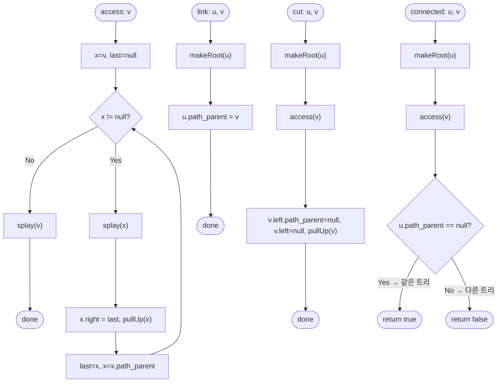

import { AlgorithmSimulation } from "#guide-sim";

# Link-Cut Tree 해설

## 성능 목표 예측

| 제약 항목 | 값 |
|-----------|-----|
| 노드 수 $n$ | $\leq 10^4$ |
| 질의 수 $q$ | $\leq 10^4$ |
| 노드 인덱스 | 0-기반: $0 \leq v < n$ |

**naive 접근의 문제점**: 동적 포레스트에서 `link`와 `cut`이 없다면 Union-Find로 $O(\alpha(n))$ 연결성 판단이 가능하다. 하지만 Union-Find는 간선 삭제(`cut`)를 지원하지 않는다. 간선 삭제를 지원하기 위해 단순히 인접 리스트를 유지하고 BFS/DFS로 연결성을 확인하면 `connected` 질의마다 $O(n)$이 된다. $q$번의 질의에서 총 $O(qn) = O(10^8)$으로 시간 초과 위험이 있다.

**목표 복잡도**: 세 연산 모두 분할 상환 $O(\log n)$. $O(q \log n) \approx 10^4 \times 14 \approx 1.4 \times 10^5$으로 충분히 빠르다.

**공간 복잡도**: $O(n)$. 노드당 상수 개의 포인터(left, right, parent, path\_parent, rev\_lazy)를 유지한다.

---

## 목표 함수

```ts
class LinkCutTree {
  constructor(n: number): LinkCutTree
  link(u: number, v: number): void
  cut(u: number, v: number): void
  connected(u: number, v: number): boolean
}
```

| 파라미터 | 의미 | 제약 |
|---------|------|------|
| `n` | 노드 개수 | $1 \leq n \leq 10^4$ |
| `u`, `v` (link) | 연결할 두 노드 | 서로 다른 트리에 있어야 함 |
| `u`, `v` (cut) | 간선을 제거할 두 노드 | 간선이 실제 존재해야 함 |
| `u`, `v` (connected) | 연결성을 확인할 두 노드 | $0 \leq u, v < n$ |

**반환값**: `connected`는 두 노드가 같은 연결 컴포넌트에 속하면 `true`를 반환한다.

**엣지케이스**:
1. 초기 상태에서 `connected(u, v)` ($u \neq v$) → `false` (모든 노드가 독립).
2. `link` 후 `cut`으로 원상복구 → `connected`는 다시 `false`.
3. `connected(u, u)` → 항상 `true`.
4. `link(u, v)` when already connected → 정의되지 않은 동작(호출자가 보장해야 함).
5. `cut(u, v)` when edge does not exist → 정의되지 않은 동작(호출자가 보장해야 함).

---

## 핵심 아이디어

**핵심 아이디어**: "동적으로 변하는 트리를 여러 수직 경로로 쪼개고, 각 경로를 Splay Tree로 관리하면 간선 추가/삭제와 연결성 확인을 모두 $O(\log n)$에 처리할 수 있다."

Union-Find는 간선 추가는 빠르지만 삭제를 지원하지 않는다. Link-Cut Tree는 원래 트리를 "선호 경로"들로 분해하고, 각 경로를 보조 Splay Tree로 표현한다. `access(v)` 연산으로 임의 노드에서 루트까지의 경로를 하나의 Splay Tree로 합칠 수 있으며, 이를 기반으로 간선 추가(`link`)와 삭제(`cut`), 연결성 확인(`connected`)을 분할 상환 $O(\log n)$에 수행한다.

**풀이 구조**
1. 각 노드에 left, right, parent, path\_parent, rev\_lazy 필드를 부여한다
2. `access(v)`: $v$에서 루트까지를 하나의 선호 경로(Splay Tree)로 통합한다
3. `makeRoot(v)`: `access(v)` 후 rev\_lazy로 경로를 반전시켜 $v$를 트리의 루트로 만든다
4. `link(u, v)`: `makeRoot(u)` 후 u.path\_parent를 $v$로 연결한다
5. `cut(u, v)` / `connected(u, v)`: `makeRoot(u)`, `access(v)` 후 Splay Tree 구조를 이용한다

**조건**: 포레스트에서 간선 추가(`link`)와 삭제(`cut`)가 동적으로 일어나면서 연결성 확인이 반복되는 상황

**대표 예시**: 동적 그래프 연결성 유지
온라인으로 간선이 추가·제거되는 네트워크에서 "노드 $u$와 $v$가 연결되어 있는가?"를 반복 질의할 때, BFS/DFS로는 질의마다 $O(n)$이 걸리지만 Link-Cut Tree로는 $O(\log n)$ 분할 상환이 보장된다. Kruskal 최소 신장 트리의 동적 버전, 동적 LCA 등에도 활용된다.

**언제 쓰나**
간선 삭제가 없다면 Union-Find가 훨씬 단순하므로, `cut` 연산이 반드시 필요한 동적 트리 문제에서만 Link-Cut Tree를 선택한다.

---

### 원형 아이디어와 naive 접근

동적 포레스트에서 연결성 변경(`link`, `cut`)을 지원하면서 $O(\log n)$ 연결성 확인이 필요하다. 가장 단순한 접근은 인접 리스트로 트리를 유지하고, `connected` 시 BFS/DFS로 경로를 탐색하는 것이다. 이는 $O(n)$으로 $q$회 질의 시 $O(qn)$이 된다.

**폭발 지점**: 동적 트리에서 `cut`을 지원하면 Union-Find의 $O(\alpha(n))$ 보장이 깨진다. 트리 구조를 보조 자료구조로 효율적으로 표현하는 새로운 아이디어가 필요하다.

### 어떤 관찰이 돌파구가 되는가

- **관찰 1**: 트리의 임의 경로를 "보조 자료구조(Splay Tree)"로 표현하면, 경로 위의 연산을 효율적으로 처리할 수 있다. 핵심은 각 트리를 여러 개의 수직 경로(path)들로 분해하는 것이다.
- **관찰 2**: 각 노드는 자식 중 최대 하나를 "선호 자식(preferred child)"으로 지정한다. 선호 자식으로 이어지는 경로들이 "선호 경로(preferred path)"를 이룬다. 이 경로들을 각각 하나의 Splay Tree로 표현하면 원래 트리가 여러 보조 Splay Tree들의 집합으로 분해된다.
- **관찰 3**: `access(v)` 연산으로 $v$에서 루트까지의 경로를 하나의 Splay Tree로 합칠 수 있다. 이 연산의 분할 상환 비용이 $O(\log n)$임이 핵심이다.

### 관찰을 형식화: 상태/구조 정의

각 노드 $v$는 다음 필드를 갖는다:

- `left`, `right`: 보조 Splay Tree의 왼쪽·오른쪽 자식 (깊이 기준 정렬)
- `parent`: 보조 Splay Tree 내의 부모 (같은 선호 경로 안)
- `path_parent`: 다른 보조 Splay Tree의 루트와 연결하는 "경로 부모" 포인터
- `rev_lazy`: 경로 방향 반전을 나타내는 지연 태그

이 형태여야 하는 근거: Splay Tree의 정렬 기준이 원래 트리에서의 "깊이"이므로, 경로 위의 최솟값/최댓값 깊이 노드(루트·끝)에 $O(\log n)$ 분할 상환으로 접근할 수 있다. `path_parent`를 통해 서로 다른 경로들이 원래 트리 구조를 재현한다.

### 점화식 또는 핵심 연산

**핵심 보조 연산 `access(v)`**:

$v$에서 원래 트리의 루트까지의 경로를 하나의 선호 경로로 만든다. 이를 위해 $v$에서 위로 올라가며 각 보조 Splay Tree를 합쳐 나간다.

```
access(v):
    last ← null
    x ← v
    while x ≠ null:
        splay(x)                   // x를 현재 보조 트리의 루트로
        x.right ← last             // 아래쪽 경로를 오른쪽 자식으로 연결
        pullUp(x)                  // size 등 집계 갱신
        last ← x
        x ← x.path_parent          // 상위 보조 트리로 이동
    splay(v)                       // v를 전체 경로의 Splay 트리 루트로
```

**`makeRoot(v)`**: `access(v)` 후 $v$를 원래 트리의 루트로 지정한다. 경로 방향 반전은 `rev_lazy` 태그로 처리한다.

**`link(u, v)`**:
```
makeRoot(u)                        // u를 u의 트리에서 루트로 만듦
u.path_parent ← v                  // u의 트리를 v에 연결
```

**`cut(u, v)`**:
```
makeRoot(u)
access(v)                          // u–v 경로가 하나의 Splay 트리에 포함됨
// 이 시점에서 v는 Splay 루트, u는 v의 왼쪽 자식
v.left.path_parent ← null
v.left ← null
pullUp(v)
```

**`connected(u, v)`**:
```
makeRoot(u)
access(v)
return find_root(u) == v           // u가 v의 Splay 트리에 속하면 연결
```

### 정당성 — 왜 이것이 옳은가

**분할 상환 $O(\log n)$ 분석**: `access(v)` 호출 시 선호 경로가 바뀌는 횟수(선호 에지 전환 수)의 분할 상환 비용을 퍼텐셜 함수로 분석하면 $O(\log n)$임이 증명된다(Sleator-Tarjan 1983). Splay 연산 자체도 $O(\log n)$ 분할 상환이므로, 전체 연산의 비용은 $O(\log n)$이다.

**불변식**: 모든 연산 전후에, 각 선호 경로를 하나의 Splay Tree가 깊이 순서로 표현한다는 불변식이 유지된다.

**까다로운 케이스**: `rev_lazy` 전파 순서가 잘못되면 Splay Tree의 정렬 순서가 뒤집혀 잘못된 결과가 나온다. `pushDown`에서 `rev_lazy`를 자식에게 전파하기 전에 현재 노드의 반전을 먼저 적용해야 한다. `cut`에서 간선이 존재하지 않으면 `v.left`가 null이어서 정의되지 않은 동작이 발생한다.

### 구현 디테일과 최적화

**isRoot 판별**: 노드 $x$가 자신의 보조 Splay Tree의 루트인지 확인하려면 `x.parent`가 null이거나, `x.parent.left != x && x.parent.right != x`이면 된다(후자는 `path_parent` 포인터로 연결된 경우).

**Splay 회전**: zig(단순 회전), zig-zig(같은 방향 두 번), zig-zag(다른 방향)의 세 경우를 구분하여 처리한다.

**함정**: `pushDown`을 `splay` 직전에 호출해야 한다. `rev_lazy`가 내려오지 않은 상태에서 left/right에 접근하면 잘못된 결과를 낸다.

---

## 시뮬레이션

노드 5개(`n=5`)의 동적 포레스트에서 `link`/`cut`/`connected` 연산 시퀀스를 수행하는 과정이다. 내부 Splay Tree 구조 대신, 이 연산들이 만들어 내는 **실제 포레스트의 연결 상태**를 graph 패널로 보여준다. 간선은 현재 연결된 (무향) 트리 간선이고, `nodeStatus`로 직전 연산에 관여한 노드를 강조한다(`active`). keyValue 패널은 연산과 그 결과다.

연산 시퀀스: `link(0,1)`, `link(1,2)`, `connected(0,2)`, `connected(0,3)`, `link(3,4)`, `cut(1,2)`, `connected(0,2)`. 마지막 `connected(0,2)`의 실제 반환값은 `false`(간선 1-2를 끊어 0과 2가 분리됨)이며, 마지막 프레임의 그래프 상태와 일치한다.

> 대화형 시뮬레이션은 MDX 런타임에서 표시됩니다.

export const nodes = [
  { id: 0, label: "0", x: 15, y: 30 },
  { id: 1, label: "1", x: 40, y: 30 },
  { id: 2, label: "2", x: 65, y: 30 },
  { id: 3, label: "3", x: 35, y: 75 },
  { id: 4, label: "4", x: 60, y: 75 },
];

export const steps = [
  {
    title: "초기 상태",
    detail: "모든 노드가 독립된 트리. 간선 없음.",
    nodes,
    edges: [],
    entries: [
      { label: "연산", value: "(초기화 n=5)" },
      { label: "포레스트", value: "{0} {1} {2} {3} {4}" },
    ],
  },
  {
    title: "link(0, 1)",
    detail: "makeRoot(0) 후 0.path_parent = 1. 0과 1이 한 트리가 된다.",
    nodes,
    edges: [{ from: 0, to: 1, directed: false }],
    nodeStatus: { 0: "active", 1: "active" },
    entries: [
      { label: "연산", value: "link(0, 1)" },
      { label: "포레스트", value: "{0,1} {2} {3} {4}" },
    ],
  },
  {
    title: "link(1, 2)",
    detail: "1과 2를 연결. 이제 0-1-2가 한 트리.",
    nodes,
    edges: [
      { from: 0, to: 1, directed: false },
      { from: 1, to: 2, directed: false },
    ],
    nodeStatus: { 1: "active", 2: "active" },
    entries: [
      { label: "연산", value: "link(1, 2)" },
      { label: "포레스트", value: "{0,1,2} {3} {4}" },
    ],
  },
  {
    title: "connected(0, 2) → true",
    detail: "makeRoot(0), access(2) 후 0이 2의 Splay 트리에 속함. 같은 트리.",
    nodes,
    edges: [
      { from: 0, to: 1, directed: false },
      { from: 1, to: 2, directed: false },
    ],
    nodeStatus: { 0: "active", 2: "active" },
    activeEdge: { from: 1, to: 2 },
    entries: [
      { label: "연산", value: "connected(0, 2)" },
      { label: "반환", value: "true" },
    ],
  },
  {
    title: "connected(0, 3) → false",
    detail: "3은 독립 트리. access 후 0이 3의 트리에 없음.",
    nodes,
    edges: [
      { from: 0, to: 1, directed: false },
      { from: 1, to: 2, directed: false },
    ],
    nodeStatus: { 0: "active", 3: "active" },
    entries: [
      { label: "연산", value: "connected(0, 3)" },
      { label: "반환", value: "false" },
    ],
  },
  {
    title: "link(3, 4)",
    detail: "3과 4를 연결. 별도의 두 번째 트리 형성.",
    nodes,
    edges: [
      { from: 0, to: 1, directed: false },
      { from: 1, to: 2, directed: false },
      { from: 3, to: 4, directed: false },
    ],
    nodeStatus: { 3: "active", 4: "active" },
    entries: [
      { label: "연산", value: "link(3, 4)" },
      { label: "포레스트", value: "{0,1,2} {3,4}" },
    ],
  },
  {
    title: "cut(1, 2)",
    detail: "makeRoot(1), access(2) 후 간선 1-2 제거. 2가 분리된다.",
    nodes,
    edges: [
      { from: 0, to: 1, directed: false },
      { from: 3, to: 4, directed: false },
    ],
    nodeStatus: { 1: "active", 2: "active" },
    entries: [
      { label: "연산", value: "cut(1, 2)" },
      { label: "포레스트", value: "{0,1} {2} {3,4}" },
    ],
  },
  {
    title: "connected(0, 2) → false (완료)",
    detail: "간선 1-2가 끊겨 0과 2는 다른 트리. 반환 false.",
    nodes,
    edges: [
      { from: 0, to: 1, directed: false },
      { from: 3, to: 4, directed: false },
    ],
    nodeStatus: { 0: "active", 2: "active" },
    entries: [
      { label: "연산", value: "connected(0, 2)" },
      { label: "반환", value: "false" },
    ],
  },
];

<AlgorithmSimulation view={["graph", "keyValue"]} steps={steps} title="Link-Cut Tree: 동적 포레스트 연결성" />

## 수도 코드와 Activity Diagram

### 의사코드

```
// 노드: { left, right, parent, path_parent, rev_lazy }
// 불변식: 각 보조 Splay Tree는 원래 트리의 선호 경로를 깊이 오름차순으로 표현한다

pushDown(x):
    if x.rev_lazy:
        swap(x.left, x.right)        // 경로 방향 반전
        if x.left:  x.left.rev_lazy  ^= true
        if x.right: x.right.rev_lazy ^= true
        x.rev_lazy = false

splay(x):
    // 경로 압축: x를 보조 Splay Tree의 루트로 올림
    // zig/zig-zig/zig-zag 회전, 각 회전 전에 pushDown 호출

access(v):
    last = null, x = v
    while x != null:
        splay(x)                     // 불변식: x가 자신의 보조 트리 루트
        x.right = last
        pullUp(x)
        last = x
        x = x.path_parent
    splay(v)

makeRoot(v):
    access(v)
    v.rev_lazy ^= true              // 경로 반전 태그로 v를 루트로 만듦

link(u, v):
    makeRoot(u)
    u.path_parent = v               // 불변식: u와 v가 서로 다른 트리에 있어야 함

cut(u, v):
    makeRoot(u)
    access(v)                       // v.left == u 상태
    v.left.path_parent = null
    v.left = null
    pullUp(v)

connected(u, v):
    makeRoot(u)
    access(v)
    return u.path_parent == null    // u가 v의 Splay 트리에 포함됨
    // 또는: find_root(u) == v
```

### Activity Diagram



**핵심 불변식**: 모든 연산 전후에, 원래 트리의 각 선호 경로를 하나의 보조 Splay Tree가 깊이 오름차순으로 정확하게 표현한다는 불변식이 유지되며, 이를 통해 $O(\log n)$ 분할 상환 비용이 보장된다.
