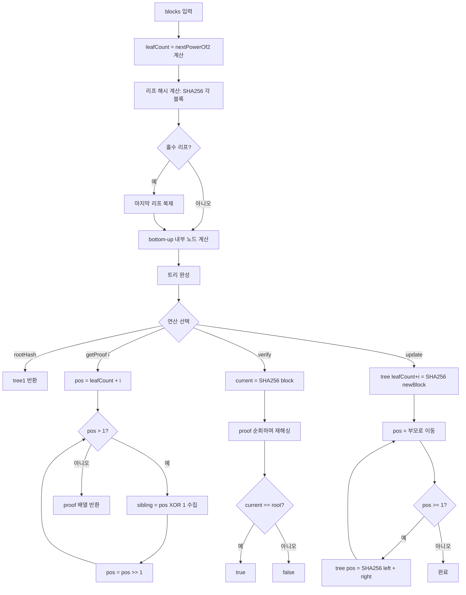

import { AlgorithmSimulation } from "#guide-sim";

# MerkleTree 해설

## 성능 목표 예측

| 연산 | 시간복잡도 | 공간복잡도 | 비고 |
|------|-----------|-----------|------|
| constructor | O(n) | O(n) | 리프 n개 → 내부 노드 n-1개 |
| rootHash | O(1) | O(1) | 루트 노드 직접 반환 |
| getProof | O(log n) | O(log n) | 트리 높이 = ceil(log2(n)) |
| verify | O(log n) | O(log n) | proof 배열 순회 |
| update | O(log n) | O(1) | 조상 체인만 재계산 |

---

## 목표 함수

| 함수 | 시그니처 | 설명 |
|------|---------|------|
| constructor | `(blocks: string[]) => void` | 블록 배열로 트리 구성 |
| rootHash | `() => string` | 루트 해시 반환 |
| getProof | `(index: number) => string[]` | sibling 해시 배열 반환 |
| verify | `(index, block, proof) => boolean` | 포함 증명 검증 |
| update | `(index, newBlock) => void` | 블록 갱신 및 해시 재계산 |

---

## 핵심 아이디어

### 원형 아이디어와 naive 접근
가장 단순한 무결성 검증은 전체 블록 배열을 한꺼번에 해싱하는 것이다. 이 경우 단일 블록 검증에 O(n) 데이터가 필요하다. n이 수천 개의 트랜잭션이라면 경량 노드에게 치명적이다.

### 어떤 관찰이 돌파구가 되는가
이진 트리의 높이는 O(log n)이다. 트리 구조를 사용하면 루트 해시 하나로 n개 블록 전체를 요약하면서, 단일 블록 검증에는 루트까지의 경로상 형제 노드 해시들만 (O(log n)개) 있으면 충분하다.

### 관찰을 형식화: 상태/구조 정의
완전 이진 트리로 배열에 매핑한다. 노드 인덱스를 1-based로 정할 때:
- 루트: 인덱스 1
- 노드 i의 왼쪽 자식: 2i, 오른쪽 자식: 2i+1
- 노드 i의 부모: floor(i/2)

리프 수를 2의 거듭제곱으로 패딩하면 배열 인덱싱이 일관된다. 홀수 리프는 마지막을 복제한다.

### 핵심 연산

**트리 구성 (bottom-up)**
```
leafCount = 다음 2의 거듭제곱 (n 이상)
tree = 크기 2*leafCount 배열
tree[leafCount + i] = SHA256(blocks[i])  // 리프
tree[leafCount + n .. 2*leafCount-1] = 마지막 리프 복제
for i = leafCount-1 downto 1:
  tree[i] = SHA256(tree[2i] + tree[2i+1])
```

**증명 수집 (getProof)**
```
pos = leafCount + index
path = []
while pos > 1:
  sibling = pos XOR 1  // 형제 노드 인덱스
  path.push(tree[sibling])
  pos = floor(pos / 2)
return path
```

**검증 (verify)**
```
current = SHA256(block)
pos = leafCount + index
for each sibling_hash in proof:
  if pos % 2 == 0:  // 왼쪽 자식
    current = SHA256(current + sibling_hash)
  else:             // 오른쪽 자식
    current = SHA256(sibling_hash + current)
  pos = floor(pos / 2)
return current == rootHash()
```

**갱신 (update)**
```
pos = leafCount + index
tree[pos] = SHA256(newBlock)
pos = floor(pos / 2)
while pos >= 1:
  tree[pos] = SHA256(tree[2*pos] + tree[2*pos+1])
  pos = floor(pos / 2)
```

### 정당성
해시 함수의 단방향성과 충돌 저항성 덕분에, 루트 해시는 모든 리프의 변경에 민감하게 반응한다. 증명 경로는 루트에서 리프까지의 유일한 경로이므로, 올바른 증명은 오직 실제 포함된 블록에서만 생성할 수 있다.

### 구현 디테일과 최적화
- **배열 표현**: 포인터 없이 1-based 인덱스 배열로 완전 이진 트리를 표현하면 캐시 친화적이다.
- **패딩**: 홀수 리프 복제 대신 홀수 노드를 자기 자신과 해싱해도 동일하다. 비트코인은 후자를 사용한다.
- **XOR 트릭**: `pos XOR 1`은 짝수면 +1, 홀수면 -1로 형제 노드를 O(1)에 찾는다.

---

## 시뮬레이션

export const steps = [
  {
    title: "리프 해시 계산",
    detail: "각 블록을 SHA-256으로 해싱해 리프 노드를 만든다.",
    array: ["SHA256(tx1)", "SHA256(tx2)", "SHA256(tx3)", "SHA256(tx4)"],
    highlight: [0, 1, 2, 3],
    marked: [],
  },
  {
    title: "레벨 1 내부 노드 계산",
    detail: "인접한 두 리프 해시를 이어붙여 해싱한다: H(h1+h2), H(h3+h4)",
    array: ["H(h1+h2)", "H(h3+h4)", "SHA256(tx1)", "SHA256(tx2)", "SHA256(tx3)", "SHA256(tx4)"],
    highlight: [0, 1],
    marked: [2, 3, 4, 5],
  },
  {
    title: "루트 해시 계산",
    detail: "두 내부 노드를 이어붙여 최종 루트 해시를 생성한다.",
    array: ["ROOT", "H(h1+h2)", "H(h3+h4)", "SHA256(tx1)", "SHA256(tx2)", "SHA256(tx3)", "SHA256(tx4)"],
    highlight: [0],
    marked: [1, 2, 3, 4, 5, 6],
  },
  {
    title: "getProof(0) — tx1의 증명 수집",
    detail: "tx1(인덱스 0)에서 루트까지: 형제 SHA256(tx2), 형제 H(h3+h4) 수집",
    array: ["ROOT", "H(h1+h2)", "H(h3+h4)", "SHA256(tx1)", "SHA256(tx2)", "SHA256(tx3)", "SHA256(tx4)"],
    highlight: [4, 2],
    marked: [3],
  },
  {
    title: "verify(0, 'tx1', proof) — 증명 검증",
    detail: "H(SHA256(tx1) + proof[0]) → H(결과 + proof[1]) == ROOT → true",
    array: ["ROOT ✓", "H(h1+h2)", "H(h3+h4)", "SHA256(tx1)", "SHA256(tx2)", "SHA256(tx3)", "SHA256(tx4)"],
    highlight: [0],
    marked: [3, 4, 2],
  },
];

<AlgorithmSimulation view="array" steps={steps} title="MerkleTree 시뮬레이션 (4개 블록)" />

---

## 수도 코드와 Activity Diagram

### 의사코드

```
MerkleTree.constructor(blocks):
  n = blocks.length
  leafCount = nextPowerOf2(n)
  tree = new Array(2 * leafCount).fill("")

  for i = 0 to n-1:
    tree[leafCount + i] = SHA256(blocks[i])
  for i = n to leafCount-1:          // 홀수 패딩
    tree[leafCount + i] = tree[leafCount + n - 1]

  for i = leafCount-1 downto 1:
    tree[i] = SHA256(tree[2i] + tree[2i+1])

MerkleTree.getProof(index):
  pos = leafCount + index
  proof = []
  while pos > 1:
    proof.push(tree[pos XOR 1])
    pos = pos >> 1
  return proof

MerkleTree.verify(index, block, proof):
  current = SHA256(block)
  pos = leafCount + index
  for hash in proof:
    if pos % 2 == 0:
      current = SHA256(current + hash)
    else:
      current = SHA256(hash + current)
    pos = pos >> 1
  return current == tree[1]

MerkleTree.update(index, newBlock):
  pos = leafCount + index
  tree[pos] = SHA256(newBlock)
  pos = pos >> 1
  while pos >= 1:
    tree[pos] = SHA256(tree[2*pos] + tree[2*pos+1])
    pos = pos >> 1
```

### Activity Diagram


