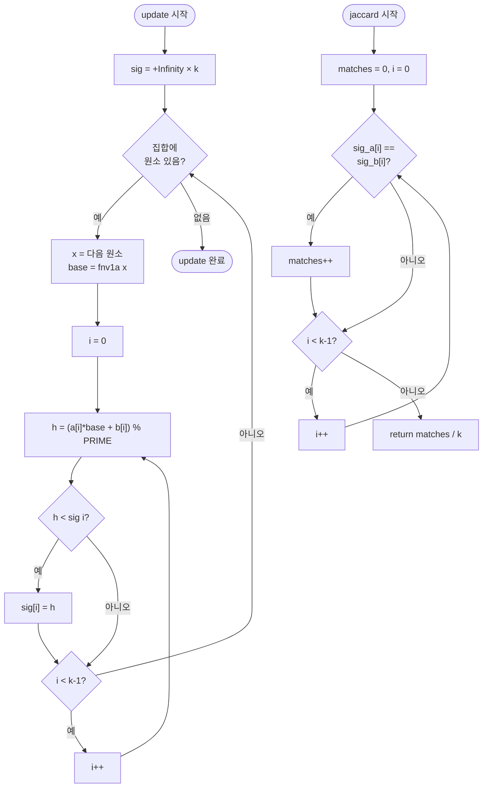

import { AlgorithmSimulation } from "#guide-sim";

# MinHash 해설

## 성능 목표 예측

| 연산 | 시간복잡도 | 공간복잡도 | 설명 |
|------|-----------|-----------|------|
| `update` | O(n × k) | O(k) | n = 집합 크기, k = numHashes |
| `signature` | O(k) | O(k) | 서명 배열 복사 |
| `jaccard` | O(k) | O(1) | 서명 원소 비교 |
| `exact` | O(n + m) | O(n + m) | 두 집합 합집합 크기 계산 |

---

## 목표 함수

| 메서드 | 입력 | 출력 | 보장 |
|--------|------|------|------|
| `update(set)` | `Iterable<string>` | `void` | 순서 무관, 동일 집합 → 동일 서명 |
| `signature()` | — | `number[]` (길이 k) | 모든 값 유한, ≥ 0 |
| `jaccard(a, b)` | 두 MinHash | `[0,1]` | 불편 추정량 |
| `exact(a, b)` | 두 Set | `[0,1]` | `|A∩B|/|A∪B|` |

---

## 핵심 아이디어

### 원형 아이디어와 naive 접근

두 집합의 Jaccard를 구하는 가장 단순한 방법은 교집합과 합집합을 직접 구하는 것이다. 하지만 수백만 개의 집합을 쌍으로 비교하면 계산량이 폭발한다. 집합 자체를 저장하는 메모리도 문제다.

목표: 집합을 훨씬 작은 숫자 배열로 압축하되, 그 배열만으로 Jaccard를 근사할 수 있게 한다.

### 어떤 관찰이 돌파구가 되는가

**핵심 통찰 (MinHash Lemma):**

집합 A, B의 원소를 모두 하나의 전체 집합 U로 보고, 무작위 순열 π를 U에 적용한다고 상상하자. π(A)와 π(B)에서 각각 가장 앞에 오는 원소(최솟값)를 뽑는다.

```
P[min(π(A)) == min(π(B))] = |A ∩ B| / |A ∪ B| = J(A, B)
```

왜냐하면, π를 적용했을 때 가장 앞에 오는 원소가 A∪B에서 뽑힌다고 할 때, 그것이 A∩B에 속할 확률이 정확히 J(A, B)이기 때문이다.

무작위 순열 대신 **무작위 해시 함수**로 시뮬레이션할 수 있다. `min(h(A))`는 A의 원소에 h를 적용한 값 중 최솟값이다.

### 관찰을 형식화: 상태/구조 정의

```
MinHash 서명:
  sig = [min₁, min₂, ..., minₖ]
  minᵢ = min({ hᵢ(x) | x ∈ set })

해시 함수族 (Universal Hashing):
  hᵢ(x) = (aᵢ * baseHash(x) + bᵢ) % PRIME

  aᵢ, bᵢ: i번째 해시의 고정 상수 (생성자에서 결정)
  PRIME: 큰 소수 (예: 2^31 - 1 = 2147483647)
  baseHash: FNV-1a 등 결정론적 문자열 해시
```

### 점화식 또는 핵심 연산

**update(set) 핵심 연산:**

```
for each i in 0..k-1:
  sig[i] = +Infinity

for each element x in set:
  base = fnv1a(x)
  for each i in 0..k-1:
    h = (a[i] * base + b[i]) % PRIME
    sig[i] = min(sig[i], h)
```

내부 루프 순서를 뒤집으면(원소 먼저, 해시 함수 나중) 원소당 baseHash를 한 번만 계산할 수 있어 효율적이다.

**jaccard(a, b) 핵심 연산:**

```
matches = 0
for each i in 0..k-1:
  if a.sig[i] == b.sig[i]: matches++
return matches / k
```

### 정당성 — 왜 이것이 옳은가

k개의 해시 함수가 독립적이라 가정하면, 각 `sig[i]`가 일치할 확률은 J(A, B)이다. k번의 독립 베르누이 시행의 평균은 J(A, B)의 불편 추정량이다. 분산은 `J(1-J)/k`이므로 k가 클수록 정확해진다.

**표준 오차** = `sqrt(J(1-J)/k)` ≤ `1/(2*sqrt(k))`

k=128일 때 최대 표준 오차 ≈ 0.044 (평균 오차 약 4.4%)

### 구현 디테일과 최적화

1. **FNV-1a 해시**: 문자열을 바이트 단위로 처리하는 빠른 비암호학적 해시. JavaScript에서는 32비트 정수 연산으로 구현한다.
2. **상수 미리 계산**: `a[]`, `b[]` 배열을 생성자에서 sfc32(seeded PRNG)로 생성해 저장한다.
3. **루프 최적화**: 원소별로 baseHash를 한 번 계산하고, k개의 hᵢ를 한 번에 갱신한다.
4. **빈 집합 처리**: update([]) 시 sig는 모두 Infinity로 유지. jaccard 계산 시 두 Infinity는 같은 값으로 취급될 수 있으나, 수학적 관례에 따라 두 빈 집합의 Jaccard = 1로 정의한다.

---

## 시뮬레이션

export const steps = [
  {
    title: "초기 상태 (k=4)",
    detail: "4개의 해시 함수 h0~h3. 서명 배열을 +∞로 초기화한다.",
    array: [9999, 9999, 9999, 9999],
    highlight: [],
    marked: [],
  },
  {
    title: "원소 'apple' 처리",
    detail: "fnv1a('apple')을 계산하고 h0~h3에 적용. 결과: [73, 41, 92, 18]. 각각 Infinity보다 작으므로 서명 갱신.",
    array: [73, 41, 92, 18],
    highlight: [0, 1, 2, 3],
    marked: [],
  },
  {
    title: "원소 'banana' 처리",
    detail: "h0('banana')=55, h1('banana')=88, h2('banana')=31, h3('banana')=62. sig = min씩 비교.",
    array: [55, 41, 31, 18],
    highlight: [0, 2],
    marked: [1, 3],
  },
  {
    title: "원소 'cherry' 처리",
    detail: "h0=80, h1=22, h2=45, h3=10. sig = [55, 22, 31, 10].",
    array: [55, 22, 31, 10],
    highlight: [1, 3],
    marked: [0, 2],
  },
  {
    title: "집합 A 서명 완료: [55, 22, 31, 10]",
    detail: "집합 A = {'apple', 'banana', 'cherry'}의 MinHash 서명이 확정되었다.",
    array: [55, 22, 31, 10],
    highlight: [],
    marked: [0, 1, 2, 3],
  },
  {
    title: "집합 B 서명: [55, 44, 31, 99]",
    detail: "집합 B = {'apple', 'cherry', 'durian'}의 서명. h0=55, h1=44, h2=31, h3=99.",
    array: [55, 44, 31, 99],
    highlight: [],
    marked: [0, 2],
  },
  {
    title: "Jaccard 추정: 서명 비교",
    detail: "A=[55,22,31,10], B=[55,44,31,99]. 인덱스 0,2에서 일치 → 2/4 = 0.5. 실제 Jaccard = 2/4 = 0.5 (우연히 정확 일치).",
    array: [1, 0, 1, 0],
    highlight: [0, 2],
    marked: [0, 2],
  },
];

<AlgorithmSimulation view="array" steps={steps} title="MinHash 시뮬레이션 (k=4 해시 함수)" />

## 수도 코드와 Activity Diagram

### 의사코드

```
PRIME = 2^31 - 1

class MinHash(numHashes):
  k    = numHashes
  a[k] = [무작위 홀수 정수 k개]
  b[k] = [무작위 정수 k개]
  sig  = [+Infinity] × k

  update(set):
    sig = [+Infinity] × k
    for each x in set:
      base = fnv1a(x)
      for i in 0..k-1:
        h = (a[i] * base + b[i]) % PRIME
        if h < sig[i]: sig[i] = h

  signature():
    return sig.slice()

  static jaccard(a, b):
    assert a.k == b.k
    matches = 0
    for i in 0..k-1:
      if a.sig[i] == b.sig[i]: matches++
    return matches / k

  static exact(a, b):
    if a.size == 0 and b.size == 0: return 1
    union = a ∪ b
    inter = a ∩ b
    return |inter| / |union|
```

### Activity Diagram


