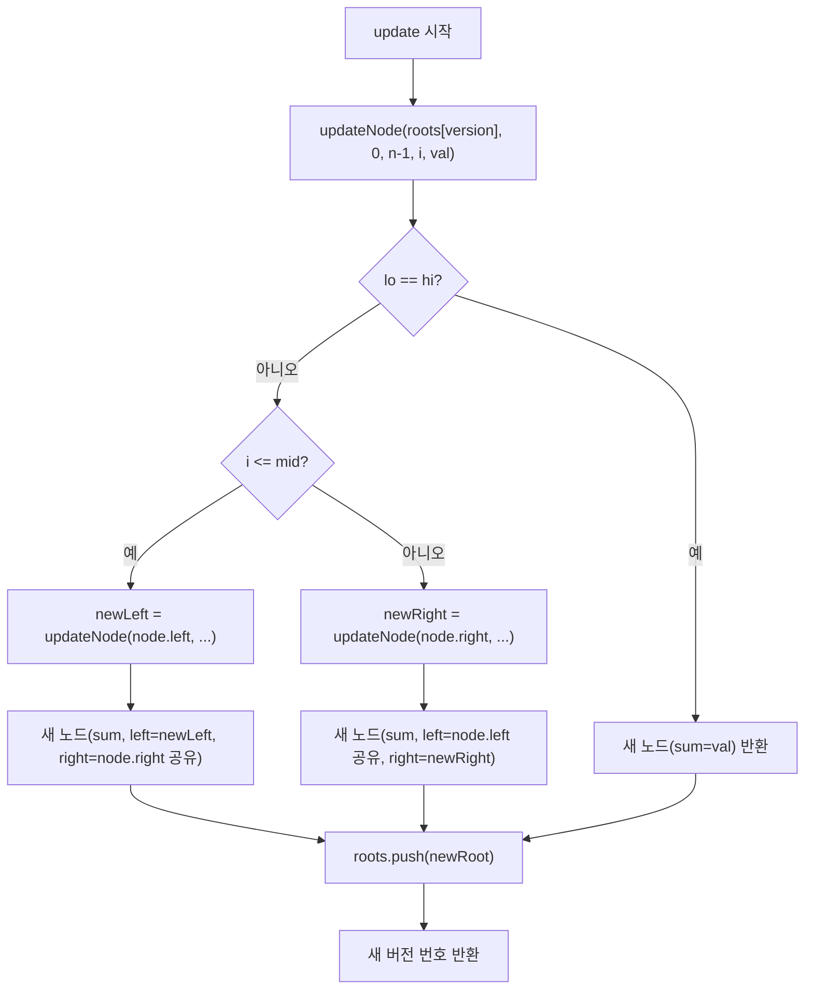
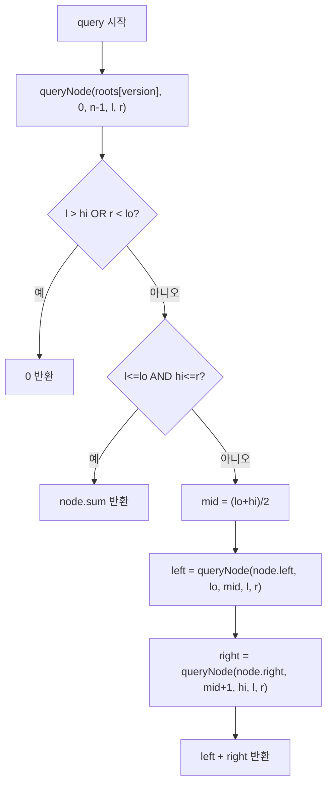

import { AlgorithmSimulation } from "#guide-sim";

# PersistentSegmentTree (영속 세그먼트 트리) 해설

## 성능 목표 예측

| 연산 | 일반 세그먼트 트리 | 영속 세그먼트 트리 | 비고 |
|------|-----------------|-----------------|------|
| 초기 구성 | O(n) | O(n) | 동일 |
| update | O(log n) | O(log n) | 새 노드 생성 추가 |
| query | O(log n) | O(log n) | 동일 |
| 과거 버전 접근 | O(n) 복사 필요 | O(1) 루트 포인터 | 핵심 차이 |
| 버전당 추가 공간 | O(n) | O(log n) | **핵심 최적화** |
| 총 공간 (v버전) | O(n·v) | O(n + v·log n) | 대규모 이력에서 압도적 절약 |

---

## 목표 함수

| 메서드 | 시그니처 | 설명 |
|--------|---------|------|
| `constructor` | `(arr: number[])` | 초기 배열로 버전 0 구성 |
| `update` | `(version, i, val): number` | 새 버전 생성 후 버전 번호 반환 |
| `query` | `(version, l, r): number` | 특정 버전의 구간 합 |
| `versionCount` | `(): number` | 총 버전 수 |

---

## 핵심 아이디어

### 원형 아이디어와 naive 접근

"과거 버전의 구간 합을 질의하고 싶다"는 요구사항을 가장 단순하게 구현하면:

```ts
// 매 버전마다 전체 배열을 복사
const versions: number[][] = [initialArr.slice()];

function update(version: number, i: number, val: number): number {
  const newArr = versions[version].slice(); // O(n) 복사
  newArr[i] = val;
  versions.push(newArr);
  return versions.length - 1;
}
```

이 방법은 버전당 O(n) 공간을 사용합니다. 업데이트가 1000번이면 O(1000n) 공간이 필요합니다.

### 어떤 관찰이 돌파구가 되는가

세그먼트 트리에서 인덱스 하나를 업데이트할 때, 실제로 값이 바뀌는 노드는 **루트에서 해당 리프까지의 경로**, 즉 O(log n)개뿐입니다. 나머지 O(n)개의 노드는 이전 버전과 동일합니다.

변경된 노드만 새로 만들고, 변경되지 않은 서브트리는 이전 버전과 **포인터를 공유**하면 됩니다.

### 관찰을 형식화

**경로 복사(Path Copying)** 기법:

```
arr = [1, 2, 3, 4]의 세그먼트 트리 (버전 0):

               [sum=10]          ← 루트
              /         \
         [sum=3]       [sum=7]
         /    \         /    \
       [1]   [2]     [3]   [4]

update(0, index=1, val=20) → 버전 1:

               [sum=28]  ← 새 노드
              /         \
         [sum=21]      [sum=7] ← 공유 (변경 없음)
         /    \
       [1]  [20]        ← [1]: 공유, [20]: 새 노드

버전 0의 [sum=10], [sum=3], [2]는 여전히 버전 0에서 접근 가능
새로 생성된 노드: 3개 = O(log n)
```

### 핵심 연산

**초기 구성 (build):**

```ts
function build(arr: number[], lo: number, hi: number): SegNode {
  if (lo === hi) return { sum: arr[lo], left: null, right: null };
  const mid = (lo + hi) >> 1;
  const left = build(arr, lo, mid);
  const right = build(arr, mid + 1, hi);
  return { sum: left.sum + right.sum, left, right };
}
// roots[0] = build(arr, 0, n-1)
```

**update (경로 복사):**

```ts
function updateNode(
  node: SegNode | null, lo: number, hi: number,
  i: number, val: number
): SegNode {
  if (lo === hi) return { sum: val, left: null, right: null };
  const mid = (lo + hi) >> 1;
  if (i <= mid) {
    const newLeft = updateNode(node!.left, lo, mid, i, val);
    return { sum: newLeft.sum + node!.right!.sum, left: newLeft, right: node!.right };
  } else {
    const newRight = updateNode(node!.right, mid + 1, hi, i, val);
    return { sum: node!.left!.sum + newRight.sum, left: node!.left, right: newRight };
  }
}
// update(version, i, val):
//   const newRoot = updateNode(roots[version], 0, n-1, i, val)
//   roots.push(newRoot)
//   return roots.length - 1
```

### 정당성

**영속성 보장:** 기존 노드는 절대 수정하지 않습니다. 새 노드를 생성하여 기존 서브트리를 참조만 합니다. 따라서 `roots[0]`에서 시작하는 버전 0 트리는 어떤 업데이트를 해도 항상 동일한 상태를 유지합니다.

**구간 합 정확성:** 각 노드의 `sum`은 자식 노드의 합이므로, 경로 복사 후에도 새 경로의 모든 조상 노드의 `sum`이 올바르게 계산됩니다.

### 구현 디테일과 최적화

1. **roots 배열**: 각 버전의 루트 노드를 포인터로 보관. `roots[v]`에서 버전 v 트리에 O(1) 접근.
2. **노드 공유**: 변경되지 않은 서브트리는 참조만 복사하므로 추가 메모리 없음.
3. **null 안전**: `noUncheckedIndexedAccess`가 활성화된 환경에서 타입 가드 필요.
4. **정수 중간값**: `mid = (lo + hi) >> 1`로 성능 향상.

---

## 시뮬레이션

export const steps = [
  {
    title: "초기 배열 [1, 2, 3, 4] — 버전 0 구성",
    detail: "루트 sum=10, 왼쪽 자식 sum=3 (1+2), 오른쪽 자식 sum=7 (3+4). 리프: [1],[2],[3],[4]",
    array: [10, 3, 7, 1, 2, 3, 4],
    highlight: [0, 1, 2, 3, 4, 5, 6],
    marked: [],
  },
  {
    title: "update(0, index=1, val=20) — 변경 경로 추적",
    detail: "index=1은 왼쪽 서브트리(0~1)에 있음. 루트 → 왼쪽 자식 → [2] 리프 경로가 변경됨. 오른쪽 자식 sum=7은 공유.",
    array: [10, 3, 7, 1, 2, 3, 4],
    highlight: [0, 1, 4],
    marked: [1, 4],
  },
  {
    title: "버전 1 생성 — 새 노드 3개",
    detail: "새 루트 sum=28, 새 왼쪽 자식 sum=21, 새 [20] 리프. [1] 리프와 오른쪽 서브트리는 버전 0과 공유.",
    array: [28, 21, 7, 1, 20, 3, 4],
    highlight: [0, 1, 4],
    marked: [0, 1, 4],
  },
  {
    title: "query(0, 0, 3) — 버전 0 전체 구간",
    detail: "roots[0]에서 시작. 루트 sum=10 반환. 버전 0은 update에 영향받지 않음.",
    array: [10, 3, 7, 1, 2, 3, 4],
    highlight: [0],
    marked: [0],
  },
  {
    title: "query(1, 0, 3) — 버전 1 전체 구간",
    detail: "roots[1]에서 시작. 새 루트 sum=28 반환. 1+20+3+4=28.",
    array: [28, 21, 7, 1, 20, 3, 4],
    highlight: [0],
    marked: [0],
  },
];

<AlgorithmSimulation view="array" steps={steps} title="영속 세그먼트 트리 — 경로 복사" />

---

## 수도 코드와 Activity Diagram

### 의사코드

```
PersistentSegmentTree.constructor(arr):
  n ← arr.length
  roots[0] ← build(arr, 0, n-1)

build(arr, lo, hi):
  if lo == hi: return 노드(sum=arr[lo])
  mid ← (lo + hi) / 2
  left  ← build(arr, lo, mid)
  right ← build(arr, mid+1, hi)
  return 노드(sum=left.sum + right.sum, left, right)

PersistentSegmentTree.update(version, i, val):
  newRoot ← updateNode(roots[version], 0, n-1, i, val)
  roots.push(newRoot)
  return roots.length - 1

updateNode(node, lo, hi, i, val):
  if lo == hi: return 새 노드(sum=val)
  mid ← (lo + hi) / 2
  if i <= mid:
    newLeft ← updateNode(node.left, lo, mid, i, val)
    return 새 노드(sum=newLeft.sum + node.right.sum, left=newLeft, right=node.right)
  else:
    newRight ← updateNode(node.right, mid+1, hi, i, val)
    return 새 노드(sum=node.left.sum + newRight.sum, left=node.left, right=newRight)

PersistentSegmentTree.query(version, l, r):
  return queryNode(roots[version], 0, n-1, l, r)

queryNode(node, lo, hi, l, r):
  if l > hi or r < lo: return 0
  if l <= lo and hi <= r: return node.sum
  mid ← (lo + hi) / 2
  return queryNode(node.left, lo, mid, l, r)
       + queryNode(node.right, mid+1, hi, l, r)
```

### Activity Diagram




