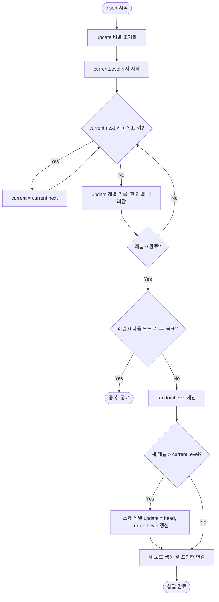

import { AlgorithmSimulation } from "#guide-sim";

# Skip List 해설

## 성능 목표 예측

| 연산 | 기대 시간복잡도 | 공간복잡도 |
|------|----------------|-----------|
| `insert` | $O(\log n)$ | $O(\log n)$ (새 노드의 포인터 배열) |
| `search` | $O(\log n)$ | $O(1)$ |
| `delete` | $O(\log n)$ | $O(\log n)$ (update 배열) |
| `toArray` | $O(n)$ | $O(n)$ |
| 전체 공간 | — | $O(n)$ 기대값 (레벨당 절반으로 줄어듦) |

p=0.5이면 레벨 k에 포함될 노드 수의 기대값은 n/2^k이다. 전체 포인터 수의 합은 기하급수 합산으로 $O(n)$. 탐색 비교 횟수의 기대값은 $O(\log n)$이며, 이는 역방향으로 진행 경로를 분석하는 backwards analysis로 엄밀하게 증명된다.

---

## 목표 함수

| 메서드 | 시그니처 | 엣지 케이스 |
|--------|---------|------------|
| `insert` | `(key: number): void` | 중복 키 → 무시 |
| `search` | `(key: number): boolean` | 빈 리스트 → `false` |
| `delete` | `(key: number): void` | 없는 키 → 무시; 삭제 후 최고 레벨 갱신 |
| `toArray` | `(): number[]` | 빈 리스트 → `[]` |

---

## 핵심 아이디어

스킵 리스트의 본질은 **계층적 고속 도로**다. 레벨 0은 모든 키를 포함하는 완전한 정렬 연결 리스트이고, 레벨 k는 레벨 k-1의 약 절반 노드만 포함한다. 탐색할 때 높은 레벨에서 큰 폭으로 뛰어넘고, 목표에 가까워지면 낮은 레벨로 내려가 세밀하게 찾는다 — 마치 고속도로에서 인터체인지를 통해 국도로 빠져나가는 것과 같다.

---

### 원형 아이디어와 naive 접근

정렬된 데이터를 빠르게 검색하는 가장 단순한 방법은 **정렬 배열**과 이진 탐색이다. 검색은 O(log n)이지만 삽입·삭제에서 O(n) 이동이 필요하다.

**정렬 연결 리스트**는 삽입·삭제를 O(1)로 줄이지만, 이진 탐색이 불가능해 검색이 O(n)이 된다. 연결 리스트에서 임의 접근이 안 되기 때문이다.

---

### 어떤 관찰이 돌파구가 되는가

"연결 리스트에서도 중간 지점으로 빠르게 뛰어넘을 수 있다면?" 이 질문이 돌파구다.

n개의 노드 중 n/2번째마다 '익스프레스 포인터'를 두면 레벨 1에서 최대 n/2번 이동으로 탐색 범위를 좁힌다. 거기서 다시 n/4번째마다 포인터를 두면... 이를 반복하면 log n 레벨 후 O(log n) 검색이 완성된다. 이것이 **결정론적 스킵 리스트**의 아이디어다.

문제는 삽입·삭제마다 익스프레스 포인터를 재조정해야 한다는 것. 이를 **확률적으로** 해결한다 — 새 노드를 삽입할 때 동전을 던져 상위 레벨 포함 여부를 결정하면, 평균적으로 n/2^k 개의 노드가 레벨 k에 들어가 균형이 유지된다.

---

### 관찰을 형식화: 상태/구조 정의

```
Node {
  key:   number
  next:  Node[]   // next[i] = 레벨 i에서의 다음 노드
}

SkipList {
  head:         Node          // 파수꾼 노드, key = -Infinity
  currentLevel: number        // 현재 사용 중인 최고 레벨 (0-indexed)
  MAX_LEVEL:    16
  p:            0.5
}
```

**파수꾼(sentinel) 노드**는 실제 키보다 항상 작은 값을 가져서 "찾으려는 키보다 작으면 앞으로 전진"하는 탐색 로직을 단순하게 만든다. 별도의 null 체크 없이 head에서 탐색을 시작할 수 있다.

---

### 점화식 또는 핵심 연산

**randomLevel()**: p=0.5 베르누이 시행의 연속. 기대 레벨 = 1/(1-p) = 2이며, MAX_LEVEL로 상한을 제한한다.

```
function randomLevel():
  level = 1
  while random() < p AND level < MAX_LEVEL:
    level += 1
  return level
```

**update 배열**: 삽입/삭제 모두에 쓰이는 핵심 보조 구조. `update[i]`는 레벨 i에서 목표 위치의 바로 직전(predecessor) 노드를 가리킨다.

```
// update 배열 구성 (insert와 delete 공통)
current = head
for i = currentLevel downto 0:
  while current.next[i] != null AND current.next[i].key < key:
    current = current.next[i]
  update[i] = current
```

**삽입 후 포인터 연결**:
```
newNode = Node(key, randomLevel())
for i = 0 to newNode.level - 1:
  newNode.next[i] = update[i].next[i]
  update[i].next[i] = newNode
```

**삭제 시 포인터 우회**:
```
for i = 0 to currentLevel:
  if update[i].next[i] != target: break
  update[i].next[i] = target.next[i]
```

---

### 정당성 — 왜 이것이 옳은가

**탐색 정확성**: 레벨 0에는 모든 키가 정렬 순서로 있고, 각 상위 레벨의 포인터는 항상 레벨 0 순서를 유지한다. update 배열 구성 로직이 "내 다음 노드의 키 < 목표 키"인 한 전진하므로, 레벨 0에서 멈추는 시점의 다음 노드가 목표이거나 그보다 크다. 이 불변식이 유지되는 한 검색 결과는 항상 정확하다.

**O(log n) 기대값**: backwards analysis를 적용한다. 탐색 역방향 경로를 따라가면, 각 단계에서 "레벨 올라가기(확률 p)" 또는 "왼쪽 전진(확률 1-p)" 중 하나다. 레벨 h에서 왼쪽 끝(head)까지 도달하는 기대 비용 C(h)는 다음 점화식을 만족한다:

```
C(0) = 0
C(h) = (1-p) * (C(h) + 1) + p * (C(h-1) + 1)
      => C(h) = 1/p + C(h-1)
      => C(h) = h/p
```

MAX_LEVEL = log_{1/p}(n)으로 설정하면 C = O(log n).

---

### 구현 디테일과 최적화

1. **currentLevel 관리**: 삽입 시 새 노드의 레벨이 currentLevel을 초과하면 초과 레벨의 update를 head로 설정하고 currentLevel을 올린다. 삭제 시 최고 레벨의 head.next가 null이 되면 currentLevel을 줄인다.

2. **타입스크립트에서 null vs sentinel**: `next[i]`가 null인지 매번 확인하는 대신, tail sentinel 노드(key = +Infinity)를 두면 null 체크를 제거할 수 있다. 단, 여기서는 null 체크 방식이 더 직관적이다.

3. **동시성(참고용)**: lock-free 스킵 리스트는 `next` 포인터를 `AtomicReference`로 만들고, 삭제 시 논리적 삭제 마킹(mark bit)을 먼저 한 뒤 물리적으로 포인터를 수정한다. Java의 `ConcurrentSkipListMap`이 이 방식을 사용한다.

---

## 시뮬레이션

export const steps = [
  {
    array: [],
    highlight: [],
    description: "초기 상태: 빈 스킵 리스트"
  },
  {
    array: [3],
    highlight: [0],
    description: "insert(3): 레벨 0에 3 삽입"
  },
  {
    array: [1, 3],
    highlight: [0],
    description: "insert(1): 1이 3보다 작으므로 앞에 삽입"
  },
  {
    array: [1, 3, 5],
    highlight: [2],
    description: "insert(5): 5가 3보다 크므로 뒤에 삽입"
  },
  {
    array: [1, 3, 5],
    highlight: [1],
    description: "search(3): 레벨 0에서 3 발견 → true"
  },
  {
    array: [3, 5],
    highlight: [],
    description: "delete(1): 1 제거 후 레벨 0 = [3, 5]"
  }
];

<AlgorithmSimulation
  view="array"
  steps={steps}
  title="Skip List 시뮬레이션 (레벨 0 기준)"
/>

---

## 수도 코드와 Activity Diagram

### 의사코드

```
class SkipList:
  head = Node(-Infinity, MAX_LEVEL)
  currentLevel = 0

  randomLevel():
    level = 1
    while random() < 0.5 AND level < MAX_LEVEL:
      level++
    return level

  insert(key):
    update = array of MAX_LEVEL
    current = head
    for i = currentLevel downto 0:
      while current.next[i] != null AND current.next[i].key < key:
        current = current.next[i]
      update[i] = current
    // 중복 확인
    if current.next[0] != null AND current.next[0].key == key:
      return
    // 새 노드 삽입
    newLevel = randomLevel()
    if newLevel > currentLevel:
      for i = currentLevel+1 to newLevel-1:
        update[i] = head
      currentLevel = newLevel
    newNode = Node(key, newLevel)
    for i = 0 to newLevel-1:
      newNode.next[i] = update[i].next[i]
      update[i].next[i] = newNode

  search(key):
    current = head
    for i = currentLevel downto 0:
      while current.next[i] != null AND current.next[i].key < key:
        current = current.next[i]
    return current.next[0] != null AND current.next[0].key == key

  delete(key):
    update = array of MAX_LEVEL
    current = head
    for i = currentLevel downto 0:
      while current.next[i] != null AND current.next[i].key < key:
        current = current.next[i]
      update[i] = current
    target = current.next[0]
    if target == null OR target.key != key:
      return
    for i = 0 to currentLevel:
      if update[i].next[i] != target: break
      update[i].next[i] = target.next[i]
    while currentLevel > 0 AND head.next[currentLevel] == null:
      currentLevel--

  toArray():
    result = []
    current = head.next[0]
    while current != null:
      result.push(current.key)
      current = current.next[0]
    return result
```

### Activity Diagram


