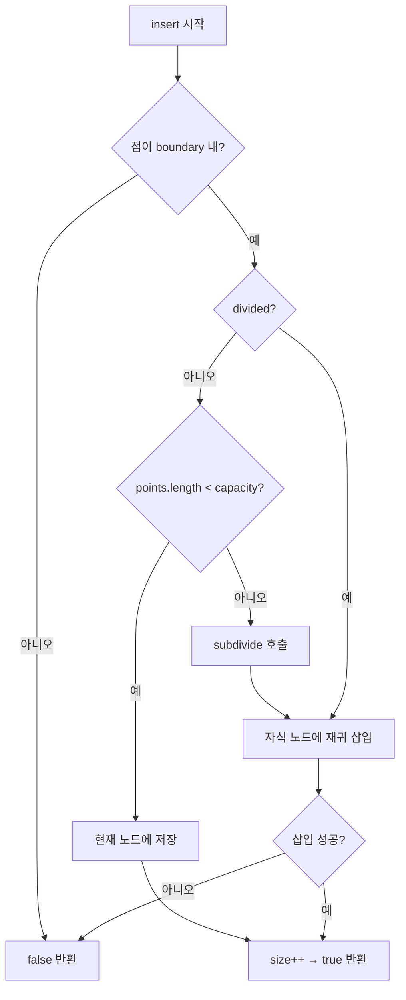
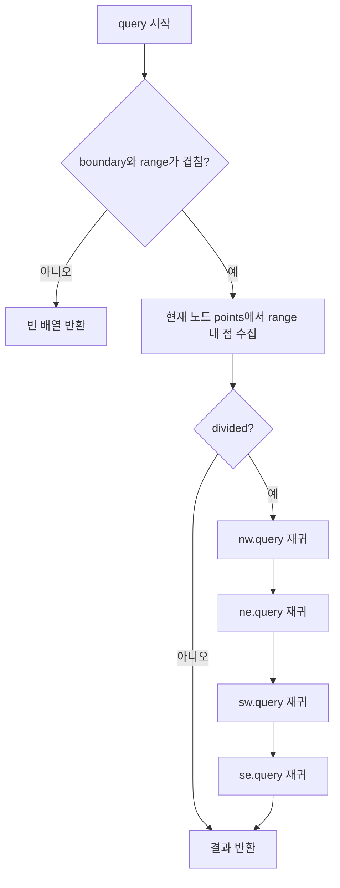

import { AlgorithmSimulation } from "#guide-sim";

# Quadtree (쿼드트리) 해설

## 성능 목표 예측

| 연산 | Naive (배열) | Quadtree (평균) | Quadtree (최악, 모든 점이 한 사분면) |
|------|------------|----------------|-------------------------------------|
| insert | O(1) | O(log n) | O(n) |
| query | O(n) | O(log n + k) | O(n) |
| 충돌 감지 (전체) | O(n²) | O(n log n) | O(n²) |
| 공간 | O(n) | O(n) | O(n) |

n=10^4에서 query는 Naive 대비 약 **1,000배** 빠릅니다.

---

## 목표 함수

| 메서드 | 시그니처 | 설명 |
|--------|---------|------|
| `constructor` | `(boundary: Rect, capacity?: number)` | 경계와 용량으로 초기화 |
| `insert` | `(point: Point2D): boolean` | 경계 내 삽입, 경계 밖이면 false |
| `query` | `(range: Rect): Point2D[]` | 범위와 겹치는 모든 점 반환 |
| `size` | `(): number` | 저장된 총 점 수 반환 |

---

## 핵심 아이디어

### 원형 아이디어와 naive 접근

게임에서 모든 오브젝트 쌍의 충돌을 검사하는 방법:

```ts
for (const a of objects) {
  for (const b of objects) {
    if (a !== b && isColliding(a, b)) handleCollision(a, b);
  }
}
// O(n²) — n=1000이면 초당 60,000,000번 비교
```

이 방법은 화면 반대쪽에 있는 오브젝트까지 불필요하게 비교합니다.

### 어떤 관찰이 돌파구가 되는가

충돌은 **인접한 오브젝트 사이에서만** 발생합니다. 화면의 왼쪽 위에 있는 오브젝트와 오른쪽 아래에 있는 오브젝트는 충돌할 수 없습니다. 공간을 계층적으로 분할하면, 다른 공간에 속한 오브젝트들은 비교 대상에서 제외할 수 있습니다.

### 관찰을 형식화

2D 공간을 재귀적으로 4등분합니다. 각 사각형이 일정 수(`capacity`) 이상의 점을 담게 되면 NW/NE/SW/SE 4개의 자식 사각형으로 나눕니다.

```
capacity=2인 경우:

초기:          점 2개 삽입:      3번째 삽입 시 4분할:
┌──────┐       ┌──────┐          ┌───┬───┐
│      │       │ • •  │          │ • │   │
│      │  →    │      │    →     ├───┼───┤
│      │       │      │          │   │ • │
└──────┘       └──────┘          └───┴───┘
                               (• = 점, 각 사분면이 독립 노드)
```

### 핵심 연산

**subdivide (4분할):**

```ts
subdivide(): void {
  const { x, y, width, height } = this.boundary;
  const hw = width / 2;
  const hh = height / 2;
  this.nw = new Quadtree({ x,      y,      width: hw, height: hh }, this.capacity);
  this.ne = new Quadtree({ x + hw, y,      width: hw, height: hh }, this.capacity);
  this.sw = new Quadtree({ x,      y + hh, width: hw, height: hh }, this.capacity);
  this.se = new Quadtree({ x + hw, y + hh, width: hw, height: hh }, this.capacity);
  this.divided = true;
  // 기존 점들을 자식 노드로 재배분
  for (const p of this.points) {
    this.nw.insert(p) || this.ne.insert(p) ||
    this.sw.insert(p) || this.se.insert(p);
  }
  this.points = []; // 현재 노드의 점은 자식으로 이동
}
```

**범위 겹침 검사 (intersects):**

```ts
intersects(a: Rect, b: Rect): boolean {
  return !(
    b.x > a.x + a.width   ||  // b가 a의 오른쪽
    b.x + b.width < a.x   ||  // b가 a의 왼쪽
    b.y > a.y + a.height  ||  // b가 a의 아래쪽
    b.y + b.height < a.y      // b가 a의 위쪽
  );
}
```

### 정당성

**insert 정확성:** 각 점은 자신이 속한 경계의 노드에 삽입됩니다. 분할 시 기존 점들도 올바른 자식으로 재배분되므로 점이 유실되지 않습니다.

**query 정확성:** `range`와 겹치지 않는 서브트리는 가지치기됩니다. 겹치는 서브트리는 모두 탐색하므로 누락이 없습니다.

### 구현 디테일과 최적화

1. **size 추적**: 삽입/실패를 추적해 O(1) size()를 구현합니다.
2. **경계 포함 정책**: 경계선 위의 점을 일관성 있게 처리합니다 (닫힌 구간).
3. **메모리**: 분할하지 않은 노드는 자식 참조를 null로 유지하여 메모리를 절약합니다.

---

## 시뮬레이션

export const steps = [
  {
    title: "초기 상태 (capacity=2)",
    detail: "경계 { x:0, y:0, w:100, h:100 }, capacity=2. 아직 아무 점도 없습니다.",
    array: [],
    highlight: [],
    marked: [],
  },
  {
    title: "점 (10,10) 삽입",
    detail: "경계 내부이고 points.length(0) < capacity(2). 현재 노드에 저장합니다.",
    array: [[10, 10]],
    highlight: [0],
    marked: [],
  },
  {
    title: "점 (80,80) 삽입",
    detail: "경계 내부이고 points.length(1) < capacity(2). 현재 노드에 저장합니다.",
    array: [[10, 10], [80, 80]],
    highlight: [1],
    marked: [],
  },
  {
    title: "점 (30,30) 삽입 → 4분할 발생",
    detail: "points.length(2) >= capacity(2). subdivide() 호출. NW/NE/SW/SE 생성 후 기존 점들을 재배분. (10,10)→NW, (80,80)→SE, (30,30)→NW.",
    array: [[10, 10], [30, 30], [80, 80]],
    highlight: [0, 1, 2],
    marked: [2],
  },
  {
    title: "query({ x:0, y:0, w:50, h:50 })",
    detail: "범위가 NW와 겹침 → NW 탐색: (10,10)✓, (30,30)✓. 범위가 SE와 안겹침 → SE 생략. 결과: [(10,10), (30,30)]",
    array: [[10, 10], [30, 30]],
    highlight: [0, 1],
    marked: [],
  },
];

<AlgorithmSimulation view="array" steps={steps} title="Quadtree 삽입과 4분할" />

---

## 수도 코드와 Activity Diagram

### 의사코드

```
Quadtree.insert(point):
  if point not in boundary: return false
  if not divided:
    if points.length < capacity:
      points.push(point)
      size += 1
      return true
    else:
      subdivide()
  // 자식 노드 중 하나에 삽입
  if nw.insert(point): size += 1; return true
  if ne.insert(point): size += 1; return true
  if sw.insert(point): size += 1; return true
  if se.insert(point): size += 1; return true
  return false  // 도달하면 안 되는 경우

Quadtree.subdivide():
  hw ← boundary.width / 2
  hh ← boundary.height / 2
  nw ← new Quadtree(NW 경계, capacity)
  ne ← new Quadtree(NE 경계, capacity)
  sw ← new Quadtree(SW 경계, capacity)
  se ← new Quadtree(SE 경계, capacity)
  divided ← true
  for each p in points: 재배분(p)
  points ← []

Quadtree.query(range):
  if not intersects(boundary, range): return []
  result ← []
  for each p in points:
    if p in range: result.push(p)
  if divided:
    result += nw.query(range)
    result += ne.query(range)
    result += sw.query(range)
    result += se.query(range)
  return result
```

### Activity Diagram




