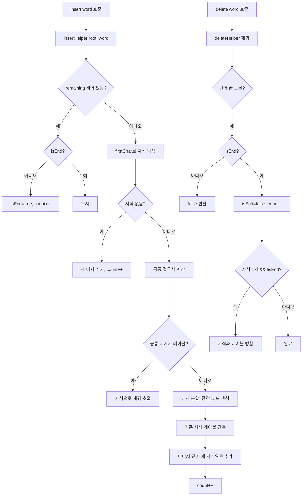

import { AlgorithmSimulation } from "#guide-sim";

# RadixTree 해설

## 성능 목표 예측

| 연산 | 시간복잡도 | 공간복잡도 | 비고 |
|------|-----------|-----------|------|
| insert | O(m) | O(m) | m = 단어 길이, 에지 분할 상수 시간 |
| search | O(m) | O(1) | |
| startsWith | O(m) | O(1) | |
| delete | O(m) | O(1) | 병합 포함 |
| wordsWithPrefix | O(m + k) | O(k) | k = 결과 단어 길이 합 |
| size | O(1) | O(1) | |

총 노드 수: O(n), n = 삽입된 단어 수 (Trie의 O(전체 문자 수) 대비 절약)

---

## 목표 함수

| 함수 | 시그니처 | 설명 |
|------|---------|------|
| insert | `(word: string) => void` | 에지 분할로 단어 삽입 |
| search | `(word: string) => boolean` | 정확한 단어 존재 여부 |
| startsWith | `(prefix: string) => boolean` | 접두사 존재 여부 |
| delete | `(word: string) => boolean` | 단어 삭제 + 노드 병합 |
| wordsWithPrefix | `(prefix: string) => string[]` | 접두사 일치 단어 목록 |
| size | `() => number` | 저장된 단어 수 |

---

## 핵심 아이디어

### 원형 아이디어와 naive 접근
Trie는 단어 "romane"를 저장할 때 r→o→m→a→n→e 6개 노드를 만든다. 이 노드들 각각은 하나의 자식만 가져 실질적인 분기 없이 직선 경로를 형성한다. 직선 경로는 압축해도 의미가 손실되지 않는다.

### 어떤 관찰이 돌파구가 되는가
**분기점(branching point)만이 의미 있는 노드다.** 자식이 하나뿐인 노드들을 묶어 에지 레이블을 문자열로 저장하면, 트리의 노드 수가 분기점(+ 리프)의 수, 즉 O(단어 수)로 줄어든다.

### 관찰을 형식화: 상태/구조 정의
에지의 첫 문자로 자식 맵에 접근하고, 나머지 레이블은 노드 안에 저장한다.
```ts
interface RadixNode {
  children: Map<string, RadixNode>;  // 첫 문자 → 자식
  label: string;                      // 이 에지의 레이블
  isEnd: boolean;
}
```

### 핵심 연산: insert의 에지 분할

```
insert(word, node, remaining):
  // 이 노드에서 remaining의 첫 문자와 일치하는 자식 찾기
  firstChar = remaining[0]
  child = node.children.get(firstChar)

  if child is null:
    // 완전히 새로운 에지 추가
    node.children.set(firstChar, { label: remaining, isEnd: true, children: {} })
    count++
    return

  // 공통 접두사 계산
  common = commonPrefix(child.label, remaining)

  if common.length == child.label.length:
    // 에지 레이블을 완전히 소비 → 자식으로 내려감
    insert(remaining.slice(common.length), child, ...)
  else:
    // 에지 분할: common 위치에서 자름
    // 1. 기존 자식의 레이블을 child.label.slice(common.length)로 줄임
    // 2. common 길이의 새 중간 노드 생성
    // 3. 기존 자식을 중간 노드의 자식으로 이동
    // 4. remaining.slice(common.length)를 중간 노드의 새 자식으로 추가
    splitNode = { label: common, isEnd: remaining.slice(common.length) == "" }
    child.label = child.label.slice(common.length)
    splitNode.children.set(child.label[0], child)
    if remaining.slice(common.length) != "":
      rest = remaining.slice(common.length)
      splitNode.children.set(rest[0], { label: rest, isEnd: true })
    node.children.set(firstChar, splitNode)
```

### 핵심 연산: delete의 노드 병합
삭제 후 노드의 자식이 1개이고 `isEnd`가 false이면, 자식과 레이블을 합쳐 하나의 에지로 만든다. 이 병합으로 항상 "내부 노드는 자식이 2개 이상 또는 isEnd" 불변식이 유지된다.

### 정당성
Radix Tree 불변식: **"내부 노드는 반드시 분기점이거나 단어 종료 지점이어야 한다"**. insert의 split과 delete의 merge가 이 불변식을 유지하므로, 노드 수는 항상 O(단어 수)에 머문다.

### 구현 디테일과 최적화
- **공통 접두사 계산**: `while i < a.length && i < b.length && a[i] == b[i]: i++` — O(min(|a|,|b|))
- **에지 첫 문자 키**: `children`의 키를 에지 첫 문자 하나로 관리하면 O(1) 자식 탐색. 레이블 전체를 키로 하면 공간 낭비.
- **병합 조건**: delete 후 자식이 정확히 1개이고 isEnd=false인 경우만 병합. isEnd=true이면 해당 노드는 단어 경계이므로 유지.

---

## 시뮬레이션

export const steps = [
  {
    title: "초기 상태",
    detail: "빈 루트 노드",
    array: ["ROOT"],
    highlight: [0],
    marked: [],
  },
  {
    title: "insert('romane'): 새 에지 추가",
    detail: "루트 → 'romane' 에지 하나로 삽입",
    array: ["ROOT", "romane(END)"],
    highlight: [1],
    marked: [],
  },
  {
    title: "insert('romanus'): 에지 분할",
    detail: "공통 접두사 'roman' 분리. 분기점 'roman' 노드 생성 후 'e', 'us' 자식",
    array: ["ROOT", "roman", "e(END)", "us(END)"],
    highlight: [1, 2, 3],
    marked: [],
  },
  {
    title: "insert('romulus'): 'r' 분기",
    detail: "'roman'과 'romulus'는 'rom' 공통. 'an', 'ulus' 분기",
    array: ["ROOT", "rom", "an", "e(END)", "us(END)", "ulus(END)"],
    highlight: [1, 5],
    marked: [2, 3, 4],
  },
  {
    title: "insert('ruber'): 'r' 다음 분기",
    detail: "'rom'과 'ruber'는 'r' 만 공통. 'om', 'uber' 분기",
    array: ["ROOT", "r", "om", "uber(END)", "an", "e(END)", "us(END)", "ulus(END)"],
    highlight: [1, 3],
    marked: [2, 4, 5, 6, 7],
  },
  {
    title: "search('romane'): r→om→an→e 탐색 → true",
    detail: "각 에지 레이블을 순서대로 소비하며 내려가 isEnd 확인",
    array: ["ROOT", "r✓", "om✓", "an✓", "e(END)✓"],
    highlight: [4],
    marked: [1, 2, 3],
  },
];

<AlgorithmSimulation view="array" steps={steps} title="RadixTree 시뮬레이션" />

---

## 수도 코드와 Activity Diagram

### 의사코드

```
RadixTree.insert(word):
  insertHelper(root, word)

insertHelper(node, remaining):
  if remaining == "":
    if !node.isEnd: node.isEnd = true; count++
    return
  firstChar = remaining[0]
  child = node.children.get(firstChar)
  if child == null:
    node.children.set(firstChar, { label: remaining, isEnd: true, children: {} })
    count++
    return
  common = commonPrefix(child.label, remaining)
  if common == child.label:
    insertHelper(child, remaining.slice(common.length))
  else:
    // 에지 분할
    newNode = { label: common, isEnd: false, children: {} }
    child.label = child.label.slice(common.length)
    newNode.children.set(child.label[0], child)
    rest = remaining.slice(common.length)
    if rest == "":
      newNode.isEnd = true; count++
    else:
      newNode.children.set(rest[0], { label: rest, isEnd: true, children: {} }); count++
    node.children.set(firstChar, newNode)

RadixTree.search(word):
  return searchHelper(root, word)

searchHelper(node, remaining):
  if remaining == "": return node.isEnd
  firstChar = remaining[0]
  child = node.children.get(firstChar)
  if child == null || !remaining.startsWith(child.label): return false
  return searchHelper(child, remaining.slice(child.label.length))
```

### Activity Diagram


