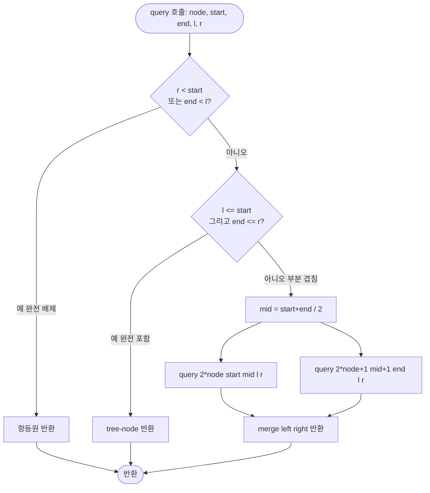
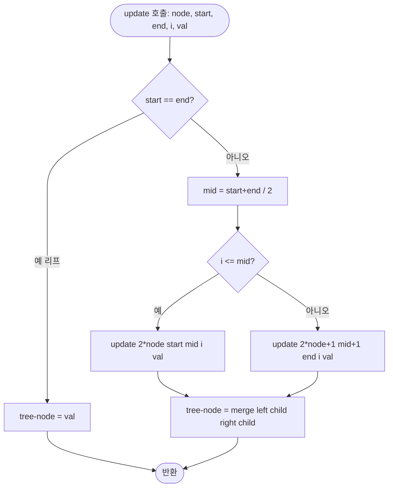

import { AlgorithmSimulation } from "#guide-sim";

# SegmentTree (세그먼트 트리) 해설

## 성능 목표 예측

| 연산 | 단순 배열 | 누적합 | **세그먼트 트리** |
|------|-----------|--------|-------------------|
| 빌드 | O(1) | O(n) | O(n) |
| 구간 질의 | O(n) | O(1) | O(log n) |
| 단일 업데이트 | O(1) | O(n) | O(log n) |
| 범위 업데이트 | O(n) | O(n) | O(n log n)* |

\* 범위 업데이트가 빈번하다면 Lazy Propagation(segmentTreeLazy) 버전을 사용한다.

---

## 목표 함수

| 함수 | 시그니처 | 복잡도 |
|------|----------|--------|
| 생성자 | `constructor(arr, merge)` | O(n) |
| 구간 질의 | `query(l, r): number` | O(log n) |
| 단일 갱신 | `update(i, val): void` | O(log n) |
| 크기 반환 | `size(): number` | O(1) |

---

## 핵심 아이디어

### 원형 아이디어와 naive 접근

구간 [l, r]의 합을 매번 O(n)으로 순회하면, 질의 Q번과 업데이트 U번의 총 비용은 O((Q+U)·n)이다. n=10^5, Q=U=10^4이면 10^9 연산이 필요해 1초를 초과한다.

### 어떤 관찰이 돌파구가 되는가

"구간을 미리 O(n)개 미리 계산해 두고, 겹치지 않는 구간들의 조합으로 임의 질의 구간을 표현할 수 있는가?" — 이것이 핵심 질문이다.

이진 트리를 이용하면 임의 구간을 **O(log n)개** 이하의 미리 계산된 서브구간으로 분해할 수 있다. 트리의 각 노드가 특정 구간의 집계 값을 저장하므로 해당 구간 전체를 단번에 참조할 수 있다.

### 관찰을 형식화

배열 A[0..n-1]에 대해 이진 트리를 구성한다.

- **리프 노드**: A[i] 값 저장
- **내부 노드**: 두 자식 구간의 merge 결과 저장
- **루트**: A[0..n-1] 전체의 집계 값

1-indexed 배열 표현을 쓰면 노드 k의 자식이 2k, 2k+1이므로 인덱스 계산이 단순해진다.

### 핵심 연산

**구간 질의**: 현재 노드 구간 [start, end]와 질의 구간 [l, r]을 세 경우로 분류한다.

1. 완전 포함 (l ≤ start, end ≤ r): 현재 노드 값 즉시 반환
2. 완전 배제 (r < start 또는 end < l): 항등원 반환
3. 부분 겹침: mid = (start+end)/2, 좌우 자식 재귀 후 merge

**단일 업데이트**: 리프까지 내려가 값을 교체하고, 올라오는 길에 부모 노드를 `merge(leftChild, rightChild)`로 갱신한다.

### 정당성

트리 높이가 ⌈log₂ n⌉이므로 경로 길이는 O(log n)이다. 구간 질의에서 방문하는 노드 수는 최대 4·log n임이 증명되어 있다 (각 깊이에서 최대 4개 노드만 '부분 겹침' 처리를 받는다).

### 구현 디테일과 최적화

- **배열 크기**: 안전하게 `4 * n`을 할당한다 (n이 2의 거제곱이 아닌 경우 대비).
- **1-indexed vs 0-indexed**: 1-indexed 사용 시 부모/자식 계산이 비트 연산으로 단순화된다.
- **항등원 처리**: merge 함수가 최솟값이면 항등원은 `+Infinity`, 합이면 `0`. 생성자에서 사용자에게 받거나 초기 배열로 추론한다.
- **이터레이티브 구현**: 재귀 대신 반복문으로도 구현 가능하며 상수 인자가 작아진다.

---

## 시뮬레이션

export const steps = [
  {
    title: "초기 배열",
    detail: "prices = [100, 45, 78, 23, 56]. 세그먼트 트리를 빌드한다.",
    array: [100, 45, 78, 23, 56],
    highlight: [0, 1, 2, 3, 4],
    marked: [],
  },
  {
    title: "리프 노드 채우기",
    detail: "트리의 리프 노드에 원본 배열 값을 복사한다.",
    array: [100, 45, 78, 23, 56],
    highlight: [],
    marked: [0, 1, 2, 3, 4],
  },
  {
    title: "내부 노드 계산 — 레벨 1",
    detail: "min(100,45)=45, min(78,23)=23, 56은 단독.",
    array: [45, 23, 56],
    highlight: [0, 1, 2],
    marked: [],
  },
  {
    title: "내부 노드 계산 — 레벨 2",
    detail: "min(45,23)=23, 56은 단독.",
    array: [23, 56],
    highlight: [0, 1],
    marked: [],
  },
  {
    title: "루트 계산 완료",
    detail: "루트 = min(23,56) = 23. 빌드 완료.",
    array: [23],
    highlight: [0],
    marked: [],
  },
  {
    title: "query(0, 2) — 구간 질의",
    detail: "[0,2] 질의. 트리를 내려가며 완전 포함 구간만 수집: min(100,45,78) = 45.",
    array: [100, 45, 78, 23, 56],
    highlight: [0, 1, 2],
    marked: [],
  },
  {
    title: "update(3, 200) — 단일 업데이트",
    detail: "인덱스 3을 200으로 변경. 리프부터 루트까지 경로 상의 노드를 재계산.",
    array: [100, 45, 78, 200, 56],
    highlight: [3],
    marked: [0, 1, 2, 4],
  },
  {
    title: "update 후 query(0, 4)",
    detail: "전체 구간 최솟값. 23이었던 자리가 200이 되어 이제 최솟값은 45.",
    array: [100, 45, 78, 200, 56],
    highlight: [0, 1, 2, 3, 4],
    marked: [1],
  },
];

<AlgorithmSimulation view="array" steps={steps} title="SegmentTree — 구간 최솟값 시뮬레이션" />

## 수도 코드와 Activity Diagram

### 의사코드

```
// 빌드
build(node, start, end):
  if start == end:
    tree[node] = arr[start]
    return
  mid = (start + end) / 2
  build(2*node, start, mid)
  build(2*node+1, mid+1, end)
  tree[node] = merge(tree[2*node], tree[2*node+1])

// 구간 질의
query(node, start, end, l, r):
  if r < start OR end < l:
    return IDENTITY          // 완전 배제
  if l <= start AND end <= r:
    return tree[node]        // 완전 포함
  mid = (start + end) / 2
  left  = query(2*node, start, mid, l, r)
  right = query(2*node+1, mid+1, end, l, r)
  return merge(left, right)

// 단일 업데이트
update(node, start, end, i, val):
  if start == end:
    arr[i] = val
    tree[node] = val
    return
  mid = (start + end) / 2
  if i <= mid:
    update(2*node, start, mid, i, val)
  else:
    update(2*node+1, mid+1, end, i, val)
  tree[node] = merge(tree[2*node], tree[2*node+1])
```

### Activity Diagram




