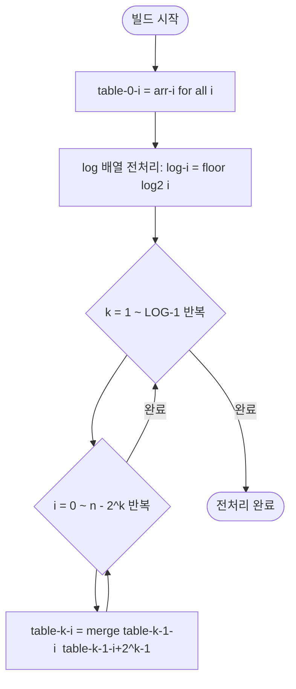
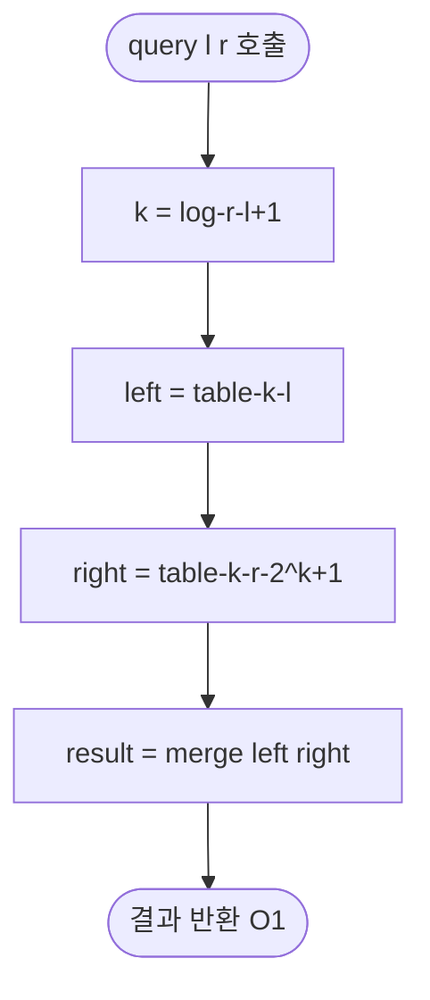

import { AlgorithmSimulation } from "#guide-sim";

# SparseTable (희소 테이블) 해설

## 성능 목표 예측

| 연산 | 단순 배열 | 세그먼트 트리 | **희소 테이블** |
|------|-----------|---------------|-----------------|
| 전처리(빌드) | O(1) | O(n) | O(n log n) |
| 구간 질의 | O(n) | O(log n) | **O(1)** |
| 단일 업데이트 | O(1) | O(log n) | 지원 안 함 |
| 공간 | O(n) | O(n) | O(n log n) |

업데이트가 없고 질의만 빈번한 정적 배열 시나리오에서 세그먼트 트리 대비 log n 배 빠르다.

---

## 목표 함수

| 함수 | 시그니처 | 복잡도 |
|------|----------|--------|
| 생성자 | `constructor(arr, merge)` | O(n log n) |
| 구간 질의 | `query(l, r): number` | **O(1)** |

---

## 핵심 아이디어

### 원형 아이디어와 naive 접근

매 질의마다 [l, r]을 선형 순회하면 O(n)이다. 누적합으로 구간 합은 O(1)에 되지만 최솟값/최댓값은 뺄셈이 성립하지 않아 불가하다. 세그먼트 트리는 O(log n)이지만 질의당 log n 개 노드를 방문한다.

### 어떤 관찰이 돌파구가 되는가

**멱등성(idempotency)**: `min(min(x, y), y) = min(x, y)`.

구간을 "두 개의 겹치는 구간"으로 덮을 때, 겹친 부분의 원소를 두 번 포함해도 min이나 max 결과는 바뀌지 않는다. 이 관찰 덕분에 임의 구간 [l, r]을 두 개의 2의 거듭제곱 크기 구간으로 덮고, 그 결과를 merge 한 번으로 얻을 수 있다.

### 관찰을 형식화

길이 len = r - l + 1에 대해 `k = ⌊log₂(len)⌋`이면 `2^k ≤ len < 2^(k+1)`.

두 구간 `[l, l+2^k-1]`과 `[r-2^k+1, r]`은 모두 길이 2^k이고, 합쳐서 [l, r]을 완전히 덮는다. 둘 다 `table[k][*]`에 O(n log n) 전처리로 계산되어 있으므로 질의는 O(1)이다.

### 핵심 연산

**전처리 점화식**

```
table[0][i] = arr[i]
table[k][i] = merge(table[k-1][i], table[k-1][i + 2^(k-1)])
```

k를 1부터 log₂n까지, i를 0부터 n-2^k까지 반복하면 O(n log n)에 완성된다.

**O(1) 질의**

```
k = floor(log2(r - l + 1))
return merge(table[k][l], table[k][r - (1 << k) + 1])
```

`log` 값은 매 질의마다 계산하지 않고 전처리 배열 `_log[i] = floor(log2(i))`에 O(n)으로 미리 저장한다.

### 정당성

- `2^k ≤ len`이므로 두 구간이 [l, r]을 완전히 덮는다.
- `2^k ≤ len < 2^(k+1)`이므로 오른쪽 구간 시작점 `r - 2^k + 1 ≥ l`이 성립한다 (겹칠 수 있지만 양쪽 구간이 인덱스 범위 내에 있다).
- merge가 멱등이므로 겹치는 원소를 두 번 포함해도 결과가 동일하다.

### 구현 디테일과 최적화

- **log 배열 미리 계산**: `_log[1] = 0`, `_log[i] = _log[i/2] + 1` (i ≥ 2). 질의당 Math.log2 호출을 없앤다.
- **2차원 배열 방향**: `table[k][i]` 형태(행=레벨, 열=인덱스)로 저장하면 전처리 순서와 일치해 캐시 효율이 좋다.
- **전처리 범위**: 레벨 k에서 유효한 인덱스는 `0 ≤ i ≤ n - (1 << k)`. 범위를 초과하면 undefined가 된다.

---

## 시뮬레이션

export const steps = [
  {
    title: "초기 배열 (table[0])",
    detail: "ttls = [300, 60, 3600, 120, 900]. table[0][i] = arr[i] (길이 1 구간).",
    array: [300, 60, 3600, 120, 900],
    highlight: [0, 1, 2, 3, 4],
    marked: [],
  },
  {
    title: "table[1] 계산 (길이 2 구간)",
    detail: "table[1][i] = min(table[0][i], table[0][i+1]). 결과: [60, 60, 120, 120].",
    array: [60, 60, 120, 120],
    highlight: [0, 1, 2, 3],
    marked: [],
  },
  {
    title: "table[2] 계산 (길이 4 구간)",
    detail: "table[2][i] = min(table[1][i], table[1][i+2]). 결과: [60, 60].",
    array: [60, 60],
    highlight: [0, 1],
    marked: [],
  },
  {
    title: "전처리 완료",
    detail: "log 배열: log[1]=0, log[2]=1, log[3]=1, log[4]=2, log[5]=2. 이제 O(1) 질의 준비 완료.",
    array: [0, 0, 1, 1, 2],
    highlight: [0, 1, 2, 3, 4],
    marked: [],
  },
  {
    title: "query(0, 4) — 전체 구간",
    detail: "len=5, k=log[5]=2, 2^k=4. 두 구간: [0,3]과 [1,4]. merge(table[2][0], table[2][1]) = min(60,60) = 60.",
    array: [300, 60, 3600, 120, 900],
    highlight: [0, 1, 2, 3, 4],
    marked: [1],
  },
  {
    title: "query(2, 4) — 부분 구간",
    detail: "len=3, k=log[3]=1, 2^k=2. 두 구간: [2,3]과 [3,4]. merge(table[1][2], table[1][3]) = min(120,120) = 120.",
    array: [300, 60, 3600, 120, 900],
    highlight: [2, 3, 4],
    marked: [3],
  },
];

<AlgorithmSimulation view="array" steps={steps} title="SparseTable — DNS TTL 최솟값 시뮬레이션" />

## 수도 코드와 Activity Diagram

### 의사코드

```
// 전처리
build(arr, merge):
  n = arr.length
  LOG = floor(log2(n)) + 1
  table[0][i] = arr[i]  for i in [0, n)
  log[1] = 0
  log[i] = log[i/2] + 1  for i in [2, n]

  for k in [1, LOG):
    for i in [0, n - (1 << k)]:
      table[k][i] = merge(table[k-1][i], table[k-1][i + (1 << (k-1))])

// O(1) 질의
query(l, r):
  k = log[r - l + 1]
  return merge(table[k][l], table[k][r - (1 << k) + 1])
```

### Activity Diagram




