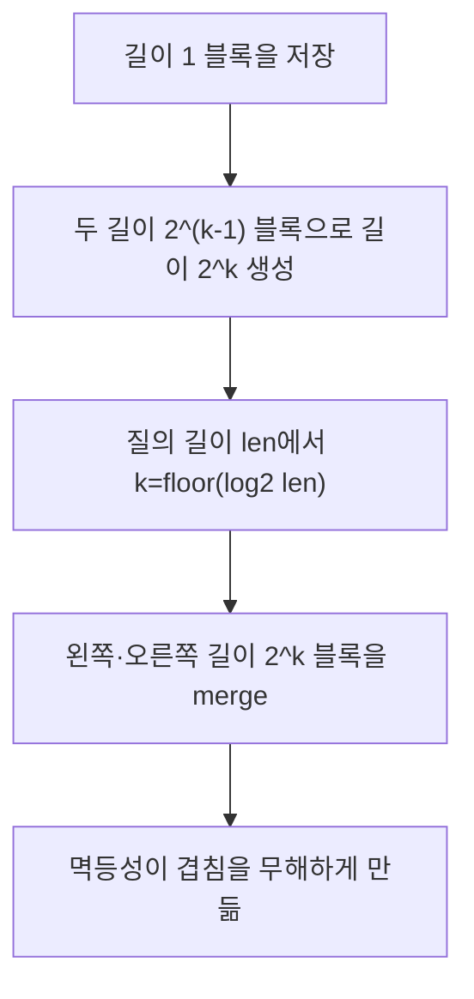

import { AlgorithmSimulation } from "#guide-sim";

# Sparse Table — 바뀌지 않는 배열의 답을 미리 겹쳐 저장하기

## 먼저 문제를 한 문장으로

배열이 바뀌지 않고 `min`, `max`, `gcd`처럼 같은 값을 중복해도 결과가 달라지지 않는 연산의 구간 질의를 빠르게 처리한다.

## 처음 생각해 볼 방법과 막히는 지점

매 질의마다 `[l, r]`을 훑으면 길이에 비례하는 시간이 든다. 세그먼트 트리는 갱신도 지원하지만 여기에는 갱신이 없다. 정적인 데이터라면 2의 거듭제곱 길이 구간을 전부 미리 계산해, 질의 때는 두 조각만 합치는 편이 낫다.

## 돌파구가 되는 관찰

`table[k][i]`를 `i`에서 시작하는 길이 `2^k` 구간의 값으로 둔다. 길이 8 구간은 길이 4 구간 두 개로 만들 수 있다. 질이 길이가 `len`이면 `k = floor(log2(len))`를 택하고, 왼쪽의 길이 `2^k` 구간과 오른쪽의 길이 `2^k` 구간으로 덮는다. 두 구간이 겹칠 수 있으므로 중복이 결과를 바꾸지 않는 **멱등 연산**이어야 한다. 합에는 이 방법을 쓸 수 없다.

## 실행 시각화

`[8, 6, 7, 3, 5]`의 최솟값 테이블 일부다. `[1, 4]`는 길이 4이므로 `table[2][1]` 하나로 답을 얻는다. 길이가 거듭제곱이 아니어도 두 블록의 겹침은 `min`에서 안전하다.

> 대화형 시뮬레이션은 MDX 런타임에서 표시됩니다.

export const sparseTableSteps = [
  { title: "길이 1", detail: "table[0]은 원본 배열이다.", matrix: [[8, 6, 7, 3, 5]], rowLabels: ["2⁰"], colLabels: [0, 1, 2, 3, 4] },
  { title: "길이 2", detail: "인접한 길이 1 블록 두 개의 min을 저장한다.", matrix: [[8, 6, 7, 3, 5], [6, 6, 3, 3, null]], rowLabels: ["2⁰", "2¹"], colLabels: [0, 1, 2, 3, 4], cells: [[1, 1]] },
  { title: "길이 4", detail: "table[2][1] = min(table[1][1], table[1][3]) = 3. query(1, 4)의 답이다.", matrix: [[8, 6, 7, 3, 5], [6, 6, 3, 3, null], [3, 3, null, null, null]], rowLabels: ["2⁰", "2¹", "2²"], colLabels: [0, 1, 2, 3, 4], cells: [[2, 1]] },
];

<AlgorithmSimulation view="matrix" steps={sparseTableSteps} title="Sparse Table: 구간 최솟값 전처리" />

## 알고리즘의 흐름 한눈에 보기

## 왜 항상 맞는가

전처리는 길이 1에서 시작해 두 반쪽을 합치므로, 귀납적으로 모든 `table[k][i]`가 정확한 구간 값을 갖는다. 질의의 두 블록은 `[l, r]`을 모두 덮는다. 겹친 원소가 있더라도 `min(x, x) = x`처럼 결과가 변하지 않아 답은 전체 구간의 merge와 같다.

## 구현할 때 놓치기 쉬운 점

전처리와 공간은 `O(n log n)`, 질의는 `O(1)`이다. `r - 2^k + 1`은 오른쪽 블록의 시작점이며, `l + 2^k`와 혼동하지 않는다. 업데이트가 필요하거나 합을 구해야 한다면 이 자료구조가 아니라 Fenwick Tree·세그먼트 트리를 선택해야 한다.

## 스스로 점검하기

1. `sum`에서 두 블록이 겹치면 어떤 값이 두 번 더해질까?
2. 길이 5 구간을 두 길이 4 블록으로 덮어도 `min`이 맞는 이유는 무엇일까?
