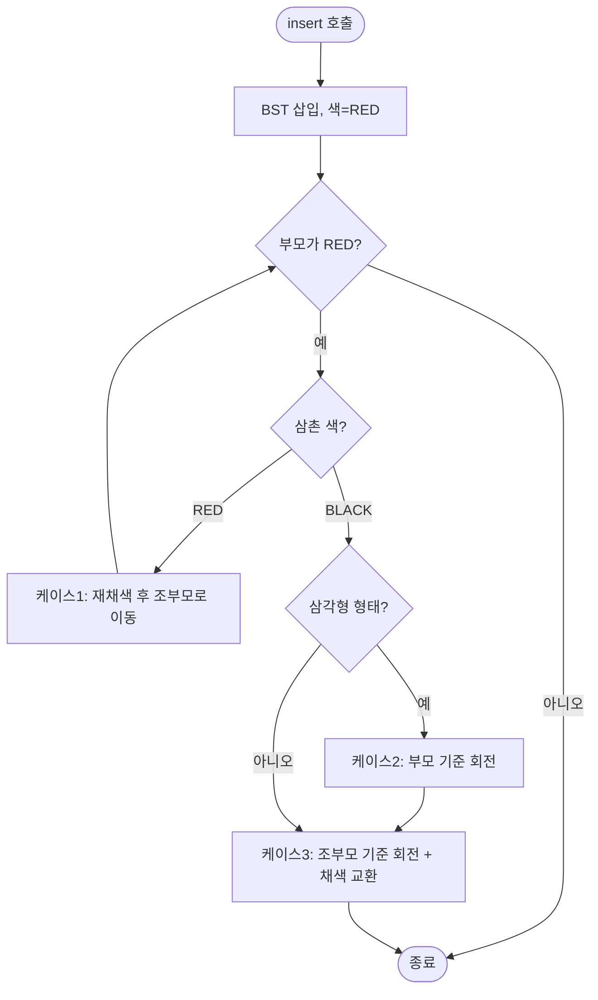

import { AlgorithmSimulation } from "#guide-sim";

# RedBlackTree 해설

## 성능 목표 예측

| 연산 | 평균 | 최악 |
|------|------|------|
| insert | O(log n) | O(log n) |
| delete | O(log n) | O(log n) |
| has | O(log n) | O(log n) |
| min / max | O(log n) | O(log n) |
| inOrder | O(n) | O(n) |

레드-블랙 트리의 높이 상한은 $2 \cdot \log_2(n+1)$. AVL보다 느슨하지만 삽입·삭제 회전이 최대 3회로 제한된다.

---

## 목표 함수

| 메서드 | 역할 |
|--------|------|
| `insert(value)` | BST 삽입 → RED 채색 → fixupInsert |
| `delete(value)` | BST 삭제 → fixupDelete (double black 해소) |
| `has(value)` | 일반 BST 탐색 |
| `min() / max()` | 최좌/최우 노드 값 |
| `inOrder()` | 중위 순회 |

---

## 핵심 아이디어

### 원형 아이디어와 naive 접근

일반 BST는 편향(skewed)되면 O(n)으로 퇴화한다. AVL은 엄격한 균형 인수(±1)로 이를 막지만, 삽입/삭제마다 회전이 여러 번 발생할 수 있다.

**레드-블랙 트리의 핵심 관찰**: 트리를 엄격히 균형 잡는 대신, "Black 높이"만 모든 경로에서 동일하게 유지하면 충분하다. Red 노드는 Black 노드 사이에만 낄 수 있으므로, 높이 상한이 `2 * log2(n+1)`로 보장된다.

### 어떤 관찰이 돌파구가 되는가

**속성 4(연속 Red 금지) + 속성 5(Black 높이 동일)** 를 유지하기만 하면 자동으로 O(log n)이 보장된다.

그리고 이 두 속성의 위반은 **항상 국소적으로 발생**하므로, 채색 변경(recoloring)과 회전(rotation) 두 가지 도구만으로 O(log n) 단계 안에 복구할 수 있다.

### 관찰을 형식화: 상태/구조 정의

```ts
type RBColor = "RED" | "BLACK";

class RBNode<T> {
  value: T;
  color: RBColor;
  left:   RBNode<T> | undefined;
  right:  RBNode<T> | undefined;
  parent: RBNode<T> | undefined;
}
```

NIL 노드를 명시적 센티넬(sentinel)로 표현하면 삭제 픽스업 구현이 간결해진다.

### 핵심 연산 — 삽입 픽스업 3 케이스

새 노드는 항상 RED로 삽입. 부모도 RED면 속성 4 위반 → 픽스업 시작.

| 케이스 | 조건 | 해결 |
|--------|------|------|
| 1 | 삼촌이 RED | 부모·삼촌 → BLACK, 조부모 → RED, 조부모에서 재귀 |
| 2 | 삼촌 BLACK, 삼각형 형태 | 부모 기준 회전 → 케이스 3으로 변환 |
| 3 | 삼촌 BLACK, 직선 형태 | 조부모 기준 회전 + 부모↔조부모 색 교환 |

```
케이스 1 (삼촌 RED):
      B(조)           R(조)
     / \             / \
   R(부) R(삼)  →  B(부) B(삼)
   |                |
  R(새)            R(새)

케이스 3 (삼촌 BLACK, LL):
      B(조)          B(부)
     / \            / \
   R(부) B(삼) →  R(새) R(조)
   /                      \
  R(새)                   B(삼)
```

### 삭제 픽스업 — Double Black

Black 노드를 삭제하면 해당 경로의 Black 높이가 줄어 "이중 흑색" 상태 발생. 4 케이스로 해소:

| 케이스 | 조건 | 해결 |
|--------|------|------|
| 1 | 형제가 RED | 형제-부모 색 교환 + 부모 기준 회전 → 케이스 2~4 |
| 2 | 형제 BLACK, 형제 자식 모두 BLACK | 형제 → RED, 부모로 이중 흑색 전파 |
| 3 | 형제 BLACK, 가까운 자식 RED | 형제 자식-형제 색 교환 + 회전 → 케이스 4 |
| 4 | 형제 BLACK, 먼 자식 RED | 형제에 부모 색 할당, 부모·먼 자식 → BLACK, 회전 |

### 정당성

- 모든 픽스업 케이스는 Black 높이를 변경하지 않거나 전파 단계를 줄이면서 종료된다.
- 삽입 픽스업: O(log n) 단계, 회전 최대 2번
- 삭제 픽스업: O(log n) 단계, 회전 최대 3번

### 구현 디테일과 최적화

- **부모 포인터**: `rotateLeft/Right` 시 부모 포인터를 함께 갱신해야 한다.
- **센티넬 NIL 노드**: `undefined` 대신 `NIL` 싱글톤을 쓰면 null 체크가 줄어 코드가 간결해진다.
- **루트 강제 Black**: fixup 마지막에 `root.color = "BLACK"` 한 줄로 속성 2를 보장한다.

---

## 시뮬레이션

export const steps = [
  {
    title: "초기 상태 — insert(10)",
    detail: "10을 RED로 삽입. 루트이므로 BLACK으로 강제 전환.",
    array: [10],
    highlight: [0],
    marked: [],
  },
  {
    title: "insert(5)",
    detail: "5를 RED로 삽입. 부모(10)가 BLACK → 속성 위반 없음.",
    array: [10, 5],
    highlight: [1],
    marked: [0],
  },
  {
    title: "insert(15)",
    detail: "15를 RED로 삽입. 부모(10)가 BLACK → 위반 없음.",
    array: [10, 5, 15],
    highlight: [2],
    marked: [0, 1],
  },
  {
    title: "insert(3) — 케이스 1",
    detail: "3(RED) 삽입. 부모(5)가 RED, 삼촌(15)이 RED → 케이스 1: 5·15를 BLACK, 10을 RED → 10을 다시 BLACK(루트).",
    array: [10, 5, 15, 3],
    highlight: [3],
    marked: [],
  },
  {
    title: "케이스 1 재채색 완료",
    detail: "10(BLACK), 5(BLACK), 15(BLACK), 3(RED). 모든 속성 만족.",
    array: [10, 5, 15, 3],
    highlight: [0],
    marked: [1, 2, 3],
  },
  {
    title: "insert(7) — 케이스 2→3",
    detail: "7(RED) 삽입 → 부모(5) RED, 삼촌(15) BLACK, LR 삼각형 → 케이스 2: 5 기준 왼쪽 회전 → 케이스 3: 10 기준 오른쪽 회전.",
    array: [10, 5, 15, 3, 7],
    highlight: [4],
    marked: [],
  },
  {
    title: "이중 회전 완료",
    detail: "7이 새로운 왼쪽 서브트리 루트(BLACK). 5(RED·왼쪽), 10(RED·오른쪽). 균형 복원.",
    array: [7, 5, 10, 3, 0, 0, 15],
    highlight: [0],
    marked: [1, 2, 3, 6],
  },
];

<AlgorithmSimulation view="array" steps={steps} title="레드-블랙 트리 삽입 픽스업 시뮬레이션" />

---

## 수도 코드와 Activity Diagram

### 의사코드

```
function insert(value):
  node = new Node(value, RED)
  bstInsert(root, node)
  fixupInsert(node)
  root.color = BLACK

function fixupInsert(z):
  while z.parent.color == RED:
    if z.parent == z.parent.parent.left:
      uncle = z.parent.parent.right
      if uncle.color == RED:          // 케이스 1
        z.parent.color = BLACK
        uncle.color = BLACK
        z.parent.parent.color = RED
        z = z.parent.parent
      else:
        if z == z.parent.right:       // 케이스 2
          z = z.parent
          rotateLeft(z)
        z.parent.color = BLACK        // 케이스 3
        z.parent.parent.color = RED
        rotateRight(z.parent.parent)
    else: (대칭)
  root.color = BLACK
```

### Activity Diagram


