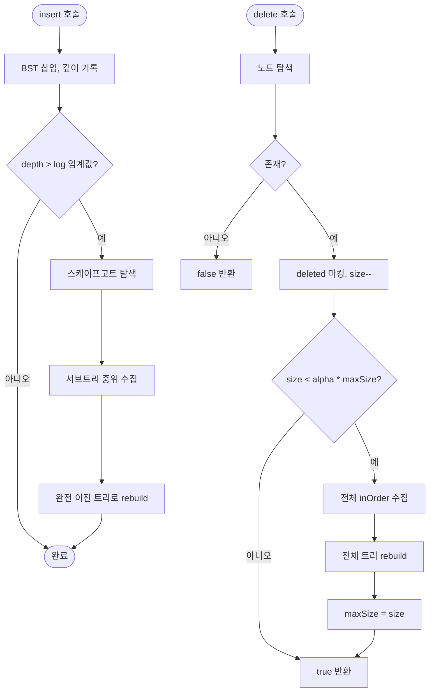

import { AlgorithmSimulation } from "#guide-sim";

# ScapegoatTree 해설

## 성능 목표 예측

| 연산 | 상각 | 최악 (재구성 발생 시) |
|------|------|----------------------|
| insert | O(log n) | O(n) |
| delete | O(log n) | O(n) |
| has | O(log n) | O(log n) |
| inOrder | O(n) | O(n) |

alpha가 작을수록 재구성이 자주 발생하지만 트리가 더 균형 잡히고, alpha가 클수록 재구성이 드물지만 트리가 편향될 수 있다.

---

## 목표 함수

| 메서드 | 핵심 동작 |
|--------|----------|
| `insert(value)` | BST 삽입 → 경로 거슬러 alpha 검사 → 위반 시 rebuild |
| `delete(value)` | deleted 마킹 → size 조건 시 전체 rebuild |
| `has(value)` | 일반 BST 탐색 (deleted 노드는 false) |
| `inOrder()` | 중위 순회 (deleted 제외) |

---

## 핵심 아이디어

### 원형 아이디어와 naive 접근

AVL 트리와 레드-블랙 트리는 삽입/삭제마다 회전으로 균형을 유지한다. 회전 로직은 케이스가 많고 구현 오류가 나기 쉽다.

**스케이프고트 트리의 관점**: 균형이 깨질 때만 처리하자. 그리고 처리 방법은 회전 대신 "완전히 다시 만들기"다. 재구성 비용이 크더라도 드물게 발생하면 상각 복잡도가 O(log n)으로 유지된다.

### 어떤 관찰이 돌파구가 되는가

**핵심 관찰**: n개 원소를 완전 이진 트리로 구성하면 높이가 $\lfloor \log_2 n \rfloor$이다. 재구성 후 트리는 최적 균형 상태다. 그리고 재구성은 상각적으로 드물게 발생한다.

**alpha의 역할**: alpha에 따라 "얼마나 불균형을 허용할 것인가"를 결정한다. alpha가 크면 재구성이 드물지만 개별 탐색이 느려질 수 있다.

### 관찰을 형식화: 상태/구조 정의

```ts
class ScapegoatNode<T> {
  value:   T;
  left:    ScapegoatNode<T> | undefined;
  right:   ScapegoatNode<T> | undefined;
  deleted: boolean;  // 논리 삭제 마킹
}

class ScapegoatTree<T> {
  root:     ScapegoatNode<T> | undefined;
  _size:    number;    // 논리 노드 수
  _maxSize: number;    // 최대 도달한 논리 노드 수 (재구성 임계값 계산용)
  alpha:    number;
}
```

추가 필드(height, color, rank)가 없다. 노드가 단순하다.

### 핵심 연산 1 — 삽입 후 스케이프고트 탐색

```ts
function insert(value: T): void {
  // 1. BST 삽입, 삽입 경로(깊이)를 기록
  const depth = bstInsert(root, value);
  _size++;
  _maxSize = Math.max(_maxSize, _size);

  // 2. alpha 조건 검사: depth > log_{1/alpha}(size)
  if (depth > Math.log(_size) / Math.log(1 / alpha)) {
    // 3. 경로를 거슬러 스케이프고트 탐색
    const scapegoat = findScapegoat(insertedNode);
    // 4. 스케이프고트 서브트리 재구성
    const nodes = collectInOrder(scapegoat);
    rebuildSubtree(scapegoat, nodes);
  }
}
```

### 핵심 연산 2 — 서브트리 재구성

```ts
function rebuild(nodes: T[]): ScapegoatNode<T> | undefined {
  if (nodes.length === 0) return undefined;
  const mid = Math.floor(nodes.length / 2);
  const node = new ScapegoatNode(nodes[mid]!);
  node.left  = rebuild(nodes.slice(0, mid));
  node.right = rebuild(nodes.slice(mid + 1));
  return node;
}
```

이 재구성은 O(k) (k = 서브트리 크기)이며, 결과는 높이가 $\lfloor \log_2 k \rfloor$인 완전 이진 트리다.

### 핵심 연산 3 — 논리 삭제와 전체 재구성

```ts
function delete(value: T): boolean {
  const node = find(root, value);
  if (!node || node.deleted) return false;
  node.deleted = true;
  _size--;
  // 삭제 노드가 너무 많으면 전체 재구성
  if (_size < alpha * _maxSize) {
    const nodes = collectInOrder(root);  // deleted 제외
    root = rebuild(nodes);
    _maxSize = _size;
  }
  return true;
}
```

### 정당성 — 상각 분석

재구성 비용은 O(k). 그러나 k개 노드를 재구성하려면 그 전에 적어도 k * (1 - alpha) 번의 삽입이 있어야 한다. 따라서 삽입 n번에 대한 총 재구성 비용은 O(n log n)이 되어 연산당 상각 O(log n)이 된다.

### 구현 디테일과 최적화

- **depth vs 포인터 경로**: 삽입 시 경로를 스택에 기록하거나 부모 포인터를 사용해 거슬러 올라가며 스케이프고트를 찾는다.
- **논리 삭제**: 물리 삭제 대신 `deleted` 플래그를 사용하면 재구성이 트리거될 때 한 번에 정리할 수 있어 구현이 단순하다.
- **inOrder에서 deleted 제외**: 중위 순회 시 `deleted` 노드를 건너뛴다.
- **중복 처리**: comparator 결과가 0이면 삽입 무시.

---

## 시뮬레이션

export const steps = [
  {
    title: "초기 — [10, 5, 15, 3, 7, 12, 20] 삽입",
    detail: "7개 원소가 삽입됨. alpha=0.65. 아직 재구성 불필요.",
    array: [10, 5, 15, 3, 7, 12, 20],
    highlight: [],
    marked: [0, 1, 2, 3, 4, 5, 6],
  },
  {
    title: "insert(1) — 깊이 체크",
    detail: "1이 삽입되어 깊이가 커짐. alpha 조건 검사: depth > log(8)/log(1/0.65) ≈ 5.4",
    array: [10, 5, 15, 3, 7, 12, 20, 1],
    highlight: [7],
    marked: [],
  },
  {
    title: "스케이프고트 발견",
    detail: "경로 거슬러 올라가며 size(left) > 0.65 * size(subtree) 위반 노드를 찾음. 5가 스케이프고트.",
    array: [10, 5, 15, 3, 7, 12, 20, 1],
    highlight: [1],
    marked: [0, 2, 5, 6],
  },
  {
    title: "스케이프고트 서브트리 중위 수집",
    detail: "5의 서브트리 중위 순회: [1, 3, 5, 7]. 이것으로 완전 이진 트리를 재구성.",
    array: [10, 5, 15, 3, 7, 12, 20, 1],
    highlight: [1, 3, 4, 7],
    marked: [],
  },
  {
    title: "서브트리 재구성 완료",
    detail: "중앙값 3이 새 루트. 좌=1, 우=5, 우우=7. 높이 2의 완전 이진 트리.",
    array: [10, 3, 15, 1, 5, 12, 20, 0, 0, 0, 7],
    highlight: [1, 3, 4, 10],
    marked: [0, 2, 5, 6],
  },
];

<AlgorithmSimulation view="array" steps={steps} title="스케이프고트 트리 — 삽입 후 서브트리 재구성" />

---

## 수도 코드와 Activity Diagram

### 의사코드

```
function insert(value):
  depth = bstInsert(root, value)
  size++; maxSize = max(maxSize, size)
  if depth > log(size) / log(1/alpha):
    node = findNode(value)
    scapegoat = findScapegoat(node)
    nodes = collectInOrder(scapegoat)  // deleted 제외
    newSubtree = rebuild(nodes)
    replaceSubtree(scapegoat, newSubtree)

function rebuild(nodes):
  if empty: return null
  mid = len(nodes) / 2
  root = new Node(nodes[mid])
  root.left  = rebuild(nodes[:mid])
  root.right = rebuild(nodes[mid+1:])
  return root

function delete(value):
  node = find(value)
  if not found: return false
  node.deleted = true; size--
  if size < alpha * maxSize:
    nodes = collectInOrder(root)
    root = rebuild(nodes)
    maxSize = size
  return true
```

### Activity Diagram


