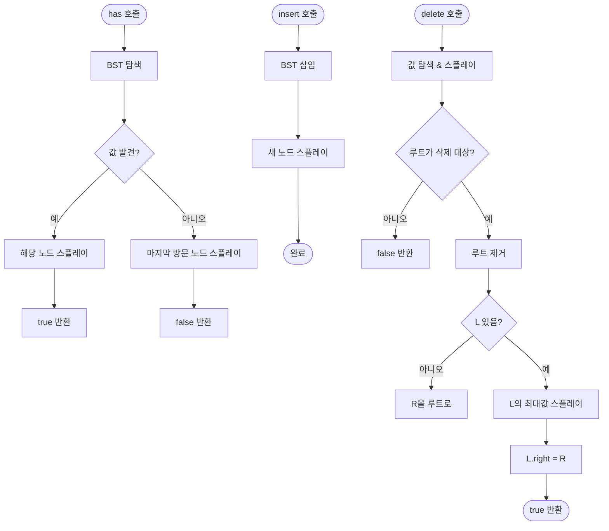

import { AlgorithmSimulation } from "#guide-sim";

# SplayTree 해설

## 성능 목표 예측

| 연산 | 상각 | 최악 (단일 연산) |
|------|------|----------------|
| insert | O(log n) | O(n) |
| delete | O(log n) | O(n) |
| has | O(log n) | O(n) |
| inOrder | O(n) | O(n) |

스플레이 트리는 포텐셜 함수(potential function)를 이용한 상각 분석으로 O(log n)을 보장한다. 단일 연산은 최악 O(n)이 가능하지만, 연속 m번 연산의 총 비용은 O(m log n) 이내다.

---

## 목표 함수

| 메서드 | 핵심 동작 |
|--------|----------|
| `insert(value)` | BST 삽입 → splay(삽입 노드) |
| `delete(value)` | splay(삭제 노드) → 루트 제거 → 두 서브트리 합병 |
| `has(value)` | BST 탐색 → splay(탐색 노드 또는 마지막 방문 노드) |
| `min() / max()` | 최좌/최우 노드 |
| `inOrder()` | 중위 순회 |

---

## 핵심 아이디어

### 원형 아이디어와 naive 접근

일반 BST의 탐색 비용은 트리 높이에 비례한다. 편향된 BST는 O(n)까지 떨어진다. AVL이나 레드-블랙 트리처럼 균형 메타데이터를 유지하면 해결되지만, 추가 필드(height, color)가 필요하고 회전 로직이 복잡해진다.

**스플레이 트리의 관점**: 균형을 항상 유지하지 말고, 접근 패턴 자체를 이용하자. 자주 접근하는 원소는 루트 근처로 끌어올리면 다음 접근이 빠르다.

### 어떤 관찰이 돌파구가 되는가

**스플레이 연산의 묘수**: 단순히 x를 루트로 회전시키면(zig만 반복) O(n)이 보장되지 않는다. 지그재그 패턴의 트리에서 번갈아 최소/최대를 찾으면 매번 O(n)이 된다.

**돌파구**: 조부모가 있을 때는 부모부터 먼저 회전하는 Zig-Zig를 적용하면, 포텐셜 에너지가 감소하여 상각 O(log n)이 보장된다.

### 관찰을 형식화: 상태/구조 정의

```ts
class SplayNode<T> {
  value:  T;
  left:   SplayNode<T> | undefined;
  right:  SplayNode<T> | undefined;
  parent: SplayNode<T> | undefined;
}
```

스플레이 트리는 노드에 추가 필드(height, color)가 없다. 대신 `parent` 포인터가 스플레이 연산에 필요하다.

### 핵심 연산 — splay(x)

```ts
function splay(x: SplayNode<T>): void {
  while (x.parent !== undefined) {
    const p = x.parent;
    const g = p.parent;

    if (g === undefined) {
      // Zig: 부모가 루트
      rotate(x);
    } else if (isLeftChild(x) === isLeftChild(p)) {
      // Zig-Zig: 같은 방향
      rotate(p);  // 부모를 먼저 회전
      rotate(x);
    } else {
      // Zig-Zag: 다른 방향
      rotate(x);  // x를 두 번 회전
      rotate(x);
    }
  }
  this.root = x;
}
```

**rotate(x)**: x가 부모의 왼쪽/오른쪽 자식인지에 따라 오른쪽/왼쪽 회전. 부모·조부모·자식 포인터를 모두 갱신해야 한다.

### 삭제 연산

```
1. splay(삭제 노드) → 루트로
2. L = root.left, R = root.right
3. L.parent = undefined, R.parent = undefined
4. L의 최대 노드를 splay → L의 오른쪽 자식이 없어짐
5. L.right = R, R.parent = L
6. root = L
```

### 정당성 — 포텐셜 분석

포텐셜 함수 $\Phi = \sum_{v} \log(\text{size}(v))$ 를 정의하면, splay 한 번의 상각 비용이 $O(\log n)$임을 증명할 수 있다. Zig-Zig가 핵심: 부모를 먼저 회전하면 트리의 포텐셜이 충분히 감소한다.

### 구현 디테일과 최적화

- **부모 포인터 갱신**: 회전 시 조부모, 부모, 자식 포인터를 정확히 업데이트.
- **has에서 스플레이**: 값이 없을 때는 마지막으로 방문한 노드를 스플레이.
- **삭제에서 합병**: L이 없으면 R이 새 루트, R이 없으면 L이 새 루트.
- **루트 추적**: 모든 연산 후 `this.root` 업데이트 필수.

---

## 시뮬레이션

export const steps = [
  {
    title: "초기 상태 — [10, 5, 15, 3, 7] 삽입 후",
    detail: "마지막으로 삽입한 7이 루트 근처에 위치. BST 성질 유지.",
    array: [7, 5, 10, 3, 0, 0, 15],
    highlight: [0],
    marked: [],
  },
  {
    title: "has(3) 탐색 시작",
    detail: "3을 찾아 왼쪽으로 이동. 3이 발견됨.",
    array: [7, 5, 10, 3, 0, 0, 15],
    highlight: [3],
    marked: [],
  },
  {
    title: "splay(3) — Zig-Zig 1단계",
    detail: "3의 부모(5)와 조부모(7)가 같은 방향(왼쪽). Zig-Zig: 5를 먼저 오른쪽 회전.",
    array: [5, 3, 7, 0, 0, 0, 10, 0, 0, 0, 0, 0, 0, 0, 15],
    highlight: [0],
    marked: [1],
  },
  {
    title: "splay(3) — Zig-Zig 2단계",
    detail: "이제 3의 부모(5)에서 오른쪽 회전. 3이 루트로 이동.",
    array: [3, 0, 5, 0, 0, 0, 7, 0, 0, 0, 0, 0, 0, 0, 10],
    highlight: [0],
    marked: [2, 6],
  },
  {
    title: "splay(3) 완료",
    detail: "3이 루트. inOrder: [3, 5, 7, 10, 15] 유지. 다음 접근 시 3은 O(1).",
    array: [3, 0, 5, 0, 0, 0, 7],
    highlight: [0],
    marked: [2, 6],
  },
];

<AlgorithmSimulation view="array" steps={steps} title="스플레이 트리 — has(3) 후 Zig-Zig 스플레이" />

---

## 수도 코드와 Activity Diagram

### 의사코드

```
function splay(x):
  while x.parent != null:
    p = x.parent
    g = p.parent
    if g == null:
      rotate(x)                 // Zig
    else if sameDir(x, p):
      rotate(p); rotate(x)      // Zig-Zig
    else:
      rotate(x); rotate(x)      // Zig-Zag

function delete(value):
  node = find(value)
  if node == null: return false
  splay(node)
  L = root.left;  R = root.right
  if L == null: root = R; return true
  if R == null: root = L; return true
  maxL = findMax(L)
  splay(maxL in L)
  maxL.right = R
  root = maxL
  return true
```

### Activity Diagram


