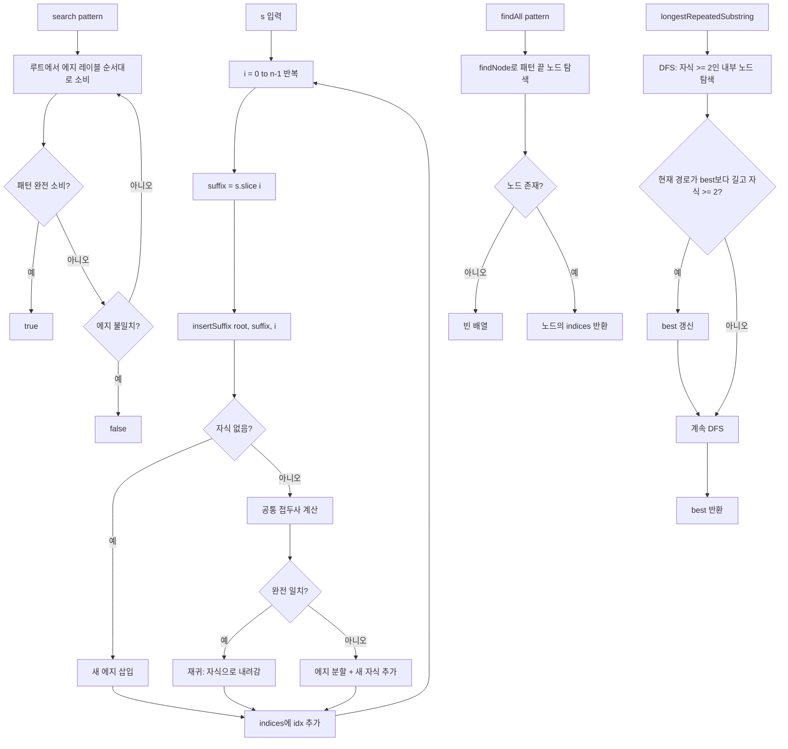

import { AlgorithmSimulation } from "#guide-sim";

# SuffixTree 해설

## 성능 목표 예측

| 연산 | 시간복잡도 | 공간복잡도 | 비고 |
|------|-----------|-----------|------|
| constructor | O(n²) | O(n²) | Naive: n개 접미사 × 평균 n/2 문자 |
| search | O(m) | O(1) | m = 패턴 길이 |
| findAll | O(m + k) | O(k) | k = 등장 횟수 |
| longestRepeatedSubstring | O(n) | O(n) | DFS 1회 |

Ukkonen's 알고리즘: O(n) 구성, O(n) 공간

---

## 목표 함수

| 함수 | 시그니처 | 설명 |
|------|---------|------|
| constructor | `(s: string) => void` | 모든 접미사로 트리 구성 |
| search | `(pattern: string) => boolean` | 부분 문자열 존재 여부 |
| findAll | `(pattern: string) => number[]` | 패턴 시작 인덱스 전체 |
| longestRepeatedSubstring | `() => string` | 두 번 이상 등장하는 최장 부분 문자열 |

---

## 핵심 아이디어

### 원형 아이디어와 naive 접근
패턴 검색을 매번 KMP로 처리하면 쿼리당 O(n+m)이다. 쿼리가 q번이면 O(q(n+m))으로 선형이지만 n이 수십억인 유전체 서열에서는 여전히 느리다. 문자열을 한 번 전처리해두면 각 쿼리를 O(m)에 처리할 수 있어야 한다.

### 어떤 관찰이 돌파구가 되는가
**패턴 p가 s의 부분 문자열 ⟺ p는 s의 어떤 접미사의 접두사다.** 이 동치 관계가 핵심이다. 모든 접미사를 트라이/Radix Tree에 저장하면 "접두사 탐색"을 O(m)에 수행할 수 있고, 이는 곧 O(m) 패턴 검색으로 이어진다.

### 관찰을 형식화: 상태/구조 정의
```ts
interface SuffixNode {
  children: Map<string, SuffixNode>;
  label: string;       // 에지 레이블
  indices: number[];   // 이 서브트리에 포함된 접미사 시작 인덱스
}
```

각 리프의 `indices`에는 해당 접미사의 시작 인덱스 하나만 들어 있다. 내부 노드의 `indices`는 자식들의 합집합이며, 이를 미리 집계하거나 findAll 시 DFS로 수집한다.

### 핵심 연산

**생성 (Naive)**
```
for i = 0 to n-1:
  insertSuffix(root, s.slice(i), i)

insertSuffix(node, suffix, idx):
  // Radix Tree insert와 동일, 단 idx를 노드에 기록
```

**search(pattern)**
```
node = root
remaining = pattern
while remaining != "":
  firstChar = remaining[0]
  child = node.children.get(firstChar)
  if child == null: return false
  // 공통 접두사 비교
  common = commonPrefix(child.label, remaining)
  if common.length < child.label.length: return false  // 에지 중간에서 끊김
  remaining = remaining.slice(common.length)
  node = child
return true
```

**findAll(pattern)**
```
// 1. pattern과 일치하는 노드 탐색 (search와 동일)
// 2. 해당 노드의 서브트리에서 모든 indices DFS 수집
node = findNode(root, pattern)
if node == null: return []
return collectIndices(node)
```

**longestRepeatedSubstring**
```
// DFS로 각 노드까지의 경로 길이와 자식 수 추적
// 자식 수 >= 2인 내부 노드 중 경로 길이가 가장 긴 것
best = ""
dfs(root, ""):
  if node.children.size >= 2:
    if currentPath.length > best.length:
      best = currentPath
  for (_, child) of node.children:
    dfs(child, currentPath + child.label)
return best
```

### 정당성
**search의 정당성**: 패턴 p가 s의 부분 문자열이면, p = s[i..i+m-1]이고, 접미사 s[i..n-1]의 첫 m글자가 p와 같다. 이 접미사가 트리에 삽입되어 있으므로 루트에서 p를 따라 내려갈 수 있다.

**longestRepeatedSubstring의 정당성**: 두 접미사 s[i..]와 s[j..]가 공통 접두사 p를 가지면, 트리에서 루트→내부노드까지의 경로가 p를 나타낸다. 이 내부 노드는 자식이 2개 이상(두 접미사가 여기서 갈라짐)이므로, 가장 깊은 분기 내부 노드가 LRS를 나타낸다.

### 구현 디테일과 최적화
- **종단 문자 (`$`)**: 여러 접미사가 동일한 에지를 공유하지 않도록 원본 문자열 끝에 `$`(다른 문자보다 사전순으로 작은 문자)를 추가하면 모든 접미사가 리프에서 끝난다. 이렇게 하면 구현이 단순해진다.
- **인덱스 전파**: findAll에서 매번 DFS를 돌리는 대신, 삽입 시 각 내부 노드에 indices를 전파해두면 O(k)에 가져올 수 있다. 단, 메모리가 O(n²)이 될 수 있다.
- **Ukkonen's 알고리즘**: O(n) 구성 알고리즘. suffix link, active point 개념으로 중복 계산을 제거한다. 고급 구현의 경우 이를 사용한다.

---

## 시뮬레이션

export const steps = [
  {
    title: "s = 'banana' 의 모든 접미사",
    detail: "i=0부터 5까지 총 6개 접미사를 삽입한다",
    array: ["banana(0)", "anana(1)", "nana(2)", "ana(3)", "na(4)", "a(5)"],
    highlight: [0, 1, 2, 3, 4, 5],
    marked: [],
  },
  {
    title: "insert('banana'): 루트에서 'banana' 에지",
    detail: "b로 시작하는 자식 없음 → 'banana' 에지 삽입",
    array: ["ROOT", "banana(END,0)"],
    highlight: [1],
    marked: [],
  },
  {
    title: "insert('anana'): 'a' 에지 추가",
    detail: "a로 시작하는 자식 없음 → 'anana' 에지 삽입",
    array: ["ROOT", "banana(END,0)", "anana(END,1)"],
    highlight: [2],
    marked: [],
  },
  {
    title: "insert('ana'): 'anana' 에지 분할",
    detail: "'ana'와 'anana'의 공통 접두사 'ana'. 'ana' 분기점 생성, 'na', '' 자식",
    array: ["ROOT", "banana(END,0)", "ana(END,3)", "na(END,1)"],
    highlight: [1, 2, 3],
    marked: [],
  },
  {
    title: "구성 완료 후 search('ana')",
    detail: "루트→'ana' 에지 소비 → 패턴 완전 소비 → true",
    array: ["ROOT", "banana(END,0)", "ana(END,3)✓", "na(END,1)"],
    highlight: [2],
    marked: [],
  },
  {
    title: "findAll('ana'): 서브트리 indices 수집",
    detail: "'ana' 노드의 indices = [1, 3] (ana로 시작하는 접미사 인덱스)",
    array: ["찾은 노드: ana", "indices: [1, 3]"],
    highlight: [0, 1],
    marked: [],
  },
  {
    title: "longestRepeatedSubstring: 가장 깊은 내부 분기점",
    detail: "자식 2개 이상인 내부 노드 중 루트로부터 가장 긴 경로 = 'ana'",
    array: ["LRS = 'ana'", "길이 = 3", "인덱스 [1, 3]에서 반복"],
    highlight: [0],
    marked: [1, 2],
  },
];

<AlgorithmSimulation view="array" steps={steps} title="SuffixTree 시뮬레이션 ('banana')" />

---

## 수도 코드와 Activity Diagram

### 의사코드

```
SuffixTree.constructor(s):
  this.s = s
  root = { children: {}, label: "", indices: [] }
  for i = 0 to s.length-1:
    suffix = s.slice(i)
    insertSuffix(root, suffix, i, "")

insertSuffix(node, remaining, idx, currentPath):
  node.indices.push(idx)
  if remaining == "": return
  firstChar = remaining[0]
  child = node.children.get(firstChar)
  if child == null:
    node.children.set(firstChar, { label: remaining, indices: [idx], children: {} })
    return
  common = commonPrefix(child.label, remaining)
  if common == child.label:
    insertSuffix(child, remaining.slice(common.length), idx, ...)
  else:
    // 에지 분할
    mid = { label: common, indices: [idx], children: {} }
    child.label = child.label.slice(common.length)
    mid.children.set(child.label[0], child)
    rest = remaining.slice(common.length)
    if rest != "":
      mid.children.set(rest[0], { label: rest, indices: [idx], children: {} })
    else:
      mid.isEnd = true  // 단어 경계
    node.children.set(firstChar, mid)

SuffixTree.search(pattern):
  node = root; remaining = pattern
  while remaining != "":
    child = node.children.get(remaining[0])
    if !child: return false
    common = commonPrefix(child.label, remaining)
    if common.length < child.label.length && remaining.length <= child.label.length:
      return child.label.startsWith(remaining)  // 에지 중간에서 패턴 소비 완료
    if common.length < child.label.length: return false
    remaining = remaining.slice(child.label.length)
    node = child
  return true

SuffixTree.findAll(pattern):
  node = findNode(root, pattern)
  if node == null: return []
  return node.indices  // 미리 집계된 경우

SuffixTree.longestRepeatedSubstring():
  best = ""
  dfs(root, ""):
    if node.children.size >= 2 && path.length > best.length:
      best = path
    for (_, child) of node.children:
      dfs(child, path + child.label)
  return best
```

### Activity Diagram


