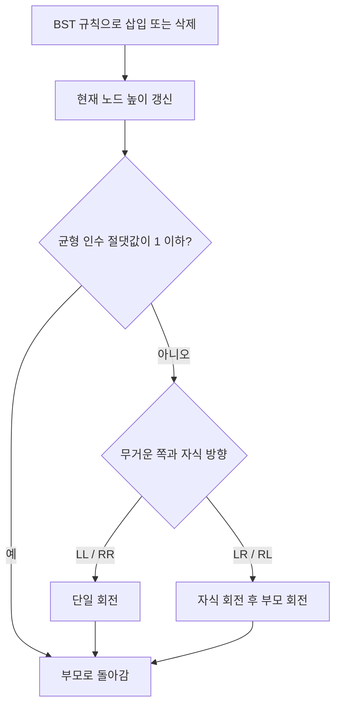

import { AlgorithmSimulation } from "#guide-sim";

# AVL Tree — 정렬 순서를 지키면서 높이가 한쪽으로 쏠리지 않게 하기

## 먼저 문제를 한 문장으로

이진 탐색 트리의 정렬 규칙은 지키되, 삽입과 삭제 뒤 높이 차이가 1을 넘으면 회전해 최악의 경우에도 `O(log n)`을 유지한다.

## 처음 생각해 볼 방법과 막히는 지점

일반 BST에 `1, 2, 3, ...`을 넣으면 트리가 연결 리스트처럼 길어진다. 그러면 탐색과 삽입이 `O(n)`이 된다. AVL은 각 노드의 왼쪽 높이에서 오른쪽 높이를 뺀 균형 인수를 보고, 절댓값이 2가 되는 즉시 국소 회전으로 문제를 고친다.

## 돌파구가 되는 관찰

회전은 노드의 상대적 중위 순서를 바꾸지 않는다. 즉, BST 규칙을 보존한 채 높이만 줄일 수 있다. 바깥쪽으로 기운 LL·RR은 한 번 회전하고, 안쪽으로 꺾인 LR·RL은 자식 회전 뒤 부모 회전을 한다. 회전 뒤에는 아래 노드부터 높이를 다시 계산해야 한다.

## 실행 시각화

`30, 20, 10`을 순서대로 삽입하면 30의 균형 인수는 2가 된다. 이는 LL 패턴이므로 30을 오른쪽으로 회전한다. 아래 재생은 표준 AVL 삽입 규칙의 상태다.

> 대화형 시뮬레이션은 MDX 런타임에서 표시됩니다.

export const avlSteps = [
  { title: "30 삽입", detail: "첫 노드는 루트이며 높이는 1이다.", root: { id: 30, label: "30 (h=1)" } },
  { title: "20 삽입", detail: "20은 30의 왼쪽. 아직 균형 인수는 1이다.", root: { id: 30, label: "30 (h=2)", children: [{ id: 20, label: "20 (h=1)" }] } },
  { title: "10 삽입: LL 불균형", detail: "30의 왼쪽 높이가 두 단계 더 크다. 30에서 오른쪽 회전이 필요하다.", root: { id: 30, label: "30 (BF=2)", status: "active", children: [{ id: 20, label: "20", children: [{ id: 10, label: "10" }] }] } },
  { title: "오른쪽 회전 후", detail: "20이 루트가 되고 중위 순서 10, 20, 30은 유지된다.", root: { id: 20, label: "20 (h=2)", status: "visited", children: [{ id: 10, label: "10 (h=1)" }, { id: 30, label: "30 (h=1)" }] } },
];

<AlgorithmSimulation view="tree" steps={avlSteps} title="AVL Tree: LL 회전" />

## 알고리즘의 흐름 한눈에 보기

## 왜 항상 맞는가

삽입·삭제 전에는 각 서브트리가 BST이고 균형이라고 가정한다. 변경 경로 밖의 서브트리는 변하지 않는다. 경로의 각 노드에서 회전은 중위 순서를 보존하므로 BST 규칙을 깨지 않는다. 네 가지 경우에 맞는 회전은 해당 노드의 높이 차이를 1 이하로 되돌리고, 높이를 갱신하며 위로 올라가면 루트까지 같은 성질이 회복된다.

## 구현할 때 놓치기 쉬운 점

삭제가 더 어렵다. 자식 둘이 있는 노드는 오른쪽 서브트리의 최솟값(중위 후계자)으로 값을 바꾼 뒤, 그 후계자를 실제로 삭제하고 되돌아오며 다시 균형을 잡아야 한다. 중복은 삽입하지 않아야 `size`가 늘지 않는다. 탐색·삽입·삭제는 `O(log n)`, 중위 순회는 `O(n)`이다.

## 스스로 점검하기

1. `30, 10, 20`은 왜 한 번의 오른쪽 회전만으로 해결되지 않을까?
2. 회전 뒤 두 노드의 높이를 어떤 순서로 갱신해야 할까?
