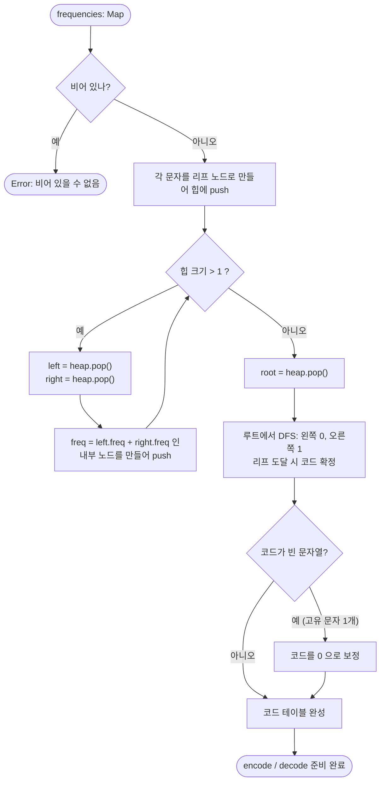

import { AlgorithmSimulation } from "#guide-sim";

# HuffmanTree — 합칠 때 드는 비용이 곧 두 빈도의 합이라서, 작은 것부터 합친다

## 한눈에 보는 컨셉

문자마다 등장 빈도가 다를 때, 빈도가 높은 문자에 짧은 비트 코드를 주어 전체 길이를 줄이는 알고리즘이에요. 핵심 관찰은 **"두 노드를 합칠 때 늘어나는 비트 수는 정확히 두 빈도의 합"**이라는 것이고, 여기서 "합계가 작은 것부터 합친다"는 탐욕 규칙이 곧바로 따라 나옵니다. 최소 힙으로 이 결합을 반복하면 `O(n log n)`에 **이론적으로 최적인** 압축 코드가 나와요.

## 출발점: 가장 순진한 방법부터

먼저 풀 문제를 정확히 고정하고 갑시다.

```ts
class HuffmanTree {
  constructor(frequencies: Map<string, number>)  // 문자 → 등장 횟수
  encode(text: string): string                   // 텍스트 → '0'/'1' 비트 문자열
  decode(bits: string): string                   // 비트 문자열 → 원본 텍스트
  codeTable(): Map<string, string>               // 문자 → 코드
  compressionRatio(text: string): number         // 압축 비트 수 / (길이 × 8)
}
```

- **입력 계약**: `frequencies`의 값은 모두 양의 정수이고, 비어 있지 않습니다. `encode`에 들어오는 텍스트는 `frequencies`에 있는 문자만 씁니다.
- **출력 계약**: `decode(encode(t)) === t`가 항상 성립해야 합니다(무손실).
- **규모**: 고유 문자 최대 256개($n$), 텍스트 최대 $10^5$자($m$).

**목표 복잡도부터 예측해 둡시다.** `encode`와 `decode`는 텍스트를 한 번씩은 훑어야 하니 $O(m)$ 아래로 내려갈 수 없고, 이건 개선의 여지가 없습니다. 관건은 **트리 구성**이에요. 문자 $n$개를 하나로 묶으려면 결합이 $n-1$번 필요한데, 한 번의 결합에 얼마를 쓰느냐가 전체를 좌우합니다. 매번 남은 것을 전부 훑으면 결합당 $O(n)$이라 총 $O(n^2)$이고, 결합당 $O(\log n)$에 끝낼 수 있다면 $O(n \log n)$이 됩니다. $n \le 256$이면 $O(n^2)$도 제한은 통과하지만, **$O(n \log n)$을 목표로 잡고** 마지막에 도달했는지 확인하겠습니다.

이제 이 문제를 처음 만났다고 생각하고, 가장 정직한 방법부터 시작해 봅시다.

### 첫 번째 시도: 모든 문자에 같은 폭을 준다

문자를 비트로 바꾸려면 문자마다 비트 패턴이 하나씩 있어야 하죠. 가장 단순한 배정은 **전부 같은 길이**로 주는 겁니다. 길이가 같으면 비트열을 그 길이로 잘라 읽기만 하면 되니 해석도 고민할 게 없어요. ASCII 8비트가 딱 이 방식입니다.

아래 빈도표를 예제로 씁시다. 21글자짜리 짧은 로그에서 잰 빈도라고 해 둘게요.

```text
문자   a   b   c   d   e   f   g      합계
빈도   9   2   2   2   2   2   2       21

고정 길이(8비트/문자)  21 × 8 = 168 bit
```

그런데 여기서 뭔가 걸립니다. `a`는 9번, 나머지는 2번씩인데 **전부 똑같이 8비트**를 씁니다. 9번이나 나오는 문자에 짧은 코드를 주면 그 이득이 9배로 돌아올 텐데, 고정 길이는 그 기회를 통째로 버려요.

> 관찰 ①: 빈도가 치우쳐 있다면, 길이도 치우치게 줘야 한다. **가변 길이 코드**로 가자.

### 두 번째 시도: 위에서부터 반씩 쪼갠다

가변 길이로 가기로 했으면 곧바로 다음 질문이 옵니다 — **어느 문자에 몇 비트를 줄 것인가?**

여기서 가장 자연스럽게 떠오르는 절차가 있습니다. 코드의 첫 비트는 전체를 두 덩어리로 가르는 역할이니, **빈도 합이 최대한 비슷하게 반으로 갈라** 한쪽에 `0`, 다른 쪽에 `1`을 주고, 각 덩어리 안에서 같은 일을 재귀적으로 반복하는 겁니다. 반씩 자르면 깊이가 균형 잡히고, 빈도가 큰 쪽이 먼저 확정되니 그럴듯하죠.

실제로 이 방법이 역사적으로 먼저 나왔습니다(**Shannon-Fano 코딩**). 위 빈도표에 돌려 봅시다.

```text
빈도 내림차순:  [a:9][b:2][c:2][d:2][e:2][f:2][g:2]   합 21

분할 1  {a,b} 11  vs  {c,d,e,f,g} 10      차이 1   <- 가장 균등한 지점
        (참고: {a} 9 vs 나머지 12 는 차이 3 이라 밀린다)
        => 왼쪽은 "0...", 오른쪽은 "1..." 로 시작

  분할 2  {a} 9 vs {b} 2                  => a = "00",  b = "01"

  분할 3  {c,d} 4  vs  {e,f,g} 6          차이 2
    분할 4  {c} vs {d}                    => c = "100", d = "101"
    분할 5  {e} 2 vs {f,g} 4              => e = "110"
      분할 6  {f} vs {g}                  => f = "1110", g = "1111"
```

여기서 이미 결정적인 일이 벌어졌습니다. **분할 1이 `a`를 `b`와 같은 덩어리에 넣어 버렸어요.** 합을 균등하게 맞추려다 보니 그렇게 됐는데, 그 결과 `a`는 최소 2비트를 받게 확정됩니다 — 아무리 자주 나와도 첫 분할에서 혼자 떨어져 나오지 못했으니까요.

끝까지 돌리면 이런 코드가 나옵니다. 허프만이 내놓는 답과 나란히 놓아 볼게요.

```text
문자  빈도   Shannon-Fano        허프만
 a     9     00     (2 bit)     0      (1 bit)
 b     2     01     (2 bit)     1100   (4 bit)
 c     2     100    (3 bit)     1101   (4 bit)
 d     2     101    (3 bit)     1110   (4 bit)
 e     2     110    (3 bit)     1111   (4 bit)
 f     2     1110   (4 bit)     100    (3 bit)
 g     2     1111   (4 bit)     101    (3 bit)

총 비트   Shannon-Fano 56 bit
          허프만       53 bit   <- 3비트 적다 (5.7% 손해)
          고정 길이   168 bit
```

고정 길이 168비트에 비하면 56비트도 훌륭한 성과예요. 방향은 맞았습니다. **그런데 최적은 아닙니다.** 같은 빈도표에서 3비트를 더 줄일 방법이 있는데 이 절차는 그걸 못 찾습니다.

3비트가 어디서 갈렸는지 문자별로 세어 봅시다.

```text
        Shannon-Fano        허프만              차이
 a      9 x 2 = 18 bit      9 x 1 =  9 bit     -9   <- 허프만이 크게 번다
 b~e    2x2 + 2x3x3 = 22    2 x 4 x 4 = 32     +10  <- 허프만이 손해를 본다
 f,g    2 x 4 x 2 = 16      2 x 3 x 2 = 12     -4   <- 허프만이 조금 번다
                                               ---
                                                -3
```

허프만은 `b`~`e`에서 10비트를 **더 쓰면서까지** `a`를 1비트로 끌어내렸고, 그 거래에서 3비트가 남았습니다. 9번 등장하는 문자의 1비트는 2번 등장하는 문자의 1비트보다 4.5배 무겁다는 걸 정확히 계산해 낸 거예요. Shannon-Fano는 그 거래를 할 기회조차 갖지 못했습니다 — 분할 1에서 이미 `a`의 운명이 정해졌으니까요.

> **여기서 헷갈리기 쉬운 포인트**: "Shannon-Fano는 항상 나쁘다"가 아닙니다. 실제로 `"abracadabra"`(a:5, b:2, r:2, c:1, d:1)에 두 방법을 돌리면 **둘 다 정확히 23비트**로 비깁니다. 직접 해 보면 같은 답이 나와서 "차이가 없네?" 하고 넘어가기 쉬워요. Shannon-Fano의 문제는 *항상* 지는 게 아니라 **최적을 보장하지 못한다**는 것입니다. 위 빈도표처럼 갈리는 입력이 존재한다는 사실 하나로 "이 절차는 최적 알고리즘이 아니다"가 확정됩니다.

그럼 왜 못 찾을까요? 위에서 아래로 쪼개는 절차는 **분할을 결정하는 순간, 그 결정이 최종적으로 몇 비트를 물릴지 아직 모릅니다.** 분할 1에서 `{a,b}`를 한 덩어리로 묶을 때, 그 덩어리가 앞으로 몇 번 더 쪼개질지는 그때 알 수 없어요. 그런데 `a`의 최종 코드 길이는 정확히 그 횟수로 정해집니다. **결정에 필요한 정보가 아직 아래에 있는데 위에서 먼저 결정해 버리는** 구조인 겁니다.

> 관찰 ②: 위에서 쪼개면 **결정할 때 필요한 정보가 아직 아래에 있다.** 그렇다면 **아래에서부터** 쌓아 올려야 하는 것 아닐까?

이 낌새를 붙잡고 다음 절로 갑니다.

## 아이디어 자세히 들여다보기

### 합치면 그 값만큼 비용이 붙는다 — 수식과 그림

먼저 "총 비트 수"를 정확히 세는 식부터 정의합시다. 문자를 리프에만 두는 이진 트리 $T$에서, 리프 $c$의 깊이를 $depth_T(c)$라 하면 그 문자의 코드 길이가 곧 깊이입니다(루트에서 리프까지 내려온 횟수 = 비트 수). 문자 $c$는 $freq(c)$번 등장하고 매번 $depth_T(c)$비트를 쓰므로, 전체 비용은

$$\text{WPL}(T) = \sum_{c \in \text{Leaves}} freq(c) \cdot depth_T(c)$$

입니다. 이 값을 **가중 경로 길이**(weighted path length)라고 부르고, 우리가 최소화할 목적 함수예요. 여기까지는 정의일 뿐입니다. 이제 이 정의를 **완전히 다른 방식으로 다시 세어** 보겠습니다. 이 재해석이 이 알고리즘의 전부입니다.

두 노드 $x$와 $y$를 합쳐 새 부모를 만든다고 해 봅시다. 무슨 일이 벌어질까요?

```text
Before:      x:3          y:4        <- 아직 부모가 없는 두 서브트리
                                        (x 아래 리프 빈도 합 = 3, y 아래 = 4)

After:            *:7                <- 새 부모를 만들어 둘을 자식으로 매단다
                 /   \
              x:3     y:4            <- x, y 아래 "모든" 리프가 한 칸씩 깊어진다
```

$x$ 아래 있던 **모든 리프가 한 칸씩 깊어집니다.** $y$ 아래 리프들도 마찬가지고요. 깊이가 1 늘면 그 리프는 코드가 1비트 길어지고, 그 문자는 $freq$번 등장하니 $freq$비트가 추가됩니다. 그러므로 이 결합으로 늘어나는 총 비트 수는

$$\underbrace{\sum_{c \in x} freq(c)}_{= \,freq(x)} + \underbrace{\sum_{c \in y} freq(c)}_{= \,freq(y)} \;=\; freq(x) + freq(y)$$

즉 **새로 만든 부모 노드에 적힌 그 값 자체**입니다. 결합 한 번의 비용이 정확히 부모의 빈도예요.

트리는 결합을 반복해서 만들어지고 각 결합이 자기 부모 값만큼 비용을 내므로, 다음이 성립합니다.

> **총 비트 수 = 모든 내부 노드에 적힌 빈도의 합**

`"abracadabra"`(a:5, b:2, r:2, c:1, d:1)로 확인해 봅시다. 완성된 트리는 이렇게 생겼어요. (`*`는 문자가 없는 내부 노드입니다.)

```text
                    root:11
                   /       \
                a:5         *:6
                           /   \
                        *:2     *:4
                       /   \   /   \
                     c:1 d:1 b:2   r:2

내부 노드:  *:2  *:4  *:6  root:11   ->  2 + 4 + 6 + 11 = 23
Sfreq x depth:  a 5x1 + c 1x3 + d 1x3 + b 2x3 + r 2x3 = 5 + 3 + 3 + 6 + 6 = 23
```

두 방식이 **23으로 정확히 일치**합니다(무작위 빈도 4371건에 대해 교차 검증했고, 전부 일치했습니다).

> 잠깐, 확인 하나만 해 볼까요? 위 트리에서 `c`와 `d`를 서로 바꾸면 총 비트 수가 달라질까요?
>
> 달라지지 않습니다. 둘 다 빈도 1, 깊이 3이라 각자 3비트로 같고, 내부 노드 값도 하나도 안 바뀌니까요. 코드 테이블만 `c→101, d→100`으로 바뀝니다. **총 비용은 트리의 "모양"이 정하지, 리프에 어떤 이름표를 붙였는지가 정하는 게 아니라는** 뜻이에요.

이제 관찰 ②로 돌아갑시다. 총 비용이 내부 노드 값의 합이라면, **비용을 줄이려면 내부 노드 값들을 작게 만들어야** 합니다. 그런데 내부 노드 값은 자기 아래 리프 빈도의 총합이고, **일찍 합쳐진 노드일수록 그 위의 모든 조상 합계에 계속 포함됩니다.**

```text
c:1 과 d:1 을 1단계에서 합치면 -> 값 2 가 만들어지고
                                  그 위 *:6 에도 포함되고
                                  그 위 root:11 에도 포함된다  (3번 세어짐)

a:5 를 마지막에 합치면        -> root:11 에만 포함된다        (1번 세어짐)
```

빈도가 큰 값이 여러 번 세어지면 손해니까, **큰 값은 최대한 늦게, 작은 값부터 먼저 합쳐야 합니다.** 이것이 "매 단계 최솟값 두 개를 결합한다"는 탐욕 규칙의 정체예요. 그리고 이 규칙은 **아래에서 위로**(bottom-up) 진행합니다 — 관찰 ②가 요구한 방향 그대로입니다.

같은 렌즈로 아까 Shannon-Fano의 패배도 설명됩니다. 위에서 쪼개는 절차는 **가장 큰 내부 노드(루트 = 전체 합)를 맨 먼저 확정**하고 내려가는데, 정작 조절 가능한 건 작은 값들이거든요. 방향이 거꾸로였던 겁니다.

### 단서를 설명해 주는 이론 — 탐욕 선택 속성과 최적 부분 구조

"작은 것부터 합친다"는 규칙은 매 순간 **그 순간 가장 좋아 보이는 선택**을 하고 되돌아보지 않습니다. 이런 알고리즘을 **탐욕 알고리즘**(greedy algorithm)이라 부르고, 탐욕이 전역 최적을 보장하려면 두 가지 성질이 필요합니다. 이 두 성질은 뒤의 정당성 논증에서 그대로 두 개의 보조정리가 되니, 지금 이름과 뜻을 확실히 잡아 두세요.

**① 탐욕 선택 속성 (greedy choice property).** *"지금 하는 탐욕적 선택을 포함하는 최적해가 적어도 하나 존재한다."*

이게 왜 필요한지가 중요합니다. 탐욕은 "내 선택이 유일한 정답"이라고 주장하지 않아요. 주장하는 건 **"내 선택을 하고도 여전히 최적에 도달할 수 있다"**입니다. 최적해가 여러 개일 때 그중 내 선택과 어울리는 놈이 하나라도 있으면 충분하죠. 우리 문제에서는 이렇게 번역됩니다 — *"빈도가 가장 작은 두 문자를 형제로 두는 최적 트리가 존재한다."*

**② 최적 부분 구조 (optimal substructure).** *"탐욕적 선택을 하고 나면, 남은 문제는 같은 종류의 더 작은 문제가 되고, 그 작은 문제의 최적해를 붙이면 전체 최적해가 된다."*

이 성질이 있어야 "선택 → 축소 → 반복"이 정당해집니다. 우리 문제에서는 이렇게 번역됩니다 — *"$x$와 $y$를 합쳐 만든 노드를 빈도 $freq(x)+freq(y)$짜리 **새로운 하나의 심볼**로 취급하면, 문자가 $n-1$개인 같은 문제가 된다."*

두 성질이 모두 성립하면 수학적 귀납법이 돌아갑니다: ①로 첫 선택을 정당화하고, ②로 문제 크기를 1 줄이고, 줄어든 문제에 같은 논증을 반복하는 거예요. **이 두 조각을 뒤의 "왜 모순 없이 작동하는가"에서 다시 소환해 실제로 증명할 테니 기억해 두세요.**

참고로 탐욕이 늘 통하는 건 아닙니다. 0/1 배낭 문제에 "단위 무게당 가치가 큰 것부터" 탐욕을 쓰면 최적이 아니에요 — 탐욕 선택 속성이 성립하지 않기 때문입니다. 그래서 이 두 성질을 **증명해야 하는 것**이지, 그럴듯해 보인다고 가정할 수 있는 게 아닙니다.

### 셈을 맡는 자료구조 — 최소 힙

매 단계 "지금 남은 것 중 빈도가 가장 작은 두 개"를 꺼내야 합니다. 이 역할, 즉 **원소를 계속 넣으면서도 최솟값을 빠르게 꺼내는** 일을 최소 힙(min-heap)이 맡습니다. 우리에게 필요한 건 딱 세 가지 연산이에요.

| 연산 | 하는 일 | 비용 |
|------|---------|------|
| `push(node)` | 노드 하나 추가 | `O(log n)` |
| `pop()` | 최솟값 꺼내기 | `O(log n)` |
| `size` | 남은 개수 | `O(1)` |

힙 자체의 구조와 `bubbleUp`/`bubbleDown`이 왜 `O(log n)`인지는 이 프로젝트의 전용 가이드에서 다룹니다 — [minHeap 가이드](../../heap/minHeap/minHeap-guide.mdx)를 참고하세요. 여기서는 "최솟값을 로그 시간에 꺼내 주는 상자"로만 쓰겠습니다.

### 왜 모순 없이 작동하는가

증명할 것이 두 가지입니다. **(A) 만들어진 코드로 항상 원문을 복원할 수 있는가**, **(B) 그 코드가 정말 최소 비트인가.**

#### (A) 어떤 코드도 다른 코드의 접두사가 아니다

먼저 왜 이게 필요한지부터 봅시다. 접두사 관계가 생기면 어떻게 망가지는지 구체적으로 보여 드릴게요.

```text
a -> "0"      b -> "01"     c -> "1"        <- b의 코드가 a의 코드로 시작한다

비트열 "01" 을 받았다면?
  해석 1:  "01"     -> b
  해석 2:  "0" "1"  -> a, c  => "ac"
둘 다 유효하다. 원문을 복원할 방법이 없다.
```

구분자 없이 비트만 이어 붙이려면 이런 모호함이 **한 번도** 생기면 안 됩니다. 그래서 필요한 성질이 **접두어 없음**(prefix-free)이고, 이제 우리 트리가 항상 이 성질을 만족함을 귀납으로 보입니다. 부여 규칙은 "왼쪽 자식으로 내려가면 `0`, 오른쪽이면 `1`을 뒤에 붙인다"입니다.

- **기저**: 리프가 하나뿐인 트리. 코드가 하나뿐이라 "다른 코드의 접두사"를 따질 상대 자체가 없으므로 조건이 공허하게 참입니다.
- **귀납 가정**: 리프가 $k$개 미만인 모든 트리에서 접두어 없음이 성립한다고 하자.
- **귀납 단계**: 리프가 $k$개인 트리 $T$의 루트가 왼쪽 서브트리 $L$과 오른쪽 서브트리 $R$을 갖는다고 합시다. $L$, $R$은 리프가 각각 $k$개 미만이므로 귀납 가정이 적용됩니다. 두 코드 $u, v$를 아무렇게나 골랐을 때 경우는 셋뿐이고, 이 셋 말고는 없습니다(두 리프는 반드시 $L$에 둘 다 있거나, $R$에 둘 다 있거나, 갈라져 있으니까요).
  1. **둘 다 $L$에 있음**: $T$에서의 코드는 $L$에서의 코드 앞에 `0`을 똑같이 붙인 것입니다. 귀납 가정으로 $L$ 안에서 접두사 관계가 없었고, 양쪽에 같은 문자를 앞에 붙여도 접두사 관계는 새로 생기지 않습니다.
  2. **둘 다 $R$에 있음**: 같은 논리로 성립합니다(`1`을 붙임).
  3. **하나는 $L$, 하나는 $R$**: 첫 비트가 각각 `0`과 `1`로 **다릅니다.** 접두사가 되려면 첫 비트부터 같아야 하므로 어느 쪽도 다른 쪽의 접두사가 될 수 없습니다.

세 경우 모두에서 성립하므로 $T$도 접두어 없음을 만족합니다. **∎**

알고리즘은 힙 크기가 1이 될 때까지 결합만 하므로 최종 트리도 이 성질을 갖고, 따라서 `decode`는 "루트에서 출발해 비트를 따라 내려가다 리프를 만나면 문자를 적고 루트로 돌아간다"만으로 유일하게 복원됩니다.

#### (B) 이 트리가 최소 비트다

앞 절에서 예고한 두 보조정리를 실제로 증명합니다.

**보조정리 1 (탐빅 선택 속성).** *빈도가 가장 작은 두 문자 $x, y$를 형제(같은 부모의 두 자식)로 갖는 최적 트리가 존재한다.*

*증명.* 최적 트리 $T^*$를 아무거나 하나 잡습니다. $T^*$에서 **가장 깊은** 곳에 있는 두 형제 리프를 $p, q$라 합시다. 이런 쌍은 반드시 존재해요 — 모든 내부 노드가 자식을 정확히 둘 가지므로, 가장 깊은 리프의 형제도 리프여야 하기 때문입니다(형제가 내부 노드면 그 아래에 더 깊은 리프가 있어 "가장 깊다"에 모순).

이제 $x$와 $p$의 자리를, 그리고 $y$와 $q$의 자리를 맞바꿉니다. 총 비용이 얼마나 변하는지 계산해 보죠. $x$와 $p$만 먼저 봅시다. 교환 전에는 $freq(x) \cdot depth(x) + freq(p) \cdot depth(p)$였고, 교환 후에는 두 문자가 자리를 맞바꿨으니 $freq(x) \cdot depth(p) + freq(p) \cdot depth(x)$입니다. 차이는

$$\Delta_1 = \big(freq(x) \cdot depth(p) + freq(p) \cdot depth(x)\big) - \big(freq(x) \cdot depth(x) + freq(p) \cdot depth(p)\big)$$

이고, $freq(x)$끼리 $freq(p)$끼리 묶으면

$$\Delta_1 = freq(x)\big(depth(p) - depth(x)\big) - freq(p)\big(depth(p) - depth(x)\big) = \big(freq(x) - freq(p)\big)\big(depth(p) - depth(x)\big)$$

로 정리됩니다. 이제 **두 괄호의 부호를 각각 따집니다.**

- 첫 괄호 $freq(x) - freq(p) \le 0$: $x$는 **전체에서 빈도가 가장 작은** 문자이므로 $freq(x) \le freq(p)$입니다.
- 둘째 괄호 $depth(p) - depth(x) \ge 0$: $p$는 $T^*$에서 **가장 깊은** 리프이므로 $depth(p) \ge depth(x)$입니다.

$(\le 0) \times (\ge 0) = (\le 0)$이므로 $\Delta_1 \le 0$입니다. 똑같은 논리를 $y$와 $q$에 적용하면 $\Delta_2 \le 0$이고(이번엔 $y$가 두 번째로 작은 빈도, $q$가 남은 것 중 가장 깊은 리프입니다), 총 변화량은 $\Delta_1 + \Delta_2 \le 0$입니다.

즉 교환해도 비용이 **늘지 않습니다.** 그런데 $T^*$는 최적이었으므로 비용이 줄어들 수도 없습니다(줄면 $T^*$가 최적이 아니었다는 모순). 따라서 $\Delta_1 + \Delta_2 = 0$이고, **교환한 트리도 여전히 최적**입니다. 그 트리에서는 $x, y$가 원래 $p, q$가 있던 자리, 즉 형제 자리에 있습니다. **∎**

**보조정리 2 (최적 부분 구조).** *$x, y$를 합쳐 만든 노드를 빈도 $f = freq(x)+freq(y)$인 새 심볼 $z$로 대체한 문자 집합을 $S'$라 하자. $S'$에 대한 최적 트리 $T'$의 리프 $z$를 다시 $x, y$를 자식으로 갖는 노드로 펼치면, 그 결과 $T$는 원래 집합 $S$에 대한 최적 트리다.*

*증명.* 먼저 두 트리의 비용 관계를 봅시다. $T$는 $T'$의 리프 $z$ 자리에 $x, y$를 매단 것이므로, $x$와 $y$의 깊이는 $depth_{T'}(z) + 1$입니다. 그러므로

$$\text{WPL}(T) = \text{WPL}(T') - f \cdot depth_{T'}(z) + \big(freq(x) + freq(y)\big)\big(depth_{T'}(z)+1\big) = \text{WPL}(T') + f$$

가 됩니다($freq(x)+freq(y) = f$이므로 $depth_{T'}(z)$가 붙은 항끼리 상쇄되고 $f$만 남습니다). 즉 **$z$를 펼치는 비용은 항상 정확히 $f$이고, 이는 $T'$가 어떻게 생겼든 무관한 상수**입니다.

이제 $T$가 최적이 아니라고 가정해 봅시다. 그러면 $x, y$를 형제로 갖는 더 나은 트리 $U$가 있어 $\text{WPL}(U) < \text{WPL}(T)$입니다(보조정리 1이 $x, y$를 형제로 갖는 최적해의 존재를 보장하므로, 비교 대상을 그런 트리로 한정해도 됩니다). $U$에서 $x, y$ 형제 쌍을 다시 하나의 심볼 $z$로 접으면 $S'$에 대한 트리 $U'$를 얻고, 위와 같은 계산으로 $\text{WPL}(U') = \text{WPL}(U) - f$입니다. 그러면

$$\text{WPL}(U') = \text{WPL}(U) - f < \text{WPL}(T) - f = \text{WPL}(T')$$

가 되어 $T'$보다 나은 $S'$의 트리가 존재한다는 뜻이 됩니다. 이는 $T'$가 $S'$의 최적 트리라는 전제에 모순입니다. 따라서 $T$는 최적입니다. **∎**

**정리.** 두 보조정리를 문자 개수 $n$에 대한 귀납으로 묶습니다.

- **기저 ($n = 1$)**: 문자가 하나면 만들 수 있는 트리가 리프 하나짜리 하나뿐입니다. 후보가 유일하므로 그것이 곧 최소입니다.
- **기저 ($n = 2$)**: 두 문자를 합치는 방법은 하나뿐이라 각 1비트, 이것이 유일한 트리이므로 최적입니다.
- **귀납 가정**: 문자가 $n-1$개인 모든 입력에 대해 알고리즘이 최적 트리를 만든다고 하자.
- **귀납 단계**: 문자가 $n$개일 때 알고리즘은 최솟값 두 개 $x, y$를 합칩니다. 보조정리 1에 의해 $x, y$를 형제로 갖는 최적해가 존재하므로 이 선택은 최적을 배제하지 않습니다. 합친 뒤 남은 문제는 문자가 $n-1$개인 같은 문제이고, 귀납 가정에 의해 알고리즘은 그 문제의 최적 트리 $T'$를 만듭니다. 보조정리 2에 의해 $T'$를 펼친 $T$는 $n$개 문제의 최적 트리입니다.

따라서 모든 $n$에 대해 알고리즘의 출력은 최적입니다. **∎**

말로만 하면 미덥지 않으니 기계로도 확인했습니다. 고유 문자 2~6개짜리 무작위 빈도 **3000건**에 대해, 가능한 모든 트리 모양을 완전 탐색해 얻은 최소 비용과 이 알고리즘의 결과를 비교했고 **불일치는 0건**이었습니다.

#### 여기서 헷갈리기 쉬운 포인트

**첫째, "최솟값 두 개"를 어기면 정말 손해가 나는지** 숫자로 확인해 둡시다. `"abracadabra"`의 3단계에서 최솟값 둘(`*:2`, `*:4`)이 아니라 `a:5`와 `*:2`를 먼저 합쳐 보면:

```text
잘못된 결합:  a:5 + *:2(c,d) -> *:7,   그다음 *:4(b,r) + *:7 -> root:11
내부 노드:    *:2  *:4  *:7  root:11  ->  2 + 4 + 7 + 11 = 24 bit
올바른 결합:  *:2  *:4  *:6  root:11  ->  2 + 4 + 6 + 11 = 23 bit
```

단 1비트지만 분명한 손해입니다. 그리고 앞 절의 렌즈로 보면 이유가 즉시 보여요 — 큰 값 `5`를 일찍 합치는 바람에 그것이 상위 합계에 한 번 더 세어졌습니다(6이 7로 커진 게 정확히 그 흔적입니다).

**둘째, 동점 처리는 최적성을 깨지 않습니다.** 빈도가 같은 후보가 여럿일 때 어느 것을 먼저 꺼내느냐에 따라 **트리 모양과 개별 코드는 달라집니다.** 그래도 총 비트 수는 같아요. 보조정리 1의 증명에서 $x$에 요구한 조건은 "빈도가 가장 작음"뿐이고, 동점인 후보 아무거나 넣어도 $freq(x) - freq(p) \le 0$은 그대로 성립하기 때문입니다. 그래서 구현에서 동점을 어떻게 처리하든 **압축률은 동일**하고, 우리는 단지 **결과를 재현 가능하게** 만들려고 삽입 순서(`seq`)로 동점을 깹니다.

**셋째, `encode`와 `decode`는 같은 트리 인스턴스를 써야 합니다.** 동점 처리 규칙이 없거나 불안정한 구현이라면 같은 빈도표로 트리를 두 번 만들었을 때 코드 테이블이 달라질 수 있습니다. 한쪽 트리로 만든 비트열을 다른 트리로 디코딩하면 조용히 다른 문자가 나옵니다.

#### 엣지 케이스

```text
frequencies 가 빈 맵        -> 트리를 만들 수 없다. Error("frequencies는 비어 있을 수 없습니다")
고유 문자 1개 (예: x:7)     -> 결합이 0회. 루트 자체가 리프이고 코드가 빈 문자열이 된다.
                               관례로 "0"을 부여 -> encode("xxxx") = "0000", ratio = 4/(4x8) = 0.125
                               (이 경우에만 "총 비트 = 내부 노드 합" 항등식이 적용되지 않는다.
                                내부 노드가 하나도 없어 합이 0이지만 실제로는 1비트씩 쓰기 때문)
frequencies 에 없는 문자     -> Error("frequencies에 없는 문자: z")
빈 텍스트 encode("")         -> "" (길이 0). ratio 는 0/0 이 되므로 0을 반환하도록 가드
```

## 아이디어를 코드로 옮기기

먼저 아이디어를 **그대로** 옮깁니다. "남은 것 중 최솟값 두 개를 찾아 합치기"를 반복하되, 최솟값 찾기는 가장 정직하게 **전체를 훑어서** 합니다.

노드 타입부터 봅시다. 여기서 한 가지 설계를 짚고 갈게요.

```ts
type HuffmanNode =
  | { kind: "leaf"; char: string; freq: number; seq: number }
  | { kind: "internal"; freq: number; seq: number; left: HuffmanNode; right: HuffmanNode };
```

**리프와 내부 노드를 서로 다른 타입으로 갈랐습니다.** 이러면 "문자는 리프에만 있다"는 규칙이 주석이 아니라 **타입으로 강제**됩니다 — 내부 노드에는 `char` 필드가 아예 없어서 실수로 읽을 수가 없고, 반대로 리프에는 `left`/`right`가 없어 자식을 따라 내려갈 수도 없어요. 컴파일러가 `kind`를 검사하도록 만들면 (A)의 접두어 없음이 기대는 구조적 전제를 코드가 저절로 지킵니다.

```ts
function isLess(a: HuffmanNode, b: HuffmanNode): boolean {
  return a.freq !== b.freq ? a.freq < b.freq : a.seq < b.seq;
}

function buildTreeNaive(frequencies: Map<string, number>): HuffmanNode {
  if (frequencies.size === 0) throw new Error("frequencies는 비어 있을 수 없습니다");

  let seq = 0;
  const nodes: HuffmanNode[] = [];
  for (const [char, freq] of frequencies) {
    nodes.push({ kind: "leaf", char, freq, seq: seq++ });
  }

  while (nodes.length > 1) {
    let i = 0;
    for (let k = 1; k < nodes.length; k++) if (isLess(nodes[k]!, nodes[i]!)) i = k;
    const left = nodes.splice(i, 1)[0]!;          // 최솟값을 빼낸다

    let j = 0;
    for (let k = 1; k < nodes.length; k++) if (isLess(nodes[k]!, nodes[j]!)) j = k;
    const right = nodes.splice(j, 1)[0]!;          // 남은 것 중 최솟값

    nodes.push({ kind: "internal", freq: left.freq + right.freq, seq: seq++, left, right });
  }
  return nodes[0]!;
}
```

**가장 실수가 잦은 부분은 두 번째 최솟값을 찾는 자리입니다.** 첫 최솟값을 `splice`로 **빼낸 뒤에** 다시 스캔해야 합니다. 빼내지 않고 "첫째와 둘째를 한 번에 찾겠다"고 하면 동점일 때 같은 원소를 두 번 고르는 버그가 나기 쉬워요. 먼저 빼고 다시 훑으면 그런 경우가 아예 생기지 않습니다.

`isLess`에서 **`freq`를 먼저 비교하고, 같을 때만 `seq`를 본다**는 순서도 중요합니다. 뒤집으면 빈도가 다른데도 삽입 순서가 우선순위를 결정해 최솟값 추출 자체가 깨집니다.

이 구현은 정확합니다. 결합을 $n-1$번 하고, 매번 남은 원소를 두 번 훑으므로 비용은

$$\sum_{k=2}^{n} 2k = O(n^2)$$

입니다. 고유 문자가 256개면 최악 약 6만 번의 비교라 제한 안에서는 무난히 돌아가요. 하지만 목표 복잡도는 `O(n log n)`이었죠. 어디가 낭비인지 보러 갑시다.

## 더 빠르게 만들 단서 찾기

낭비 지점을 그림으로 봅시다. 매 단계 우리가 실제로 *쓰는* 정보는 최솟값 두 개뿐인데, *읽는* 양은 남은 전부입니다.

```text
1단계  [a:5][b:2][r:2][c:1][d:1]   5개 전부 훑음 -> 쓰는 건 c:1, d:1  (2개)
2단계  [a:5][b:2][r:2][*:2]        4개 전부 훑음 -> 쓰는 건 b:2, r:2  (2개)
3단계  [a:5][*:4][*:2]             3개 전부 훑음 -> 쓰는 건 *:2, *:4  (2개)
4단계  [a:5][*:6]                  2개 전부 훑음 -> 쓰는 건 둘 다

읽은 총량 5+4+3+2 = 14,  실제로 필요한 정보는 매번 "가장 작은 2개"
```

그리고 결정적인 낭비가 하나 더 있습니다. **1단계에서 힘들게 알아낸 대소 관계를 2단계에서 통째로 버립니다.** 1단계에서 이미 `a:5`가 크다는 걸 알았는데, 2단계에서 또 `a:5`를 비교하고, 3단계에서 또 비교해요. 매 단계 순위를 처음부터 다시 매기는 셈입니다.

> 단서: 우리에게 필요한 건 **완전한 정렬이 아니라 "최솟값만" 빠르게 꺼내는 것**이고, 게다가 매 단계 **원소가 하나 추가**된다(합친 결과를 다시 넣는다). "삽입하면서 최솟값을 꺼내는" 이 요구가 바로 우선순위 큐의 정의입니다.

## 단서를 최적화로 연결하기

앞 절의 단서는 3.3에서 예고한 **최소 힙**을 정확히 가리킵니다. 배열 전체를 정렬 상태로 유지하는 대신, "부모가 자식보다 작거나 같다"는 느슨한 조건만 지키면 최솟값은 항상 맨 앞에 있고 갱신은 `O(log n)`에 끝나니까요.

바뀌는 것은 **최솟값을 얻는 방법 하나뿐**입니다. 알고리즘의 뼈대는 그대로예요.

```text
Before (기본 구현)                     After (힙)
  전체 스캔으로 최솟값 찾기  O(n)        heap.pop()             O(log n)
  전체 스캔으로 최솟값 찾기  O(n)        heap.pop()             O(log n)
  배열 끝에 push            O(1)        heap.push(합친 노드)    O(log n)
  --------------------------------      --------------------------------
  결합 1회당 O(n)                       결합 1회당 O(log n)
  총 O(n^2)                             총 O(n log n)
```

유지해야 할 불변식도 명확합니다.

> **루프 불변식**: 반복문 진입 시점마다, 힙 안의 노드들은 "아직 부모가 정해지지 않은 서브트리들"의 집합이고, 그 빈도의 총합은 항상 전체 문자 빈도의 합과 같다.

이 불변식이 종료를 보장합니다 — 결합 한 번에 원소가 2개 줄고 1개 늘어 순감 1이므로, $n$개에서 시작해 정확히 $n-1$번 만에 크기 1에 도달합니다.

## 최적화 코드

`buildTreeNaive`의 스캔 두 줄이 `heap.pop()` 두 번으로 바뀐 것이 변경의 전부입니다.

```ts
class MinHeap {
  private items: HuffmanNode[] = [];

  get size(): number {
    return this.items.length;
  }

  push(node: HuffmanNode): void {
    this.items.push(node);
    let i = this.items.length - 1;
    while (i > 0) {
      const parent = (i - 1) >> 1;
      if (!isLess(this.items[i]!, this.items[parent]!)) break;
      [this.items[i], this.items[parent]] = [this.items[parent]!, this.items[i]!];
      i = parent;
    }
  }

  pop(): HuffmanNode {
    const top = this.items[0]!;
    const last = this.items.pop()!;
    if (this.items.length > 0) {
      this.items[0] = last;
      let i = 0;
      for (;;) {
        const l = 2 * i + 1;
        const r = 2 * i + 2;
        let small = i;
        if (l < this.items.length && isLess(this.items[l]!, this.items[small]!)) small = l;
        if (r < this.items.length && isLess(this.items[r]!, this.items[small]!)) small = r;
        if (small === i) break;
        [this.items[i], this.items[small]] = [this.items[small]!, this.items[i]!];
        i = small;
      }
    }
    return top;
  }
}

export class HuffmanTree {
  private root: HuffmanNode;
  private codes = new Map<string, string>();

  constructor(frequencies: Map<string, number>) {
    if (frequencies.size === 0) throw new Error("frequencies는 비어 있을 수 없습니다");

    const heap = new MinHeap();
    let seq = 0;
    for (const [char, freq] of frequencies) {
      heap.push({ kind: "leaf", char, freq, seq: seq++ });
    }

    while (heap.size > 1) {
      const left = heap.pop();
      const right = heap.pop();
      heap.push({ kind: "internal", freq: left.freq + right.freq, seq: seq++, left, right });
    }

    this.root = heap.pop();
    this.buildCodes(this.root, "");
  }

  private buildCodes(node: HuffmanNode, prefix: string): void {
    if (node.kind === "leaf") {
      this.codes.set(node.char, prefix === "" ? "0" : prefix);
      return;
    }
    this.buildCodes(node.left, prefix + "0");
    this.buildCodes(node.right, prefix + "1");
  }

  encode(text: string): string {
    let bits = "";
    for (const ch of text) {
      const code = this.codes.get(ch);
      if (code === undefined) throw new Error(`frequencies에 없는 문자: ${ch}`);
      bits += code;
    }
    return bits;
  }

  decode(bits: string): string {
    if (this.root.kind === "leaf") {
      return this.root.char.repeat(bits.length);
    }
    let node = this.root;
    let text = "";
    for (const bit of bits) {
      node = bit === "0" ? node.left : node.right;
      if (node.kind === "leaf") {
        text += node.char;
        node = this.root;
      }
    }
    return text;
  }

  codeTable(): Map<string, string> {
    return new Map(this.codes);
  }

  compressionRatio(text: string): number {
    if (text.length === 0) return 0;
    return this.encode(text).length / (text.length * 8);
  }
}
```

**가장 중요한 줄은 `decode` 안의 `node = this.root` 한 줄입니다.** 리프에 도달해 문자를 적은 직후 반드시 루트로 되돌아가야 다음 비트가 새 문자의 시작으로 해석됩니다. 이 줄을 빼면 어떻게 조용히 망가지는지 실제로 돌려 봤습니다 — `encode("ab")`의 결과 `"0110"`을 디코딩하면 첫 비트 `'0'`에서 리프 `a`에 도달해 `'a'`를 적은 뒤 `node`가 리프 `a`에 그대로 머뭅니다. 다음 비트 `'1'`에서 `node.right`를 읽으려 하는데 리프에는 그 필드가 없어 `undefined`가 되고, 그 다음 줄에서 이 에러가 납니다.

```text
TypeError: undefined is not an object (evaluating 'node.kind')
```

놓치기 쉬운 자리를 두 곳 더 짚습니다.

- **`prefix === "" ? "0" : prefix`.** 고유 문자가 1개면 결합이 0회라 루트가 곧 리프이고, DFS 시작 시 `prefix`가 `""`입니다. 이 보정이 없으면 코드가 빈 문자열이 되어 `encode("xxxx")`가 `"0000"`(길이 4) 대신 `""`(길이 0)을 반환하고, 압축률이 실제 `0.125` 대신 `0`으로 보고됩니다 — "압축률 0%"라는 있을 수 없는 값이 조용히 나오는 함정이에요.
- **`decode`의 단일 리프 분기.** 루트가 리프면 `node.left` 접근 자체가 타입상 불가능하므로 일반 루프에 들어가기 전에 따로 처리해야 합니다.

> 기억법: **"리프를 만나면 적고, 루트로 돌아간다."** 디코딩은 이 한 문장의 반복입니다.

**더 빠르게 만들 여지가 있을까요?** 두 가지만 짚고 종료를 선언합니다.

- **입력이 이미 빈도순으로 정렬돼 있다면 `O(n)`이 가능합니다.** 정렬된 리프 큐와 "합쳐서 만든 노드" 큐 두 개를 두면, 새로 만들어지는 내부 노드의 빈도가 **단조 증가**하므로 두 큐의 앞만 비교해 최솟값을 `O(1)`에 얻을 수 있어요. 힙이 필요 없어집니다.
- **정렬돼 있지 않다면 `O(n log n)`이 한계입니다.** 빈도의 대소 관계를 알아야 결합 순서가 정해지는데, 비교만으로 $n$개의 순서를 확정하는 데는 $\Omega(n \log n)$이 필요하기 때문입니다.

더 나은 압축을 원한다면 알고리즘 자체를 바꿔야 합니다. 허프만은 심볼당 **정수 비트**만 줄 수 있어서 아무리 최적이어도 심볼당 1비트 아래로 못 내려가요. 위 21글자 예제에서 정보 이론적 하한(엔트로피)은 51.71비트인데 허프만은 53비트인 것이 그 간극입니다. 이 간극을 좁히려면 심볼당 1비트 미만을 표현할 수 있는 **산술 코딩**으로 가야 하는데, 구현 복잡도가 크게 올라갑니다. 그래서 실무에서는 여전히 허프만이 널리 쓰여요 — DEFLATE, JPEG, MP3가 모두 마지막 엔트로피 코딩 단계에 이 알고리즘을 씁니다.

마지막으로 한 가지. **빈도가 균등하면 허프만은 고정 길이를 못 이깁니다.** `a,b,c,d`가 각 1회면 코드는 `00, 01, 10, 11`로 전부 2비트, 고정 길이와 완전히 동일합니다. 이 알고리즘이 버는 이득은 처음부터 끝까지 **빈도 치우침**에서 나옵니다.

## 실행 시각화

`"abracadabra"`의 빈도(a:5, b:2, r:2, c:1, d:1)로 트리를 만드는 과정입니다. 실제로 실행하면 `codeTable()`은 `a→"0", c→"100", d→"101", b→"110", r→"111"`을, `encode("abracadabra")`는 길이 **23**의 비트열을, `compressionRatio("abracadabra")`는 **0.2614**를 반환합니다.

패널에 보이는 것은 **최소 힙의 실제 내부 배열**입니다. 정렬된 목록이 아니에요 — 힙은 "부모가 자식보다 작다"만 지키므로 형제 사이 순서는 정해져 있지 않습니다. 예를 들어 삽입 직후 배열이 `[c:1, d:1, r:2, a:5, b:2]`인데, `a:5`가 `b:2`보다 앞에 있어도 힙 조건은 깨지지 않습니다(둘은 서로 부모-자식 관계가 아니니까요). 아래 값은 전부 위 구현을 그대로 실행해 찍은 것입니다. 내부 노드는 자기 아래 문자들을 묶어 `cd`, `br`처럼 표기했고, `highlight`는 그 단계에서 새로 만들어져 힙에 들어간 노드입니다.

> 대화형 시뮬레이션은 MDX 런타임에서 표시됩니다.

export const steps = [
  {
    title: "빈도 맵을 리프로 만들어 힙에 삽입",
    detail: "a:5, b:2, r:2, c:1, d:1 을 차례로 push. 배열은 힙의 실제 내부 순서다",
    heap: [
      { label: "c", key: 1 },
      { label: "d", key: 1 },
      { label: "r", key: 2 },
      { label: "a", key: 5 },
      { label: "b", key: 2 },
    ],
    highlight: [],
  },
  {
    title: "1단계: pop 두 번 → c:1, d:1 결합",
    detail: "최솟값 c:1 과 d:1 을 꺼내 cd:2 를 만들어 다시 push",
    heap: [
      { label: "b", key: 2 },
      { label: "cd", key: 2 },
      { label: "r", key: 2 },
      { label: "a", key: 5 },
    ],
    highlight: [1],
  },
  {
    title: "2단계: pop 두 번 → b:2, r:2 결합",
    detail: "동점(2)이 셋이지만 삽입 순서가 앞선 b, r 이 먼저 나온다 → br:4",
    heap: [
      { label: "cd", key: 2 },
      { label: "a", key: 5 },
      { label: "br", key: 4 },
    ],
    highlight: [2],
  },
  {
    title: "3단계: pop 두 번 → cd:2, br:4 결합",
    detail: "a:5 가 아니라 cd:2 와 br:4 가 최솟값 두 개다 → cdbr:6",
    heap: [
      { label: "a", key: 5 },
      { label: "cdbr", key: 6 },
    ],
    highlight: [1],
  },
  {
    title: "4단계: 마지막 결합 → 루트 완성",
    detail: "a:5 + cdbr:6 → root:11. 힙 크기가 1이 되어 종료",
    heap: [{ label: "root", key: 11 }],
    highlight: [0],
  },
];

<AlgorithmSimulation view="priorityQueue" steps={steps} title="HuffmanTree 트리 구성 (abracadabra)" />

내부 노드에 적힌 값을 모두 더하면 `2 + 4 + 6 + 11 = 23`으로, `encode("abracadabra").length`와 정확히 같습니다. 3.1절의 항등식이 시뮬레이션 위에서 그대로 확인되는 셈이에요.

## 흐름 한눈에 보기

전체 알고리즘을 의사코드로 먼저 정리합니다.

```text
BUILD(frequencies):
    if frequencies 가 비었으면 -> Error
    heap <- 빈 최소 힙,  seq <- 0
    for (char, freq) in frequencies:
        heap.push( Leaf(char, freq, seq++) )
    while heap.size > 1:                       # 정확히 n-1 회 반복
        left  <- heap.pop()                    # 최솟값
        right <- heap.pop()                    # 두 번째 최솟값
        heap.push( Internal(left.freq + right.freq, seq++, left, right) )
    root <- heap.pop()
    ASSIGN(root, "")

ASSIGN(node, prefix):                          # 루트에서 DFS
    if node 가 리프:
        codes[node.char] <- (prefix 가 "" 이면 "0", 아니면 prefix)
        return
    ASSIGN(node.left,  prefix + "0")
    ASSIGN(node.right, prefix + "1")

ENCODE(text):
    각 문자를 codes 로 치환해 이어 붙인다      # codes 에 없으면 Error

DECODE(bits):
    if root 가 리프: return root.char 를 bits 길이만큼 반복
    node <- root
    for bit in bits:
        node <- (bit == "0" ? node.left : node.right)
        if node 가 리프:
            출력에 node.char 를 적고
            node <- root                       # 반드시 루트로 복귀
```

같은 내용을 흐름도로도 봅시다.



## 스스로 점검하기

1. 빈도가 `a:1, b:1, c:1, d:1, e:1`로 모두 같을 때, 이 가이드의 구현(동점은 삽입 순서로 처리)으로 트리를 손으로 만들어 보세요. 각 문자의 코드 길이가 전부 같게 나오나요? 총 비트 수를 **내부 노드 합**으로 세어 보고, `Σ freq × depth`로도 세어 같은 값이 나오는지 확인해 보세요.
2. 3.1절에서 "총 비트 = 내부 노드 빈도의 합"을 보였습니다. 그런데 엣지 케이스 절에는 **고유 문자가 1개일 때는 이 항등식이 성립하지 않는다**고 적혀 있어요. 왜 그럴까요? 항등식의 유도 과정 중 어느 단계가 이 경우에 무너지는지 짚어 보세요.
3. 본문에서 `"abracadabra"`는 Shannon-Fano와 허프만이 둘 다 23비트로 비긴다고 했습니다. 그렇다면 `a:9, b:2, c:2, d:2, e:2, f:2, g:2`에서는 왜 3비트가 갈릴까요? 두 방법이 `a`에 준 코드 길이(2비트 vs 1비트)에 주목해서, **어느 결정이 언제 내려졌는지**의 차이로 설명해 보세요.
