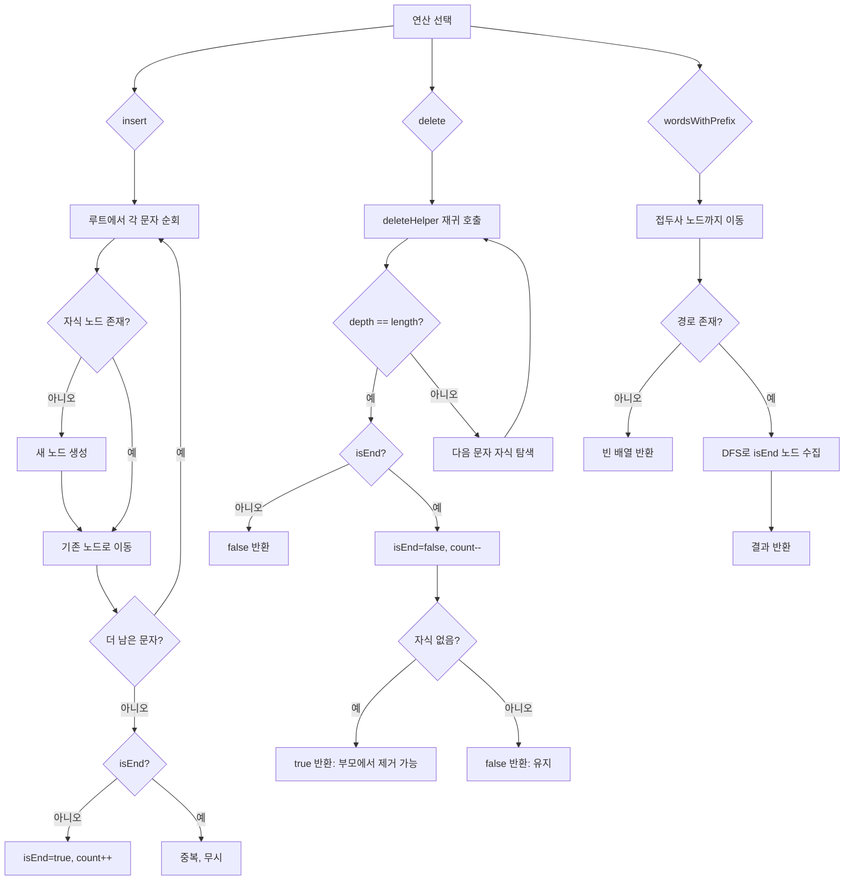

import { AlgorithmSimulation } from "#guide-sim";

# Trie 해설

## 성능 목표 예측

| 연산 | 시간복잡도 | 공간복잡도 | 비고 |
|------|-----------|-----------|------|
| insert | O(m) | O(m) | m = 단어 길이, 새 노드 최대 m개 |
| search | O(m) | O(1) | |
| startsWith | O(m) | O(1) | |
| delete | O(m) | O(1) | 재귀 스택 O(m) |
| wordsWithPrefix | O(m + k) | O(k) | k = 결과 단어 길이 합 |
| size | O(1) | O(1) | 카운터 유지 |

---

## 목표 함수

| 함수 | 시그니처 | 설명 |
|------|---------|------|
| insert | `(word: string) => void` | 단어 삽입 (중복 무시) |
| search | `(word: string) => boolean` | 정확한 단어 존재 여부 |
| startsWith | `(prefix: string) => boolean` | 접두사 존재 여부 |
| delete | `(word: string) => boolean` | 단어 삭제, 성공 여부 반환 |
| wordsWithPrefix | `(prefix: string) => string[]` | 접두사 일치 단어 목록 |
| size | `() => number` | 저장된 단어 수 |

---

## 핵심 아이디어

### 원형 아이디어와 naive 접근
단어 집합을 배열이나 해시셋으로 저장하면 `search`는 O(1)이지만 `wordsWithPrefix`는 O(전체 단어 수 × 단어 길이)가 된다. 접두사를 공유하는 단어들이 데이터 구조 안에서 아무 관계 없이 흩어져 있기 때문이다.

### 어떤 관찰이 돌파구가 되는가
문자열은 **접두사를 공유**한다. "apple"과 "application"은 "appl"까지 동일하다. 이 공유 부분을 트리 경로로 표현하면 한 번의 경로 탐색으로 모든 공통 접두사 단어를 찾는 서브트리에 도달할 수 있다.

### 관찰을 형식화: 상태/구조 정의
```ts
interface TrieNode {
  children: Map<string, TrieNode>;  // 다음 문자 → 다음 노드
  isEnd: boolean;                    // 여기서 단어가 끝나는가
}
```
루트는 빈 문자열을 나타내며, 경로 루트→노드가 특정 문자열을 나타낸다.

### 핵심 연산

**insert**
```
function insert(word):
  node = root
  for ch of word:
    if !node.children.has(ch):
      node.children.set(ch, newNode())
    node = node.children.get(ch)
  if !node.isEnd:
    node.isEnd = true
    count++
```

**search**
```
function search(word):
  node = traverse(word)  // 경로를 따라 내려감
  return node != null && node.isEnd
```

**delete (재귀 + pruning)**
```
function deleteHelper(node, word, depth):
  if depth == word.length:
    if !node.isEnd: return false  // 단어 없음
    node.isEnd = false
    count--
    return node.children.size == 0  // 자식 없으면 삭제 가능
  ch = word[depth]
  child = node.children.get(ch)
  if !child: return false
  shouldDelete = deleteHelper(child, word, depth+1)
  if shouldDelete:
    node.children.delete(ch)
    return !node.isEnd && node.children.size == 0
  return false
```

**wordsWithPrefix**
```
function wordsWithPrefix(prefix):
  node = traverse(prefix)
  if node == null: return []
  results = []
  dfs(node, prefix, results)
  return results

function dfs(node, current, results):
  if node.isEnd: results.push(current)
  for (ch, child) of node.children:
    dfs(child, current + ch, results)
```

### 정당성
`isEnd` 플래그 덕분에 노드 경로는 접두사를, 리프 여부와 관계없이 `isEnd`만으로 단어 종료를 표현한다. "app"이 "apple"의 접두사 경로에 함께 저장돼도 독립적으로 존재할 수 있다. delete의 pruning은 `isEnd`가 false이고 자식이 없을 때만 부모로부터 연결을 끊어 다른 단어 경로를 보존한다.

### 구현 디테일과 최적화
- **Map vs 배열**: 알파벳 소문자 26개만 쓰면 `new Array(26)` 고정 배열이 Map보다 빠르다. Unicode 범위가 필요하면 Map이 안전하다.
- **size 카운터**: `wordsWithPrefix("").length`로 매번 세는 대신, insert/delete 시 카운터를 관리하면 O(1).
- **메모리**: 단어가 많이 공유되면 해시셋 대비 메모리 절약. 공유가 거의 없으면 오히려 더 사용할 수 있다 — 이때는 RadixTree가 유리하다.

---

## 시뮬레이션

export const steps = [
  {
    title: "초기 상태: 빈 루트",
    detail: "루트 노드는 빈 문자열을 나타냄. children = {}, isEnd = false",
    array: ["ROOT"],
    highlight: [0],
    marked: [],
  },
  {
    title: "insert('cat'): c → a → t 경로 생성",
    detail: "각 문자에 대한 자식 노드 생성. 마지막 't' 노드에 isEnd=true",
    array: ["ROOT", "c", "a", "t(END)"],
    highlight: [1, 2, 3],
    marked: [],
  },
  {
    title: "insert('car'): c → a 공유, r 신규",
    detail: "'c'와 'a' 노드는 이미 존재. 'r' 노드만 새로 생성",
    array: ["ROOT", "c", "a", "t(END)", "r(END)"],
    highlight: [4],
    marked: [1, 2],
  },
  {
    title: "insert('card'): c→a→r 공유, d 신규",
    detail: "'c', 'a', 'r' 경로 공유. 'd' 추가",
    array: ["ROOT", "c", "a", "t(END)", "r(END)", "d(END)"],
    highlight: [5],
    marked: [1, 2, 4],
  },
  {
    title: "search('car'): c→a→r 이동 후 isEnd 확인",
    detail: "r 노드의 isEnd=true → true 반환",
    array: ["ROOT", "c", "a", "t(END)", "r(END)✓", "d(END)"],
    highlight: [4],
    marked: [1, 2],
  },
  {
    title: "delete('car'): r의 isEnd=false, 자식 있으므로 노드 유지",
    detail: "r에 'd' 자식이 있으므로 노드는 삭제하지 않음. isEnd만 false",
    array: ["ROOT", "c", "a", "t(END)", "r", "d(END)"],
    highlight: [4],
    marked: [1, 2, 5],
  },
];

<AlgorithmSimulation view="array" steps={steps} title="Trie 시뮬레이션 (cat, car, card)" />

---

## 수도 코드와 Activity Diagram

### 의사코드

```
Trie.insert(word):
  node = root
  for ch of word:
    if not node.children.has(ch):
      node.children.set(ch, { children: new Map(), isEnd: false })
    node = node.children.get(ch)
  if not node.isEnd:
    node.isEnd = true
    count += 1

Trie.search(word):
  node = root
  for ch of word:
    if not node.children.has(ch): return false
    node = node.children.get(ch)
  return node.isEnd

Trie.startsWith(prefix):
  node = root
  for ch of prefix:
    if not node.children.has(ch): return false
    node = node.children.get(ch)
  return true

Trie.delete(word):
  return deleteHelper(root, word, 0)

deleteHelper(node, word, depth):
  if depth == word.length:
    if not node.isEnd: return false
    node.isEnd = false; count -= 1
    return node.children.size == 0
  ch = word[depth]
  if not node.children.has(ch): return false
  child = node.children.get(ch)
  shouldDelete = deleteHelper(child, word, depth+1)
  if shouldDelete:
    node.children.delete(ch)
    return not node.isEnd and node.children.size == 0
  return false

Trie.wordsWithPrefix(prefix):
  node = root
  for ch of prefix:
    if not node.children.has(ch): return []
    node = node.children.get(ch)
  results = []
  dfs(node, prefix, results)
  return results

dfs(node, current, results):
  if node.isEnd: results.push(current)
  for (ch, child) of node.children:
    dfs(child, current + ch, results)
```

### Activity Diagram


