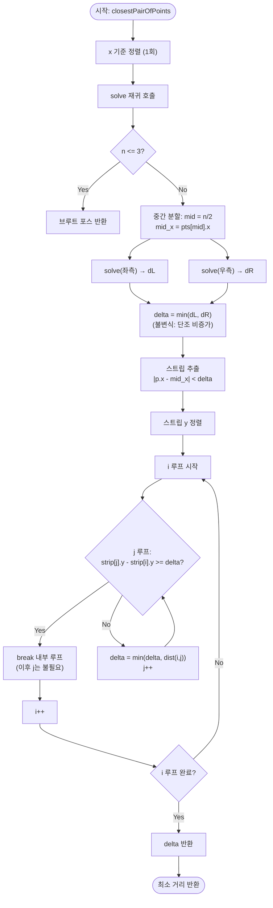

# closestPairOfPoints 해설 — 분할 정복

## 성능 목표 예측

| 제약 항목 | 값 |
|-----------|-----|
| 점 수 $n$ | $2 \leq n \leq 10^5$ |
| 좌표 범위 | $-10^9 \leq x, y \leq 10^9$ |

**naive 접근의 시간복잡도**

가장 단순한 접근은 모든 점 쌍을 비교하는 브루트 포스다.

$$T_{\text{naive}}(n) = \binom{n}{2} = \frac{n(n-1)}{2} = O(n^2)$$

$n = 10^5$에서 $\approx 5 \times 10^9$ 비교가 필요하므로 제한 초과다. 이 방법은 "더 가까운 쌍이 있다"는 사실을 알더라도 계산을 중단할 기준이 없기 때문에 본질적으로 개선이 어렵다.

**목표 복잡도**: $O(n \log n)$ — 분할 정복 점화식 $T(n) = 2T(n/2) + O(n)$의 해.

**공간 복잡도**: $O(n)$ — 재귀 스택 $O(\log n)$ + 스트립 배열 $O(n)$.

**메모리 트레이드오프**: 스트립 $y$ 정렬에 $O(n)$ 추가 공간이 필요하다. 사전에 $y$ 정렬 배열을 유지하는 방법으로 $O(n \log n)$을 순수 $O(n \log n)$으로 구현할 수도 있지만, 추가 배열이 필요하다.

---

## 목표 함수

```typescript
function closestPairOfPoints(points: Point[]): number
```

| 파라미터 | 타입 | 의미 | 제약 |
|----------|------|------|------|
| `points` | `Point[]` | 2차원 점 배열 | $2 \leq n \leq 10^5$, 좌표 $[-10^9, 10^9]$ |

**반환값**: 가장 가까운 두 점 사이의 유클리드 거리($\sqrt{}$ 포함, 실수).

**엣지케이스**:
1. **$n = 2$**: 두 점 사이의 거리를 직접 반환.
2. **동일한 점 여러 개**: 두 점의 좌표가 같으면 거리 0 반환.
3. **모든 점이 같은 $x$좌표**: 정렬 후 인접 점 비교로 자연스럽게 처리된다.
4. **모든 점이 같은 $y$좌표**: 스트립 내에서 $y$ 차이가 항상 0이므로, 모든 쌍이 비교된다. 이 경우에도 상수 횟수 비교로 처리된다.

---

## 핵심 아이디어

**핵심 아이디어**: "이미 찾은 최솟값 $\delta$보다 멀리 있는 점은 비교할 필요가 없다 — 분할 정복으로 탐색 범위를 좁혀 나간다."

$n$개의 점을 $x$ 기준으로 정렬한 뒤 절반씩 재귀적으로 나누면, 양쪽 절반의 최솟값 $\delta$가 먼저 구해진다. 그 후 분할선을 가로지르는 쌍만 추가로 검사하면 되는데, 이 쌍은 반드시 너비 $2\delta$의 좁은 스트립 안에 존재하고, 비둘기집 원리로 스트립 내 각 점이 비교할 상대가 최대 7개임이 보장된다.

**풀이 구조**
1. 점 배열을 $x$ 좌표로 정렬한다(1회).
2. 중간 $x$ 좌표를 기준으로 왼쪽·오른쪽을 재귀적으로 처리해 $\delta_L$, $\delta_R$을 구한다.
3. $\delta = \min(\delta_L, \delta_R)$.
4. 분할선 기준 $\pm\delta$ 이내 점들을 $y$ 정렬 후 스트립 비교(각 점당 최대 7번).
5. 전체 최솟값을 반환한다.

**조건**: 점들의 좌표가 비교 가능하고, $n \geq 2$이어야 한다. 기저 케이스($n \leq 3$)는 브루트 포스로 처리한다.

**대표 예시**: 가장 가까운 공항 쌍 찾기
$10^5$개의 공항 좌표가 주어졌을 때 최단 거리를 구하는 상황이다. 분할 정복으로 절반씩 문제를 쪼개면 스트립 너비가 점점 좁아지고, 실제 비교 횟수는 $O(n \log n)$에 수렴해 브루트 포스 $O(n^2)$의 한계를 돌파한다.

**언제 쓰나**
"2차원 점 집합에서 가장 가까운 두 점의 거리를 구하라"는 전형적인 문제에서 $n$이 수만 이상일 때 사용한다. $O(n^2)$이 시간 초과이고 정렬 후 분할 정복이 가능한 구조면 이 알고리즘을 떠올린다.

---

### 원형 아이디어와 naive 접근

브루트 포스는 이중 루프로 모든 쌍을 비교한다. $O(n^2)$이고 $n = 10^5$에서 불가능하다. 이 방법의 폭발 지점은 "두 점이 아주 멀리 있어도 비교를 건너뛸 방법이 없다"는 데 있다. 이미 알고 있는 최소 거리 $\delta$를 활용해 불필요한 비교를 건너뛰는 것이 핵심이다.

### 어떤 관찰이 돌파구가 되는가

- **관찰 1**: 점들을 $x$좌표로 정렬하면 "가장 가까운 두 점은 $x$좌표가 가까운 점들 사이에서만 나올 수 있다"는 것을 활용할 수 있다. 이미 구한 최소 거리 $\delta$ 이상 떨어진 점은 더 나은 답이 될 수 없다.
- **관찰 2**: 분할 정복으로 절반씩 문제를 쪼개면, "분할선을 가로지르는 쌍"만 따로 처리하면 된다. 이 쌍은 분할선에서 $\pm\delta$ 이내의 "스트립" 안에만 있을 수 있다.
- **관찰 3**: 스트립 내에서 $y$좌표로 정렬하면, 각 점에 대해 $y$ 차이가 $\delta$ 미만인 점만 비교하면 된다. 비둘기집 원리에 의해 이 조건을 만족하는 점이 최대 7개(또는 상수)임이 보장된다.

### 관찰을 형식화: 상태/구조 정의

**재귀 구조**: 점 배열 $P$를 $x$좌표 중간값 $x_m$으로 분할한다.

$$P_L = \{p \in P \mid p_x \leq x_m\}, \quad P_R = \{p \in P \mid p_x > x_m\}$$

재귀적으로 $\delta_L = d^*(P_L)$, $\delta_R = d^*(P_R)$를 구한 뒤:

$$\delta = \min(\delta_L, \delta_R)$$

**스트립**: 분할선에서 $x$ 거리가 $\delta$ 미만인 점들.

$$\text{Strip} = \{p \in P \mid |p_x - x_m| < \delta\}$$

이 형태여야 하는 이유: 분할선을 가로지르는 쌍 $(p, q)$가 $\delta$보다 가깝다면, $p_x$와 $q_x$ 모두 $x_m$에서 $\delta$ 미만에 있어야 한다. 그렇지 않으면 $|p_x - q_x| \geq \delta$이고 거리도 $\delta$ 이상이 된다.

**상태**: 현재까지 발견한 최소 거리 $\delta$. 루프/재귀 전반에 걸쳐 단조 비증가.

### 점화식 또는 핵심 연산

**분할 정복 점화식 유도**:

$$T(n) = 2T\!\left(\frac{n}{2}\right) + O(n)$$

Master Theorem 적용: $a = 2$, $b = 2$, $f(n) = O(n)$. $n^{\log_b a} = n^{\log_2 2} = n^1$. $f(n) = O(n^1)$이므로 Case 2: $T(n) = O(n \log n)$.

**스트립 처리가 $O(n)$인 이유 (비둘기집 원리)**:

스트립의 임의의 점 $p$에서 $y$ 차이 $\delta$ 이내인 점들이 만들 수 있는 영역은 $2\delta \times \delta$ 직사각형이다. 이 직사각형을 $\delta/2 \times \delta/2$ 크기의 8개 소정사각형으로 나누면, 각 소정사각형 안에는 최대 1개의 점만 있을 수 있다. (같은 쪽에서 두 점이 있다면 그 거리는 $\delta \cdot \frac{\sqrt{5}}{2} < \delta$여서 모순.)

따라서 $p$와 비교해야 할 점이 최대 7개이다.

**각 항의 의미**:
- $\delta_L, \delta_R$: 왼쪽/오른쪽 절반의 최소 거리.
- $\delta$: 현재 최선 답. 스트립 필터링과 내부 루프 중단 조건으로 사용.
- 스트립 내 `break` 조건 `strip[j].y - strip[i].y >= delta`: $y$가 정렬되어 있으므로 이후 점은 $y$ 차이가 더 커져 더 나은 답이 될 수 없음.

### 정당성 — 왜 이것이 옳은가

**재귀 정당성**: 각 절반에서 최소 거리를 재귀로 정확히 구한다고 가정하면, 분할선을 가로지르는 쌍만 추가로 확인하면 된다. 스트립 조건이 이를 완전히 다루므로 정확성이 보장된다.

**스트립 내 완전성**: 분할선을 가로지르는 쌍 $(p, q)$의 거리가 $\delta$보다 작으면, $p$와 $q$ 모두 스트립 안에 있다. $y$로 정렬된 스트립에서 $y$ 차이가 $\delta$ 이상이면 거리도 $\delta$ 이상이므로, 내부 루프에서 해당 쌍을 비교할 때 `break`가 발생하기 전에 비교가 이루어진다. 따라서 어떤 유효한 쌍도 놓치지 않는다.

**까다로운 케이스**:
- $y$ 정렬: 스트립 내에서 매번 다시 정렬하면 합치기 단계가 $O(n \log n)$이 되어 전체가 $O(n \log^2 n)$이 된다. $O(n \log n)$을 달성하려면 $y$ 정렬 배열을 전처리하거나 병합 단계에서 병합 정렬을 활용한다. 실용적 구현에서는 $O(n \log^2 n)$도 충분히 빠르다.
- 부동소수 정밀도: 두 점의 거리를 `sqrt`로 계산하면 비교에 오차가 생길 수 있다. 엄밀한 구현은 $\delta^2$를 비교하고 마지막에만 `sqrt`를 적용한다.

### 구현 디테일과 최적화

- **기저 케이스**: $n \leq 3$이면 브루트 포스로 처리. 재귀가 무한히 깊어지는 것을 방지.
- **스트립 추출 최적화**: 분할선 $x_m$ 기준으로 $|p_x - x_m| < \delta$를 필터링. $\delta$가 줄어들면 스트립도 좁아진다.
- **내부 루프 조기 종료**: `strip[j].y - strip[i].y >= delta`이면 `break`. $y$ 정렬 덕분에 이후 $j$도 모두 조건 불만족임이 보장된다.
- **함정**: `points.sort()`를 재귀 내부에서 반복 호출하면 $O(n^2 \log n)$이 된다. 정렬은 최초 1회만 수행하고 재귀에는 이미 정렬된 부분 배열을 전달해야 한다.

---

## 수도 코드와 Activity Diagram

### 의사코드

```
function dist(a, b):
  return sqrt((a.x - b.x)^2 + (a.y - b.y)^2)

function bruteForce(pts):
  min_d = INF
  for i in 0..len(pts)-1:
    for j in i+1..len(pts)-1:
      min_d = min(min_d, dist(pts[i], pts[j]))
  return min_d

// 불변식: pts는 x좌표 기준 정렬된 상태
function solve(pts):
  n = len(pts)
  if n <= 3: return bruteForce(pts)  // 기저 케이스

  mid = n / 2
  mid_x = pts[mid].x  // 분할선 x좌표

  dL = solve(pts[0..mid-1])  // 좌측 최소 거리
  dR = solve(pts[mid..n-1])  // 우측 최소 거리
  delta = min(dL, dR)        // 불변식: 단조 비증가

  // 스트립: 분할선에서 delta 이내인 점들
  strip = [p for p in pts if |p.x - mid_x| < delta]
  sort strip by y  // y 정렬

  // 스트립 내 비교
  for i in 0..len(strip)-1:
    // 불변식: strip[j].y - strip[i].y < delta인 j만 비교
    for j in i+1..len(strip)-1:
      if strip[j].y - strip[i].y >= delta:
        break  // y가 정렬되어 있으므로 이후 j도 불필요
      delta = min(delta, dist(strip[i], strip[j]))

  return delta

function closestPairOfPoints(points):
  pts = sort(points) by x  // 최초 1회만 정렬
  return solve(pts)
```

### Activity Diagram



**핵심 불변식**: `delta`는 알고리즘 전반에 걸쳐 단조 비증가다. 스트립 조건 `|p.x - mid_x| < delta`와 내부 루프 `break` 조건 모두 현재 `delta`를 기준으로 불필요한 비교를 제거하며, 이로 인해 스트립 내 점당 비교 횟수가 최대 7회(상수)로 보장된다.
