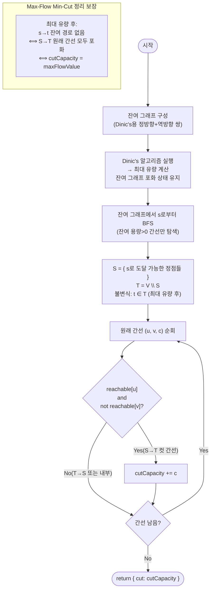

# minCut 해설

## 성능 목표 예측

| 항목 | 값 |
|------|----|
| 정점 V | $2 \leq V \leq 500$ |
| 간선 E | $0 \leq E \leq 10^4$ |
| 용량 c | $0 \leq c \leq 10^6$ |

**naive 접근의 문제점:**
최소 컷을 직접 구하려면 정점 집합 $V$의 모든 분할 $(S, T)$를 열거해 컷 용량을 계산한다.
분할의 수는 $2^V$이고, 각 분할의 컷 용량 계산이 $O(E)$이므로 $O(2^V \cdot E)$ → 완전히 불가능하다.

다른 naive 접근: 모든 간선 집합의 부분집합을 제거해 $s$와 $t$를 분리시키는 최소 비용을 찾는다. 이 또한 $O(2^E)$ → 불가능하다.

**목표 복잡도:** $O(V^2 \cdot E)$ (Dinic's로 최대 유량) + $O(V + E)$ (BFS로 컷 집합 결정), $O(V + E)$ 공간.

**근거:** Max-Flow Min-Cut 정리에 의해 최소 컷 = 최대 유량이므로, 최대 유량 알고리즘의 복잡도가 전체를 지배한다. 최대 유량 계산 후 잔여 그래프에서 BFS 한 번으로 컷을 결정하는 추가 비용은 $O(V + E)$이다.

**공간 복잡도:** 잔여 그래프 $O(V + E)$, 도달 가능 배열 $O(V)$. 추가 공간이 최소화된다.

---

## 목표 함수

```ts
minCut(
  n: number,
  edges: [number, number, number][],
  source: number,
  sink: number
): { cut: number }
```

| 매개변수 | 의미 | 제약 |
|----------|------|------|
| `n` | 정점 개수 $V$ (인덱스: $0 \ldots n-1$) | $2 \leq n \leq 500$ |
| `edges` | 방향 간선 `[u, v, c]` (용량 $c$) | $E \leq 10^4$ |
| `source` | 소스 $s$ | $s \neq t$ |
| `sink` | 싱크 $t$ | $s \neq t$ |
| 반환값 | `{ cut }`: 최소 $s$-$t$ 컷 용량 | — |

**엣지케이스:**

1. **간선 없음:** $s$에서 $t$로의 경로 없음 → `{ cut: 0 }`.
2. **역방향 간선만 있음:** $s \to t$ 방향 잔여 용량이 없어 유량 0 → `{ cut: 0 }`.
3. **$s$와 $t$가 단절된 경우:** 어떤 간선도 제거 없이 이미 분리됨 → `{ cut: 0 }`.
4. **반환값 = 최대 유량:** `{ cut }`의 값은 항상 `maxFlow`의 `flow`와 동일하다. Max-Flow Min-Cut 정리의 직접적 귀결이다.
5. **병렬 간선:** 같은 방향의 여러 간선은 각각 별개로 처리하며, 컷 집합 판정 시에도 개별적으로 합산한다.

---

## 핵심 아이디어

**핵심 아이디어**: "최소 컷의 용량 = 최대 유량이다 — 최대 유량 계산 후 잔여 그래프에서 도달 가능한 정점 집합이 최소 컷을 결정한다."

정점 집합을 두 그룹 $(S, T)$로 분할해 $S \to T$ 간선 용량의 합을 최소화하는 문제는 $2^V$개의 분할을 열거하지 않아도 된다. Max-Flow Min-Cut 정리에 의해 최소 컷 용량은 최대 유량과 정확히 같고, 최대 유량 계산 후 잔여 그래프에서 소스 $s$로부터 도달 가능한 집합 $S$가 자동으로 최소 컷을 정의한다. BFS 한 번으로 컷 집합을 결정하고 원래 간선 중 $S \to T$ 방향 용량을 합산하면 된다.

**풀이 구조**
1. Dinic's 알고리즘으로 최대 유량을 계산한다(잔여 그래프 유지).
2. 잔여 그래프에서 $s$로부터 잔여 용량 > 0인 간선을 따라 BFS를 수행한다.
3. 도달 가능한 정점 집합 $S$, 도달 불가능한 집합 $T$를 결정한다.
4. 원래 간선 목록에서 $u \in S$, $v \in T$인 간선의 용량을 합산한다.
5. 합산 값을 `{ cut }`으로 반환한다.

**조건**: 방향 그래프이고 소스 $s \neq$ 싱크 $t$여야 한다. 컷 용량 계산 시 잔여 그래프의 역방향 간선을 포함하면 안 되며 반드시 원래 간선 목록으로 합산해야 한다.

**대표 예시**: 네트워크 통신 차단 최소 비용
서버 $s$에서 클라이언트 $t$로의 통신을 끊으려면 어떤 링크들을 최소 비용으로 제거해야 하는가의 문제다. 최대 유량을 먼저 구하면 그 값이 곧 최소 컷이고, 잔여 그래프 BFS로 실제로 제거해야 할 링크 집합을 $O(V+E)$에 식별한다.

**언제 쓰나**
"$s$에서 $t$를 분리하는 최소 컷을 구하라" 또는 "네트워크를 분리하는 최소 비용을 구하라"는 문제에서 사용한다. Max-Flow Min-Cut 정리 덕분에 최대 유량 코드를 그대로 재활용하고 BFS 한 번만 추가하면 된다.

---

### 원형 아이디어와 naive 접근

컷의 정의에서 출발한다: 정점 집합을 $(S, T)$로 분할했을 때 $S$에서 $T$로 향하는 모든 간선의 용량 합을 최소화하는 분할을 찾는다.

```
naive:
  minCutVal = INF
  for each partition (S, T) of V (s ∈ S, t ∈ T):
    cutVal = sum of c(u,v) for (u,v) with u∈S, v∈T
    minCutVal = min(minCutVal, cutVal)
  return minCutVal
```

분할 수가 $2^{V-2}$이므로 $V = 500$에서는 계산 불가능하다.

**핵심 낭비:** 대부분의 분할은 컷 용량이 크다. 최소 컷과 관련 없는 분할을 모두 검사하는 것이 낭비이다.

### 어떤 관찰이 돌파구가 되는가

- **관찰 1 (유량의 상한):** 임의의 $s$-$t$ 컷 $(S, T)$에 대해, $s$에서 $t$로 보낼 수 있는 유량은 $c(S, T)$를 초과할 수 없다. 왜냐하면 모든 유량이 $S$에서 $T$로 넘어가는 간선을 통해야 하고, 각 간선의 용량이 그 한계를 설정하기 때문이다.
  
  $$|f| \leq c(S, T) \quad \text{임의의 s-t 컷 (S, T)에 대해}$$

- **관찰 2 (등호 성립 조건):** Ford-Fulkerson이 종료되는 순간, 잔여 그래프에서 $s$로부터 $t$에 도달할 수 없다. 이때 도달 가능한 집합 $S$, 불가능한 집합 $T$로 정의하면 $S \to T$ 방향의 원래 간선들은 모두 잔여 용량 0(포화 상태)이다. 따라서 이 간선들의 원래 용량 합 = 총 유량 = 최대 유량이다.

- **관찰 3 (최대 유량 = 최소 컷):** 관찰 1과 2를 합치면: 최대 유량 $\leq$ 최소 컷 용량 (관찰 1), 그리고 잔여 그래프 기반 컷 용량 = 최대 유량 (관찰 2). 따라서 최대 유량 = 최소 컷 용량이다.

### 관찰을 형식화: 상태/구조 정의

**최대 유량 계산 후 잔여 그래프:** Dinic's 알고리즘으로 최대 유량을 계산하면 잔여 그래프가 포화 상태로 남는다.

**도달 가능 집합 $S$:** 잔여 그래프에서 $s$로부터 BFS를 수행해, 잔여 용량 $> 0$인 간선을 따라 도달할 수 있는 모든 정점의 집합이다.

$$S = \{v \in V : \text{잔여 그래프에서 } s \rightsquigarrow v\}$$

$$T = V \setminus S \quad (\text{불변식: } t \in T)$$

이 정의가 $S$를 "도달 가능"으로 정의하는 이유: 최대 유량 후에는 $t$에 도달 불가($t \in T$)이고, $S \to T$ 방향 모든 원래 간선이 포화 상태여서 컷 용량과 유량이 정확히 일치하기 때문이다. $S$를 다른 방식으로 정의하면 이 일치가 보장되지 않는다.

**컷 용량 계산:**

$$c(S, T) = \sum_{\substack{(u, v, c) \in \text{원래 간선} \\ u \in S, \; v \in T}} c(u, v)$$

원래 간선을 기준으로 계산한다. 잔여 그래프의 역방향 간선은 포함하지 않는다.

### 점화식 또는 핵심 연산

**포화 조건 (최대 유량 후):**

$$
\text{포화}: \text{잔여 용량}(u \to v) = 0 \quad \forall u \in S, v \in T
$$

즉, $s$로부터 $t$로의 잔여 경로가 없으므로:

$$
\text{BFS 도달 여부}: \text{reachable}[v] = \begin{cases} \text{true} & \text{if } s \rightsquigarrow v \text{ (잔여 용량 > 0)} \\ \text{false} & \text{otherwise} \end{cases}
$$

**컷 용량:**

$$
\text{cut} = \sum_{\substack{(u, v, c) \in \text{edges} \\ \text{reachable}[u] = \text{true} \\ \text{reachable}[v] = \text{false}}} c
$$

- $\text{reachable}[u] = \text{true}$, $\text{reachable}[v] = \text{false}$: 간선이 $S$에서 $T$로 넘어가는 컷 간선임.
- 이 간선들은 최대 유량 후 모두 포화 상태이므로, 원래 용량의 합이 곧 컷 용량이자 최대 유량이다.

### 정당성 — 왜 이것이 옳은가

**약한 쌍대성:** 임의의 유량 $f$와 임의의 $s$-$t$ 컷 $(S, T)$에 대해 유량 보존 법칙에 의해:

$$|f| = \sum_{\substack{u \in S, v \in T}} f(u,v) - \sum_{\substack{u \in T, v \in S}} f(u,v) \leq \sum_{\substack{u \in S, v \in T}} c(u,v) = c(S,T)$$

따라서 최대 유량 $\leq$ 최소 컷.

**강한 쌍대성 (등호 성립):** 최대 유량 $f^*$ 달성 후 잔여 그래프에서 $s \to t$ 경로가 없다. $S$를 도달 가능 집합으로 정의하면, $S \to T$ 원래 간선은 모두 포화($\text{잔여용량} = 0 = c - f$, 즉 $f = c$). 따라서:

$$c(S,T) = \sum_{\substack{u \in S, v \in T}} c(u,v) = \sum_{\substack{u \in S, v \in T}} f(u,v) = |f^*|$$

**까다로운 케이스:**
- $T \to S$ 방향 간선(역방향)은 컷 용량에 포함하지 않는다: 역방향 간선의 잔여 용량은 흘린 유량을 나타내며, 컷 용량 정의에서 역방향은 제외된다.
- 원래 간선 목록으로 컷을 계산해야 한다: 잔여 그래프의 역방향 간선까지 합산하면 컷이 과대 계산된다.

### 구현 디테일과 최적화

- **최대 유량과 컷의 분리:** 최대 유량 알고리즘 실행 후 잔여 그래프를 그대로 사용해 BFS로 컷을 결정한다. 별도의 잔여 그래프를 복사할 필요 없이 Dinic's의 `graph` 배열을 그대로 재활용한다.

- **컷 용량 계산 시 원래 간선 사용:** 입력 `edges` 배열을 순회하며 `reachable[u] && !reachable[v]`인 간선의 용량을 합산한다. 잔여 그래프의 역방향 간선을 포함하지 않도록 주의한다.

- **반환값 검증:** 이론적으로 `cutCapacity == maxFlowValue`가 성립해야 한다. 구현 오류 탐지를 위해 개발 중 이 등식을 단언(assertion)으로 확인할 수 있다.

- **함정 — 역방향 간선을 컷 합산에 포함:** 잔여 그래프 전체를 순회하면 역방향 간선(초기 용량 0, 현재 흘린 유량만큼 용량 있음)까지 포함되어 컷이 2배가 될 수 있다.

- **함정 — BFS에서 `cap > 0` 조건 누락:** 포화된 간선을 따라 탐색하면 $T$ 정점이 $S$에 포함되어 컷 집합이 잘못 결정된다.

---

## 수도 코드와 Activity Diagram

### 의사코드

```
function minCut(n, edges, s, t):
    // 1. Dinic's로 최대 유량 계산 (잔여 그래프 graph 유지)
    graph = buildResidualGraph(n, edges)   // 정방향+역방향 쌍
    maxFlowValue = runDinic(graph, n, s, t) // maxFlow 수도 코드 참고

    // 2. 잔여 그래프에서 s 도달 가능 집합 S 계산
    reachable[0..n-1] = false
    BFS(s, graph, reachable)              // 불변식: reachable[v] = (s → v 잔여 경로 존재)

    // 3. 원래 간선 중 S→T 컷 간선의 용량 합
    cutCapacity = 0
    for (u, v, c) in edges:              // 불변식: 원래 간선만 순회 (역방향 제외)
        if reachable[u] and not reachable[v]:
            cutCapacity += c             // 불변식: 이 간선은 포화 상태 (최대 유량 후)

    // 검증: cutCapacity == maxFlowValue (Max-Flow Min-Cut 정리)
    return { cut: cutCapacity }

function BFS(s, graph, reachable):
    queue = [s]
    reachable[s] = true                   // 불변식: s는 항상 S에 속함
    while queue not empty:
        u = dequeue(queue)
        for edge in graph[u]:
            if edge.cap > 0 and not reachable[edge.to]:  // 잔여 용량>0 간선만
                reachable[edge.to] = true
                enqueue(queue, edge.to)
    // 불변식: BFS 종료 후 reachable[t] = false (최대 유량 후에는 t 도달 불가)

// 핵심 불변식:
//   최대 유량 계산 후, s→T 방향의 모든 원래 간선은 포화 상태.
//   reachable[u] && !reachable[v] → (u, v)는 컷 간선 → 포화 → c(u,v) = f(u,v).
//   따라서 cutCapacity = maxFlowValue.
```

### Activity Diagram



**핵심 불변식:** Dinic's 종료 후 잔여 그래프에서 $s$로부터 $t$로의 경로가 존재하지 않으므로, BFS로 결정된 $S$에서 $T$로 향하는 모든 원래 간선은 포화 상태이다. 이 간선들의 용량 합이 최소 컷이자 최대 유량과 동일함이 Max-Flow Min-Cut 정리에 의해 보장된다.
