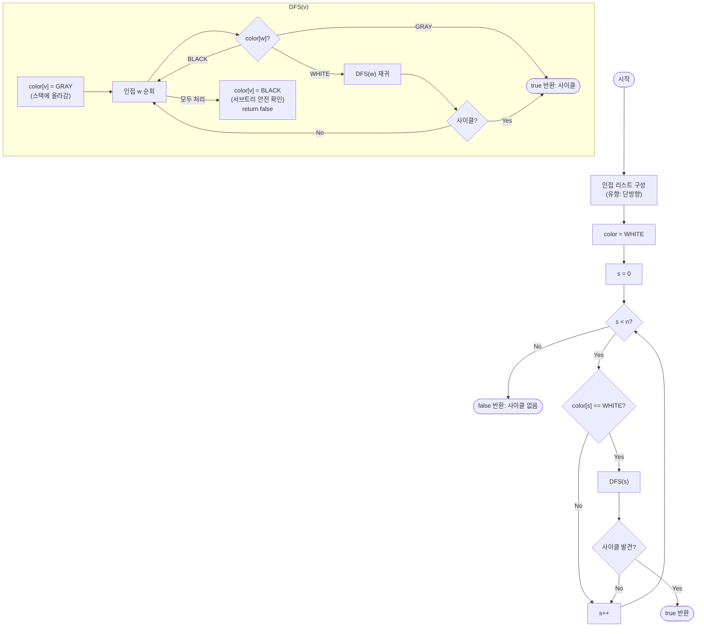

# directedCycleDetection 해설

## 성능 목표 예측

| 제약 | 값 |
|------|----|
| 정점 수 $V$ | $1 \leq V \leq 10^5$ |
| 간선 수 $E$ | $0 \leq E \leq 10^5$ |
| 정점 번호 | $0 \ldots n-1$ |
| 그래프 종류 | 유향 |

**naive 접근의 비용**: 모든 단순 경로(simple path)를 열거해 닫힌 경로(사이클)가 있는지 확인한다.
경로 수는 최악 $O(V!)$ → 불가.

조금 나은 방법: 각 정점 $v$에서 출발해 DFS로 $v$로 돌아오는 경로를 찾는다.
$V$번 × DFS $O(V + E)$ = $O(V(V + E))$ → $V = 10^5$이면 $10^{10}$ → 시간 초과.

**목표**: DFS 한 번으로 사이클 유무를 판별한다. 시간 $O(V + E)$, 공간 $O(V + E)$.
$V + E \leq 2 \times 10^5$이므로 단일 DFS로 충분.

**왜 Union-Find로는 안 되는가?** 무향 그래프에서는 Union-Find로 사이클을 탐지할 수 있지만, 유향 그래프에서는 방향을 무시하게 되어 오탐이 발생한다. $A \to B$, $A \to C$, $B \to C$가 있는 DAG를 Union-Find는 사이클로 오판한다.

---

## 목표 함수

```ts
function directedCycleDetection(n: number, edges: [number, number][]): boolean
```

| 파라미터 | 의미 | 제약 |
|----------|------|------|
| `n` | 정점 수 | $1 \leq n \leq 10^5$ |
| `edges` | 유향 간선 `[u, v]` ($u \to v$) 목록 | $0 \leq E \leq 10^5$ |
| 반환 | 사이클이 존재하면 `true`, 없으면 `false` | — |

**엣지케이스**

1. **자기 루프** $(v, v)$: $v$를 DFS 시작하면 즉시 GRAY 상태인 $v$로 향하는 간선 발견 → `true`.
2. **DAG**: 사이클 없음 → `false`. 위상 정렬 가능.
3. **간선 없음**: 탐색이 아무 back edge도 발견하지 못함 → `false`.
4. **분리된 컴포넌트**: 외부 루프가 모든 미방문 정점에서 DFS를 시작하므로 누락 없음.

---

## 핵심 아이디어

**핵심 아이디어**: "현재 탐색 중인 경로에 있는 정점으로 되돌아가는 간선이 있으면, 그것이 곧 사이클의 증거다."

유향 그래프에서는 단순히 "이미 방문한 정점"을 만났다고 해서 사이클이 아니다. 완전히 탐색이 끝난 정점으로 향하는 간선은 사이클을 만들지 않는다. 핵심은 정점을 세 상태로 구분하는 것이다: 미방문(WHITE), 현재 DFS 스택에 있음(GRAY), 탐색 완전 종료(BLACK). GRAY 정점으로 향하는 간선만이 사이클을 의미하므로, DFS 한 번으로 사이클 유무를 $O(V+E)$에 판별한다.

**풀이 구조**
1. 인접 리스트를 단방향으로 구성하고, 모든 정점을 WHITE로 초기화한다.
2. 미방문(WHITE) 정점에서 DFS를 시작하며, 방문 시 GRAY로 표시한다.
3. 인접 정점 `w`를 탐색할 때: GRAY이면 사이클 발견 → `true` 반환, WHITE이면 DFS 재귀, BLACK이면 스킵한다.
4. DFS가 완료되면 해당 정점을 BLACK으로 표시한다.
5. 모든 정점을 탐색하고도 사이클이 없으면 `false`를 반환한다.

**조건**: 유향 그래프 전용. 무향 그래프에서는 Union-Find나 부모 추적 DFS가 더 단순하다. WHITE/GRAY/BLACK 3색 구분은 유향 그래프에서만 필요하다.

**대표 예시**: 작업 스케줄링에서 순환 의존성 감지
작업 A가 B를 필요로 하고, B가 다시 A를 필요로 하면 실행 불가능한 순환이 생긴다. 이를 유향 그래프로 모델링하고 DFS를 돌리면, A → B → A처럼 현재 스택(GRAY)에 있는 정점으로 되돌아오는 순간 순환이 탐지된다.

**언제 쓰나**
위상 정렬을 시도하기 전에 DAG 여부를 확인하거나, 유향 그래프에서 "A가 B에 간접적으로 의존하고 B도 A에 의존하는" 순환 의존성을 탐지해야 할 때 사용한다.

---

### 원형 아이디어와 naive 접근

가장 직관적인 방법: 모든 정점 $v$에서 DFS를 시작해 다시 $v$로 돌아오는 경로를 찾는다.

```
for v in 0..n-1:
  path = DFS starting from v
  if v appears again in path:
    return true
return false
```

$O(V)$번의 DFS, 각 $O(V + E)$ → 전체 $O(V(V + E))$ → 시간 초과.

문제의 근원: 이미 탐색한 정점의 정보를 활용하지 않는다. 정점 $v$에서 DFS를 완료했는데 사이클이 없다는 사실을 다음 DFS에서 재사용하지 않는다.

무향 그래프에서는 단순히 "부모 방향으로 돌아가는 간선"인지 확인하면 되지만, 유향 그래프에서는 방향이 있어 more subtle하다. $A \to B \to C$와 $A \to C$가 있을 때, $A$ 탐색 중 $C$를 발견했더라도 이는 사이클이 아니다($A \to C$는 단순히 "이미 방문한 정점으로 가는 forward edge"다).

### 어떤 관찰이 돌파구가 되는가

- **관찰 1**: 사이클이 있다는 것은 DFS 진행 중 "현재 DFS 콜 스택에 있는 정점"으로 향하는 간선(back edge)이 있다는 것과 동치이다. DFS 스택에 있는 정점으로 돌아가면 순환이 형성된다.
- **관찰 2**: 이미 DFS가 완전히 끝난 정점(콜 스택에서 빠져나간 정점)으로 향하는 간선은 사이클을 만들지 않는다. 그 정점의 서브트리에서는 이미 사이클이 없다고 확인됐기 때문이다.
- **관찰 3**: 따라서 정점을 세 가지 상태로 구분하면 된다. 미탐색 / 현재 DFS 스택에 있음 / DFS 완전 종료. "현재 스택에 있는 정점으로 가는 간선"만 사이클 증거이다.

### 관찰을 형식화: 상태/구조 정의

각 정점에 세 가지 색(상태)을 부여한다.

$$\text{color}(v) \in \{\text{WHITE},\, \text{GRAY},\, \text{BLACK}\}$$

| 색 | 의미 |
|----|------|
| WHITE (0) | 아직 방문하지 않음 |
| GRAY (1) | 현재 DFS 재귀 콜 스택에 있음 (탐색 중) |
| BLACK (2) | DFS가 완전히 종료됨 (서브트리에 사이클 없음이 확인됨) |

왜 세 가지 색인가? 두 가지(방문/미방문)로는 "지금 스택에 있는가"와 "이미 완료됐는가"를 구별할 수 없다. 유향 그래프에서는 이 둘의 구별이 필수이다. BLACK으로 끝난 정점은 "안전하다"는 증명서이고, GRAY는 "현재 탐색 경로에 있다"는 표시이다.

### 점화식 또는 핵심 연산

DFS(v)의 전이 규칙:

$$\text{color}(v) \leftarrow \text{GRAY} \quad \text{(DFS 시작 시)}$$

$$\forall (v, w) \in E: \begin{cases}
\text{color}(w) = \text{GRAY} & \to \text{사이클 발견, } \text{true 반환} \\
\text{color}(w) = \text{WHITE} & \to \text{DFS}(w) \text{ 재귀} \\
\text{color}(w) = \text{BLACK} & \to \text{스킵 (안전한 정점)}
\end{cases}$$

$$\text{color}(v) \leftarrow \text{BLACK} \quad \text{(DFS 완료 후)}$$

각 항의 의미:
- GRAY인 $w$로의 간선: $v$에서 출발해 $w$로 돌아가는 경로가 DFS 스택에 이미 존재. 사이클.
- BLACK인 $w$로의 간선: $w$의 서브트리 탐색이 완료됐고 사이클 없음이 확인됨. 이 간선은 사이클에 기여하지 않음.

### 정당성 — 왜 이것이 옳은가

방향: "사이클 존재 → GRAY-to-GRAY 간선 발견"을 귀납적으로 증명한다.

사이클 $v_0 \to v_1 \to \cdots \to v_k = v_0$가 존재한다고 하자. DFS가 $v_0$를 처음 방문하면 $v_0$는 GRAY가 된다. DFS는 $v_1, v_2, \ldots$를 순서대로 탐색하고, $v_k = v_0$로 향하는 간선을 만날 때 $v_0$는 여전히 GRAY 상태이다(DFS가 $v_0$에서 돌아오기 전이므로). 따라서 GRAY-to-GRAY 간선이 반드시 발견된다.

역방향: "GRAY-to-GRAY 간선 발견 → 사이클 존재"도 자명하다. DFS 스택이 $v_0 \to \cdots \to v$의 경로를 나타내고, $v$에서 GRAY 상태인 $v_0$로의 간선이 있으면 $v_0 \to \cdots \to v \to v_0$가 사이클이다.

까다로운 케이스: 자기 루프 $(v, v)$. DFS(v)가 $\text{color}(v) = \text{GRAY}$로 설정한 직후 인접 정점 $v$ 자체를 확인하면 GRAY 발견 → 즉시 사이클.

### 구현 디테일과 최적화

**BLACK 정점 최적화**: $\text{color}(v) = \text{BLACK}$이 된 정점은 다시 탐색할 필요가 없다. 외부 루프에서 `color[s] == WHITE`인 정점에서만 DFS를 시작한다. 이미 BLACK인 정점을 건너뜀으로써 DFS가 각 정점을 정확히 한 번만 처리한다.

**조기 종료(early exit)**: 사이클이 발견되는 즉시 `true`를 반환하고 탐색을 중단한다. 문제가 "모든 사이클 목록"이 아니라 "존재 여부"이므로 조기 종료가 유효하다.

**재귀 vs 반복**: $V = 10^5$인 체인 그래프에서 재귀 깊이가 $10^5$에 달한다. 런타임에 따라 명시적 스택으로 구현하는 것이 안전하다.

**함정**: `color[w] == WHITE`일 때만 DFS(w)를 호출해야 한다. BLACK 정점도 재귀하면 $O(V \cdot E)$로 복잡도가 증가한다.

---

## 수도 코드와 Activity Diagram

### 의사코드

```
WHITE=0, GRAY=1, BLACK=2
color[0..n-1] = WHITE          -- 불변식: WHITE=미방문, GRAY=스택 중, BLACK=완료

function dfs(v):
  color[v] = GRAY              -- 불변식: GRAY는 "현재 DFS 경로에 있음"

  for w in adj[v]:
    if color[w] == GRAY:
      return true              -- back edge = 사이클 발견
    if color[w] == WHITE:
      if dfs(w):
        return true            -- 하위 탐색에서 사이클 발견

  color[v] = BLACK             -- 불변식: BLACK = "이 정점의 서브트리에 사이클 없음"
  return false

function directedCycleDetection(n, edges):
  adj[0..n-1] = 빈 리스트
  for [u, v] in edges:
    adj[u].push(v)             -- 유향 그래프: 단방향만 등록

  for s in 0..n-1:
    if color[s] == WHITE:
      if dfs(s):
        return true            -- 조기 종료

  return false
```

**핵심 불변식:**
`color[v] = BLACK`은 "$v$의 DFS 서브트리에는 사이클이 존재하지 않는다"는 불변식이다. 이 때문에 BLACK 정점은 다시 탐색할 필요가 없으며, 각 정점·간선이 정확히 한 번 처리되어 $O(V + E)$가 보장된다.

### Activity Diagram


