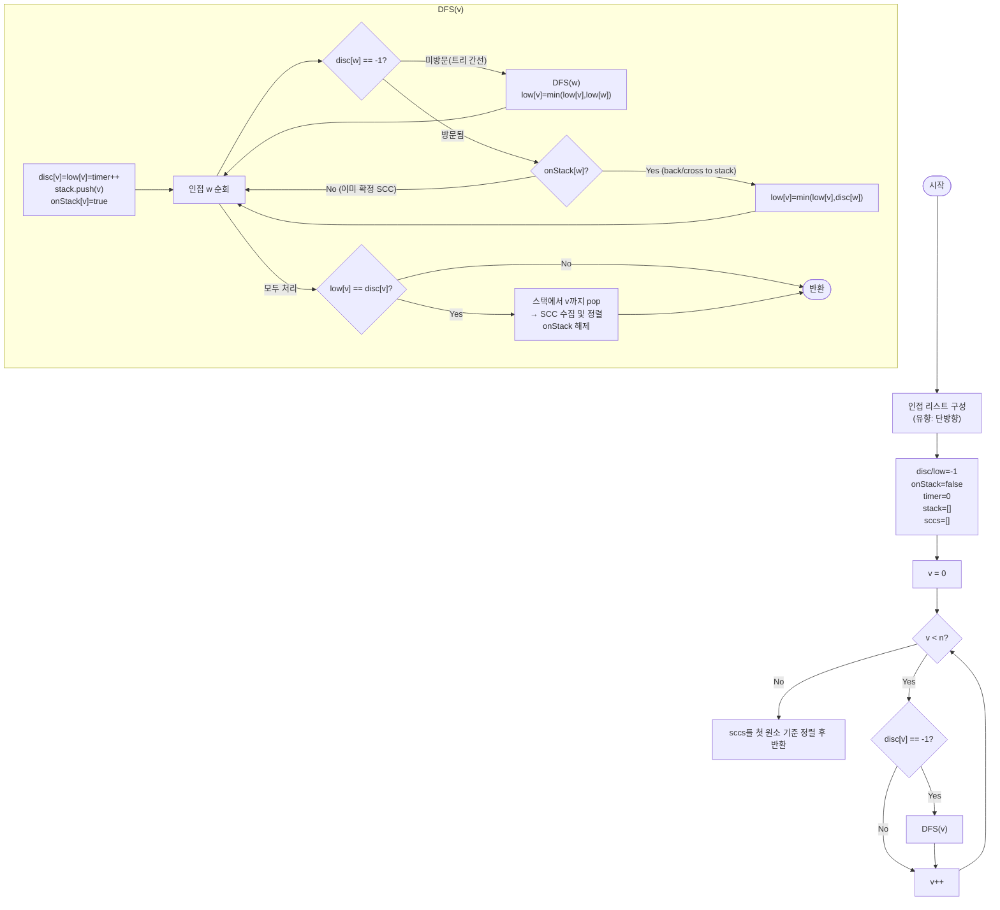

# stronglyConnectedComponents 해설

## 성능 목표 예측

| 제약 | 값 |
|------|----|
| 정점 수 $V$ | $1 \leq V \leq 10^5$ |
| 간선 수 $E$ | $0 \leq E \leq 10^5$ |
| 정점 번호 | $0 \ldots n-1$ |
| 그래프 종류 | 유향 |

**naive 접근의 비용**: 두 정점 $u, v$가 같은 SCC인지 확인하려면, $u \to v$ 경로와 $v \to u$ 경로 모두 BFS/DFS로 탐색한다.
$O(V^2)$ 쌍 × 탐색 $O(V + E)$ = $O(V^2(V + E))$ → $V = 10^5$이면 $10^{15}$ → 불가.

**목표**: DFS 한 번(Tarjan)으로 모든 SCC를 동시에 찾는다. 시간 $O(V + E)$, 공간 $O(V + E)$.
$V + E \leq 2 \times 10^5$으로 단일 DFS 충분.

**공간 트레이드오프**: 인접 리스트 $O(V + E)$ + disc/low/onStack 배열 $O(V)$ + 스택 $O(V)$.

---

## 목표 함수

```ts
function stronglyConnectedComponents(n: number, edges: [number, number][]): number[][]
```

| 파라미터 | 의미 | 제약 |
|----------|------|------|
| `n` | 정점 수 | $1 \leq n \leq 10^5$ |
| `edges` | 유향 간선 `[u, v]` ($u \to v$) 목록 | $0 \leq E \leq 10^5$ |
| 반환 | SCC 배열. 각 SCC 내 정점은 오름차순; SCC 배열 자체도 각 SCC의 첫 원소 기준 오름차순 | — |

**엣지케이스**

1. **간선 없음**: 각 정점이 개별 SCC → $n$개의 단원소 SCC.
2. **단방향 체인** $0 \to 1 \to 2 \to \cdots$: 각 정점이 개별 SCC ($n$개).
3. **완전 양방향 사이클**: 모든 정점이 하나의 SCC.
4. **복합 구조** (사이클 + DAG): 사이클을 이루는 정점들이 하나의 SCC, 나머지는 각자 SCC.

---

## 핵심 아이디어

**핵심 아이디어**: "서로 오갈 수 있는 정점들의 묶음(SCC)은, DFS 트리에서 자기보다 위로 올라가는 back edge가 없는 정점을 루트로 삼아 한 번에 수집할 수 있다."

두 정점이 서로 도달 가능한지 모든 쌍에 대해 확인하면 $O(V^2(V+E))$이다. Tarjan 알고리즘은 DFS 한 번으로 해결한다: 각 정점에 발견 시각(`disc`)과 서브트리에서 스택 내 정점으로 도달 가능한 최솟값(`low`)을 기록한다. `low[v] == disc[v]`인 정점은 자신의 서브트리가 자신보다 오래된 정점에 닿지 못하는 "SCC 루트"이며, 이 순간 스택에서 해당 루트까지 꺼내면 하나의 SCC가 완성된다.

**풀이 구조**
1. 인접 리스트를 단방향으로 구성하고, `disc`, `low`, `onStack` 배열을 초기화한다.
2. 미방문 정점에서 DFS를 시작하며, 방문 시 `disc[v] = low[v] = timer++`로 기록하고 스택에 삽입한다.
3. 미방문 이웃 `w`는 DFS 재귀 후 `low[v] = min(low[v], low[w])`로 전파한다.
4. 방문됐지만 스택에 있는(`onStack`) 이웃 `w`는 `low[v] = min(low[v], disc[w])`로 갱신한다.
5. DFS 완료 후 `low[v] == disc[v]`이면 SCC 루트: 스택에서 `v`가 나올 때까지 pop하여 SCC를 수집한다.
6. 각 SCC 내부를 오름차순 정렬하고, SCC 배열을 첫 원소 기준 오름차순으로 반환한다.

**조건**: 유향 그래프. `onStack` 배열로 "현재 DFS 스택에 있음"과 "이미 확정된 SCC에 속함"을 구별해야 한다.

**대표 예시**: 웹 페이지 링크 그래프에서 서로 도달 가능한 페이지 묶음 찾기
A → B → C → A처럼 순환하는 페이지들은 하나의 SCC를 이룬다. D → A처럼 단방향으로만 연결된 페이지 D는 독립 SCC가 된다. Tarjan은 DFS 한 번으로 이 모든 묶음을 동시에 식별한다.

**언제 쓰나**
유향 그래프에서 "서로 오갈 수 있는 정점 집합"을 찾거나, 그래프를 DAG로 압축(각 SCC를 하나의 노드로)해 위상 정렬이나 최장 경로 문제로 변환할 때 사용한다.

---

### 원형 아이디어와 naive 접근

$u$와 $v$가 같은 SCC인지 확인하는 직접적 방법:

```
for u in 0..n-1:
  for v in u+1..n-1:
    if reachable(u, v) and reachable(v, u):  -- 각각 BFS O(V+E)
      merge(u, v)
```

$O(V^2)$ 쌍 × BFS $O(V + E)$ = $O(V^2(V+E))$ → 불가.

문제의 근원: "왕복 도달 가능성"을 모든 쌍에 대해 독립적으로 계산한다. DFS 한 번이 생성하는 트리 구조를 활용하지 않는다.

Kosaraju 접근(DFS 두 번)은 직관적으로 이해하기 쉽지만, DFS를 두 번 실행한다. Tarjan 접근은 DFS 한 번으로 같은 결과를 얻는다.

### 어떤 관찰이 돌파구가 되는가

- **관찰 1**: DFS 트리에서 두 정점 $u, v$가 같은 SCC에 속한다는 것은, DFS 경로상 $u$에서 $v$로 가는 간선과 $v$에서 $u$의 조상으로 돌아오는 back edge가 모두 존재한다는 의미이다.
- **관찰 2**: 정점 $v$의 서브트리에서 $v$보다 먼저 발견된(disc가 작은) 정점으로 돌아가는 back edge가 없다면, $v$의 서브트리에 있는 정점들이 하나의 SCC를 형성한다. $v$는 이 SCC의 "루트"이다.
- **관찰 3**: DFS 스택을 이용해 SCC 루트를 발견하는 순간 해당 SCC의 정점들을 한꺼번에 수집할 수 있다.

### 관찰을 형식화: 상태/구조 정의

세 가지 상태 배열을 정의한다.

$$\text{disc}(v) = \text{DFS에서 } v \text{를 처음 방문한 타임스탬프}$$

$$\text{low}(v) = \min\!\left(\text{disc}(v),\;
  \min_{(v,\,w) \in E,\, \text{onStack}(w)} \text{disc}(w),\;
  \min_{(v,\,c)\,\text{tree edge}} \text{low}(c)\right)$$

$$\text{onStack}(v) = \begin{cases} \text{true} & v \text{가 현재 DFS 스택에 있음} \\ \text{false} & v \text{가 이미 확정된 SCC에 속함} \end{cases}$$

$\text{low}(v)$의 직관: "$v$의 서브트리에서 DFS 스택을 통해 도달 가능한 가장 오래된 정점의 disc 값."

왜 $\text{onStack}(w)$을 조건으로 사용하는가? 이미 확정된 SCC의 정점으로 가는 간선(cross edge)은 $v$의 SCC를 결정하는 데 관여하지 않는다. $\text{onStack}(w) = \text{false}$이면 $w$는 다른 SCC에 속하므로 $\text{low}(v)$ 계산에서 제외한다.

SCC 루트 판정:

$$v \text{는 SCC 루트} \iff \text{low}(v) = \text{disc}(v)$$

이 조건의 의미: $v$의 서브트리에서 $v$보다 위(더 오래된 정점)로 올라가는 back edge가 없다.

### 점화식 또는 핵심 연산

DFS(v) 에서의 갱신:

1. $\text{disc}(v) \leftarrow \text{low}(v) \leftarrow \text{timer}$, $\text{timer}$++
2. 스택에 $v$ 삽입, $\text{onStack}(v) \leftarrow \text{true}$
3. 인접 $w$에 대해:
   - $w$ 미방문: DFS$(w)$ 후 $\text{low}(v) \leftarrow \min(\text{low}(v),\, \text{low}(w))$
   - $w$ 방문됨이고 $\text{onStack}(w) = \text{true}$: $\text{low}(v) \leftarrow \min(\text{low}(v),\, \text{disc}(w))$
   - $w$ 방문됨이고 $\text{onStack}(w) = \text{false}$: 스킵
4. DFS 완료 후 $\text{low}(v) = \text{disc}(v)$이면:
   - 스택에서 $v$가 나올 때까지 pop → 하나의 SCC

각 항의 의미:
- 미방문 $w$: 트리 간선으로 $\text{low}(w)$를 $v$에 전파. $w$의 서브트리가 올라갈 수 있는 최고점을 $v$가 이어받음.
- $\text{onStack}(w) = \text{true}$인 방문 $w$: back edge(또는 cross edge to stack). $w$의 발견 시각이 $v$의 새로운 "도달 가능 최솟값".
- $\text{onStack}(w) = \text{false}$인 방문 $w$: 이미 다른 SCC에 속함. 이 간선은 $v$의 SCC를 더 넓힐 수 없음.

### 정당성 — 왜 이것이 옳은가

$\text{low}(v) = \text{disc}(v)$일 때, $v$의 서브트리에서 $v$보다 먼저 발견된 스택 정점으로 가는 경로가 없다는 의미이다. 따라서 $v$와 스택에서 $v$ 위에 있는 정점들은 서로 도달 가능한(양방향 경로 존재) 정점들의 집합, 즉 SCC를 형성한다.

귀납적 정당성: DFS 트리에서 $v$의 서브트리에 있는 정점 $u$가 $v$와 같은 SCC에 속한다면, $u$에서 $v$의 조상으로 가는 back edge가 없으므로 $u$는 $\text{low}(v) = \text{disc}(v)$ 조건에서 수집된다. 반대로, $v$와 다른 SCC에 속하는 정점은 이미 이전 SCC 수집 단계에서 스택에서 제거됐거나($\text{onStack} = \text{false}$), $v$보다 먼저 발견된 조상이다($\text{disc} < \text{disc}(v)$).

까다로운 케이스: 자기 루프 $(v, v)$. $\text{low}(v) = \min(\text{low}(v), \text{disc}(v)) = \text{disc}(v)$ → SCC 루트 조건을 즉시 만족 → $\{v\}$ 단원소 SCC로 수집.

### 구현 디테일과 최적화

**onStack vs disc 기반 판별**: 방문됐지만 이미 SCC에 속한 정점을 제외하기 위해 `onStack` 배열이 필요하다. `disc[w] != -1` 조건만으로는 해당 정점이 현재 스택에 있는지, 아니면 이미 다른 SCC로 확정됐는지 알 수 없다.

**스택 불변식**: 스택에는 항상 현재 DFS 경로의 정점들이 포함된다. SCC 루트가 발견되면 그 루트까지의 모든 정점이 하나의 SCC로 수집되고 스택에서 제거된다. 제거 후 해당 정점들의 `onStack = false`로 설정한다.

**재귀 깊이**: $V = 10^5$인 체인에서 재귀 깊이가 $10^5$에 달할 수 있다. 명시적 스택으로 전환하면 안전하다.

**결과 정렬**: Tarjan 알고리즘은 SCC를 위상 정렬의 역순으로 출력한다. 문제에서는 SCC 내부를 오름차순, SCC 배열을 첫 원소 기준 오름차순으로 요구하므로 별도 정렬이 필요하다.

---

## 수도 코드와 Activity Diagram

### 의사코드

```
timer = 0
stack = []
onStack[0..n-1] = false        -- 불변식: onStack[v]는 v가 현재 스택에 있음
disc[0..n-1] = -1              -- 불변식: -1은 미방문
low[0..n-1]  = -1
sccs = []

function dfs(v):
  disc[v] = low[v] = timer++   -- 불변식: disc[v]는 방문 순서; 이후 불변
  stack.push(v)
  onStack[v] = true            -- 불변식: 스택에 올라가는 순간 onStack=true

  for w in adj[v]:
    if disc[w] == -1:          -- 미방문: 트리 간선
      dfs(w)
      low[v] = min(low[v], low[w])      -- 자식의 reach를 전파
    elif onStack[w]:           -- 스택 내 정점: back/cross edge to stack
      low[v] = min(low[v], disc[w])     -- 도달 가능한 최오래된 정점 갱신
    -- onStack[w]=false: 이미 확정 SCC → 무시

  if low[v] == disc[v]:        -- 불변식: v는 SCC 루트 (더 위로 못 올라감)
    scc = []
    while true:
      w = stack.pop()
      onStack[w] = false       -- 확정 SCC에서 제거
      scc.push(w)
      if w == v: break
    scc.sort()
    sccs.push(scc)

function stronglyConnectedComponents(n, edges):
  adj[0..n-1] = 빈 리스트
  for [u, v] in edges:
    adj[u].push(v)             -- 유향: 단방향

  for v in 0..n-1:
    if disc[v] == -1: dfs(v)

  sccs.sort by first element   -- 첫 원소 기준 오름차순
  return sccs
```

**핵심 불변식:**
`onStack[v] = true`는 $v$가 현재 DFS 스택에 있음을 의미한다. `low[v] = disc[v]`이면 $v$의 서브트리에서 스택을 통해 $v$보다 오래된 정점으로 갈 수 없으므로 $v$가 SCC의 루트이다.

### Activity Diagram


