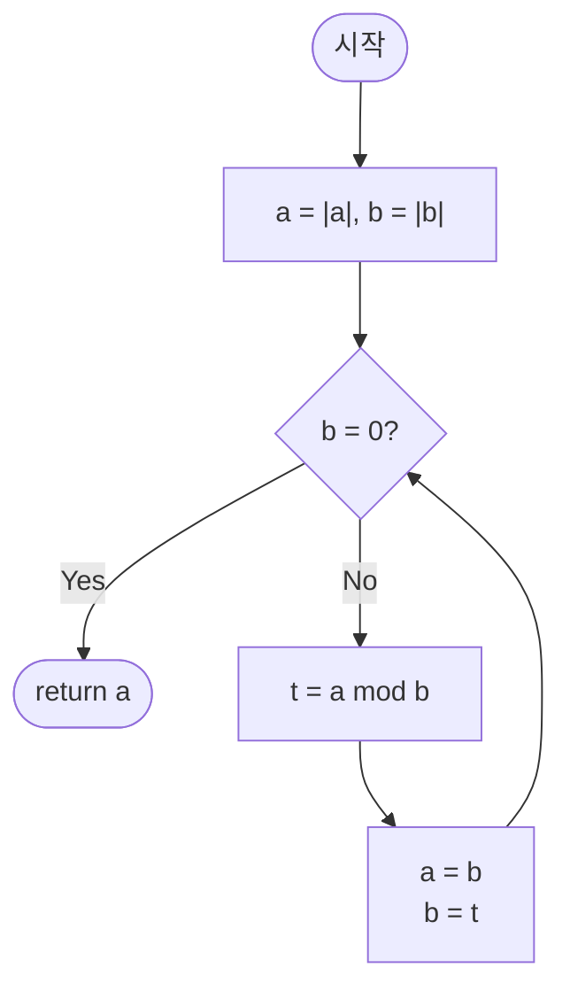

# gcd — 최대공약수 (유클리드 호제법) 해설

## 성능 목표 예측

| 항목 | 값 |
|------|-----|
| 입력 크기 | 임의의 bigint, 실용 범위 $\|a\|, \|b\| \leq 2^{63}$ |
| 시간 복잡도 | $O(\log \min(\|a\|, \|b\|))$ |
| 공간 복잡도 | $O(1)$ (반복문 버전), $O(\log \min(\|a\|, \|b\|))$ (재귀 스택) |

**naive 접근의 한계.** 가장 단순한 방법은 $1$부터 $\min(\|a\|, \|b\|)$까지 공약수를 탐색하는 것이다. 이는 $O(\min(\|a\|, \|b\|))$로, $a \approx 2^{63}$이면 $9 \times 10^{18}$회 반복이 필요해 사실상 불가능하다.

**목표 복잡도와 근거.** 유클리드 호제법은 각 단계에서 $b$가 $a \bmod b$로 감소하며, $a \bmod b < b/2$이므로 두 스텝마다 인자가 절반 이하가 된다. 따라서 단계 수는 $O(\log \min(\|a\|, \|b\|))$로, $2^{63}$ 범위에서도 최대 약 200회 반복이면 충분하다.

**공간 트레이드오프.** 반복문으로 구현하면 추가 공간이 $O(1)$이다. 재귀로 구현하면 호출 스택이 $O(\log \min(\|a\|, \|b\|))$를 소모하지만, 깊이가 200 수준이므로 실용상 문제없다.

---

## 목표 함수

```ts
function gcd(a: bigint, b: bigint): bigint
```

| 파라미터 | 의미 | 제약 |
|----------|------|------|
| `a` | 첫 번째 정수 | 임의의 bigint (음수 포함, 0 포함) |
| `b` | 두 번째 정수 | 임의의 bigint (음수 포함, 0 포함) |

**반환값**: 두 수의 최대공약수. 결과는 항상 $\geq 0$이다. 입력이 음수여도 절댓값의 gcd를 반환한다.

**엣지케이스**:
1. `a = 0n, b = 5n` → `5n` (0의 약수는 모든 정수이므로 `gcd(0, b) = |b|`)
2. `a = -12n, b = 8n` → `4n` (음수 입력도 절댓값 기준으로 계산)
3. `a = 0n, b = 0n` → `0n` (수학적으로 gcd(0,0)은 미정이나 관례상 0 반환)
4. `a = 1n, b = 10000000000000n` → `1n` (서로소이면 1 반환)

---

## 핵심 아이디어

**핵심 아이디어**: "두 수의 공약수 집합은 나머지 연산으로 줄여도 그대로 보존된다 — gcd(a, b) = gcd(b, a mod b)"

1부터 min(a, b)까지 순서대로 약수를 탐색하면 $O(\min(a, b))$로 $a \approx 2^{63}$에서는 수십 년이 걸린다. 유클리드 호제법의 핵심 통찰은 $a = qb + r$로 나눌 때 $(a, b)$와 $(b, r)$이 완전히 동일한 공약수 집합을 가진다는 것이다. 이 전환으로 매 단계 문제 크기가 절반 이하가 되어 전체 단계 수가 $O(\log \min(a, b))$로 수렴한다.

**풀이 구조**
1. 음수 입력을 절댓값으로 정규화
2. $b \neq 0$인 동안: $(a, b) \leftarrow (b, a \bmod b)$
3. $b = 0$이 되면 $a$ 반환

**조건**: 입력이 0이어도 동작한다. $\gcd(0, b) = |b|$, $\gcd(0, 0) = 0$ (관례). 음수 입력은 절댓값 기준으로 처리한다.

**대표 예시**: $\gcd(48, 18)$ 계산
$48 = 2 \cdot 18 + 12 \to (18, 12)$; $18 = 1 \cdot 12 + 6 \to (12, 6)$; $12 = 2 \cdot 6 + 0 \to (6, 0)$. $b = 0$이 되었으므로 $\gcd = 6$. 단 3단계 만에 $1$부터 탐색했다면 최대 18단계가 필요했을 것이다.

**언제 쓰나**
두 수의 공약수 혹은 최소공배수가 필요할 때, 분수를 기약으로 약분할 때, CRT나 모듈러 역원 계산의 전처리 단계로 사용한다. 수론 알고리즘 전반의 기반 연산이다.

---

### 원형 아이디어와 naive 접근

가장 직관적인 접근은 $\min(\|a\|, \|b\|)$부터 1까지 내려가며 두 수를 모두 나누는 첫 수를 찾는 것이다. 이는 $O(\min(\|a\|, \|b\|))$이며, $a = 2^{63}$ 같은 큰 수에서는 폭발한다. 개선이 필요하다.

### 어떤 관찰이 돌파구가 되는가

- **핵심 관찰 1**: $a = q \cdot b + r$로 나눌 때, $a$와 $b$의 공약수 집합과 $b$와 $r$의 공약수 집합이 완전히 동일하다. 따라서 $\gcd(a, b) = \gcd(b, a \bmod b)$가 성립한다.
- **핵심 관찰 2**: $a \bmod b < b$이므로 두 인자 중 하나가 단조 감소한다. 두 스텝마다 작은 인자가 절반 이하가 되므로 단계 수가 로그 수준으로 수렴한다.
- **핵심 관찰 3**: $b = 0$이 되는 순간 $\gcd(a, 0) = a$가 기저 사례(base case)가 된다.

### 관찰을 형식화: 상태/구조 정의

상태를 $(a, b)$ 쌍으로 정의한다. 매 단계에서 $(a, b) \to (b, a \bmod b)$로 전이한다. 이 전이가 gcd를 보존한다는 것이 핵심 불변식이다:

$$\gcd(a, b) = \gcd(b,\, a \bmod b)$$

이 형태여야 하는 이유: 단순히 나눗셈 결과로 "불필요한 나머지를 버리는" 것이 아니라, 공약수 집합이 그대로 이어진다는 수학적 등가성이 있기 때문에 이 전이가 정당하다.

### 점화식 또는 핵심 연산

$$\gcd(a, b) = \begin{cases} a & \text{if } b = 0 \\ \gcd(b,\, a \bmod b) & \text{otherwise} \end{cases}$$

각 항의 의미:
- 기저 사례 $b = 0$: 더 이상 나눌 수 없으므로 $a$가 최대공약수이다.
- 재귀 사례: $(a, b)$에서 $(b, a \bmod b)$로 문제 크기를 줄인다.

유도 과정: $a = q \cdot b + r$이라 하면, $d \mid a$이고 $d \mid b$이면 $d \mid (a - q \cdot b) = r$. 역으로 $d \mid b$이고 $d \mid r$이면 $d \mid (q \cdot b + r) = a$. 따라서 $(a, b)$의 공약수 집합 $\equiv$ $(b, r)$의 공약수 집합 $\Rightarrow$ $\gcd(a, b) = \gcd(b, r)$.

### 정당성 — 왜 이것이 옳은가

**종료 보장**: $b$ 값이 $b \to r = a \bmod b$로 전이할 때 $0 \leq r < b$이므로 $b$는 엄격히 감소한다. 따라서 유한 단계 후 반드시 $b = 0$에 도달한다.

**귀납 정당성**: 기저 사례 $\gcd(a, 0) = a$는 자명하다(a의 약수 중 최대값은 a 자신). 귀납 가정으로 $\gcd(b, a \bmod b)$가 올바르다고 하면, 위의 공약수 집합 등가성에 의해 $\gcd(a, b) = \gcd(b, a \bmod b)$도 올바르다.

**까다로운 케이스**: JS/TS의 bigint `%` 연산자는 부호를 피제수 부호로 맞춘다. 즉, $-12n \% 8n = -4n$이 되어 음수 나머지가 나온다. 따라서 진입 시 $|a|$, $|b|$로 절댓값 처리가 필수이다.

### 구현 디테일과 최적화

- **음수 처리**: 함수 진입 직후 `a = a < 0n ? -a : a`와 `b = b < 0n ? -b : b`를 적용한다.
- **반복문 vs 재귀**: 반복문 버전이 스택 오버플로 위험이 없고 공간 효율이 좋으므로 선호한다.
- **두 수 동시 교환**: `[a, b] = [b, a % b]` 형태의 구조 분해 대입을 사용하면 임시 변수 없이 깔끔하게 처리된다.
- **lcm 계산**: lcm$(a, b) = a / \gcd(a, b) \times b$ 순서로 계산해야 중간 오버플로를 방지할 수 있다.

---

## 수도 코드와 Activity Diagram

### 의사코드

```
function gcd(a, b):
    // 불변식: a, b >= 0
    a = |a|
    b = |b|
    // 불변식: gcd(a, b) = gcd(원래 입력 |a0|, |b0|)
    while b ≠ 0:
        t = a mod b   // t < b (t >= 0, 절댓값 처리 후)
        a = b         // 불변식 유지: gcd(a_new, b_new) = gcd(b, t) = gcd(a, b)
        b = t
    // b = 0이 되었으므로 gcd(a, 0) = a
    return a
```

### Activity Diagram



**핵심 불변식**: 매 반복 직전 $\gcd(a, b)$ = 원래 입력의 $\gcd$.

---

## 관련 알고리즘과 응용

### lcm (최소공배수) 계산

$$\text{lcm}(a, b) = \frac{|a \cdot b|}{\gcd(a, b)}$$

구현 시 $a / \gcd(a, b) \cdot b$ 순서로 계산해야 중간 오버플로를 방지할 수 있다.

### 모듈러 역원과의 연결

$\gcd(a, m) = 1$이면 확장 유클리드 호제법(`extendedEuclidean`)으로 $a \cdot x \equiv 1 \pmod{m}$의 $x$를 구할 수 있다. gcd는 그 전처리 단계이다.

### 중국인의 나머지 정리 (CRT)

두 합동식을 합칠 때 $\gcd(m_1, m_2)$를 계산해 해 존재 조건을 확인한다. gcd는 CRT의 핵심 연산이다.

### 피보나치 수와 최악 케이스

유클리드 호제법의 최악 케이스는 연속 피보나치 수 쌍 $(\text{Fib}(n+1), \text{Fib}(n))$이다. 이 경우 단계 수가 최대화된다. 예: $\gcd(89, 55)$는 9단계가 필요하다.

$$\gcd(\text{Fib}(n+1), \text{Fib}(n)) = \gcd(\text{Fib}(n), \text{Fib}(n-1)) = \cdots = \gcd(1, 0) = 1$$

이 최악 케이스에서도 단계 수가 $O(\log_\phi \min(|a|, |b|))$ ($\phi = (1+\sqrt{5})/2$)임을 확인할 수 있다.

### 이진 GCD (Stein 알고리즘)

나눗셈 대신 비트 연산만으로 gcd를 계산하는 Stein 알고리즘도 있다. 핵심 규칙은 다음과 같다:
- $a$와 $b$ 모두 짝수이면: $\gcd(a, b) = 2 \cdot \gcd(a/2, b/2)$
- $a$만 짝수이면: $\gcd(a, b) = \gcd(a/2, b)$
- 둘 다 홀수이면: $\gcd(a, b) = \gcd(|a-b|/2, \min(a,b))$

하드웨어 나눗셈이 느린 환경에서 유리하지만, 현대 CPU에서는 유클리드 호제법과 유사한 성능을 보인다. bigint 환경에서 시프트 연산(`>> 1`)이 나눗셈보다 빠른 경우 이진 GCD가 유리할 수 있다.

### gcd와 서로소 조건

두 수 $a$, $b$가 서로소(coprime)이면 $\gcd(a, b) = 1$이다. 이 조건은 CRT의 적용, 모듈러 역원의 존재, RSA 키 생성 등 암호학적 알고리즘의 전제조건이 된다.
