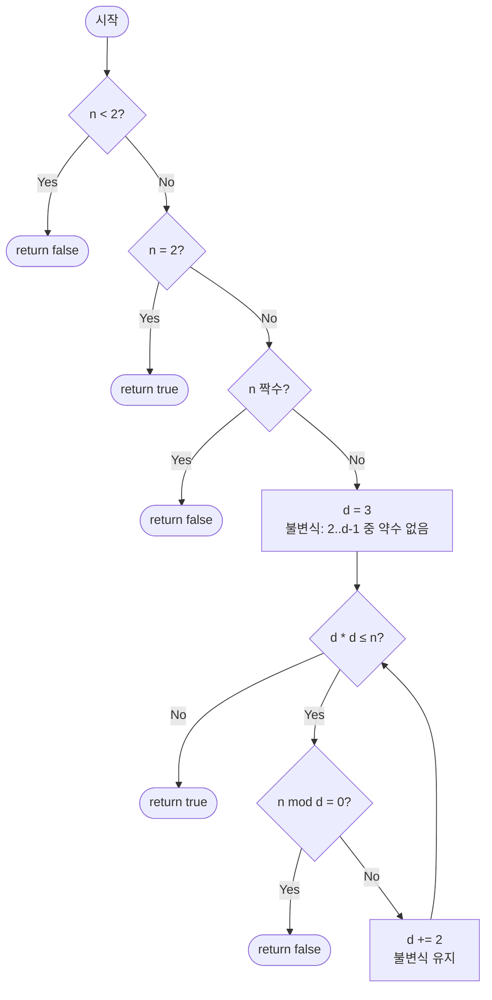

# isPrimeTrial — 시행 나눗셈 소수 판정 해설

## 성능 목표 예측

| 항목 | 값 |
|------|-----|
| 입력 범위 | $n \leq 10^{12}$ (권장) |
| 시간 복잡도 | $O(\sqrt{n})$ |
| 공간 복잡도 | $O(1)$ |

**naive 접근의 한계.** 가장 단순한 방법은 $2$부터 $n - 1$까지 모든 정수로 나눠보는 것이다. 이는 $O(n)$이며, $n = 10^{12}$이면 $10^{12}$번의 나눗셈이 필요해 수백 초가 걸린다.

**목표 복잡도와 근거.** $n$이 합성수라면 반드시 $\sqrt{n}$ 이하의 약수가 존재한다. 따라서 $2$부터 $\lfloor \sqrt{n} \rfloor$까지만 나눠보면 충분하다. $n = 10^{12}$이면 $\sqrt{n} = 10^6$이므로 최대 100만 번의 나눗셈으로 판정 가능하다. 홀수만 검사하면 약 50만 번으로 줄어든다.

**공간 트레이드오프.** 상태 변수가 하나(`d`)뿐이므로 추가 메모리가 $O(1)$이다. 에라토스테네스의 체처럼 전처리 배열이 필요 없어, 단발성 소수 판정에 적합하다.

---

## 목표 함수

```ts
function isPrimeTrial(n: number): boolean
```

| 파라미터 | 의미 | 제약 |
|----------|------|------|
| `n` | 판별할 정수 | $n \leq 10^{12}$ 범위 권장 |

**반환값**: $n$이 소수이면 `true`, 아니면 `false`.

**엣지케이스**:
1. `n = 0` → `false` ($0$은 소수가 아님)
2. `n = 1` → `false` ($1$은 소수의 정의상 제외)
3. `n = 2` → `true` (가장 작은 소수)
4. `n = 4` → `false` ($4 = 2 \times 2$, 가장 작은 합성수)
5. `n = 999999999989` → `true` ($10^{12}$ 근방의 소수)

---

## 핵심 아이디어

**핵심 아이디어**: "합성수라면 반드시 √n 이하의 약수가 있으므로 √n까지만 시도해도 충분하다"

소수 판정의 가장 단순한 방법은 2부터 n-1까지 모두 나눠보는 것이지만 $O(n)$이다. 핵심 통찰은 $n = a \times b$ ($a \leq b$)라면 $a \leq \sqrt{n}$이 반드시 성립한다는 점이다. 따라서 $\lfloor\sqrt{n}\rfloor$까지만 나눠보면 되고, 2를 별도 처리한 뒤 홀수만 검사하면 탐색 횟수를 절반으로 더 줄일 수 있다. 결과적으로 $O(\sqrt{n})$ 단순 구현으로 $n \leq 10^{12}$을 처리할 수 있다.

**풀이 구조**
1. $n < 2$ 이면 false, $n = 2$ 이면 true, $n$이 짝수이면 false 반환 (사전 처리)
2. $d = 3$에서 시작해 $d^2 \leq n$인 동안 홀수 $d$만 시도
3. $n \bmod d = 0$이면 false (약수 발견)
4. $d^2 > n$이 되면 true (√n 이하에 약수 없음)

**조건**: $n \leq 10^{12}$ 범위에서 실용적이다. 더 큰 수($n > 10^{12}$)에서는 밀러-라빈을 사용해야 한다.

**대표 예시**: $\text{isPrime}(97)$ 판정
$\sqrt{97} \approx 9.8$이므로 $d = 3, 5, 7, 9$를 시도한다. $97 \bmod 3 = 1$, $97 \bmod 5 = 2$, $97 \bmod 7 = 6$, $d = 9$에서 $9^2 = 81 \leq 97$이지만 $97 \bmod 9 = 7$. 다음 $d = 11$에서 $11^2 = 121 > 97$이므로 루프 종료, true 반환. 브루트포스라면 95번 나눴을 것을 단 4번으로 해결했다.

**언제 쓰나**
단발성으로 하나의 수가 소수인지 확인할 때, 또는 $n \leq 10^{12}$ 범위의 수를 별도 전처리 없이 즉시 판정해야 할 때 사용한다. 범위 내 모든 소수 목록이 필요하면 에라토스테네스의 체가, $n > 10^{12}$이면 밀러-라빈이 더 적합하다.

---

### 원형 아이디어와 naive 접근

소수의 정의에 따라 $2$부터 $n - 1$까지 나눠보면 되지만, 이는 $O(n)$으로 $n$이 크면 폭발한다. "꼭 $n - 1$까지 다 확인해야 할까? 어느 시점에서 멈춰도 안전한가?"라는 질문이 돌파구이다.

### 어떤 관찰이 돌파구가 되는가

- **핵심 관찰 1**: $n$이 합성수라면 $n = a \times b$ ($a \leq b$)로 인수분해할 수 있다. 이때 $a \leq \sqrt{n} \leq b$가 반드시 성립한다. 왜냐하면 $a > \sqrt{n}$이면 $b \geq a > \sqrt{n}$이어서 $a \times b > n$이 되어 모순이기 때문이다.
- **핵심 관찰 2**: 따라서 $\lfloor \sqrt{n} \rfloor$까지 나눠봐서 약수가 없으면, $n$은 소수이다. 탐색 범위를 $O(n)$에서 $O(\sqrt{n})$으로 줄인다.
- **핵심 관찰 3**: $2$를 별도로 처리하고 나면, 이후 홀수($3, 5, 7, \ldots$)만 검사해도 충분하다. 짝수는 $2$가 이미 거르기 때문이다. 이를 통해 실제 반복 횟수를 약 절반으로 줄일 수 있다.

### 관찰을 형식화: 상태/구조 정의

상태를 제수 $d$로 정의한다. 초기값 $d = 3$에서 시작해 $d^2 \leq n$인 동안 홀수 $d$를 순서대로 시도한다. 매 단계의 불변식은 다음과 같다:

"$2$부터 $d - 1$까지의 어떤 정수도 $n$을 나누지 못했다."

이 불변식이 유지되다가 $d^2 > n$이 되면, $\sqrt{n}$ 이하의 약수가 없으므로 $n$은 소수이다. 반대로 $n \bmod d = 0$이 되면 $d$가 약수이므로 $n$은 합성수이다.

### 점화식 또는 핵심 연산

명시적 점화식보다는 루프 구조로 표현하는 것이 자연스럽다:

$$\text{isPrime}(n) = \begin{cases}
  \text{false} & \text{if } n < 2 \\
  \text{true} & \text{if } n = 2 \\
  \text{false} & \text{if } n \bmod 2 = 0 \\
  \neg \bigl(\exists\, d \in \{3, 5, 7, \ldots, \lfloor \sqrt{n} \rfloor\} : d \mid n\bigr) & \text{otherwise}
\end{cases}$$

**유도**: $n$이 합성수이면 $n = p \cdot q$ ($p$는 최소 소인수)로 쓸 수 있다. $p \leq \sqrt{n}$임을 위에서 보였다. $2$를 별도 처리했으므로, 홀수 $d = 3, 5, \ldots$ 중 $p$가 있으며 $d \leq \sqrt{n}$ 범위에서 발견된다.

### 정당성 — 왜 이것이 옳은가

**완전성 (false negative 없음)**: $n$이 합성수라면 최소 소인수 $p \leq \sqrt{n}$이 존재하며, 알고리즘은 $d = p$일 때 `false`를 반환한다.

**건전성 (false positive 없음)**: $d = 3$부터 $\lfloor \sqrt{n} \rfloor$까지 모든 홀수를 시도했는데 아무도 $n$을 나누지 못했다면, $n$은 소수이다.

**까다로운 케이스**: $n = 4$는 $d = 2$ 검사로 걸러진다. $n = 9$는 $d = 3$에서 $3^2 = 9 \leq 9$이므로 $9 \bmod 3 = 0$으로 합성수로 판정된다. $n$이 정확히 소수의 제곱인 경우 $d = \sqrt{n}$에서 탐지되므로 $d^2 \leq n$ 조건이 `<=`이어야 한다.

### 구현 디테일과 최적화

- **홀수만 검사**: $d = 3$에서 시작해 $d += 2$로 진행하면 절반의 나눗셈을 생략한다.
- **$d^2 \leq n$ 조건**: $d \leq \lfloor \sqrt{n} \rfloor$ 대신 `d * d <= n`을 사용하면 부동소수점 오차를 피할 수 있다. `number` 타입에서 $n \leq 10^{12}$이면 `d * d`는 최대 $10^{12}$으로 정밀도 내에 있다.
- **조기 종료**: $n$이 짝수이면 $2$를 별도로 처리한 뒤 바로 `false`를 반환해 불필요한 홀수 루프를 생략한다.
- **함정**: `Math.sqrt(n)`의 부동소수점 오차로 $d \leq \text{Math.sqrt}(n)$이 $n$이 완전제곱수일 때 잘못 판정할 수 있다. `d * d <= n`이 더 안전하다.

---

## 수도 코드와 Activity Diagram

### 의사코드

```
function isPrimeTrial(n):
    if n < 2: return false          // 0, 1, 음수는 소수 아님
    if n == 2: return true          // 2는 소수
    if n % 2 == 0: return false     // 짝수는 소수 아님 (2 제외)

    d = 3
    // 불변식: 2부터 d-1까지의 어떤 수도 n을 나누지 못함
    while d * d <= n:
        if n % d == 0:
            return false            // d가 약수이므로 합성수
        d += 2                      // 홀수만 검사
    // d² > n → √n 이하의 약수 없음 → 소수
    return true
```

### Activity Diagram



**핵심 불변식**: 루프 매 반복 직전, $2$부터 $d - 1$까지의 어떤 정수도 $n$을 나누지 못했다.

---

## 관련 알고리즘과 적용 범위 비교

### isPrimeTrial vs millerRabin vs sieveOfEratosthenes

| 방법 | 시간 | 공간 | 적합 범위 | 특징 |
|------|------|------|----------|------|
| 시행 나눗셈 | $O(\sqrt{n})$ | $O(1)$ | $n \leq 10^{12}$ | 단발성, 코드 단순 |
| 밀러-라빈 | $O(k \log^2 n)$ | $O(1)$ | $n < 2^{64}$ | 결정적, 큰 수에 강함 |
| 에라토스테네스 | $O(n \log \log n)$ | $O(n)$ | $n \leq 10^7$ | 범위 내 모든 소수 |

시행 나눗셈은 $n \leq 10^{12}$인 단발 판정에 적합하다. 더 큰 수에는 밀러-라빈을, 범위 내 모든 소수가 필요하면 에라토스테네스의 체를 사용한다.

### 추가 최적화: 6k±1 패턴

$2$와 $3$을 별도 처리한 후, 모든 소수는 $6k \pm 1$ 형태이다. $d = 5, 7, 11, 13, 17, 19, \ldots$ 패턴으로 $d += 4$ / $d += 2$를 교대로 적용하면 반복 횟수를 약 $1/3$로 줄일 수 있다. 이 최적화로 실제 실행 속도가 약 3배 향상된다.

### 소수 분포와 기댓값 복잡도

소수 정리에 의해 $[2, \sqrt{n}]$에서 소수 밀도는 $\approx 1/\ln(\sqrt{n})$이다. $n$이 합성수인 경우 평균적으로 첫 번째 소인수를 찾기까지 $O(\ln(\sqrt{n}))$번만 검사하면 된다. 그러나 최악 케이스($n$이 소수이거나 두 큰 소수의 곱)에서는 $O(\sqrt{n})$이 필요하다.
