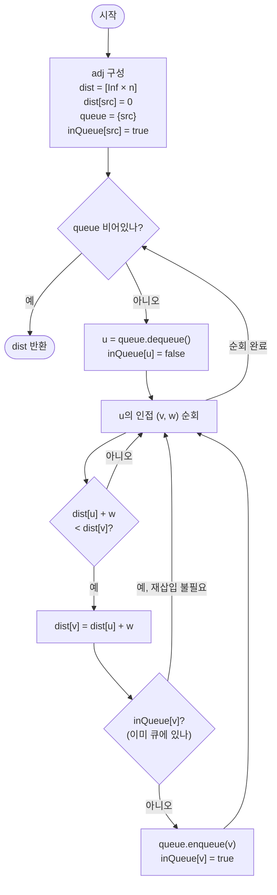

# SPFA (Shortest Path Faster Algorithm) 해설

## 성능 목표 예측

| 항목 | 값 |
|------|-----|
| V (정점 수) | $1 \leq V \leq 10^5$ |
| E (간선 수) | $0 \leq E \leq 2 \times 10^5$ |
| 가중치 범위 | $-10^9 \leq w(u, v) \leq 10^9$ |
| 구조 제약 | $s$에서 도달 가능한 음수 사이클 없음 |

### Naive 접근의 한계

음수 간선이 있으므로 Dijkstra는 사용 불가다.

음수 간선을 처리할 수 있는 Bellman-Ford는:

$$O(V \cdot E) = 10^5 \times 2 \times 10^5 = 2 \times 10^{10} \to \text{시간 초과}$$

Bellman-Ford의 비효율 원인은 매 라운드마다 **dist가 변하지 않은 정점에서 출발하는 간선도 전부 검사**한다는 것이다. $V = 10^5$의 그래프에서 $V$번 전체 검사는 현실적이지 않다.

### 목표 복잡도와 근거

SPFA는 평균적으로 $O(k \cdot E)$ (작은 상수 $k \approx 2 \sim 5$)로 동작한다.

$$O(k \cdot E) \approx 5 \times 2 \times 10^5 = 10^6 \to \text{충분히 통과}$$

단, 최악의 경우는 $O(V \cdot E)$이며, 음수 사이클이 없어야 종료가 보장된다. 경쟁 프로그래밍에서 SPFA를 의도적으로 느리게 만드는 데이터가 존재할 수 있음에 주의한다.

### 공간 복잡도

- 인접 리스트: $O(V + E)$
- 거리 배열: $O(V)$
- inQueue 플래그 배열: $O(V)$
- FIFO 큐: 최대 $O(V)$ 항목
- 전체: $O(V + E)$

## 목표 함수

```ts
function spfa(
  n: number,
  edges: [number, number, number][],
  src: number,
): number[]
```

| 파라미터 | 의미 | 제약 |
|---------|------|------|
| `n` | 정점의 개수 $V$ | $1 \leq n \leq 10^5$ |
| `edges` | 방향 간선 목록 `[u, v, w]` | 음수 가중치 허용 |
| `src` | 시작 정점 $s$ | $0 \leq src < n$ |

**반환값**: 길이 $V$의 배열 `dist`. `dist[v]`는 $s \to v$ 최단 경로 비용이며, 도달 불가능하면 `Infinity`.

**엣지케이스**:
1. `dist[src] = 0`: 자기 자신까지의 거리는 항상 0
2. 음수 사이클 없음을 가정: 음수 사이클이 있으면 알고리즘이 종료되지 않음
3. `inQueue` 플래그: 이미 큐에 있는 정점은 재삽입하지 않음 (나중에 꺼낼 때 최신 dist로 처리)
4. 도달 불가능한 정점: `Infinity`로 유지되며 큐에 삽입되지 않음

## 핵심 아이디어

**핵심 아이디어**: "방금 거리가 줄어든 정점에서만 이웃을 다시 확인하면, 불필요한 검사를 대부분 건너뛸 수 있다."

Bellman-Ford는 매 라운드마다 모든 간선을 검사하지만, 실제로 이웃이 개선되려면 출발 정점의 거리가 먼저 줄어들어야 한다. SPFA는 FIFO 큐로 "방금 갱신된 정점"만 추적해 그 이웃만 완화한다. 이 단순한 관찰로 평균 비용이 Bellman-Ford보다 훨씬 작아진다.

**풀이 구조**
1. `dist[src] = 0`, 나머지 Infinity. 큐에 src 삽입, `inQueue[src] = true`
2. 큐에서 $u$ 꺼냄. `inQueue[u] = false` 해제
3. $u$의 이웃 $v$마다 `dist[u] + w < dist[v]`이면 `dist[v]` 갱신
4. 갱신된 $v$가 큐에 없으면 큐에 삽입하고 `inQueue[v] = true`
5. 큐가 빌 때까지 반복. `dist` 반환

**조건**: 음수 간선 허용. 출발점에서 도달 가능한 음수 사이클이 없어야 종료가 보장됨. 최악 시간복잡도는 Bellman-Ford와 같은 $O(VE)$.

**대표 예시**: 음수 가중치 간선이 드문드문 있는 대형 도로 네트워크의 최단 경로
대부분의 정점은 한두 번만 갱신되고, 음수 간선이 관련된 소수의 정점만 추가 갱신된다. SPFA는 이런 희소 갱신 패턴에서 Bellman-Ford 대비 실제 수행 시간이 크게 짧다.

**언제 쓰나**
음수 간선이 있어 Dijkstra를 쓸 수 없고, V가 $10^5$ 수준으로 커서 Bellman-Ford($O(VE)$)가 느릴 때 SPFA를 시도한다. 단, 최악 케이스를 의도적으로 만드는 데이터가 존재할 수 있으므로 경쟁 프로그래밍에서는 주의가 필요하다.

---

### 원형 아이디어와 naive 접근

Bellman-Ford는 최단 경로가 최대 $V-1$개의 간선을 사용한다는 관찰로부터 출발해, $V-1$번의 완화 라운드를 수행한다.

```
dist = [Infinity] * n; dist[src] = 0

for i in 1..V-1:
    for (u, v, w) in 모든 간선:           // E개 간선 전부 검사
        if dist[u] + w < dist[v]:
            dist[v] = dist[u] + w
```

이 방식의 문제점: 매 라운드마다 $E$개의 간선을 전부 검사한다. 그 중 대부분은 `dist[u]`가 이전 라운드에서 변하지 않았으므로 완화 결과도 변하지 않는 "무의미한 검사"다.

구체적인 예시: 선형 체인 $0 \to 1 \to 2 \to \cdots \to V-1$에서 $src = 0$이면, 1번 라운드에서 `dist[1]`만 갱신되고, 2번 라운드에서 `dist[2]`만 갱신된다. 그러나 Bellman-Ford는 매 라운드마다 $V-1$개 간선을 전부 검사한다.

### 어떤 관찰이 돌파구가 되는가

- **관찰 1**: `dist[v]`가 갱신되려면 반드시 이웃 $u$의 `dist[u]`가 먼저 갱신되어야 한다. 역으로, `dist[u]`가 변하지 않았다면 $u$를 출발점으로 하는 완화는 결코 `dist[v]`를 개선하지 못한다.

- **관찰 2**: 따라서 "방금 dist가 갱신된 정점"만 추적해 그 이웃을 검사하면 충분하다. 갱신이 없는 정점에서 출발하는 간선 검사는 완전히 불필요하다.

- **관찰 3**: FIFO 큐에 "갱신된 정점"을 넣고, 꺼낼 때 그 이웃을 완화한다. `inQueue` 플래그로 이미 큐에 있는 정점의 중복 삽입을 막는다.

### 관찰을 형식화: 상태/구조 정의

**상태 정의**:
- `dist[v]`: 현재까지 발견한 $s \to v$ 최단 경로 비용
- `inQueue[v]`: 정점 $v$가 현재 큐에 있는지 여부

**큐의 불변 의미**: 큐에 있는 정점 $u$는 "dist[u]가 최근에 줄어들었으며, $u$의 이웃을 완화하면 추가 개선이 일어날 가능성이 있는 정점"이다.

왜 FIFO 큐여야 하는가: Dijkstra는 min-heap으로 "가장 짧은 dist" 순서를 보장해야 하지만, SPFA는 확정이 보장되지 않으므로 순서보다는 "갱신된 정점만 처리"가 핵심이다. FIFO 큐가 구현상 가장 단순하다. (실제로 SLF(Shortest Label First) 등의 변형으로 성능을 개선할 수 있다.)

### 점화식 또는 핵심 연산

**완화 연산**: 정점 $u$를 큐에서 꺼낼 때, $u$의 모든 이웃 $v$에 대해

$$dist[v] \leftarrow dist[u] + w(u, v) \quad \text{if } dist[u] + w(u, v) < dist[v]$$

갱신이 발생하면, $v$가 큐에 없을 경우에만 큐에 삽입:

$$v \notin \text{queue} \implies \text{queue.enqueue}(v),\; inQueue[v] \leftarrow \text{true}$$

- 이미 큐에 있는 $v$는 꺼낼 때 최신 `dist[v]`로 처리되므로 재삽입 불필요
- 갱신이 없으면 $v$는 큐에 삽입되지 않음 → 불필요한 처리 제거

### 정당성 — 왜 이것이 옳은가

**수렴 주장**: 음수 사이클이 없으면 각 정점의 `dist`는 유한 번만 갱신되고 최종적으로 진짜 최단 거리에 수렴한다.

**왜 수렴하는가**: `dist[v]`가 갱신될 때마다 값이 단조 감소한다. 음수 사이클이 없으면 모든 최단 경로의 길이는 유한하며, `dist[v]`는 그 유한한 최솟값에 도달하면 더 이상 감소하지 않는다. 따라서 각 정점이 큐에 들어가는 횟수는 유한하다.

**Bellman-Ford와의 동치성**: SPFA는 Bellman-Ford의 최적화 버전이다. Bellman-Ford에서 "갱신되지 않은 정점에서 출발하는 간선 검사"를 제거한 것이므로, 동일한 최단 거리 결과를 낸다.

**까다로운 케이스**: 같은 정점이 여러 번 갱신되는 경우 — `dist[v]`가 2번, 3번 갱신될 수 있다. 이것은 정확성에 문제가 없다. 나중에 꺼낼 때 항상 최신 `dist[v]`를 사용하기 때문이다.

**음수 사이클이 있을 때의 문제**: 음수 사이클 $v_1 \to v_2 \to \cdots \to v_1$ (합 < 0)이 있으면, 사이클을 돌수록 `dist`가 계속 감소해 큐에서 정점이 영원히 나온다. SPFA 자체에는 음수 사이클 검출 기능이 없으므로, 필요하면 `bellmanFord`를 사용해야 한다.

### 구현 디테일과 최적화

**`inQueue` 플래그의 역할**: `dist[v]`가 여러 번 갱신될 때 큐에 중복 삽입을 막는다. 큐에서 꺼낼 때 `inQueue[u] = false`로 해제해야 이후 재삽입이 가능해진다. 이를 빠뜨리면 정점이 한 번 삽입된 후 영원히 재삽입되지 않아 갱신 전파가 끊긴다.

**함정 — `inQueue` 해제 타이밍**: 큐에서 꺼낸 직후 `inQueue[u] = false`로 해제한다. 이웃 처리 후에 해제하면 같은 정점이 이웃 처리 중 재삽입될 필요가 있는데 막혀버린다.

**함정 — FIFO vs 중복 삽입**: `inQueue` 플래그 없이 중복 삽입을 허용하면 같은 정점이 여러 번 큐에 들어가 중복 처리된다. 성능은 저하되지만 정확성은 유지된다. 단, 이 경우 큐 크기가 $O(E)$까지 늘어날 수 있다.

**SLF(Shortest Label First) 최적화**: 큐에 삽입할 때 `dist[v] < dist[front of queue]`이면 큐의 앞에 삽입한다. 이를 통해 짧은 경로를 먼저 처리해 평균 성능을 향상시킬 수 있다. 단, 최악 복잡도는 변하지 않는다.

## 수도 코드와 Activity Diagram

### 의사코드

```
function spfa(n, edges, src):
  // 인접 리스트 구성
  adj ← array of empty lists, size n
  for (u, v, w) in edges:
    adj[u].append((v, w))

  // 초기화
  dist ← [Infinity] * n          // 불변식: dist[v]는 현재까지 발견한 s→v 최선값
  dist[src] ← 0
  inQueue ← [false] * n
  queue ← 빈 FIFO 큐

  queue.enqueue(src)
  inQueue[src] ← true           // 불변식: inQueue[v] = true ⟺ v가 현재 큐에 있음

  // 주 루프
  while queue is not empty:
    u ← queue.dequeue()
    inQueue[u] ← false           // 불변식 유지: 꺼낸 직후 해제

    // 불변식: u는 dist[u]가 최근 갱신된 정점. u의 이웃을 완화.
    for (v, w) in adj[u]:
      if dist[u] + w < dist[v]:
        dist[v] ← dist[u] + w   // dist[v] 단조 감소
        if not inQueue[v]:       // 이미 큐에 있으면 나중에 최신 dist로 처리됨
          queue.enqueue(v)
          inQueue[v] ← true

  return dist
```

**핵심 불변식**: 큐에 있는 정점 $v$는 "dist[v]가 최근에 갱신되어 $v$의 이웃 중 개선될 수 있는 것이 남아있을 가능성이 있는 정점"이다. 큐가 비면 더 이상 개선 가능한 정점이 없으므로 `dist`가 최종 수렴 상태다.

### Activity Diagram



**핵심 불변식**: `inQueue[v] = true`인 정점 $v$는 큐에 정확히 한 번 존재하며, 꺼낼 때 최신 `dist[v]`로 이웃을 처리한다.
