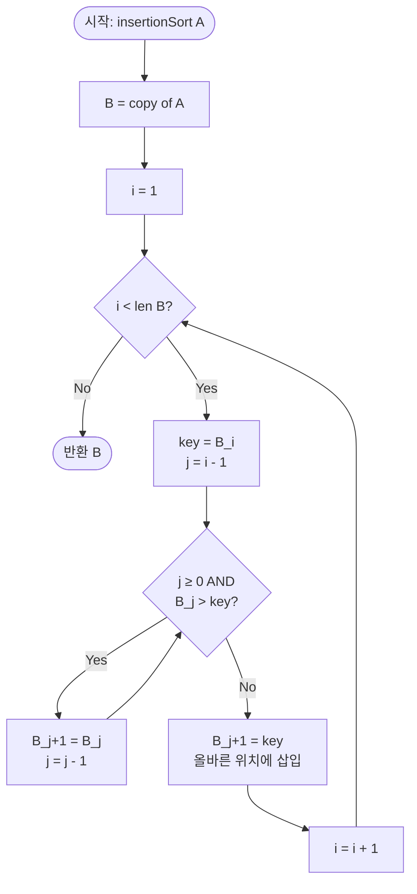

# Insertion Sort — 해설

## 성능 목표 예측

| 항목 | 값 |
|------|----|
| 입력 크기 N | 1 ≤ N ≤ 10,000 |
| 값 범위 | −10⁹ ≤ A[i] ≤ 10⁹ |
| 역순쌍 수 I(A) | $0 \leq I(A) \leq \frac{N(N-1)}{2}$ |
| 목표 시간 복잡도 | **O(N + I(A))** |
| 공간 복잡도 | **O(N)** (새 배열 반환) |

**naive 접근의 복잡도와 한계:**
버블 정렬은 인접 원소를 반복 비교·교환하며 $O(N^2)$ 시간이 소요된다. $N = 10{,}000$에서 최악 $\frac{10^4 \times (10^4-1)}{2} \approx 5 \times 10^7$ 연산이 발생한다. 이는 허용 범위지만 무조건 $O(N^2)$인 반면, 삽입 정렬은 입력의 정렬 상태에 따라 적응적으로 동작한다.

**목표 복잡도의 근거:**
이 문제는 "거의 정렬된 배열"을 전제로 한다. 역순쌍 $I(A) = |\{(i, j) \mid i < j,\ A[i] > A[j]\}|$가 작으면 삽입 정렬의 내부 이동 횟수도 작아진다. $I(A) = O(N)$인 입력에서 삽입 정렬은 $O(N)$에 수렴하며, 이는 비교 기반 정렬의 이론적 하한이다. 이미 정렬된 입력($I(A) = 0$)에서는 정확히 $O(N)$이 되어 선형 시간 정렬과 동등하다.

**공간 복잡도 고려:**
문제가 새 배열 반환을 요구하므로 $O(N)$ 복사 공간이 필요하다. 제자리 정렬로 구현하면 $O(1)$이지만, 원본 배열을 수정하게 된다.

---

## 목표 함수

```ts
function insertionSort(A: number[]): number[]
```

| 파라미터 | 의미 | 제약 |
|---------|------|------|
| `A` | 정렬할 정수 배열 | $1 \leq N \leq 10{,}000$ |
| `A[i]` | 각 원소의 값 | $-10^9 \leq A[i] \leq 10^9$ |

**반환값:** 오름차순으로 정렬된 새 배열. 원본 배열 `A`는 변경하지 않는다.

**엣지케이스:**

| 케이스 | 입력 예시 | 기대 출력 | 비고 |
|--------|----------|----------|------|
| 빈 입력 | `[]` | `[]` | N = 0 처리 |
| 단일 원소 | `[7]` | `[7]` | I(A) = 0 |
| 이미 정렬됨 | `[1, 2, 3, 4]` | `[1, 2, 3, 4]` | I(A) = 0, O(N) |
| 역순 정렬 | `[4, 3, 2, 1]` | `[1, 2, 3, 4]` | I(A) = 6, 최악 케이스 |
| 동일 원소 | `[5, 5, 5]` | `[5, 5, 5]` | 안정 정렬 — 상대 순서 유지 |
| 음수 포함 | `[-3, 1, -1, 2]` | `[-3, -1, 1, 2]` | 값 범위 경계 |

---

## 핵심 아이디어

**핵심 아이디어**: "왼쪽을 항상 정렬된 상태로 유지하고, 새 원소를 올바른 자리에 끼워 넣는다."

카드를 손에 쥘 때 한 장씩 가져와 이미 정렬된 패 사이에 끼워 넣는 방식이 바로 삽입 정렬이다. 왼쪽 $i$개가 항상 정렬된 상태라는 불변식이 유지되므로, $i+1$번째 원소를 삽입하는 것은 이미 정렬된 배열에서 올바른 위치 하나를 찾는 문제로 축소된다. 거의 정렬된 입력에서는 끼워 넣을 위치가 바로 옆이므로 내부 루프가 거의 실행되지 않는다.

**풀이 구조**
1. 원본 배열 복사
2. $i = 1$부터 끝까지 순회. `key = B[i]`, `j = i - 1`
3. `j >= 0`이고 `B[j] > key`인 동안 `B[j+1] = B[j]`, `j` 감소 (원소를 한 칸씩 오른쪽으로 밀기)
4. `B[j+1] = key` (올바른 위치에 삽입)
5. 정렬 완료된 배열 반환

**조건**: 비교 가능한 원소면 모두 적용 가능. 역순쌍 수 $I(A)$가 총 이동 횟수와 일치하므로, $I(A)$가 작을수록 빠름.

**대표 예시**: 거의 정렬된 센서 데이터 스트림 처리
실시간으로 수신되는 타임스탬프 데이터는 대부분 순서대로 들어오지만 가끔 순서가 뒤집힌다. 역순쌍이 거의 없으므로 삽입 정렬이 $O(N)$에 가깝게 동작해 퀵소트보다 훨씬 빠르다.

**언제 쓰나**
$N$이 수천 이하이거나 입력이 이미 거의 정렬된 경우에 적합하다. Timsort 같은 하이브리드 정렬에서도 소규모 구간 정렬에 삽입 정렬을 내부적으로 사용한다.

---

### 원형 아이디어와 naive 접근

가장 단순한 접근: 임의의 두 원소를 골라 잘못된 순서면 교환한다. 버블 정렬 방식으로 의사코드:

```
for i from 0 to N-1:
    for j from i+1 to N-1:
        if A[i] > A[j]:
            swap(A[i], A[j])
```

이 방법은 매번 $O(N)$ 내부 루프를 실행하므로 총 $O(N^2)$이다. $N = 10{,}000$에서 최악 $5 \times 10^7$ 연산이며, "거의 정렬된" 입력에서도 개선 없이 $O(N^2)$를 소비한다. 핵심 낭비는 이미 올바른 위치에 있는 원소들까지 반복적으로 비교한다는 것이다.

### 어떤 관찰이 돌파구가 되는가

- **관찰 1 (역순쌍과 이동 횟수의 1:1 대응):** 인접 원소 교환 알고리즘에서 swap 1회는 역순쌍을 정확히 1개 제거한다. 따라서 총 swap 횟수 = $I(A)$이며, 이것이 최하한이기도 하다.
- **관찰 2 (정렬된 구간의 보존):** 배열의 왼쪽 부분이 이미 정렬된 상태를 유지한다면, 새 원소를 그 구간에 "끼워 넣는" 비용만 지불하면 된다. 이미 올바른 위치에 있는 원소들은 건드릴 필요가 없다.
- **관찰 3 (선형 스캔의 조기 종료):** 삽입 위치를 찾을 때, 현재 원소보다 작거나 같은 원소를 만나는 순간 더 이상 왼쪽으로 갈 필요가 없다. 이것이 거의 정렬된 입력에서 내부 루프가 거의 실행되지 않는 이유이다.

### 관찰을 형식화: 상태/구조 정의

**핵심 상태:** 외부 루프 변수 $i$와 정렬된 접두사 $B[0..i-1]$.

$$\text{불변식: } B[0] \leq B[1] \leq \cdots \leq B[i-1]$$

이 상태 정의가 왜 이 형태여야 하는가: "왼쪽 $i$개가 항상 정렬됨"이라는 불변식이 성립하면, $i$번째 원소를 삽입하는 문제는 정렬된 배열에서 올바른 위치를 찾아 끼우는 문제로 환원된다. 이는 이진 탐색($O(\log i)$) 또는 선형 스캔($O(i)$)으로 해결 가능하다.

**내부 상태:** 삽입할 값 `key = B[i]`와 현재 비교 중인 포인터 $j$.

$j$는 $i-1$에서 시작해 `B[j] > key`인 동안 감소한다. 이 과정에서 `B[j]`는 한 칸 오른쪽으로 이동한다. $j$가 멈추는 위치 $j+1$이 `key`의 삽입 위치다.

### 점화식 또는 핵심 연산

**삽입 위치 탐색 (내부 루프):**

$$j \leftarrow j - 1 \text{ while } j \geq 0 \text{ and } B[j] > \text{key}$$
$$B[j+1] \leftarrow B[j] \quad \text{(원소 오른쪽으로 한 칸 이동)}$$

**삽입:**

$$B[j+1] \leftarrow \text{key}$$

**총 이동 횟수 분석:**

$i$번째 원소를 삽입할 때 이동 횟수 $= i - (j+1)$ (삽입 위치까지의 거리). 이는 정확히 $B[i]$와 $B[0..i-1]$의 각 원소 사이에서 발생하는 역순쌍 수와 같다. 따라서:

$$\text{총 이동 횟수} = \sum_{i=1}^{N-1} (\text{삽입 시 이동 횟수}_i) = I(A)$$

- 각 항: $i$번째 삽입에서 제거되는 역순쌍 수
- 합산: 전체 역순쌍을 남김없이 제거하므로 총 비용 = $I(A)$

### 정당성 — 왜 이것이 옳은가

귀납법으로 증명한다. **기저:** $i = 1$일 때, $B[0..0]$은 원소 1개이므로 자명하게 정렬됨. **귀납 단계:** $B[0..i-1]$이 정렬되어 있다고 가정하면, `key = B[i]`를 올바른 위치 $j+1$에 삽입한 후 $B[0..i]$도 정렬됨을 보인다. $j+1$은 `B[j] ≤ key < B[j+1]`이 성립하는 위치이므로, 삽입 후 $B[0..j] \leq \text{key} \leq B[j+2..i]$가 된다. 이전 정렬 상태와 결합하면 $B[0..i]$는 오름차순이다.

**동일 값 처리:** `B[j] > key` 조건(등호 포함하지 않음)이므로, `B[j] == key`이면 내부 루프가 멈춘다. 따라서 같은 값의 원소는 원래 순서가 유지되어 안정 정렬이 보장된다.

**음수 처리:** 비교 연산 `B[j] > key`는 음수에서도 정확히 작동한다. JavaScript/TypeScript의 정수 비교는 부호와 무관하게 올바르다.

### 구현 디테일과 최적화

- **새 배열 반환:** 원본을 복사한 뒤 정렬하면 원본이 보존된다. `B = [...A]` 또는 `A.slice()`로 복사한다.
- **이진 탐색 최적화:** 삽입 위치를 이진 탐색으로 $O(\log i)$에 찾을 수 있지만, 이동(shift) 횟수는 그대로 $O(i)$이므로 총 복잡도는 여전히 $O(N^2)$ 최악이다. 비교 횟수만 줄이는 최적화다.
- **흔한 함정 — 반복문 조건 순서:** `j >= 0`을 먼저 확인해야 한다. `B[j] > key`를 먼저 평가하면 $j = -1$일 때 배열 범위 초과가 발생한다 (short-circuit 평가 활용).
- **흔한 함정 — 이미 정렬된 구간 재정렬:** 내부 루프에서 $j$가 음수가 될 때까지 진행하면 $O(i)$ 이동이 발생한다. 조기 종료 조건 `B[j] > key`가 반드시 있어야 거의 정렬된 입력에서 $O(N)$에 가깝게 동작한다.
- **거의 정렬된 배열에서의 우위:** 각 원소가 최종 위치에서 최대 $c$칸 벗어나 있다면 $I(A) \leq c \cdot N$이고, 전체 비용은 $O(cN)$이다. $c$가 상수이면 선형 시간이다.

---

## 수도 코드와 Activity Diagram

### 의사코드

```
function insertionSort(A):
    B = copy of A                   // 불변식: multiset(B) = multiset(A)
    for i from 1 to len(B)-1:
        key = B[i]                  // 불변식: B[0..i-1]은 오름차순 정렬됨
        j = i - 1
        // B[j] > key인 동안 왼쪽으로 탐색하며 원소 오른쪽으로 이동
        while j >= 0 and B[j] > key:
            B[j+1] = B[j]           // 불변식: B[j+2..i]는 key보다 크다
            j = j - 1
        B[j+1] = key                // key를 올바른 위치에 삽입
        // 불변식: B[0..i]는 오름차순 정렬됨
    return B
```

### Activity Diagram



**핵심 불변식:** 외부 루프의 $i$번째 반복 시작 직전에 $B[0..i-1]$은 항상 오름차순 정렬된 상태다. 내부 루프 종료 후 $B[j+1]$이 `key`의 삽입 위치이며, $B[j] \leq \text{key} < B[j+2]$ (또는 경계 조건)가 성립한다.

---

**예시:** $A = [3, 1, 4, 1, 2]$

```
초기:  B = [3, 1, 4, 1, 2]

i=1: key=1, j=0
  B[0]=3 > 1 → B[1]=3, j=-1
  삽입 B[0]=1
  B = [1, 3, 4, 1, 2]  (이동 1회)

i=2: key=4, j=1
  B[1]=3 ≤ 4 → 즉시 멈춤
  삽입 B[2]=4
  B = [1, 3, 4, 1, 2]  (이동 0회)

i=3: key=1, j=2
  B[2]=4 > 1 → B[3]=4, j=1
  B[1]=3 > 1 → B[2]=3, j=0
  B[0]=1 ≤ 1 → 멈춤
  삽입 B[1]=1
  B = [1, 1, 3, 4, 2]  (이동 2회)

i=4: key=2, j=3
  B[3]=4 > 2 → B[4]=4, j=2
  B[2]=3 > 2 → B[3]=3, j=1
  B[1]=1 ≤ 2 → 멈춤
  삽입 B[2]=2
  B = [1, 1, 2, 3, 4]  (이동 2회)

총 이동: 0+1+0+2+2 = 5 = I(A)
최종: [1, 1, 2, 3, 4]
```
