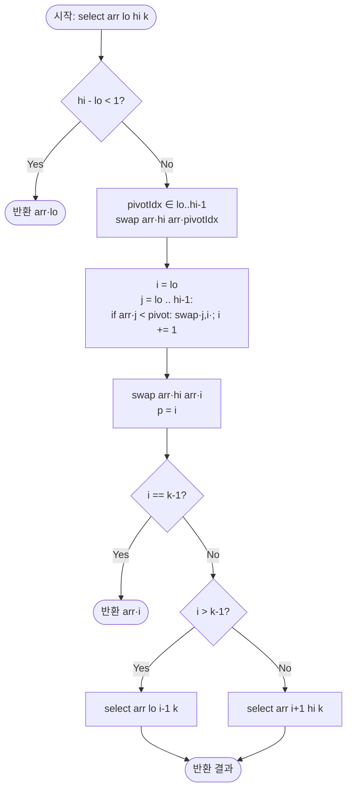

import { AlgorithmSimulation } from "#guide-sim";

# Kth Smallest Element — 해설

> 이 해설은 `kthSmallest.ts`의 **실제 구현**을 기준으로 한다. 구현은 Lomuto 계열 분할을 쓰는
> **Quickselect**이며, 함수명은 `sort`지만 전체를 정렬하지 않고 $k$번째 원소만 선택한다. 두 가지 실제 특성을
> 미리 못 박는다: (1) 분할 비교가 **`arr[j] < pivot`(강한 부등호)**이라 피벗과 **같은 값은 피벗의 오른쪽**으로
> 간다. (2) **입력 배열을 복사하지 않고 제자리에서 교환(swap)하므로 원본 `A`가 변형된다.**

## 성능 목표 예측

| 항목 | 값 |
|------|----|
| 입력 크기 $N$ | $1 \le N \le 100{,}000$ |
| 값 범위 | $-10^9 \le A[i] \le 10^9$ |
| $k$ 범위 | $1 \le k \le N$ (1-based) |
| 목표 시간 복잡도 | **평균 $O(N)$** (Quickselect) |
| 최악 시간 복잡도 | $O(N^2)$ — 무작위 피벗으로 대개 회피되나 **중복이 많은 입력에서는 피벗과 무관하게 발생**(§한계 참조) |
| 공간 복잡도 | 기대 $O(\log N)$ 재귀 스택, **최악 $O(N)$** — `N=10^5` 최악 경로에서 스택 오버플로 위험(§한계) |

> 위 $N$·값 범위·$k$ 범위는 **문제 제약**(`kthSmallest-problem.md`)이다.

**naive 접근과 한계.** 가장 단순한 방법은 전체를 정렬한 뒤 $k-1$번째를 반환하는 것이다.

```
sort(A)        // O(N log N)
return A[k-1]
```

$N = 10^5$에서 $O(N \log N)$도 통과는 하지만, $k$번째 하나만 필요한데 나머지 $N-k$개의 **순서까지**
결정하는 것은 낭비다. 이 낭비를 없애는 것이 Quickselect의 출발점이다.

**목표 복잡도의 근거.** Quickselect는 분할 후 **정답이 있는 한쪽만** 재귀하므로, 기대 비용이 등비급수로 합쳐진다.

$$T(N) = T(3N/4) + O(N) \;\Rightarrow\; T(N) = O(N)\cdot\frac{1}{1-3/4} = O(N)$$

왜 $3N/4$인가: 균등 무작위 피벗은 **1/2 확률로** 구간의 가운데 절반(순위 $[N/4, 3N/4]$)에 들어가고, 그때
남는 구간은 $\le 3N/4$다. 이런 "좋은 분할"이 상수 확률로 나오므로 나쁜 분할의 비용까지 기대값에 흡수되어
기대 시간이 $O(N)$이 된다(이것은 균등 독립 무작위 피벗을 가정한 표준 분석이다 — 아래 이 구현의 피벗은 그
가정에서 벗어난다).

> **이 구현의 피벗 선택 주의 (무작위성이 표준이 아니다).** 코드는
> `pivotIdx = (Math.floor(Math.random()*100000) % (hi-lo)) + lo`로 피벗을 고른다. 세 가지 결함이 있다.
> (1) 범위가 $[\text{lo}, \text{hi}-1]$이라 **끝 `hi`는 후보에서 제외**된다. (2) `% (hi-lo)`는 일반적으로
> **모듈로 편향**을 일으켜 균등 분포가 아니다. (3) 특히 원소가 2개 남으면(`hi-lo=1`) `(…) % 1 = 0`이라
> **항상 `lo`만** 골라 무작위성이 완전히 사라진다. 정답의 **정확성에는 영향이 없지만**(어떤 피벗이든 선택
> 결과는 같다), 위 표준 분석이 가정한 균등 독립 무작위가 깨지므로 **최악 회피 효과는 그만큼 약하다.**
> 균등하게 뽑으려면 표준식 `Math.floor(Math.random() * (hi - lo + 1)) + lo`를 써야 한다.

---

## 목표 함수

```ts
function kthSmallest(A: number[], k: number): number
```

| 파라미터 | 의미 | 제약 |
|---------|------|------|
| `A` | 정수 배열 | $1 \le N \le 100{,}000$ |
| `A[i]` | 각 원소의 값 | $-10^9 \le A[i] \le 10^9$ |
| `k` | 1-based 순위 | $1 \le k \le N$ |

**반환값:** $A$를 오름차순 정렬했을 때 $k$번째 원소(= `sort(A)[k-1]`).

**부작용(중요):** 이 구현은 `A`를 **제자리에서 변형**한다. 예를 들어 `kthSmallest([3,1,4,1,5,9,2,6], 3)`은
반환값 `2`를 주지만 호출 후 입력 배열은 부분적으로 재배치된다. 피벗이 무작위라 **구체적인 배열 상태는 실행마다
다르다**(한 실행에서는 `[1,1,2,3,5,9,6,4]`). 원본을 보존하려면 호출 측에서 `kthSmallest([...A], k)`로
복사본을 넘겨야 한다.

**엣지케이스:**

| 케이스 | 입력 | 반환 | 비고 |
|--------|------|------|------|
| 최솟값 | `[3,1,4,1,5]`, `k=1` | `1` | target = 0 |
| 최댓값 | `[3,1,4,1,5]`, `k=5` | `5` | target = N−1 |
| 단일 원소 | `[7]`, `k=1` | `7` | `hi-lo<1` 기저 |
| 중복 포함 | `[2,2,2]`, `k=2` | `2` | 동치는 분할에서 오른쪽으로 가지만 선택 결과는 정확 |

---

## 핵심 아이디어

**한 줄 요약:** 피벗을 기준으로 배열을 분할하면 피벗의 **최종 위치**가 정해진다. 그 위치가 목표 순위면 바로
정답이고, 아니면 목표가 있는 **한쪽 구간만** 재귀한다. 나머지 구간은 순서를 정할 필요가 없으므로 평균
$O(N)$에 끝난다.

### 1단계 — 원형: 반복 최솟값 추출의 낭비

가장 직관적인 방법은 최솟값 뽑기를 $k$번 반복하는 것이다.

```
for step from 1 to k:
    minIdx = argmin(A)      // 매번 전체를 선형 탐색
    제거 또는 +∞ 표시
return 마지막으로 뽑은 값
```

이는 $O(k \cdot N)$이고 $k = N/2$이면 $O(N^2)$이라 $N=10^5$에서 시간 초과다. 낭비의 핵심: $k$번째를 찾으려고
앞의 $k-1$개를 매번 처음부터 다시 훑는다. 한 번의 분할로 위치 정보를 한꺼번에 얻으면 이 반복을 없앨 수 있다.

### 2단계 — 돌파구가 되는 관찰

- **관찰 1 (분할의 위치 확정).** 임의의 `pivot`을 골라 "pivot보다 작은 것 / pivot / 그 외"로 나누면, pivot의
  **최종 인덱스 $p$ = (pivot보다 작은 원소의 개수)**가 된다. 즉 $A[\text{lo}..p-1] < A[p] \le A[\text{p}+1..\text{hi}]$.
  왼쪽은 모두 더 작고 오른쪽은 모두 크거나 같으므로, **$p$를 목표와 비교해 한쪽을 통째로 버릴 수 있다** — 더
  이상 비교가 필요 없다(중복이 있어도 이 부등식은 그대로 성립한다).
- **관찰 2 (한쪽만 재귀).** $p$가 목표 인덱스가 아니면, 정답은 $p$를 기준으로 한쪽에만 있다. 다른 쪽은 순서를
  정하지 않고 통째로 버린다 — 정렬과의 결정적 차이다.
- **관찰 3 (기대 크기 감소).** 무작위 피벗이면 분할 후 남는 구간이 평균적으로 작아진다($E[S] \le \tfrac34 N$).
  이 기대 감소가 선형 기대 시간의 근거다.

### 3단계 — 상태 정의: 절대 인덱스 목표

현재 탐색 구간 `[lo, hi]`와 **목표 인덱스** target을 상태로 둔다. $k$는 1-based이므로 0-based 목표는
$\text{target} = k-1$이다.

$$\text{불변식: 정답은 항상 } A[\text{lo}..\text{hi}] \text{ 안에 있다.}$$

> **이 구현의 표현 방식.** 코드는 별도의 `target` 변수를 만들지 않고 **1-based `k`를 재귀에 그대로 넘긴 뒤**
> 매 호출에서 분할 위치 `i`를 `i === k - 1`로 비교한다. 즉 0-based 변환을 비교 시점에 그때그때 한다.
> 목표를 **절대 인덱스**로 두기 때문에, 오른쪽 구간으로 재귀할 때도 $k$를 다시 보정할 필요가 없다(상대
> 인덱스로 관리했다면 `k - (p - lo + 1)` 같은 보정이 필요해 실수가 잦다).

### 4단계 — 핵심 연산: 이 구현의 분할

표준 Lomuto는 피벗을 끝에 두고 "≤ 피벗"을 왼쪽으로 모으지만, **이 구현은 다음과 같다.**

```
// 구간 [lo, hi], 무작위 pivotIdx ∈ [lo, hi-1]
pivot = arr[pivotIdx]
swap(arr[hi], arr[pivotIdx])      // 피벗을 끝으로 옮긴다
i = lo                            // i: "pivot보다 작은" 영역의 다음 빈 자리
for j from lo to hi-1:
    if arr[j] < pivot:            // 강한 부등호: 동치는 모으지 않는다
        swap(arr[j], arr[i]); i += 1
swap(arr[hi], arr[i])             // 피벗을 i 자리로 → 최종 위치
p = i                             // 피벗의 최종 인덱스
```

**루프 불변식으로 본 동작.** 루프를 도는 동안 구간 `[lo, hi-1]`은 세 부분으로 나뉜다:
`[lo, i-1]` = 지금까지 본 원소 중 **pivot보다 작은 것**, `[i, j-1]` = 본 것 중 **pivot 이상인 것**,
`[j, hi-1]` = 아직 안 본 것. 불변식은 "**`arr[lo..i-1]`은 모두 `< pivot`**"이다. `arr[j] < pivot`이면
`arr[j]`를 `arr[i]`로 보내고 `i`를 한 칸 늘려 불변식을 유지하고, `arr[j] >= pivot`이면 그냥 둔다(자연히
`[i, j]` 영역으로 들어간다). 루프가 끝나면 `i`는 정확히 "pivot보다 작은 원소의 개수"이고, `[lo, i-1]`은 모두
`< pivot`, `[i, hi-1]`은 모두 `>= pivot`이다.

마지막 `swap(arr[hi], arr[i])`는 끝에 치워 두었던 피벗을 그 경계 자리 `i`로 데려온다. `i` 왼쪽은 모두
`< pivot`, 오른쪽은 모두 `>= pivot`이었으므로 피벗은 정확히 제자리에 놓이고 `p = i`가 최종 인덱스다.

$$A[\text{lo}..p-1] < A[p] \le A[p+1..\text{hi}]$$

왼쪽은 **강한 부등호**($<$)임에 주의하라 — 피벗과 **같은 값은 모두 오른쪽**($p+1..\text{hi}$)에 있다.

### 5단계 — 선택: 한쪽만 재귀

분할 위치 `p`(코드의 `i`)와 목표 `k-1`을 비교한다.

- `i === k - 1` → `arr[i]`가 정답.
- `i > k - 1` → 정답은 왼쪽 `[lo, i-1]`. 그쪽만 재귀.
- `i < k - 1` → 정답은 오른쪽 `[i+1, hi]`. 그쪽만 재귀.

**기저 사례:** 구간 길이가 1 이하(`hi - lo < 1`, 즉 `hi <= lo`)면 후보가 하나뿐이므로 `arr[lo]`를 반환한다.

### 정당성 — 왜 옳은가

- **분할의 정확성.** 위 루프 불변식이 종료 시 $A[\text{lo}..p-1] < A[p] \le A[p+1..\text{hi}]$를 보장한다.
  핵심은 "`p`가 피벗의 유일한 순위"가 아니라(중복이 있으면 같은 값이 여럿일 수 있다), **`p` 왼쪽은 모두 더 작고
  오른쪽은 모두 크거나 같다**는 사실이다. 이 부등식만으로 목표를 어느 쪽에서 찾을지 결정할 수 있다.
- **선택의 정확성.** "정답은 현재 `[lo,hi]`에 있다"는 불변식이 각 재귀에서 보존된다. `p`가 목표보다 크면 정답은
  왼쪽, 작으면 오른쪽에 있고, 구간이 한 점으로 줄면 그 원소가 정답이다.
- **중복 값.** 동치가 오른쪽으로 가더라도(강한 부등호) 분할은 피벗의 **정확한 순위** `p`를 그대로 내놓는다.
  목표가 동치 블록 안을 가리켜도, 그 블록은 모두 같은 값이라 어느 것을 반환해도 값은 동일하다. 따라서 결과는
  항상 정확하다(예: `[2,2,2]`, `k=2` → `2`).

### 구현 디테일과 함정

- **제자리 변형 vs 원본 보존.** 이 구현은 `A`를 직접 swap하므로 원본이 바뀐다. 보존이 필요하면 호출 측에서
  복사본(`[...A]`)을 넘긴다.
- **무작위 피벗의 중요성.** 항상 첫/끝 원소를 고르면 이미 정렬된 입력에서 확정적으로 $O(N^2)$이다. 무작위화가
  이를 막는다(이 구현의 피벗 선택 결함은 성능 목표 예측의 주의 참조).
- **꼬리 재귀 → 반복 변환.** 한쪽만 재귀하므로 `lo`/`hi`만 갱신하는 루프로 바꾸면 스택을 $O(1)$로 줄일 수 있다.
- **0-based 변환 누락.** 비교가 `i === k - 1`임을 잊고 `i === k`로 쓰면 `k=1`이 최솟값 대신 두 번째 원소를
  반환한다.
- **입력 검증 없음.** 코드는 `k`가 $[1, N]$ 범위인지 확인하지 않는다. 유효한 `k`에서는 재귀가 빈 구간을
  만들지 않지만, 범위 밖 `k`가 들어오면 잘못된 인덱스에 접근할 수 있다.

### §한계 — 이 구현이 무너지는 지점

- **중복이 많은 입력 → 결정적 $O(N^2)$.** 분할이 `arr[j] < pivot`(강한 부등호)이라 피벗과 **같은 값은 전부
  오른쪽**으로 간다. 따라서 모든 원소가 같은 입력(예: `[2,2,2,…,2]`)에서는 어떤 피벗을 고르든 한 번 분할에
  구간이 단 1씩만 줄어 **피벗 무관하게 $O(N^2)$**이 된다. 무작위화는 이 경우를 막지 못한다. 중복이 많을 때는
  동치를 가운데로 모으는 **3-way 분할**이 해법이다.
- **최악 재귀 깊이 $O(N)$ → 스택 오버플로.** 한쪽만 재귀하지만 분할이 계속 치우치면(위 중복 입력 또는 나쁜
  피벗 연속) 재귀 깊이가 $O(N)$까지 간다. JS/TS 런타임은 꼬리 호출 최적화를 보장하지 않으므로, $N=10^5$ 최악
  경로에서 `RangeError: Maximum call stack size exceeded`가 날 수 있다. 위의 "반복 변환"이 근본 해법이다.

---

## 시뮬레이션

고정 입력 `A = [3, 1, 4, 1, 5, 9, 2, 6]`, `k = 3`(목표 인덱스 `target = k-1 = 2`)으로 실행한다. 구현은
**무작위 피벗**을 쓰므로 실제 실행 경로는 매번 다르다. 아래 트레이스는 재현을 위해 피벗을 **예시용으로
"구간 중앙 인덱스"로 고정**하고, 그 외에는 실제 분할 로직(`< pivot`, 동치는 오른쪽, 제자리 swap)을 그대로
돌려 얻은 것이다 — 어떤 피벗 순서를 쓰든 **반환값은 항상 같다**(경로만 달라진다). 빨강(`highlight`)은 이번 분할로 **최종 위치가 확정된 피벗**, 회색(`marked`)은 현재 탐색
구간 `[lo,hi]` **밖으로 밀려난(버려진)** 인덱스다.

실제 반환값은 `2`(정렬하면 `[1,1,2,3,4,5,6,9]`의 3번째)이며, 마지막 프레임의 `arr[2]`와 일치한다.

> 대화형 시뮬레이션은 MDX 런타임에서 표시됩니다.

export const steps = [
  {
    title: "초기화",
    detail: "A = [3,1,4,1,5,9,2,6], target = k-1 = 2. 탐색 구간 [0,7].",
    array: [3, 1, 4, 1, 5, 9, 2, 6],
    pointers: { lo: 0, hi: 7, target: 2 },
  },
  {
    title: "분할 1 → p = 0",
    detail: "구간[0,7] 피벗=1. 1보다 작은 원소가 없어 피벗이 인덱스 0에 확정. p=0 < target=2 → 오른쪽 [1,7]로.",
    array: [1, 1, 4, 6, 5, 9, 2, 3],
    highlight: [0],
    pointers: { lo: 0, hi: 7, p: 0, target: 2 },
  },
  {
    title: "분할 2 → p = 5",
    detail: "구간[1,7] 피벗=5. {4,3,2}가 왼쪽으로, 피벗 5가 인덱스 5에 확정. p=5 > target=2 → 왼쪽 [1,4]로.",
    array: [1, 1, 4, 3, 2, 5, 6, 9],
    highlight: [5],
    marked: [0],
    pointers: { lo: 1, hi: 7, p: 5, target: 2 },
  },
  {
    title: "분할 3 → p = 4",
    detail: "구간[1,4] 피벗=4. {2,3}가 왼쪽으로, 피벗 4가 인덱스 4에 확정. p=4 > target=2 → 왼쪽 [1,3]로.",
    array: [1, 1, 2, 3, 4, 5, 6, 9],
    highlight: [4],
    marked: [0, 5, 6, 7],
    pointers: { lo: 1, hi: 4, p: 4, target: 2 },
  },
  {
    title: "분할 4 → p = 2 == target",
    detail: "구간[1,3] 피벗=2. 피벗 2가 인덱스 2에 확정. p=2 == target=2 → arr[2]=2 반환.",
    array: [1, 1, 2, 3, 4, 5, 6, 9],
    highlight: [2],
    marked: [0, 4, 5, 6, 7],
    pointers: { lo: 1, hi: 3, p: 2, target: 2 },
  },
  {
    title: "완료: 반환값 = 2",
    detail: "k=3번째로 작은 원소는 2.",
    array: [1, 1, 2, 3, 4, 5, 6, 9],
    marked: [2],
  },
];

<AlgorithmSimulation view="array" steps={steps} title="Quickselect (중앙 피벗 고정): k=3 in [3,1,4,1,5,9,2,6]" />

## 수도 코드와 Activity Diagram

### 의사코드 (실제 구현 구조)

```
function kthSmallest(A, k):
    return select(A, 0, len(A)-1, k)       // 주의: A를 제자리 변형. 1-based k를 그대로 전달.

function select(arr, lo, hi, k):
    // 불변식: 정답은 arr[lo..hi] 안에 있다
    if hi - lo < 1:
        return arr[lo]                     // 구간 길이 1 이하: 유일 후보

    pivotIdx = floor(random() * 100000) % (hi - lo) + lo  // ∈ [lo, hi-1], 모듈로 편향 있음
    pivot    = arr[pivotIdx]
    swap(arr[hi], arr[pivotIdx])           // 피벗을 끝으로

    i = lo                                 // "pivot보다 작은" 영역의 다음 자리
    for j from lo to hi-1:
        if arr[j] < pivot:                 // 강한 부등호: 동치는 오른쪽으로
            swap(arr[j], arr[i]); i += 1
    swap(arr[hi], arr[i])                  // 피벗을 i로 → 최종 위치
    // 불변식: arr[lo..i-1] < arr[i] ≤ arr[i+1..hi]

    if i == k - 1:                         // 0-based 목표와 비교
        return arr[i]
    else if i > k - 1:
        return select(arr, lo, i - 1, k)   // 왼쪽만
    else:
        return select(arr, i + 1, hi, k)   // 오른쪽만
```

### Activity Diagram



**핵심 불변식:** 분할 종료 후 `arr[lo..i-1] < arr[i] ≤ arr[i+1..hi]`. 각 재귀 진입 시 정답은 반드시
`arr[lo..hi]` 안에 있다.

---

## 마무리

- **무엇을 했나:** 전체 정렬 대신, 분할로 피벗의 최종 순위 `p`를 얻고 **목표가 있는 한쪽만** 재귀하는
  Quickselect로 $k$번째 원소를 찾았다.
- **복잡도 결론:** 평균 $O(N)$으로 목표를 달성한다. 단 최악은 $O(N^2)$이며 **중복이 많은 입력에서는 피벗과
  무관하게 결정적으로 최악**에 빠지고, 최악 재귀 깊이 $O(N)$은 $N=10^5$에서 스택 오버플로를 낼 수 있다(§한계).
- **이 구현의 실제 특성:** ① 분할이 **`< pivot`**이라 동치는 피벗 오른쪽으로 간다(결과는 여전히 정확).
  ② 입력 `A`를 **제자리 변형**한다(보존하려면 복사본 전달). ③ 피벗을 $[\text{lo},\text{hi}-1]$에서 뽑고
  `* 100000` 상수 탓에 큰 구간에서 무작위성이 약해진다(정확성 무관, 최악 회피 효과만 감소).
- **다음 학습:** 결정적 $O(N)$을 보장하는 median-of-medians, 꼬리 재귀를 루프로 푼 반복형 Quickselect,
  동치를 가운데로 모으는 3-way 분할(중복 많은 입력에서 유리).
