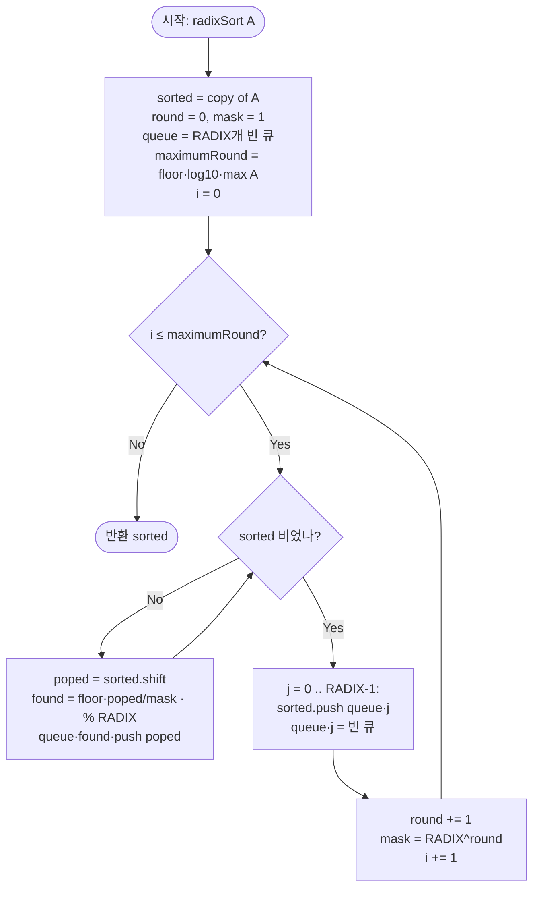

import { AlgorithmSimulation } from "#guide-sim";

# Radix Sort — 해설

> 이 해설은 `radixSort.ts`의 **실제 구현**(10진법 · 10개 큐(버킷) 기반 LSD 기수 정렬)을 기준으로 한다.
> 자릿수를 비트로 끊는 256진법 변형이 아니라, `RADIX = 10`으로 1의 자리부터 한 자리씩 분류·수집한다.

## 성능 목표 예측

비교 정렬은 두 수의 대소 하나만 알아내는 비교를 거듭하므로, 그 자체로 $\Omega(N \log N)$이라는
정보-이론적 하한에 묶인다. 그런데 이 문제의 입력은 **고정 범위의 비음 정수**($0 \le A[i] \le 10^9$)다.
정수는 자릿수라는 추가 구조를 가지므로, 비교 대신 자릿수를 키로 분류하면 이 하한을 우회할 수 있다 —
이것이 기수 정렬을 쓰는 이유다.

| 항목 | 값 |
|------|----|
| 입력 크기 $N$ | $1 \le N \le 100{,}000$ |
| 값 범위 | $0 \le A[i] \le 10^9$ |
| 진법(기수) $k$ | **10** (`RADIX`, 10진법) |
| 패스 수 $d$ | $\lfloor \log_{10} M \rfloor + 1$. 최댓값 $M \le 10^9$이면 $d \le 10$ |
| 목표 시간 복잡도 | **$O(d \cdot (N + k)) = O(10 \cdot (N + 10)) = O(N)$** |
| 공간 복잡도 | **$O(N + k)$** |

$d$는 최댓값의 자릿수다. 값이 $10^9$ 이하이면 최대 10자리이므로 $d \le 10$이고, 패스 수가 상수이므로
전체는 사실상 **$O(N)$**이다. $N = 10^5$에서 충분히 빠르다.

**주의 — `shift()`의 비용과 이 분석의 전제.** 위 $O(d(N+k))$는 "분배 단계에서 원소 하나를 꺼내는 비용이
상수"라는 전제 아래 성립한다. 그런데 이 구현은 분배 시 `sorted.shift()`로 배열 앞에서 원소를 꺼낸다.
배열의 `shift()`는 **원칙적으로 뒤 원소를 한 칸씩 당기는 $O(N)$ 연산**이라, 곧이곧대로 보면 분배 한 패스가
$O(N^2)$이 되어 전체가 $O(d \cdot N^2)$으로 부풀 수 있다. 그럼에도 성능 테스트($N=10^5$, 100ms)가
통과하는 이유는, **이 프로젝트의 런타임인 Bun(JavaScriptCore)이 배열 앞에서의 반복 제거를 내부 오프셋으로
관리해 분할상환 $O(1)$에 가깝게 처리**하기 때문이다. 즉 이 $O(N)$ 성능은 엔진의 `shift` 최적화에 기대고
있다. **이식성 있는 $O(d(N+k))$ 구현은 `shift`를 피해야 한다** — 예컨대 복사본을 앞에서부터 순회하며 새
배열로 재구성하거나(`for...of` + 인덱스 누적), 읽기 인덱스를 들고 다닌다.

**왜 $k = 10$인가 (트레이드오프).** 기수를 키우면(예: 256, 65536) 패스 수 $d$는 줄지만 패스마다
초기화·순회해야 하는 버킷 수 $k$가 커진다. 이 구현은 사람이 따라가기 쉬운 10진법을 택했다. 복잡도
$O(d(N+k))$ 안에서 $k$를 키워 $d$를 줄이는 것은 **상수 배 최적화**일 뿐 점근 복잡도를 바꾸지 않는다.

---

## 목표 함수

```ts
function radixSort(A: number[]): number[]
```

| 파라미터 | 의미 | 제약 |
|---------|------|------|
| `A` | 비음 정수 배열 | $1 \le N \le 100{,}000$ |
| `A[i]` | 각 원소의 값 | $0 \le A[i] \le 10^9$ |

**반환값:** `A`를 오름차순으로 정렬한 **새 배열**. 함수는 입력을 `[...A]`로 복사하므로 원본은 보존된다.

**경계/엣지케이스** (실제 구현 동작 기준):

| 케이스 | 입력 | 반환 | 패스 수 (비고) |
|--------|------|------|------|
| 단일 원소 | `[7]` | `[7]` | 1회 ($M=7$, `maximumRound=0`) |
| 모두 0 | `[0, 0]` | `[0, 0]` | **0회** ($M=0$ → 아래 참조) |
| 0 포함 | `[0, 10, 0, 1]` | `[0, 0, 1, 10]` | 2회 ($M=10$) |
| 최댓값 | `[10⁹, 0]` | `[0, 10⁹]` | 10회 ($d=10$) |

> **$M=0$과 빈 배열은 패스 수 공식의 경계다.** $d = \lfloor \log_{10} M \rfloor + 1$은 $M \ge 1$에서만
> 정의된다. 이 구현은 그 경계를 JS 특이동작에 맡긴다: $M=0$이면 `Math.log10(0) = -\infty`,
> `maximumRound = -\infty`라 `for (i = 0; i <= maximumRound; …)`가 한 번도 돌지 않고 입력을 그대로
> 반환한다. 빈 배열 `[]`도 `Math.max(...[]) = -\infty → log10 = NaN`이라 같은 경로로 `[]`를 반환한다.
> 모든 값이 0이거나 입력이 비면 정렬할 자릿수가 없으니 **결과는 옳다.** 다만 이는 `NaN`/`-Infinity`를
> 통한 우연한 흐름이므로, 방어적으로 쓰려면 `if (max === 0) return sorted;`를 명시하는 편이 안전하다.
> (문제 제약은 $N \ge 1$이지만 이 구현은 빈 입력에서도 안전하다.)

---

## 핵심 아이디어

**한 줄 요약:** 낮은 자릿수(1의 자리)부터 한 자리씩 **안정(stable) 분류**를 반복하면, 가장 높은 자릿수까지
마친 뒤 배열 전체가 정렬된다. 이것이 LSD(Least Significant Digit, 최하위 자릿수 우선) 기수 정렬이다.

아래에서 가장 단순한 원형에서 출발해 이 구현에 도달하는 과정을 생략 없이 따라간다.

### 1단계 — 원형: 전체 비교 정렬과 그 낭비

가장 단순한 접근은 두 수를 통째로 비교하는 것이다.

```
A.sort((a, b) => a - b)   // O(N log N)
```

정확하지만, 비교 한 번이 돌려주는 정보는 "$a$가 $b$보다 큰가/작은가" 하나뿐이다. 정수의 각 자릿수는
$0$부터 $k-1$까지의 독립적인 값인데, 전체 비교는 이 구조를 활용하지 못한다. 자릿수를 **키**로 쓰면
비교 없이 분류할 수 있고, 값의 범위가 고정된($0 \le A[i] \le 10^9$) 이 문제에서는 자릿수 분류가 비교
정렬보다 점근적으로 유리하다.

### 2단계 — 자릿수 정의

10진 정수 $x$의 위치 $i$(0-indexed, $i=0$이 1의 자리)에 있는 자릿수를 다음으로 정의한다.

$$\text{digit}(x, i) = \left\lfloor \frac{x}{10^{\,i}} \right\rfloor \bmod 10$$

구현은 라운드 변수 `round`로 $i$를, `mask`로 $10^{\,i}$를 들고 다닌다.

```ts
const mask = Math.pow(RADIX, round);          // 10^i
const found = Math.floor(poped / mask) % RADIX; // digit(poped, i)
```

`found`는 항상 $0 \le \text{found} \le 9$이므로 크기 10짜리 큐 배열의 유효한 인덱스가 된다.

### 3단계 — 1회 패스: 한 자릿수로 안정 분류

위치 $i$ 한 자리에 대한 1회 패스는 **분배(distribute) → 수집(collect)** 두 단계다.

1. **분배.** 자릿수 값 $0..9$에 대응하는 10개의 큐 $Q[0..9]$를 준비하고, 배열의 원소를 **앞에서부터 차례로**
   꺼내 $\text{digit}(x,i)$에 해당하는 큐 뒤에 넣는다(`push`). 같은 자릿수 원소는 들어온 순서대로 큐에 쌓인다.
2. **수집.** $Q[0], Q[1], \ldots, Q[9]$ 순으로, 각 큐 안의 원소를 **들어온 순서 그대로** 다시 배열에 채운다.

이 패스가 끝나면 배열은 위치 $i$의 자릿수 기준으로 정렬된다. 그리고 결정적으로 이 정렬은 **안정**하다 —
같은 자릿수 값을 가진 원소들의 상대 순서가 패스 전과 같게 유지된다. 왜 그런가를 한 단계 더 풀면: 입력을
**앞에서부터** 훑어 큐에 `push`하므로, 같은 자릿수를 가진 원소들은 패스 전의 순서 그대로 큐에 쌓인다.
수집할 때도 각 큐를 **먼저 들어온 것부터(FIFO)** 꺼내므로, 그 순서가 출력에서도 보존된다. 분배의 입력
순서와 수집의 출력 순서가 모두 FIFO이기 때문에 상대 순서가 어디서도 뒤집히지 않는다 — 이것이 안정성의
출처다.

### 4단계 — LSD 순서로 $d$회 반복: 왜 올바른가

위치 $i=0$(1의 자리)부터 최고 자릿수까지 위 패스를 반복한다. 낮은 자리부터 처리하는 것이 올바른 이유를
귀납으로 보인다.

- **불변식.** $i$번째 패스가 끝난 직후, 배열은 **하위 $i+1$개 자릿수**를 기준으로 안정 오름차순이다.
  "하위 $i+1$자리를 이어 붙인 수"란 정확히 $x \bmod 10^{\,i+1}$이다 — 상위 자릿수가 모자란 짧은 수는
  암묵적으로 앞에 0이 채워진 것으로 본다(예: $i=2$에서 $2 \to 002$, $24 \to 024$, $170 \to 170$을 비교).
- **기저 ($i=0$).** 패스 0은 1의 자리로 안정 분류하므로 하위 1자리 기준으로 정렬된다.
- **귀납 단계.** 불변식이 $i$까지 성립한다고 하자. 패스 $i+1$에서 위치 $i+1$의 자릿수로 안정 분류하면,
  - 위치 $i+1$ 자릿수가 **다른** 두 원소는 그 자릿수 크기대로 올바르게 배치된다.
  - 위치 $i+1$ 자릿수가 **같은** 원소들은 안정성 덕분에 직전 패스의 순서(= 하위 $i+1$자리 기준 정렬)가
    그대로 보존된다.
  따라서 패스 후 배열은 하위 $i+2$자리 기준으로 정렬되어 불변식이 확장된다.
- **결론.** 최고 자릿수 패스(위치 $d-1$)까지 마치면 모든 자릿수를 고려한 정렬이 완성된다. **안정성이 깨지면
  귀납 단계가 무너지므로**, 각 패스의 안정성은 선택이 아니라 필수다.

### 5단계 — 패스 수 $d$ 결정

최댓값 $M$의 자릿수만큼만 패스가 필요하다.

$$d = \lfloor \log_{10} M \rfloor + 1$$

구현은 `maximumRound = Math.floor(Math.log10(Math.max(...A)))`로 $\lfloor \log_{10} M \rfloor$을 구하고,
`for (let i = 0; i <= maximumRound; i++)`로 $i=0 \ldots \lfloor \log_{10} M \rfloor$, 즉 정확히 $d$번 돈다.

### 다관점 메모

- **중복 값:** 모든 자릿수가 같으므로 매 패스 안정성에 의해 원래 순서가 유지된다(결과적으로 안정 정렬).
- **비음 정수 전제:** 음수가 섞이면 자릿수 분해와 큐 분배의 대소 관계가 깨진다. 이 문제는 $A[i] \ge 0$이
  보장되므로 해당 없다.
- **큐 초기화:** 각 라운드가 끝나면 큐를 비워야 한다. 비우지 않으면 이전 라운드 원소가 누적되어 배열이
  자란다(구현은 큐 배열을 루프 **바깥에서 한 번** 만들고, 라운드마다 수집 직후 `queue[j] = []`로 각 큐를
  새 빈 배열로 교체한다).
- **인덱스 안전성:** `found = Math.floor(poped / mask) % RADIX`는 비음 정수에 대해 항상 정수 $0..9$를
  돌려주므로 `queue[found]`가 범위를 벗어나지 않는다. 단 이는 입력이 비음 정수(부동소수점 오차가 없는
  안전한 정수 범위 $\le 10^9$)라는 제약에 기댄다 — 음수나 매우 큰 부동소수점이 들어오면 깨질 수 있다.

---

## 시뮬레이션

`radixSort.ts`의 **실제 실행**을 작은 입력 `A = [170, 45, 75, 90, 2, 24]`로 따라간다. 최댓값이 170이므로
$d = \lfloor \log_{10}170 \rfloor + 1 = 3$ 패스(1의 자리 → 10의 자리 → 100의 자리)를 돈다. 실제 반환값은
`[2, 24, 45, 75, 90, 170]`이며, 시뮬레이션 마지막 프레임의 배열과 일치한다. 빨강(`highlight`)은 **이번
패스에서 자릿수를 읽어 분배 중인(스캔되는) 원소**를 뜻한다 — 분배 단계에서는 모든 원소를 훑으므로 전체가
강조된다. 회색(`marked`)은 정렬이 확정된 상태다.

> 대화형 시뮬레이션은 MDX 런타임에서 표시됩니다.

export const steps = [
  {
    title: "초기 상태",
    detail: "정렬 전 배열. 패스 0(1의 자리, mask=1)부터 시작한다.",
    array: [170, 45, 75, 90, 2, 24],
  },
  {
    title: "패스 0 · 분배 (1의 자리)",
    detail: "digit = x % 10 → [0,5,5,0,2,4]. 버킷 0←[170,90], 2←[2], 4←[24], 5←[45,75] (입력 순서대로 push).",
    array: [170, 45, 75, 90, 2, 24],
    highlight: [0, 1, 2, 3, 4, 5],
  },
  {
    title: "패스 0 · 수집",
    detail: "버킷 0→9 순서로 모음: [170,90] + [2] + [24] + [45,75] = [170,90,2,24,45,75].",
    array: [170, 90, 2, 24, 45, 75],
  },
  {
    title: "패스 1 · 분배 (10의 자리)",
    detail: "digit = floor(x/10) % 10 → 170→7,90→9,2→0,24→2,45→4,75→7. 버킷 0←[2],2←[24],4←[45],7←[170,75],9←[90].",
    array: [170, 90, 2, 24, 45, 75],
    highlight: [0, 1, 2, 3, 4, 5],
  },
  {
    title: "패스 1 · 수집",
    detail: "버킷 순서로 모음: [2]+[24]+[45]+[170,75]+[90] = [2,24,45,170,75,90]. 170이 75보다 앞(이전 패스 순서 보존).",
    array: [2, 24, 45, 170, 75, 90],
  },
  {
    title: "패스 2 · 분배 (100의 자리)",
    detail: "digit = floor(x/100) % 10 → 2→0,24→0,45→0,170→1,75→0,90→0. 버킷 0←[2,24,45,75,90], 1←[170].",
    array: [2, 24, 45, 170, 75, 90],
    highlight: [0, 1, 2, 3, 4, 5],
  },
  {
    title: "패스 2 · 수집 — 정렬 완료",
    detail: "버킷 순서로 모음: [2,24,45,75,90]+[170] = [2,24,45,75,90,170].",
    array: [2, 24, 45, 75, 90, 170],
    marked: [0, 1, 2, 3, 4, 5],
  },
];

<AlgorithmSimulation view="array" steps={steps} title="LSD Radix Sort (RADIX=10): [170, 45, 75, 90, 2, 24]" />

---

## 수도 코드와 Activity Diagram

### 의사코드 (실제 구현 구조)

```
function radixSort(A):
    sorted = copy of A                 // 불변식: multiset(sorted) = multiset(A)
    RADIX  = 10
    round  = 0
    queue  = RADIX개의 빈 큐            // 루프 바깥에서 한 번만 생성
    mask   = RADIX^round               // = 1
    maximumRound = floor(log10(max(A))) // 최고 자릿수 위치 (M=0/빈 입력이면 -∞ → 패스 0회)

    for i from 0 to maximumRound:       // 정확히 d = maximumRound+1 회
        // 1) 분배: sorted의 모든 원소를 앞에서부터 자릿수 큐로
        while sorted is not empty:
            poped = sorted.shift()       // 앞에서 꺼냄(FIFO 입력 순서)
            found = floor(poped / mask) % RADIX
            queue[found].push(poped)

        // 2) 수집: 버킷 0..RADIX-1 순서로 되돌리고 각 큐를 비움(안정성 보존)
        for j from 0 to RADIX-1:
            sorted.push(all of queue[j])
            queue[j] = empty             // 다음 라운드 누적 방지

        round = round + 1
        mask  = RADIX^round              // 다음 자릿수로

    return sorted
```

핵심 불변식: `i`번째 패스 종료 직후, `sorted`는 하위 `i+1`개 자릿수 기준으로 **안정 오름차순**이다.
$d$번의 패스 후 전체 기준 오름차순이 완성된다.

### Activity Diagram



---

## 마무리

- **무엇을 했나:** 정수의 자릿수 구조를 이용해, 1의 자리부터 한 자리씩 **안정 분류**를 $d$번 반복하는 LSD
  기수 정렬을 10개 큐로 구현했다. 비교를 전혀 쓰지 않으므로 비교 정렬의 $\Omega(N \log N)$ 하한에 묶이지 않는다.
- **복잡도 결론:** 알고리즘 자체는 $O(d \cdot (N + k))$, 값이 $10^9$ 이하라 $d \le 10$, $k = 10$ → 사실상 **$O(N)$ 시간 · $O(N+k)$ 공간**. 단 이 구현의 $O(N)$ 달성은 `shift`를 분할상환 $O(1)$로 처리하는 Bun(JSC)에 기댄다 — 이식성 있는 구현은 `shift`를 피해야 한다(성능 목표 예측의 주의 참조).
- **핵심 전제:** 각 패스의 **안정성**과 **비음 정수**. 둘 중 하나라도 깨지면 정확성이 무너진다.
- **다음 학습:** 기수를 256으로 키우는 비트-시프트 변형, 음수/실수 키 처리, 자릿수 분류의 내부를
  Counting Sort로 구현하는 형태(큐 대신 누적합) 비교.
