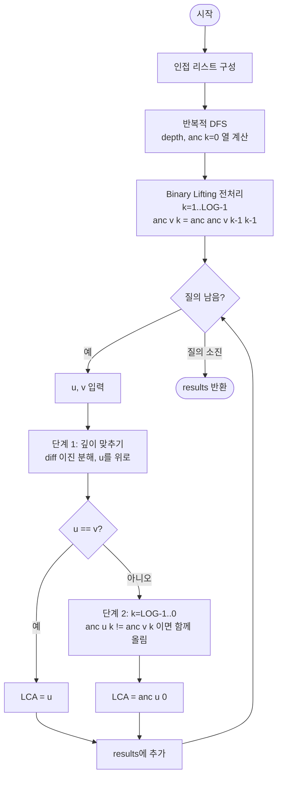

# lowestCommonAncestor 해설

## 성능 목표 예측

### 제약 표

| 항목 | 값 |
|------|-----|
| 정점 수 $n$ | $1 \leq n \leq 10^5$ |
| 간선 수 | $n - 1$ |
| 질의 수 $q$ | 문제 미명시, 최대 $10^5$ 가정 |

### Naive 접근의 한계

두 정점 $u, v$의 LCA를 구하는 가장 단순한 방법은 깊이가 더 깊은 정점을 한 칸씩 부모로 올려 두 정점이 만날 때까지 반복하는 것이다.

```
// naive LCA: 한 칸씩 올리기
while u != v:
    if depth[u] > depth[v]: u = parent[u]
    else:                   v = parent[v]
return u
```

최악의 경우(선형 체인 트리에서 두 끝 정점 질의) 한 번에 $O(n)$이 소요된다. 질의 $q$회 수행 시 $O(nq) = O(10^{10})$ → 시간 초과.

### 목표 복잡도와 근거

| 단계 | 목표 복잡도 | 근거 |
|------|-------------|------|
| 전처리 | $O(n \log n)$ | $n$개 정점 × $\log n$개의 조상 계산 |
| 질의 1회 | $O(\log n)$ | 이진 분해로 최대 $\log_2 n$번 점프 |
| 공간 | $O(n \log n)$ | `parent[v][k]` 테이블, $n \times \lceil \log_2 n \rceil$ |

$n = 10^5$에서 $\log_2 n \approx 17$이므로 테이블 크기는 $1.7 \times 10^6$, 질의당 최대 17번 점프로 충분히 빠르다.

---

## 목표 함수

```ts
function lowestCommonAncestor(
  n: number,
  edges: [number, number][],
  root: number,
  queries: [number, number][]
): number[]
```

### 파라미터 표

| 파라미터 | 의미 | 제약 |
|----------|------|------|
| `n` | 정점 수 | $1 \leq n \leq 10^5$ |
| `edges` | 무방향 간선 목록 $[u, v]$ | 길이 $n - 1$ |
| `root` | 트리의 루트 정점 | $0 \leq \text{root} < n$ |
| `queries` | LCA를 구할 정점 쌍 $[u, v]$ | 각 $0 \leq u, v < n$ |

### 반환값

각 질의 $[u, v]$에 대해 $\text{lca}(u, v)$의 정점 번호를 담은 배열 (길이 = `queries.length`).

### 엣지케이스

| 케이스 | 조건 | 기대 동작 |
|--------|------|-----------|
| 자기 자신 | `u == v` | `u` 반환 |
| 한쪽이 루트 | `u == root` 또는 `v == root` | `root` 반환 |
| 조상-자손 관계 | $u$가 $v$의 조상 | `u` 반환 |
| 단일 정점 트리 | $n = 1$, `queries = [[0,0]]` | `[0]` 반환 |

---

## 핵심 아이디어

**핵심 아이디어**: "임의 거리를 이진수로 분해해 2의 거듭제곱 점프로 올라가면, 조상 찾기가 O(log n)번의 테이블 참조로 끝난다."

두 정점의 공통 조상을 한 칸씩 올라가며 찾으면 최악 O(n)이 걸린다. Binary Lifting은 각 정점에서 1, 2, 4, 8, ... 번째 조상을 미리 O(n log n)에 계산해 테이블에 저장한다. LCA를 구할 때는 이 테이블을 이용해 깊이 차이를 이진 분해로 단번에 좁히고, 동시에 두 정점을 올리면서 LCA를 찾아낸다.

**풀이 구조**
1. DFS로 각 정점의 깊이와 부모(1번째 조상)를 계산한다.
2. 점화식 anc[v][k] = anc[anc[v][k-1]][k-1]로 2^k번째 조상 테이블을 채운다.
3. 단계 1: 깊이가 더 깊은 정점을 깊이 차이만큼 이진 분해해 올린다.
4. 단계 2: 두 정점을 동시에 올리되, 만나지 않는 최대 점프를 탐욕적으로 선택한다.
5. 루프 종료 후 anc[u][0]이 LCA이다.

**조건**: 트리가 고정되어 있고 여러 LCA 쿼리를 빠르게 처리해야 할 때. n과 쿼리 수가 모두 클 때(n, q ≤ 10^5).

**대표 예시**: 선형 체인 0-1-2-...-9에서 `lca(0, 9)` 쿼리
정점 9를 9칸 올려야 한다. 9 = 8 + 1이므로 2^3 점프 한 번, 2^0 점프 한 번으로 정점 0에 도달한다. 한 칸씩 9번 올라가는 대신 2번의 테이블 참조로 끝난다.

**언제 쓰나**
트리 경로의 길이, 두 정점 간 거리, 경로 쿼리의 LCA 기준 분리 등 LCA가 필요한 모든 트리 문제에서 다수의 쿼리를 처리해야 할 때 사용한다.

---

### 원형 아이디어와 naive 접근

LCA를 구하는 가장 직관적인 방법은 두 정점을 루트 방향으로 한 칸씩 올리며 만나는 지점을 찾는 것이다.

```
// naive 의사코드
function lca_naive(u, v):
    while depth[u] > depth[v]: u = parent[u]
    while depth[v] > depth[u]: v = parent[v]
    while u != v:
        u = parent[u]
        v = parent[v]
    return u
```

이 방법의 문제점:
- 깊이 차이를 맞추는 단계에서 최대 $O(n)$번의 이동이 필요하다.
- 두 정점을 동시에 올리는 단계도 $O(n)$이 될 수 있다.
- 질의마다 $O(n)$이면 전체 $O(nq)$로 시간 초과가 발생한다.

여기서 **낭비되는 계산의 본질**은 "이미 알 수 있는 조상으로 이동할 때 중간 단계를 모두 거친다"는 점이다.

### 어떤 관찰이 돌파구가 되는가

- **관찰 1**: $d$칸을 올라가야 한다면, $d$를 이진수로 표현하여 $\lfloor \log_2 d \rfloor + 1$번의 점프로 처리할 수 있다. 예를 들어 13칸 = 8 + 4 + 1칸, 즉 3번의 점프.
- **관찰 2**: "$v$에서 $2^k$번째 조상"을 미리 계산해두면, 임의 거리 $d$에 대한 조상을 $O(\log n)$번의 테이블 참조로 찾을 수 있다.
- **관찰 3**: $2^k$번째 조상은 $2^{k-1}$번째 조상의 $2^{k-1}$번째 조상과 같다. 이 점화식으로 전처리를 $O(n \log n)$에 마칠 수 있다.

### 관찰을 형식화: 상태/구조 정의

**Binary Lifting 테이블**:

$$\text{anc}[v][k] = v\text{의 } 2^k\text{번째 조상}$$

전처리 점화식:

$$\text{anc}[v][0] = \text{parent}(v)$$
$$\text{anc}[v][k] = \text{anc}[\text{anc}[v][k-1]][k-1] \quad (k \geq 1)$$

이 정의가 이 형태여야 하는 이유: $2^k$번째 조상을 $2^{k-1}$번째 조상의 $2^{k-1}$번째 조상으로 분해하면 각 $k$에 대해 $O(n)$의 계산만으로 테이블을 채울 수 있다. 만약 3번째, 5번째 등 비정규 간격을 사용하면 이 재귀 관계가 성립하지 않아 점화식 기반 전처리가 불가능해진다.

| 상태 변수 | 의미 |
|-----------|------|
| `depth[v]` | 루트로부터 $v$의 깊이 |
| `anc[v][k]` | $v$의 $2^k$번째 조상 (존재하지 않으면 루트 자신) |
| `LOG` | $\lceil \log_2 n \rceil$ (예: $n = 10^5$이면 17) |

### 점화식 또는 핵심 연산

**LCA 계산 두 단계**:

**단계 1: 깊이 맞추기**

$\text{depth}[u] \geq \text{depth}[v]$가 되도록 정렬한 뒤, $d = \text{depth}[u] - \text{depth}[v]$를 이진 분해하여 $u$를 올린다.

$$d = \sum_{k=0}^{LOG-1} b_k \cdot 2^k \quad (b_k \in \{0, 1\})$$

$$\text{각 } k \text{에 대해 } b_k = 1\text{이면}: \quad u \leftarrow \text{anc}[u][k]$$

단계 종료 후 `depth[u] == depth[v]`가 보장된다.

**단계 2: 동시에 올리기**

$u = v$이면 이미 LCA. 아니라면 다음을 수행한다.

$$k = LOG-1 \text{부터 } 0 \text{까지}: \quad \text{anc}[u][k] \neq \text{anc}[v][k]\text{이면} \quad u \leftarrow \text{anc}[u][k],\ v \leftarrow \text{anc}[v][k]$$

루프 종료 후 $\text{anc}[u][0] = \text{anc}[v][0]$이 LCA이다.

각 항의 의미:
- `anc[u][k] != anc[v][k]`: $2^k$만큼 올렸을 때 아직 만나지 않음. 즉, LCA가 그 위에 있음.
- 루프를 $k = LOG-1$부터 내려오며 수행하면 최대 점프만큼 올리면서도 LCA를 넘지 않는다.
- 루프 종료 시점의 $u$, $v$는 LCA 바로 아래 정점이므로 `anc[u][0]`이 LCA.

### 정당성 — 왜 이것이 옳은가

**단계 1의 정당성**: 이진 분해로 $d$칸을 올리면 $u$의 깊이는 정확히 $\text{depth}[v]$가 된다. $2^k$번 점프들의 합이 $d$와 일치하기 때문이다.

**단계 2의 정당성**: 루프 종료 후 `anc[u][0] == anc[v][0]`이 성립하는 이유는, 루프가 내려오면서 "LCA를 넘지 않는 최대 점프"를 탐욕적으로 선택하기 때문이다. 각 $k$에서 만나면 아직 LCA를 지나치지 않은 것이고, 만나지 않으면 LCA가 더 위에 있으므로 그만큼 올라간다. 모든 $k$를 처리한 뒤 `u`, `v`는 LCA 직전 정점이 된다.

**루트의 조상 처리**: 존재하지 않는 조상을 루트 자신으로 설정하면 ($\text{anc}[\text{root}][k] = \text{root}$) 테이블 범위 초과 없이 안전하게 동작한다. 단계 2에서 두 정점이 모두 루트로 올라가 `u == v`가 되는 경우도 정상 처리된다.

**깊이가 동일한데 $u = v$인 경우**: 단계 1 직후 `u == v`라면 둘 중 하나가 다른 하나의 조상이었다는 의미이므로 바로 반환한다.

### 구현 디테일과 최적화

**LOG 값 결정**: $\lceil \log_2(10^5) \rceil = 17$로 충분하다. 안전을 위해 18 또는 20을 사용하기도 한다.

**루트 조상 초기화**: `anc[root][0] = root`로 설정하면 루프가 루트를 넘어가는 상황에서도 안전하다. -1로 설정하면 배열 범위 초과에 주의해야 한다.

**반복적 DFS**: 재귀 깊이가 $n$까지 될 수 있으므로 반복적 DFS(명시적 스택)를 사용해야 스택 오버플로우를 방지한다.

**단계 2 루프 방향**: $k$를 큰 값부터 내려와야 한다. 작은 값부터 올라가면 LCA를 넘어서 잘못된 조상으로 올라갈 수 있다.

**함정 - u == v 체크 위치**: 단계 1 이후 `u == v`를 반드시 확인한 뒤 단계 2로 진입해야 한다. 확인 없이 단계 2를 수행하면 `anc[u][0]`을 반환하게 되어 LCA보다 한 단계 위 정점을 반환하는 오류가 발생한다.

---

## 수도 코드와 Activity Diagram

### 의사코드

```
LOG = 17  // ceil(log2(10^5))

function lowestCommonAncestor(n, edges, root, queries):
    // 인접 리스트 구성
    adj[0..n-1] = []
    for each [u, v] in edges:
        adj[u].push(v), adj[v].push(u)

    // DFS: depth와 anc[v][0] 계산 (반복적)
    depth[0..n-1] = 0
    anc[0..n-1][0..LOG-1] = root       // 불변식: 존재하지 않는 조상 = root
    stack = [(root, -1, 0)]
    while stack not empty:
        (v, par, d) = stack.pop()
        depth[v] = d                    // 불변식: depth[root] = 0
        if par != -1:
            anc[v][0] = par
        else:
            anc[v][0] = root            // 루트의 부모 = 루트 자신
        for u in adj[v]:
            if u != par:
                stack.push((u, v, d + 1))

    // Binary Lifting 테이블 구성
    for k in 1..LOG-1:
        for v in 0..n-1:
            anc[v][k] = anc[anc[v][k-1]][k-1]
            // 불변식: anc[v][k] = v의 2^k번째 조상

    // LCA 질의 함수
    function lca(u, v):
        // 단계 1: 깊이 맞추기
        if depth[u] < depth[v]: swap(u, v)
        diff = depth[u] - depth[v]      // 불변식: diff >= 0
        for k in 0..LOG-1:
            if (diff >> k) & 1:
                u = anc[u][k]           // u를 2^k칸 위로 올림
        // 여기서 depth[u] == depth[v] 보장

        if u == v: return u             // 한쪽이 다른 쪽의 조상인 경우

        // 단계 2: 동시에 올리기 (LCA를 넘지 않는 최대 점프)
        for k in LOG-1..0:
            if anc[u][k] != anc[v][k]:
                u = anc[u][k]           // 불변식: anc[u][k] != LCA (아직 LCA 위가 아님)
                v = anc[v][k]
        return anc[u][0]               // 불변식: u, v는 LCA 바로 아래 정점

    results = []
    for each (u, v) in queries:
        results.push(lca(u, v))
    return results
```

**핵심 불변식**: `anc[v][k]`는 정점 $v$의 $2^k$번째 조상이며, 루트를 넘어가는 경우 루트 자신을 가리킨다.

### Activity Diagram



**핵심 불변식**: 단계 2 루프 종료 시 `u`와 `v`는 LCA의 직접 자식이며, `anc[u][0] == anc[v][0] == LCA`가 성립한다.
