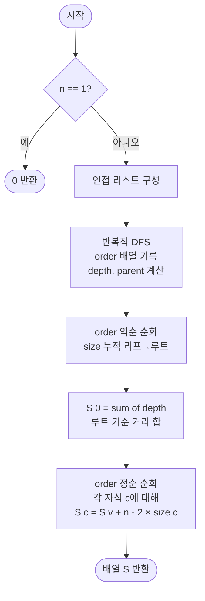

# treeRerooting 해설

## 성능 목표 예측

### 제약 표

| 항목 | 값 |
|------|-----|
| 정점 수 $n$ | $1 \leq n \leq 10^5$ |
| 간선 가중치 | 모두 1 |
| 간선 수 | $n - 1$ |

### Naive 접근의 한계

각 정점 $v$에서 다른 모든 정점까지의 거리 합을 독립적으로 계산하면 정점마다 BFS 한 번이 필요하다.

```
// naive: 각 정점에서 독립적 BFS
for v in 0..n-1:
    S[v] = sum(BFS distances from v)   // O(n)
```

- BFS 1회: $O(n)$
- $n$번 반복: 총 $O(n^2) = O(10^{10})$ → 시간 초과

### 목표 복잡도와 근거

| 연산 | 목표 복잡도 | 근거 |
|------|-------------|------|
| DFS 1회 (루트 기준) | $O(n)$ | subtree size, 루트의 $S$ 계산 |
| DFS 2회 (Rerooting) | $O(n)$ | 점화식으로 각 정점의 $S$ 전파 |
| 총 | $O(n)$ | DFS 2회 |
| 공간 | $O(n)$ | $\text{size}$, $S$ 배열 |

$n = 10^5$에서 $O(n) = 10^5$는 충분히 빠르다.

---

## 목표 함수

```ts
function treeRerooting(n: number, edges: [number, number][]): number[]
```

### 파라미터 표

| 파라미터 | 의미 | 제약 |
|----------|------|------|
| `n` | 정점 수 | $1 \leq n \leq 10^5$ |
| `edges` | 무방향 간선 목록 $[u, v]$ | 길이 $n-1$, 가중치 1 |

### 반환값

길이 $n$인 배열. `result[v]`는 정점 $v$에서 다른 모든 정점까지의 거리 합:

$$S(v) = \sum_{u \in V} d(v, u)$$

### 엣지케이스

| 케이스 | 조건 | 기대 출력 |
|--------|------|-----------|
| 단일 정점 | $n = 1$ | `[0]` |
| 두 정점 | $n = 2$, 간선 1개 | `[1, 1]` |
| 선형 체인 | $0 - 1 - 2 - \cdots - (n-1)$ | 양 끝이 최댓값 |
| 별 모양 | 루트에 모든 리프 연결 | 루트의 $S$ = 리프 수, 각 리프의 $S$ = (리프 수 - 1) × 2 + 0 |

---

## 핵심 아이디어

**핵심 아이디어**: "루트를 이웃으로 옮기면 서브트리 크기가 바뀌는 양이 정확히 계산되므로, 모든 정점의 거리 합을 O(n)에 전파할 수 있다."

각 정점을 루트로 가정한 거리 합을 독립적으로 BFS로 구하면 O(n²)이 걸린다. Rerooting은 임의의 루트(정점 0)에서 DFS 한 번으로 S(0)과 각 서브트리 크기를 구한 뒤, 루트를 자식으로 옮길 때의 거리 합 변화 공식 S(c) = S(부모) + (n - 2×size(c))를 이용해 DFS 순서대로 값을 전파한다. 모든 정점의 답을 단 두 번의 DFS로 구한다.

**풀이 구조**
1. DFS 1: 루트 0 기준으로 각 정점의 깊이, 서브트리 크기, 부모를 계산하고 order 배열을 기록한다.
2. order 역순으로 size를 누적한다 (리프 → 루트 방향).
3. S[0]을 모든 정점의 깊이 합으로 초기화한다.
4. DFS 2 (order 정순): S[c] = S[부모] + (n - 2 × size[c]) 점화식으로 각 정점에 전파한다.

**조건**: 간선 가중치가 모두 1인 트리에서 각 정점의 "모든 정점까지 거리 합"을 구해야 할 때. (가중치가 있는 경우 size 대신 서브트리 가중치 합을 사용하도록 확장 가능)

**대표 예시**: 선형 체인 0-1-2-3-4 (n=5)
S[0] = 0+1+2+3+4 = 10. 루트를 1로 옮기면 size[1에서 본 0쪽 서브트리] = 1이므로 S[1] = 10 + (5 - 2×4) = 10 - 3 = 7. 계속 전파하면 S = [10, 7, 6, 7, 10]이 된다.

**언제 쓰나**
트리의 모든 정점에서 다른 모든 정점까지 거리 합을 구해야 할 때, 또는 루트가 바뀔 때 서브트리 기반 값이 어떻게 변하는지 전파가 필요한 트리 DP 문제에서 사용한다.

---

### 원형 아이디어와 naive 접근

각 정점에서 모든 다른 정점까지의 거리 합을 구하려면, 정점마다 BFS를 수행하여 거리를 합산하는 것이 가장 직관적이다.

```
// naive
for v in 0..n-1:
    S[v] = 0
    BFS from v:
        S[v] += dist[u] for all u
```

여기서 시간이 폭발하는 이유: $n$개의 정점 각각에 대해 $O(n)$의 BFS를 독립적으로 수행하므로 총 $O(n^2)$이다. 이웃 정점으로 루트를 옮길 때 $S$ 값이 어떻게 변하는지를 활용하면 중복 계산을 크게 줄일 수 있다.

### 어떤 관찰이 돌파구가 되는가

- **관찰 1**: 루트 $r$에서 자식 $c$로 루트를 옮기면, $c$의 부분 트리 내 $\text{size}(c)$개의 정점은 루트와 1칸 가까워지고, 나머지 $n - \text{size}(c)$개의 정점은 루트와 1칸 멀어진다.
- **관찰 2**: 따라서 $S(c) = S(r) - \text{size}(c) + (n - \text{size}(c)) = S(r) + (n - 2 \times \text{size}(c))$이다. 이 점화식은 부모의 $S$ 값과 부분 트리 크기만 알면 $O(1)$에 자식의 $S$를 계산한다.
- **관찰 3**: DFS 1회로 임의의 루트(예: 정점 0)에서의 $S(0)$과 각 정점의 $\text{size}$를 계산한 뒤, DFS 2회로 루트에서 자식 방향으로 $S$를 전파하면 전체 $O(n)$에 해결된다.

### 관찰을 형식화: 상태/구조 정의

**부분 트리 크기 $\text{size}(v)$**: 정점 $v$를 루트로 하는 서브트리의 정점 수 (자신 포함). 루트 기준 DFS에서 리프부터 역순으로 계산한다.

$$\text{size}(v) = 1 + \sum_{c \in \text{children}(v)} \text{size}(c)$$

**거리 합 $S(v)$**: 정점 $v$를 트리의 루트로 가정했을 때, $v$에서 모든 정점까지의 거리 합.

$$S(v) = \sum_{u \in V} d(v, u)$$

**루트 기준 DFS 1에서의 $S(0)$ 계산**:

$$S(0) = \sum_{v \in V} \text{depth}(v)$$

여기서 $\text{depth}(v)$는 루트 0에서 $v$까지의 거리 (간선 수).

이 정의가 이 형태여야 하는 이유: $\text{size}(v)$를 루트 기준으로 정의해야만 Rerooting 점화식에서 "루트를 $r$에서 $c$로 옮길 때 이동하는 정점 수"를 정확히 파악할 수 있다. 다른 기준으로 크기를 정의하면 점화식의 항이 달라진다.

| 상태 변수 | 의미 |
|-----------|------|
| `size[v]` | 루트 0 기준으로 $v$의 서브트리 크기 |
| `depth[v]` | 루트 0에서 $v$까지의 거리 |
| `parent[v]` | 루트 0 기준 $v$의 부모 |
| `S[v]` | $v$를 루트로 했을 때 모든 정점까지 거리 합 |

### 점화식 또는 핵심 연산

**Rerooting 점화식**:

$$S(c) = S(\text{parent}(c)) + (n - 2 \times \text{size}(c))$$

이 식의 각 항의 의미:
- $S(\text{parent}(c))$: 부모가 루트일 때의 거리 합 (이미 계산됨).
- $+\,(n - \text{size}(c))$: 루트가 $c$로 이동하면 $c$의 서브트리 바깥 정점 $n - \text{size}(c)$개가 각각 1칸 멀어진다.
- $-\,\text{size}(c)$: 루트가 $c$로 이동하면 $c$의 서브트리 내 정점 $\text{size}(c)$개가 각각 1칸 가까워진다.
- 결합: $-\text{size}(c) + (n - \text{size}(c)) = n - 2 \times \text{size}(c)$.

**유도 과정**:

루트를 $r$에서 $c$($r$의 자식)로 이동한다.

$$S(c) = \sum_{u \in V} d(c, u)$$

모든 $u$를 두 그룹으로 분리한다.

- **그룹 A**: $u \in \text{subtree}(c)$ — $\text{size}(c)$개. $r$ 기준으로는 $d(r, u) = d(r, c) + d(c, u) = 1 + d(c, u)$. 즉 $d(c, u) = d(r, u) - 1$.
- **그룹 B**: $u \notin \text{subtree}(c)$ — $n - \text{size}(c)$개. $c$ 기준으로는 $d(c, u) = d(c, r) + d(r, u) = 1 + d(r, u)$.

$$S(c) = \sum_{u \in A} (d(r, u) - 1) + \sum_{u \in B} (d(r, u) + 1)$$

$$= \sum_{u \in V} d(r, u) - \text{size}(c) + (n - \text{size}(c))$$

$$= S(r) + n - 2 \times \text{size}(c)$$

### 정당성 — 왜 이것이 옳은가

점화식 $S(c) = S(\text{parent}) + (n - 2 \times \text{size}(c))$는 "루트 이동 시 거리 변화량"의 정확한 계산에 기반한다. 트리에서 두 정점 사이 경로는 유일하므로 루트를 $r \to c$로 옮기면 $c$의 서브트리 내 모든 정점과의 거리가 정확히 1씩 줄고, 바깥 정점들의 거리는 정확히 1씩 늘어난다. 이 분류가 완전하고 배반(disjoint)이므로 점화식이 정확하다.

Rerooting을 루트→리프 방향(BFS 순서)으로 수행해야 하는 이유: 자식 $c$의 $S$ 계산에 부모의 $S$가 필요하므로 부모가 먼저 계산되어야 한다. 루트에서 시작해 DFS 방문 순서로 전파하면 이 조건이 보장된다.

**경계 케이스 - 루트 자신**: $S(0)$는 DFS 1에서 모든 정점의 `depth` 합으로 직접 계산한다. 점화식은 루트의 자식부터 적용된다.

**경계 케이스 - $n = 1$**: 정점이 1개이면 `size[0] = 1`, `S[0] = 0`. 점화식 적용 없이 `[0]` 반환.

### 구현 디테일과 최적화

**DFS 1: 방문 순서 기록이 핵심**: 반복적 DFS를 수행하며 정점 방문 순서를 `order` 배열에 저장한다. 이후 역순으로 순회하면 리프 → 루트 방향으로 `size`를 누적할 수 있다.

**DFS 2: 방문 순서 재활용**: `order` 배열을 정순으로 순회하면 루트 → 리프 방향으로 점화식을 적용할 수 있다. 별도의 두 번째 DFS 없이 `order` 배열을 재활용하면 구현이 단순해진다.

**루프 순서 함정**: DFS 2에서 부모보다 자식을 먼저 처리하면 아직 계산되지 않은 $S(\text{parent})$를 참조하는 오류가 발생한다. 반드시 루트 → 리프 순서(= `order` 배열 정순)로 처리해야 한다.

**공간 절감**: `depth` 배열은 $S(0)$ 계산 후 필요 없으므로 `S` 배열로 덮어쓸 수 있다. `S[0] = sum(depth)`로 초기화한 뒤 `depth` 배열을 해제하면 된다.

**함정 - size 역산 누적**: DFS 1의 반복적 구현에서 `size` 누적은 자식이 부모보다 먼저 처리되어야 한다. `order` 배열 역순이 이를 보장한다. 정순으로 `size`를 누적하면 자식의 크기가 아직 1인 상태에서 부모에 더해지므로 잘못된 값이 된다.

---

## 수도 코드와 Activity Diagram

### 의사코드

```
function treeRerooting(n, edges):
    if n == 1: return [0]

    // 인접 리스트 구성
    adj[0..n-1] = []
    for each [u, v] in edges:
        adj[u].push(v), adj[v].push(u)

    // DFS 1: 방문 순서 기록, depth, parent 계산
    size[0..n-1] = 1                   // 불변식: size[v] >= 1 (자신 포함)
    depth[0..n-1] = 0
    parent[0..n-1] = -1
    order = []                          // 불변식: order는 BFS/DFS 방문 순서

    stack = [(0, -1)]
    while stack not empty:
        (v, par) = stack.pop()
        parent[v] = par
        order.push(v)
        for u in adj[v]:
            if u != par:
                depth[u] = depth[v] + 1
                stack.push((u, v))

    // 역순 순회: size 누적 (리프 → 루트)
    for v in reverse(order):           // 불변식: v의 모든 자손은 이미 처리됨
        if parent[v] != -1:
            size[parent[v]] += size[v]

    // S[0] 계산: 루트 0에서 모든 정점까지 거리 합
    S[0..n-1] = 0
    S[0] = sum(depth[v] for v in 0..n-1)  // 불변식: S[0] = 루트 0 기준 거리 합

    // DFS 2 (Rerooting): order 정순으로 S 전파 (루트 → 리프)
    for v in order:                    // 불변식: parent[v]의 S는 이미 계산됨
        for c in adj[v]:
            if c != parent[v]:
                // 점화식: 루트를 v → c로 이동 시 S 변화
                S[c] = S[v] + (n - 2 * size[c])
                // 불변식: S[c] = c를 루트로 했을 때 거리 합

    return S
```

**핵심 불변식**: DFS 2의 `order` 정순 순회에서 정점 $v$를 처리할 때, $v$의 부모에 대한 $S$ 값은 이미 계산 완료 상태이다. `order`는 루트에서 리프 방향이므로 부모는 항상 자식보다 먼저 등장한다.

### Activity Diagram



**핵심 불변식**: `size[v]`는 루트 0 기준으로 $v$의 서브트리 크기이며, `S[c] = S[parent(c)] + n - 2 × size[c]`가 $c$를 루트로 가정했을 때의 거리 합과 정확히 일치한다.
