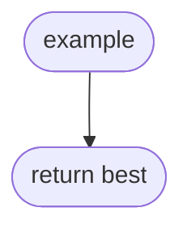

import { AlgorithmSimulation } from "#guide-sim";

# 예시 알고리즘 — 골격이 성립하는지 붙잡는 뼈대

<!--
  `algo-guide` spec 의 `sections[]` 가 실제로 성립하는지 대조하는 fixture 다.
  **읽히는 글이 아니라 골격 표본**이고, 절 제목과 순서만 의미가 있다.

  조건부 절(`idea.theory` · `idea.ds`)은 **일부러 뺐다** — 빼도 골격이 성립한다는 것을
  회귀 시험이 확인한다.

  절을 더하거나 순서를 바꾸면 `spec.json` 의 `sections[]` 와 이 파일을 **함께** 고친다.
  한쪽만 고치면 `tools/algo-skeleton.test.ts` 가 실패한다 — 캔버스가 spec 보다 앞서
  있던 것을 사람이 읽어서야 발견했던 일을 되풀이하지 않으려고 둔 장치다.
-->

## 한눈에 보는 컨셉

세 문장 이하로 아이디어의 전체 모양을 잡는다. 복잡도는 `O(n)` 처럼 코드 스팬으로 적는다.

## 출발점: 가장 순진한 방법부터

```ts
function example(xs: number[]): number
```

순진한 방법과 그것이 막히는 지점, 그리고 경쟁 설계와의 수치 대조가 온다.

## 아이디어 자세히 들여다보기

### 상태를 정의하고 굴려 보기 — 수식과 그림

정의 하나마다 계산 하나가 붙는다.

### 왜 모순 없이 작동하는가

기저 → 귀납 단계 → 경우의 완전성.

## 아이디어를 코드로 옮기기

```ts
function example(xs: number[]): number {
  let best = 0;
  for (const x of xs) {
    if (x > best) best = x; // ① 갱신
  }
  return best;
}
```

정적 읽기 — 초기값·경계·순회 방향·가드 순서. 분기에는 원문자 라벨을 단다.

## 코드를 한 번 끝까지 굴려 보기

```text
T1  xs = [3, 1, 4]   best = 0
    x(3) > best(0) 이 참 → ① 갱신
```

고정 입력 하나 위에서 단계마다 굴리고, 어느 분기를 왜 밟았는지를 실제 값으로 적는다.

## 더 빠르게 만들 단서 찾기

T1~T3 을 지목해 낭비를 짚는다.

## 단서를 최적화로 연결하기

단서를 최적화 아이디어로 바꾼다.

## 최적화 코드

같은 고정 입력을 다시 굴려 어느 단계가 사라지는지 T 번호로 대조한다.

## 실행 시각화

> 대화형 시뮬레이션은 MDX 런타임에서 표시됩니다.

export const steps = [
  { title: "T1", detail: "골격 표본", trace: "T1" },
];

<AlgorithmSimulation view={["array"]} steps={steps} title="골격 표본" />

## 흐름 한눈에 보기



## 스스로 점검하기

1. 손으로 따라가는 계산 문제.
2. 오해를 건드리는 문제.
3. 변형·전이 문제.
